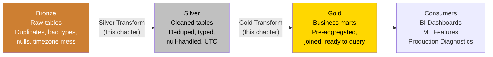
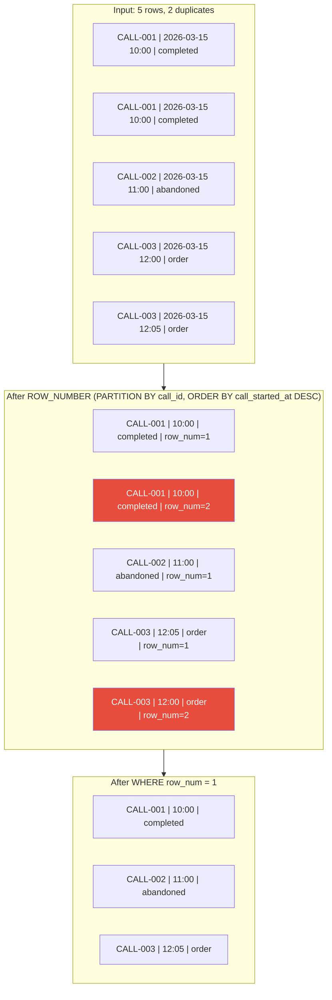
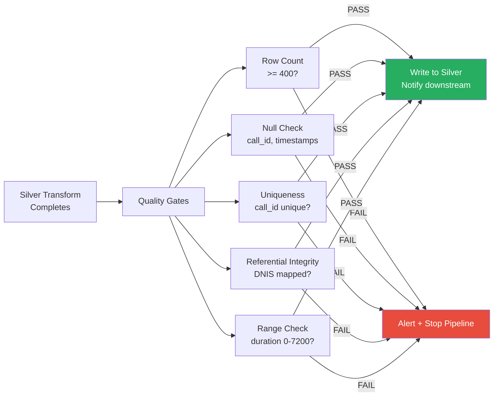
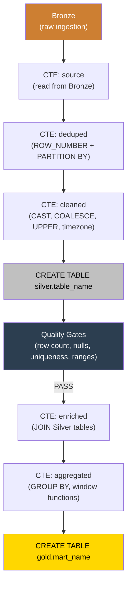

# Building Data Transforms with SQL

**Series:** SQL for Production Systems (5 of 10)
**Notebook:** [Advanced SQL on Colab](https://colab.research.google.com/github/sunilmogadati/systems-in-production/blob/main/implementation/notebooks/Advanced_SQL.ipynb)

---

## What We Are Building

A complete Bronze-to-Silver-to-Gold SQL pipeline. The same pattern used in dbt (data build tool) projects, warehouse-native ETL (Extract, Transform, Load), and production data platforms.



---

## The Silver Transform Pattern

The Silver layer takes raw Bronze data and produces clean, typed, deduplicated tables. Every Silver transform follows the same structure:

1. **Deduplicate** -- Remove exact and near-duplicates
2. **Cast types** -- Convert strings to proper types (timestamps, integers, decimals)
3. **Handle NULLs** -- Replace or flag missing values
4. **Normalize** -- Standardize timezones, formats, codes
5. **Validate** -- Run quality checks before writing

### The Full Silver Transform for Calls

```sql
CREATE OR REPLACE TABLE silver.calls AS

WITH source AS (
    -- Step 0: Read from Bronze (raw ingestion, no transforms)
    SELECT *
    FROM bronze.raw_va_calls
),

deduped AS (
    -- Step 1: Deduplicate
    -- WHY ROW_NUMBER? Because the source system sends duplicate records.
    -- Keep the most recent version of each call_id.
    SELECT *,
           ROW_NUMBER() OVER (
               PARTITION BY call_id
               ORDER BY call_started_at DESC
           ) AS row_num
    FROM source
),

cleaned AS (
    -- Step 2: Keep only first occurrence (row_num = 1)
    -- Step 3: Cast types from strings to proper types
    -- Step 4: Handle NULLs with COALESCE
    -- Step 5: Normalize timezones to UTC
    SELECT
        call_id,
        dnis,
        caller_phone,

        -- Timestamps: cast from string, ensure UTC
        -- SAFE_CAST returns NULL instead of erroring on bad data
        SAFE_CAST(call_started_at AS TIMESTAMP) AS call_started_at,
        SAFE_CAST(call_ended_at AS TIMESTAMP)   AS call_ended_at,

        -- Duration: cast to integer, default to 0 if NULL
        COALESCE(SAFE_CAST(duration_seconds AS INT64), 0) AS duration_seconds,

        -- Disposition: normalize to uppercase, handle NULLs
        UPPER(COALESCE(disposition, 'UNKNOWN'))       AS disposition,
        UPPER(COALESCE(disposition_type, 'UNKNOWN'))  AS disposition_type,

        -- Channel: default to 'UNKNOWN' if missing
        COALESCE(channel, 'UNKNOWN') AS channel,

        -- Sentiment: normalize casing
        INITCAP(COALESCE(sentiment, 'Unknown')) AS sentiment,

        -- Metadata: when this row was processed
        CURRENT_TIMESTAMP() AS _loaded_at

    FROM deduped
    WHERE row_num = 1
)

SELECT * FROM cleaned;
```

### What Each Step Does

| Step | CTE | Purpose | Without This Step |
|---|---|---|---|
| Read | `source` | Isolate the source reference. Easy to change later. | Hardcoded table names scattered through the query |
| Dedup | `deduped` | `ROW_NUMBER()` assigns 1 to the most recent version of each `call_id` | Duplicate records inflate counts. A campaign with 100 calls shows 103 because 3 were sent twice. |
| Clean | `cleaned` | Type casting, NULL handling, normalization, metadata | `duration_seconds` stored as string breaks `AVG()`. Timezones in mixed formats produce wrong date groupings. NULL dispositions excluded from `GROUP BY`. |

---

## Window Functions for Deduplication

The `ROW_NUMBER() OVER (PARTITION BY ... ORDER BY ...)` pattern is the standard way to deduplicate in SQL. Here is how it works step by step:



Red rows are eliminated. For CALL-003, the later timestamp (12:05) is kept because `ORDER BY call_started_at DESC` puts the most recent first.

---

## Window Functions for Analytics

Beyond deduplication, window functions power production analytics.

### Running Totals: Cumulative Revenue by Day

```sql
SELECT
    call_date,
    daily_revenue,
    SUM(daily_revenue) OVER (
        ORDER BY call_date
        ROWS BETWEEN UNBOUNDED PRECEDING AND CURRENT ROW
    ) AS cumulative_revenue
FROM gold.daily_revenue;
```

### Rankings: Top Campaigns by Conversion Rate

```sql
SELECT
    campaign_name,
    conversion_pct,
    RANK() OVER (ORDER BY conversion_pct DESC) AS rank
FROM gold.campaign_summary
WHERE total_calls >= 100;  -- Only rank campaigns with meaningful volume
```

### Change Detection: LAG for Day-over-Day Comparison

```sql
-- Alert when daily call volume drops more than 20% from previous day
WITH daily AS (
    SELECT
        call_date,
        COUNT(*) AS daily_calls,
        LAG(COUNT(*), 1) OVER (ORDER BY call_date) AS prev_day_calls
    FROM silver.calls
    GROUP BY call_date
)
SELECT
    call_date,
    daily_calls,
    prev_day_calls,
    ROUND((daily_calls - prev_day_calls) * 100.0 / NULLIF(prev_day_calls, 0), 1) AS pct_change
FROM daily
WHERE (daily_calls - prev_day_calls) * 100.0 / NULLIF(prev_day_calls, 0) < -20;
```

### Moving Average: 7-Day Smoothed Call Volume

```sql
SELECT
    call_date,
    daily_calls,
    ROUND(AVG(daily_calls) OVER (
        ORDER BY call_date
        ROWS BETWEEN 6 PRECEDING AND CURRENT ROW
    ), 1) AS moving_avg_7d
FROM gold.daily_call_volume;
```

---

## MERGE / UPSERT: Incremental Loading

In production, you do not rebuild the entire Silver table every day. You load only new and changed records. `MERGE` (also called "upsert") handles this: insert new rows and update existing rows in a single atomic statement.

### BigQuery MERGE

```sql
MERGE silver.calls AS target
USING (
    -- New/updated records from today's Bronze load
    WITH deduped_new AS (
        SELECT *,
               ROW_NUMBER() OVER (PARTITION BY call_id ORDER BY call_started_at DESC) AS rn
        FROM bronze.raw_va_calls
        WHERE _ingested_at >= CURRENT_DATE()  -- Only today's data
    )
    SELECT * FROM deduped_new WHERE rn = 1
) AS source
ON target.call_id = source.call_id

-- If the record already exists, update it
WHEN MATCHED THEN UPDATE SET
    target.duration_seconds = COALESCE(SAFE_CAST(source.duration_seconds AS INT64), 0),
    target.disposition      = UPPER(COALESCE(source.disposition, 'UNKNOWN')),
    target.disposition_type = UPPER(COALESCE(source.disposition_type, 'UNKNOWN')),
    target._loaded_at       = CURRENT_TIMESTAMP()

-- If the record is new, insert it
WHEN NOT MATCHED THEN INSERT (
    call_id, dnis, caller_phone, call_started_at, call_ended_at,
    duration_seconds, disposition, disposition_type, channel, sentiment, _loaded_at
) VALUES (
    source.call_id, source.dnis, source.caller_phone,
    SAFE_CAST(source.call_started_at AS TIMESTAMP),
    SAFE_CAST(source.call_ended_at AS TIMESTAMP),
    COALESCE(SAFE_CAST(source.duration_seconds AS INT64), 0),
    UPPER(COALESCE(source.disposition, 'UNKNOWN')),
    UPPER(COALESCE(source.disposition_type, 'UNKNOWN')),
    COALESCE(source.channel, 'UNKNOWN'),
    INITCAP(COALESCE(source.sentiment, 'Unknown')),
    CURRENT_TIMESTAMP()
);
```

### PostgreSQL Equivalent (INSERT ON CONFLICT)

```sql
INSERT INTO silver.calls (call_id, dnis, duration_seconds, disposition, _loaded_at)
SELECT call_id, dnis, duration_seconds, disposition, NOW()
FROM bronze.raw_va_calls
ON CONFLICT (call_id) DO UPDATE SET
    duration_seconds = EXCLUDED.duration_seconds,
    disposition      = EXCLUDED.disposition,
    _loaded_at       = NOW();
```

---

## Temp Tables vs CTEs vs Subqueries: When to Use Each

| Approach | Scope | Persisted? | When to Use |
|---|---|---|---|
| **CTE** (`WITH ... AS`) | Single query | No (exists only during query execution) | Multi-step transforms within one query. Standard for dbt models. |
| **Subquery** | Single query | No | Simple one-off inline filters. Avoid for complex logic. |
| **Temp Table** (`CREATE TEMP TABLE`) | Single session | Yes (until session ends) | Intermediate results referenced by multiple subsequent queries. Debugging. |
| **Materialized View** | Permanent | Yes (refreshed on schedule or demand) | Pre-computed results that multiple consumers read. |
| **Permanent Table** (`CREATE TABLE ... AS`) | Permanent | Yes | Silver and Gold layer output. The final artifact. |

**The production pattern:**
- Use **CTEs** inside a single transform (dedup step, clean step, enrich step).
- Use **temp tables** when debugging a complex pipeline or when an intermediate result is needed by multiple downstream queries in the same session.
- Use **permanent tables** for Silver and Gold layers -- the output that downstream consumers read.

---

## The Gold Mart Pattern: Pre-Aggregated Business Tables

Gold tables are designed for consumers -- analysts, dashboards, ML pipelines. They are pre-joined, pre-aggregated, and optimized for read speed.

### Campaign Performance Mart

```sql
CREATE OR REPLACE TABLE gold.campaign_daily_summary AS

WITH call_metrics AS (
    -- Base metrics from Silver calls
    SELECT
        DATE(c.call_started_at)    AS call_date,
        ds.campaign_name,
        ds.media_type,
        ds.media_source,
        COUNT(*)                    AS total_calls,
        SUM(CASE WHEN c.disposition_type = 'ORDER' THEN 1 ELSE 0 END) AS orders,
        AVG(c.duration_seconds)     AS avg_duration_sec,
        SUM(c.duration_seconds)     AS total_duration_sec
    FROM silver.calls c
    JOIN silver.dnis_sources ds ON c.dnis = ds.dnis
    GROUP BY 1, 2, 3, 4
),

revenue_metrics AS (
    -- Revenue from Silver orders + order details
    SELECT
        DATE(o.order_date)          AS order_date,
        ds.campaign_name,
        SUM(od.unit_price * od.quantity) AS gross_revenue,
        SUM(od.discount)            AS total_discounts,
        SUM(od.unit_price * od.quantity - od.discount) AS net_revenue
    FROM silver.orders o
    JOIN silver.order_details od ON o.order_id = od.order_id
    JOIN silver.calls c ON o.voiceprint_id = c.call_id
    JOIN silver.dnis_sources ds ON c.dnis = ds.dnis
    GROUP BY 1, 2
)

SELECT
    cm.call_date,
    cm.campaign_name,
    cm.media_type,
    cm.media_source,
    cm.total_calls,
    cm.orders,
    ROUND(cm.orders * 100.0 / NULLIF(cm.total_calls, 0), 2) AS conversion_pct,
    ROUND(cm.avg_duration_sec, 1)   AS avg_duration_sec,
    cm.total_duration_sec,
    COALESCE(rm.gross_revenue, 0)   AS gross_revenue,
    COALESCE(rm.total_discounts, 0) AS total_discounts,
    COALESCE(rm.net_revenue, 0)     AS net_revenue,
    ROUND(COALESCE(rm.net_revenue, 0) / NULLIF(cm.orders, 0), 2) AS avg_order_value,
    ROUND(COALESCE(rm.net_revenue, 0) / NULLIF(cm.total_calls, 0), 2) AS revenue_per_call,
    CURRENT_TIMESTAMP()             AS _built_at
FROM call_metrics cm
LEFT JOIN revenue_metrics rm
    ON cm.call_date = rm.order_date
    AND cm.campaign_name = rm.campaign_name
ORDER BY cm.call_date, cm.campaign_name;
```

### What Makes This a Gold Table

| Property | How It Is Achieved |
|---|---|
| **Pre-joined** | Calls, orders, order details, and DNIS sources are already combined. Analysts do not need to know the join logic. |
| **Pre-aggregated** | Daily grain by campaign. No need to aggregate 50 million rows for a dashboard. |
| **Derived metrics** | Conversion rate, average order value, revenue per call -- computed once, queried many times. |
| **NULL-safe** | `COALESCE` and `NULLIF` ensure no NULL surprises for consumers. |
| **Auditable** | `_built_at` timestamp shows when the table was last refreshed. |

---

## Building Quality Gates in SQL

Quality gates are checks that run AFTER a transform and BEFORE downstream consumers read the data. If a check fails, the pipeline stops or alerts.

### Row Count Check

```sql
-- Fail if Silver has fewer rows than expected (data loss detection)
SELECT
    CASE
        WHEN COUNT(*) < 400 THEN ERROR('QUALITY GATE FAILED: silver.calls has fewer than 400 rows')
        ELSE 'PASS'
    END AS row_count_check
FROM silver.calls;
```

(Note: `ERROR()` is BigQuery syntax. In PostgreSQL, use `RAISE EXCEPTION` inside a function or `DO` block.)

### Null Check on Critical Columns

```sql
-- No NULLs allowed in call_id or call_started_at
SELECT
    'call_id' AS column_name,
    COUNT(*) AS null_count
FROM silver.calls
WHERE call_id IS NULL

UNION ALL

SELECT
    'call_started_at',
    COUNT(*)
FROM silver.calls
WHERE call_started_at IS NULL;

-- If any null_count > 0, the pipeline should stop
```

### Uniqueness Check

```sql
-- call_id must be unique after dedup
SELECT
    call_id,
    COUNT(*) AS occurrences
FROM silver.calls
GROUP BY call_id
HAVING COUNT(*) > 1;

-- Expected result: zero rows. Any rows = dedup failed.
```

### Referential Integrity Check

```sql
-- Every DNIS in calls should exist in dnis_sources
SELECT DISTINCT c.dnis
FROM silver.calls c
LEFT JOIN silver.dnis_sources ds ON c.dnis = ds.dnis
WHERE ds.dnis IS NULL;

-- Expected: zero rows. Any rows = unmapped DNIS (new campaign? config missing?)
```

### Range Check

```sql
-- Duration should be between 0 and 7200 seconds (2 hours max)
SELECT COUNT(*) AS out_of_range_count
FROM silver.calls
WHERE duration_seconds < 0 OR duration_seconds > 7200;
```

### Quality Gate Summary



---

## The Full Pipeline: Silver to Gold, Reusable Pattern

Here is the complete pattern as a repeatable template:



### The Template

Every table in the pipeline follows this structure:

```sql
-- Silver Transform Template
CREATE OR REPLACE TABLE silver.{table_name} AS

WITH source AS (
    SELECT * FROM bronze.raw_{table_name}
),

deduped AS (
    SELECT *,
           ROW_NUMBER() OVER (
               PARTITION BY {primary_key}
               ORDER BY {timestamp_column} DESC
           ) AS row_num
    FROM source
),

cleaned AS (
    SELECT
        {primary_key},
        -- Cast each column to its proper type
        -- Handle NULLs with COALESCE
        -- Normalize formats (uppercase, timezone, etc.)
        CURRENT_TIMESTAMP() AS _loaded_at
    FROM deduped
    WHERE row_num = 1
)

SELECT * FROM cleaned;
```

```sql
-- Gold Mart Template
CREATE OR REPLACE TABLE gold.{mart_name} AS

WITH base_metrics AS (
    SELECT
        {dimension_columns},
        {aggregate_functions}
    FROM silver.{primary_table}
    JOIN silver.{secondary_table} ON {join_condition}
    GROUP BY {dimension_columns}
),

enriched AS (
    -- Add derived metrics, window functions, rankings
    SELECT *,
           {derived_columns},
           CURRENT_TIMESTAMP() AS _built_at
    FROM base_metrics
)

SELECT * FROM enriched;
```

---

## Production Use Case: Build the Silver and Gold Layers for the Production Diagnostic System

The Production Diagnostic System tracks incidents, deployments, and system health across services. The source data lands in Bronze as JSON from monitoring tools (PagerDuty, Datadog, GitHub Actions).

### Silver Layer: Incidents

```sql
CREATE OR REPLACE TABLE silver.incidents AS

WITH source AS (
    SELECT * FROM bronze.raw_incidents
),

deduped AS (
    SELECT *,
           ROW_NUMBER() OVER (
               PARTITION BY incident_id
               ORDER BY updated_at DESC
           ) AS row_num
    FROM source
),

cleaned AS (
    SELECT
        incident_id,
        SAFE_CAST(created_at AS TIMESTAMP)   AS created_at,
        SAFE_CAST(resolved_at AS TIMESTAMP)  AS resolved_at,
        TIMESTAMP_DIFF(
            SAFE_CAST(resolved_at AS TIMESTAMP),
            SAFE_CAST(created_at AS TIMESTAMP),
            MINUTE
        ) AS resolution_minutes,
        UPPER(COALESCE(severity, 'UNKNOWN'))  AS severity,
        COALESCE(service_name, 'unknown')     AS service_name,
        COALESCE(team_name, 'unassigned')     AS team_name,
        UPPER(COALESCE(status, 'UNKNOWN'))    AS status,
        root_cause_category,
        CURRENT_TIMESTAMP() AS _loaded_at
    FROM deduped
    WHERE row_num = 1
)

SELECT * FROM cleaned;
```

### Gold Layer: Service Health Mart

```sql
CREATE OR REPLACE TABLE gold.service_health_weekly AS

WITH weekly_incidents AS (
    SELECT
        service_name,
        team_name,
        DATE_TRUNC(created_at, WEEK)    AS week_start,
        COUNT(*)                         AS incident_count,
        SUM(CASE WHEN severity = 'SEV1' THEN 1 ELSE 0 END) AS sev1_count,
        SUM(CASE WHEN severity = 'SEV2' THEN 1 ELSE 0 END) AS sev2_count,
        AVG(resolution_minutes)          AS avg_resolution_min,
        PERCENTILE_CONT(resolution_minutes, 0.5) OVER (
            PARTITION BY service_name, DATE_TRUNC(created_at, WEEK)
        ) AS median_resolution_min
    FROM silver.incidents
    WHERE status = 'RESOLVED'
    GROUP BY service_name, team_name, week_start
),

with_trends AS (
    SELECT
        *,
        LAG(incident_count, 1) OVER (
            PARTITION BY service_name ORDER BY week_start
        ) AS prev_week_incidents,
        incident_count - LAG(incident_count, 1) OVER (
            PARTITION BY service_name ORDER BY week_start
        ) AS week_over_week_change,
        CASE
            WHEN sev1_count >= 3 THEN 'CRITICAL'
            WHEN sev1_count >= 1 OR incident_count >= 10 THEN 'WARNING'
            ELSE 'HEALTHY'
        END AS health_status,
        CURRENT_TIMESTAMP() AS _built_at
    FROM weekly_incidents
)

SELECT * FROM with_trends
ORDER BY week_start DESC, service_name;
```

### What This Gives the Diagnostic System

| Field | What It Powers |
|---|---|
| `incident_count` + `sev1_count` | Service health scorecard |
| `avg_resolution_min` | Mean Time to Resolution (MTTR) trend |
| `week_over_week_change` | Regression detection -- are incidents increasing? |
| `health_status` | Traffic light dashboard (CRITICAL / WARNING / HEALTHY) |
| `median_resolution_min` | More robust than average -- not skewed by outlier incidents |
| `team_name` | Accountability -- which team owns the degrading service? |

This Gold table is queried by the diagnostic dashboard, feeds the health score algorithm, and generates weekly team reports. The SQL runs daily via the pipeline orchestrator. Quality gates validate the output before any consumer reads it.

---

## Quick Links: SQL Chapter Series

| Chapter | Title |
|---|---|
| 01 | [Why It Still Matters](01_Why.md) |
| 02 | [Concepts](02_Concepts.md) |
| 03 | [Hello World](03_Hello_World.md) |
| 04 | [How It Works](04_How_It_Works.md) |
| **05** | [Building It](05_Building_It.md) |
| 06 | Production Patterns (coming soon) |
| 07 | System Design (coming soon) |
| 08 | Quality, Security, and Governance (coming soon) |
| 09 | Observability and Troubleshooting (coming soon) |
| 10 | Decision Guide (coming soon) |
