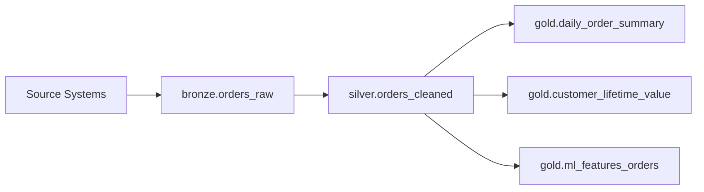
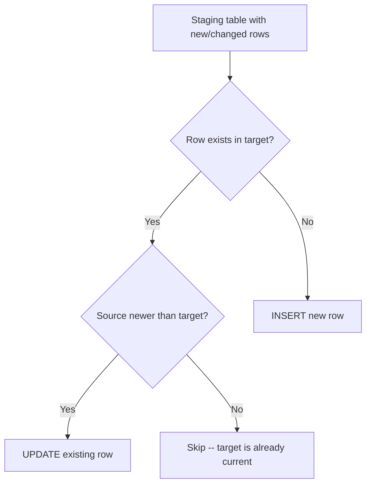
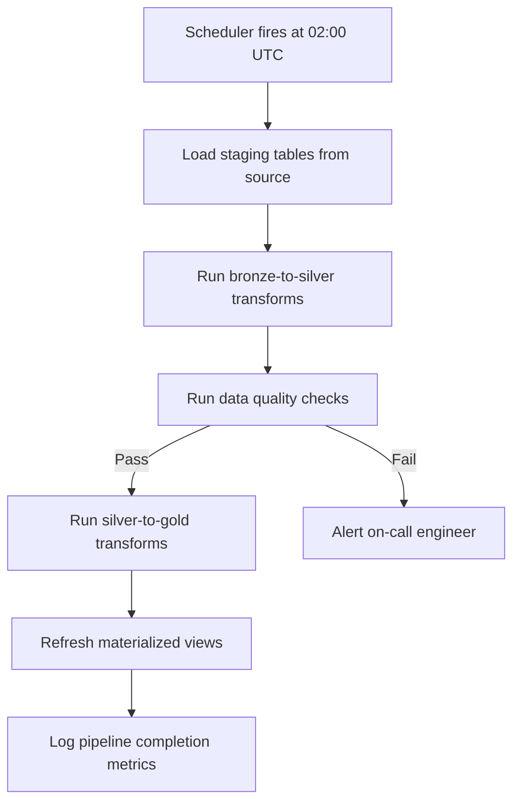

# SQL Production Patterns

> The patterns that separate ad-hoc queries from production SQL: incremental loads, idempotent transforms, quarantine tables, and scheduled pipelines that run unattended at 3 AM.

---

## The Medallion Architecture in SQL

In a production data platform, data flows through layers of increasing quality. The medallion architecture (Bronze, Silver, Gold) maps directly to SQL schemas or datasets.

- **Bronze:** Raw ingestion. Data lands exactly as received -- no transformations, no filtering. Schema matches the source system.
- **Silver:** Cleaned and conformed. Duplicates removed, types cast, nulls handled, business keys validated.
- **Gold:** Business-ready aggregates. Metrics, dimensions, feature tables. What dashboards and ML models consume.



In BigQuery, these are datasets. In PostgreSQL, these are schemas. In Snowflake, these are schemas within a database.

```sql
-- BigQuery: create datasets for each layer
CREATE SCHEMA IF NOT EXISTS bronze;
CREATE SCHEMA IF NOT EXISTS silver;
CREATE SCHEMA IF NOT EXISTS gold;

-- PostgreSQL / Snowflake: create schemas
CREATE SCHEMA IF NOT EXISTS bronze;
CREATE SCHEMA IF NOT EXISTS silver;
CREATE SCHEMA IF NOT EXISTS gold;
```

**Why three layers instead of one?** When something breaks, you need to answer "what did we receive?" (bronze), "what did we clean?" (silver), and "what did we serve?" (gold). Without layers, you cannot trace a bad number back to its origin.

---

## Incremental Loading with MERGE

MERGE is the most important production SQL pattern. It handles upserts (insert new rows, update existing ones) in a single atomic statement. Without MERGE, you need a multi-step DELETE-then-INSERT sequence that is neither atomic nor idempotent.

```sql
-- BigQuery / Snowflake / PostgreSQL 15+ MERGE syntax
MERGE INTO silver.customers AS target
USING staging.customers_incoming AS source
ON target.customer_id = source.customer_id

WHEN MATCHED AND source.updated_at > target.updated_at THEN
    UPDATE SET
        target.name = source.name,
        target.email = source.email,
        target.address = source.address,
        target.updated_at = source.updated_at

WHEN NOT MATCHED THEN
    INSERT (customer_id, name, email, address, created_at, updated_at)
    VALUES (source.customer_id, source.name, source.email, source.address,
            source.created_at, source.updated_at);
```

**Critical detail:** The `AND source.updated_at > target.updated_at` guard prevents stale data from overwriting fresher data. Without it, a late-arriving old record could overwrite a newer update.

### MERGE Execution Flow



---

## SCD Type 2 in SQL

Slowly Changing Dimension (SCD) Type 2 preserves the full history of changes. When a customer changes their address, the old row is closed (given an end date) and a new row is inserted as current.

Think of it like a lease. The old address had a lease that just expired. The new address has a lease that starts today with no end date yet.

```sql
-- Step 1: Close existing current records that have changes
UPDATE silver.dim_customer AS target
SET
    effective_end_date = CURRENT_DATE,
    is_current = FALSE
WHERE target.is_current = TRUE
  AND EXISTS (
      SELECT 1
      FROM staging.customer_updates AS source
      WHERE source.customer_id = target.customer_id
        AND (source.address != target.address
             OR source.phone != target.phone)
  );

-- Step 2: Insert new current records for those changes
INSERT INTO silver.dim_customer
    (customer_id, name, address, phone, effective_start_date, effective_end_date, is_current)
SELECT
    source.customer_id,
    source.name,
    source.address,
    source.phone,
    CURRENT_DATE,
    NULL,
    TRUE
FROM staging.customer_updates AS source
INNER JOIN silver.dim_customer AS target
    ON source.customer_id = target.customer_id
WHERE target.effective_end_date = CURRENT_DATE
  AND target.is_current = FALSE;

-- Step 3: Insert brand-new customers (no prior history)
INSERT INTO silver.dim_customer
    (customer_id, name, address, phone, effective_start_date, effective_end_date, is_current)
SELECT
    source.customer_id,
    source.name,
    source.address,
    source.phone,
    CURRENT_DATE,
    NULL,
    TRUE
FROM staging.customer_updates AS source
WHERE NOT EXISTS (
    SELECT 1 FROM silver.dim_customer AS target
    WHERE target.customer_id = source.customer_id
);
```

**When to use SCD Type 2:** Any dimension where you need to answer historical questions. "What was this customer's address when they placed order #4592?" requires SCD Type 2. If you only care about current state, a simple MERGE (SCD Type 1) is simpler.

---

## Idempotent Transforms

An idempotent transform produces the same result whether you run it once or five times. This is non-negotiable in production. Pipelines fail and retry. Schedulers sometimes double-fire. If your transform is not idempotent, retries corrupt your data.

### Pattern 1: DELETE-then-INSERT for a Partition

```sql
-- Idempotent: safe to run multiple times for the same date
DELETE FROM gold.daily_order_summary
WHERE order_date = '2026-04-04';

INSERT INTO gold.daily_order_summary (order_date, total_orders, total_revenue, avg_order_value)
SELECT
    order_date,
    COUNT(*) AS total_orders,
    SUM(amount) AS total_revenue,
    AVG(amount) AS avg_order_value
FROM silver.orders_cleaned
WHERE order_date = '2026-04-04'
GROUP BY order_date;
```

### Pattern 2: CREATE OR REPLACE

```sql
-- BigQuery and Snowflake support CREATE OR REPLACE
CREATE OR REPLACE TABLE gold.daily_order_summary AS
SELECT
    order_date,
    COUNT(*) AS total_orders,
    SUM(amount) AS total_revenue,
    AVG(amount) AS avg_order_value
FROM silver.orders_cleaned
GROUP BY order_date;
```

### Pattern 3: INSERT WHERE NOT EXISTS

```sql
-- Only insert rows that do not already exist
INSERT INTO silver.events (event_id, event_type, event_time, payload)
SELECT event_id, event_type, event_time, payload
FROM staging.events_incoming AS source
WHERE NOT EXISTS (
    SELECT 1
    FROM silver.events AS target
    WHERE target.event_id = source.event_id
);
```

**The test for idempotency:** Run the query. Check the row count and checksums. Run it again. If the count and checksums are identical, the transform is idempotent.

---

## Dead Letter Queues in SQL

Not every record is clean. Rather than failing the entire pipeline on a bad row, quarantine the failures and process the good data.

```sql
-- Route bad records to a quarantine table
INSERT INTO bronze.orders_dead_letter
    (raw_payload, rejection_reason, rejected_at)
SELECT
    raw_payload,
    CASE
        WHEN order_id IS NULL THEN 'missing_order_id'
        WHEN amount < 0 THEN 'negative_amount'
        WHEN order_date > CURRENT_DATE THEN 'future_date'
        ELSE 'unknown'
    END AS rejection_reason,
    CURRENT_TIMESTAMP AS rejected_at
FROM staging.orders_raw
WHERE order_id IS NULL
   OR amount < 0
   OR order_date > CURRENT_DATE;

-- Process only the good records
INSERT INTO silver.orders_cleaned (order_id, customer_id, amount, order_date)
SELECT order_id, customer_id, amount, order_date
FROM staging.orders_raw
WHERE order_id IS NOT NULL
  AND amount >= 0
  AND order_date <= CURRENT_DATE
  AND NOT EXISTS (
      SELECT 1 FROM silver.orders_cleaned AS existing
      WHERE existing.order_id = staging.orders_raw.order_id
  );
```

**Why not just filter and forget?** Dead letter queues give you accountability. You can report: "We processed 9,847 of 10,000 rows. 153 are quarantined with reasons." Without this, bad data vanishes silently.

---

## Scheduled SQL

Production SQL does not run by hand. It runs on a schedule, triggered by an orchestrator.

| Scheduling Method | When to Use | Key Detail |
|---|---|---|
| BigQuery Scheduled Queries | Simple SQL transforms in BigQuery | Native UI or API. No external orchestrator needed. |
| dbt run (with dbt Cloud or cron) | Model-based SQL pipelines | Handles dependencies between models. Preferred for analytics engineering. |
| Airflow `SQLOperator` / `BigQueryInsertJobOperator` | Complex pipelines with non-SQL steps | Full DAG (Directed Acyclic Graph) orchestration. Python + SQL + API calls. |
| Snowflake Tasks | SQL transforms within Snowflake | Native. Can chain tasks with dependencies. |
| Cloud Composer (managed Airflow on GCP) | GCP-native orchestration | Same as Airflow but Google manages the infrastructure. |
| MWAA (Managed Workflows for Apache Airflow on AWS) | AWS-native orchestration | Same as Airflow but AWS manages the infrastructure. |



---

## The Daily Pipeline Pattern

Three strategies for daily refreshes, each with different tradeoffs.

| Strategy | How It Works | Idempotent? | Speed | Data Volume |
|---|---|---|---|---|
| **Truncate and Reload** | Delete all rows, reinsert from source | Yes | Slow (full reprocess) | Full table every run |
| **MERGE (Upsert)** | Match on key, update changed, insert new | Yes | Medium | Only changed/new rows |
| **Append** | Insert new rows only (no updates) | Yes (with dedup guard) | Fast | New rows only |

**When to use which:**

- **Truncate and Reload:** Small reference tables (< 100K rows), lookup tables, configuration tables. Simple and bulletproof but does not scale.
- **MERGE:** Transactional tables where rows can be updated (orders, customers, inventory). The default choice for most production tables.
- **Append:** Event/log tables that are insert-only by nature (page views, API calls, sensor readings). Never update, only add.

---

## Anti-Patterns

These are the SQL mistakes that cause production incidents.

| Anti-Pattern | What Goes Wrong | Fix |
|---|---|---|
| `SELECT *` | Scans all columns. Breaks when schema changes. | Explicitly list the columns you need. |
| Implicit joins (`FROM a, b WHERE a.id = b.id`) | Easy to miss a join condition and produce a cartesian product. | Always use explicit `JOIN ... ON` syntax. |
| `DELETE FROM table` without `WHERE` | Deletes every row. Unrecoverable without backup. | Always include a `WHERE` clause. Code review should flag bare DELETEs. |
| `UPDATE table SET col = val` without `WHERE` | Updates every row. Same problem as bare DELETE. | Always include a `WHERE` clause. |
| Non-idempotent INSERT | Running the pipeline twice doubles the data. | Use `INSERT ... WHERE NOT EXISTS` or MERGE. |
| Hardcoded dates | `WHERE order_date = '2026-04-04'` breaks tomorrow. | Use `CURRENT_DATE` or parameterize dates. |
| Missing transaction boundaries | Partial writes leave tables in inconsistent state. | Wrap multi-statement transforms in `BEGIN ... COMMIT`. |
| `ORDER BY` in subqueries | Wastes compute. The outer query re-orders anyway. | Only `ORDER BY` in the final result set. |

---

## Feature Extraction for ML

SQL is often the best tool for creating ML training datasets. The features live in the database, the logic is declarative, and the result is a flat table ready for model training.

```sql
-- Create a training dataset for a churn prediction model
CREATE TABLE gold.ml_churn_features AS
SELECT
    c.customer_id,

    -- Recency: days since last order
    DATE_DIFF(CURRENT_DATE, MAX(o.order_date), DAY) AS days_since_last_order,

    -- Frequency: order count in last 90 days
    COUNTIF(o.order_date >= DATE_SUB(CURRENT_DATE, INTERVAL 90 DAY)) AS orders_last_90_days,

    -- Monetary: total spend in last 90 days
    SUM(CASE WHEN o.order_date >= DATE_SUB(CURRENT_DATE, INTERVAL 90 DAY)
             THEN o.amount ELSE 0 END) AS spend_last_90_days,

    -- Behavioral: average order value
    AVG(o.amount) AS avg_order_value,

    -- Engagement: distinct days with orders in last 180 days
    COUNT(DISTINCT CASE WHEN o.order_date >= DATE_SUB(CURRENT_DATE, INTERVAL 180 DAY)
                        THEN o.order_date END) AS active_days_last_180,

    -- Label: did the customer churn? (no order in 60 days)
    CASE WHEN DATE_DIFF(CURRENT_DATE, MAX(o.order_date), DAY) > 60
         THEN 1 ELSE 0 END AS churned

FROM silver.customers AS c
LEFT JOIN silver.orders_cleaned AS o
    ON c.customer_id = o.customer_id
GROUP BY c.customer_id;
```

**Why SQL for features?** Feature computation often involves joins, window functions, and conditional aggregations across millions of rows. SQL engines (BigQuery, Snowflake, Redshift) execute this on distributed compute without you managing a cluster. The result is a flat table you feed directly into pandas, scikit-learn, or a feature store.

---

## Key Takeaways

1. **The medallion architecture (Bronze/Silver/Gold) is the organizing principle.** Every production SQL pipeline moves data through layers of increasing quality.
2. **MERGE is the workhorse pattern.** It handles upserts atomically and is idempotent by nature.
3. **Every transform must be idempotent.** If running the pipeline twice corrupts your data, the pipeline is not production-ready.
4. **Dead letter queues make bad data visible.** Silently dropping rows is a data quality incident waiting to happen.
5. **SQL is a first-class tool for ML feature engineering.** Declarative, scalable, and the data is already there.

---

## Quick Links

| Chapter | Title |
|---|---|
| [01](01_Why.md) | SQL - Why It Matters |
| [02](02_Concepts.md) | SQL - Core Concepts |
| [03](03_Hello_World.md) | SQL - Hello World |
| [04](04_How_It_Works.md) | SQL - How It Works |
| [05](05_Building_It.md) | SQL - Building It |
| **06** | **SQL - Production Patterns** |
| [07](07_System_Design.md) | SQL - System Design |
| [08](08_Quality_Security_Governance.md) | SQL - Quality, Security, Governance |
| [09](09_Observability_Troubleshooting.md) | SQL - Observability and Troubleshooting |
| [10](10_Decision_Guide.md) | SQL - Decision Guide |

**Reference notebook:** [Advanced SQL on Colab](https://colab.research.google.com/github/sunilmogadati/systems-in-production/blob/main/implementation/notebooks/Advanced_SQL.ipynb)
