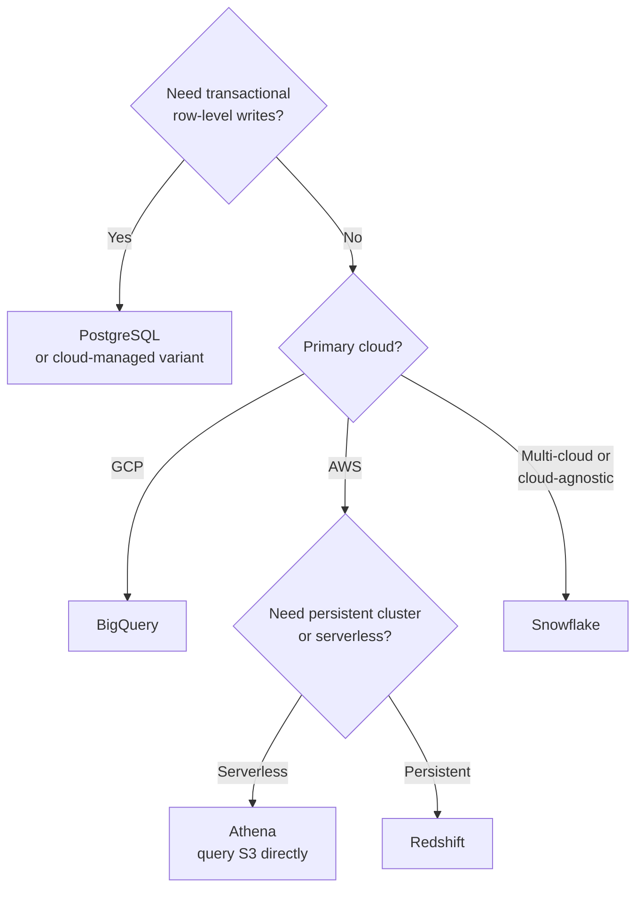
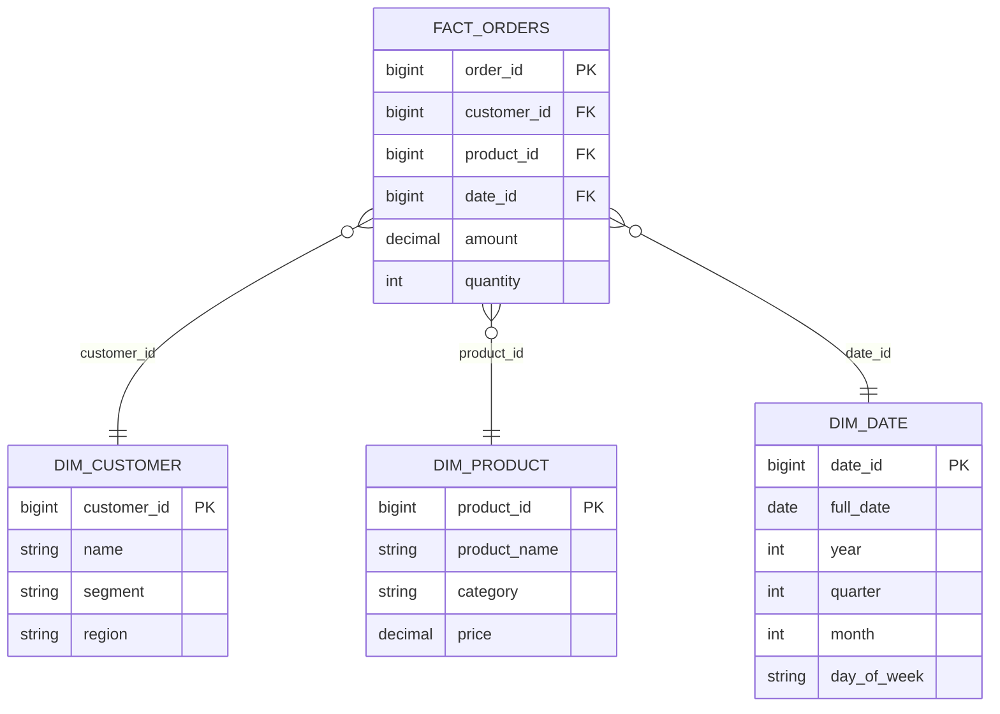
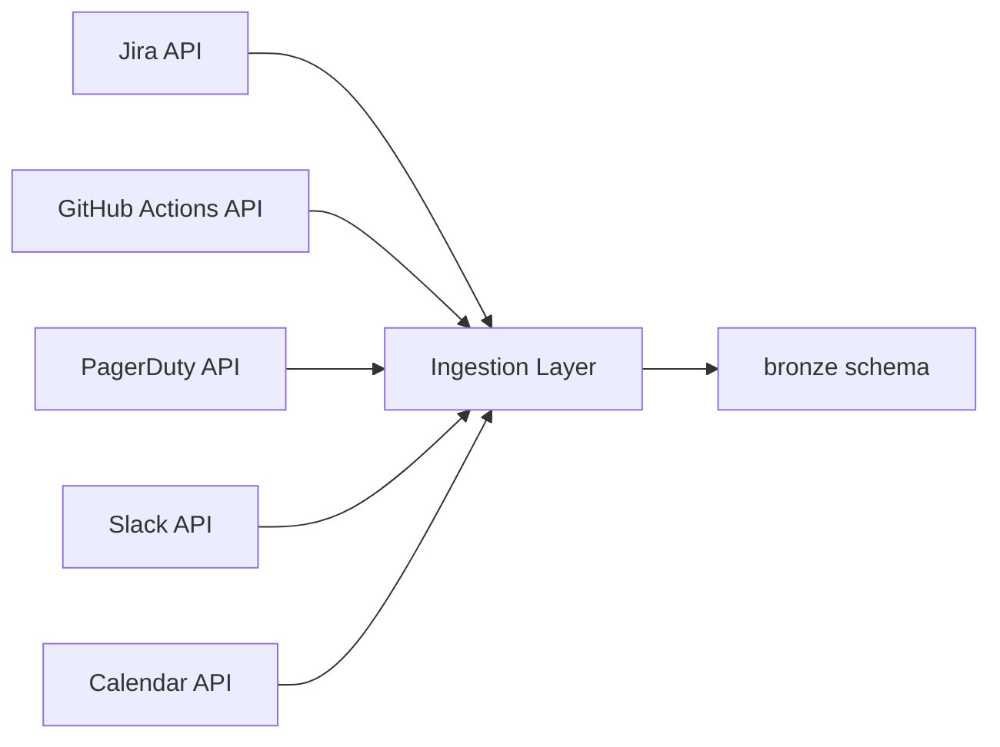
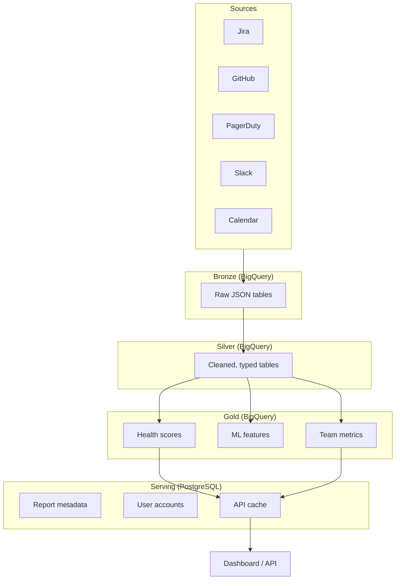

# SQL System Design

> Choosing the right SQL engine, designing schemas for analytics, and building a data architecture that scales without bankrupting the project.

---

## Choosing a SQL Engine

There is no universal best SQL engine. The right choice depends on your workload, scale, team skills, and cloud provider.

### Engine Comparison

| Dimension | PostgreSQL | BigQuery | Redshift | Snowflake | Athena |
|---|---|---|---|---|---|
| **Type** | OLTP + light OLAP | Serverless OLAP | Cluster-based OLAP | Serverless/warehouse OLAP | Serverless query engine |
| **Cost Model** | Compute (server hours) | Per-query (bytes scanned) | Per-cluster (hourly) | Per-credit (compute seconds) | Per-query (bytes scanned) |
| **Scale** | Single node (100s of GB) | Petabytes | Petabytes | Petabytes | Petabytes |
| **Real-time** | Yes (row-level ACID) | No (batch, streaming inserts) | Limited (streaming inserts) | Limited (Snowpipe) | No (query-time scan) |
| **Best For** | Application backend, small analytics | Large-scale analytics, ML features | AWS-native warehousing | Multi-cloud analytics, data sharing | Ad-hoc queries over S3 data |
| **Ecosystem** | Richest extensions (PostGIS, pgvector) | GCP-native, dbt, Looker | AWS-native, dbt, Redshift Spectrum | Cloud-agnostic, dbt, data sharing | AWS-native, Glue catalog |
| **Concurrency** | High (connection-based) | High (serverless slots) | Limited by cluster size | High (multi-cluster warehouses) | Moderate (query queue) |
| **Maintenance** | You manage (or use RDS/Cloud SQL) | Zero (fully managed) | Low (resize, vacuum) | Zero (fully managed) | Zero (fully managed) |

### Decision Flow



**The most common production setup:** PostgreSQL for the application database (OLTP), BigQuery or Snowflake for the analytics warehouse (OLAP). Data flows from PostgreSQL to the warehouse via a pipeline.

---

## Schema Design for Analytics

### Star Schema

The star schema is the standard for analytics. One fact table (events, transactions) surrounded by dimension tables (who, what, where, when).



**Why star schema?** Queries are simple (one join per dimension), query engines optimize star joins well, and business users can understand the structure without engineering help.

### Snowflake Schema

A snowflake schema normalizes dimensions further. `DIM_PRODUCT` might reference `DIM_CATEGORY`, which references `DIM_DEPARTMENT`. This saves storage but adds joins and complexity.

**When to snowflake:** Only when dimension tables are very large (millions of rows) and you need to filter on sub-dimensions frequently. For most analytics workloads, star schema is simpler and faster.

### One Big Table (OBT)

OBT denormalizes everything into a single wide table. No joins at query time.

```sql
-- OBT: all dimensions pre-joined
CREATE TABLE gold.obt_orders AS
SELECT
    o.order_id,
    o.amount,
    o.quantity,
    o.order_date,
    c.name AS customer_name,
    c.segment AS customer_segment,
    c.region AS customer_region,
    p.product_name,
    p.category AS product_category,
    p.price AS product_price
FROM silver.orders AS o
JOIN silver.customers AS c ON o.customer_id = c.customer_id
JOIN silver.products AS p ON o.product_id = p.product_id;
```

**When to use OBT:** Dashboards that need sub-second response times. BI (Business Intelligence) tools that generate ugly multi-join SQL. Small-to-medium datasets where the storage cost of duplication is negligible.

| Schema Style | Joins at Query Time | Storage | Query Complexity | Best For |
|---|---|---|---|---|
| Star | 1 per dimension | Moderate | Low | General analytics, standard BI |
| Snowflake | Multiple per dimension chain | Low | High | Large dimensions with hierarchies |
| OBT | None | High (duplication) | Very low | Dashboards, BI tools, small datasets |

---

## Materialized Views

A materialized view is a pre-computed query result stored as a table. It trades storage and freshness for query speed.

```sql
-- PostgreSQL: create a materialized view
CREATE MATERIALIZED VIEW gold.mv_daily_revenue AS
SELECT
    order_date,
    region,
    COUNT(*) AS order_count,
    SUM(amount) AS total_revenue,
    AVG(amount) AS avg_order_value
FROM silver.orders_cleaned
GROUP BY order_date, region;

-- Refresh it (typically on a schedule)
REFRESH MATERIALIZED VIEW gold.mv_daily_revenue;
```

```sql
-- BigQuery: materialized views auto-refresh
CREATE MATERIALIZED VIEW gold.mv_daily_revenue AS
SELECT
    order_date,
    region,
    COUNT(*) AS order_count,
    SUM(amount) AS total_revenue,
    AVG(amount) AS avg_order_value
FROM silver.orders_cleaned
GROUP BY order_date, region;
-- BigQuery automatically refreshes when base table changes
```

**When to materialize:** Queries that are expensive (large scans, complex joins, heavy aggregations) and run frequently (dashboards, reports, API backing queries). Do not materialize queries that run once a month.

---

## Partitioning Strategies

Partitioning divides a table into segments so queries only scan the relevant segment. This is the single most impactful performance technique for large tables.

| Strategy | How It Works | Best For | Example |
|---|---|---|---|
| **Date partitioning** | One partition per day/month/year | Time-series data, event logs, orders | `PARTITION BY DATE(order_date)` |
| **Key partitioning** | One partition per key value | Multi-tenant systems, regional data | `PARTITION BY region` |
| **Hash partitioning** | Rows distributed across N partitions by hash | Even distribution when no natural partition key | `PARTITION BY HASH(customer_id)` |

```sql
-- BigQuery: partition by date
CREATE TABLE silver.orders_cleaned (
    order_id INT64,
    customer_id INT64,
    amount NUMERIC,
    order_date DATE,
    region STRING
)
PARTITION BY order_date;

-- Query with partition filter: scans only one day
SELECT SUM(amount)
FROM silver.orders_cleaned
WHERE order_date = '2026-04-04';
```

**The cardinal rule of partitioning:** Every query against a partitioned table must include a filter on the partition column. Without the filter, the engine scans every partition -- worse than no partitioning because of the overhead.

---

## Clustering Strategies

Clustering sorts data within partitions. When a query filters on the clustered column, the engine skips blocks that cannot contain matching rows.

```sql
-- BigQuery: partition by date, cluster by region and customer_id
CREATE TABLE silver.orders_cleaned (
    order_id INT64,
    customer_id INT64,
    amount NUMERIC,
    order_date DATE,
    region STRING
)
PARTITION BY order_date
CLUSTER BY region, customer_id;
```

**Partitioning vs. clustering:** Partitioning is coarse (day, month). Clustering is fine (within a partition, rows are sorted). Use both together for large tables.

| Technique | Granularity | Maintenance | When It Helps |
|---|---|---|---|
| Partitioning | Coarse (date, key) | Automatic (new partitions created on insert) | Queries always filter by partition column |
| Clustering | Fine (within partition) | Automatic in BigQuery/Snowflake; manual VACUUM in Redshift | Queries filter by high-cardinality columns |

---

## Cost Control

SQL engines bill differently. Controlling cost requires understanding the billing model.

| Engine | Primary Cost Driver | Cost Control Strategy |
|---|---|---|
| **BigQuery** | Bytes scanned per query | Partition tables. Use `SELECT col1, col2` not `SELECT *`. Set per-query byte limits. Use BI Engine cache for dashboards. |
| **Redshift** | Cluster size x hours running | Right-size the cluster. Use Redshift Serverless for variable workloads. Pause clusters during off-hours. |
| **Snowflake** | Credits consumed (compute time) | Right-size warehouse (XS to 4XL). Set auto-suspend to 1-5 minutes. Use resource monitors to cap spend. |
| **Athena** | Bytes scanned per query | Store data in Parquet (columnar = fewer bytes). Partition S3 data. Use `SELECT` only needed columns. |

```sql
-- BigQuery: check bytes that will be scanned (dry run)
-- Use the BigQuery UI "Validator" or API dryRun flag before running expensive queries

-- Snowflake: set warehouse auto-suspend
ALTER WAREHOUSE analytics_wh SET AUTO_SUSPEND = 60; -- seconds

-- Snowflake: create a resource monitor to cap monthly spend
CREATE RESOURCE MONITOR monthly_cap
    WITH CREDIT_QUOTA = 500
    TRIGGERS ON 80 PERCENT DO NOTIFY
             ON 100 PERCENT DO SUSPEND;
```

---

## Multi-Environment: Dev / Staging / Prod

The same SQL should run in all environments. Only the dataset or schema name changes.

### Strategy 1: Dataset/Schema Prefix

```sql
-- In dev: SELECT * FROM dev_silver.orders_cleaned
-- In staging: SELECT * FROM staging_silver.orders_cleaned
-- In prod: SELECT * FROM silver.orders_cleaned

-- dbt handles this with target-based schema generation:
-- {{ target.schema }}.orders_cleaned
```

### Strategy 2: Environment Variable Substitution

```sql
-- Airflow template
SELECT *
FROM {{ params.schema }}.orders_cleaned
WHERE order_date = '{{ ds }}'
```

### Strategy 3: Snowflake Database Clones

```sql
-- Snowflake: zero-copy clone for testing
CREATE DATABASE staging_db CLONE production_db;
-- staging_db has the same data as production_db
-- without copying any bytes (metadata-only clone)
```

**The rule:** No one writes to production by hand. Production writes come from CI/CD (Continuous Integration / Continuous Deployment) pipelines. Dev and staging exist for testing.

---

## System Design: The Data Layer for a Diagnostic System

Applying a 10-step framework to design the data layer for a production system that diagnoses delivery health.

### Step 1: Clarify Requirements

- Ingest data from 5 source systems (project tracker, CI/CD, incident manager, chat, calendar)
- Process daily snapshots and real-time events
- Serve diagnostic reports with 6 health dimensions
- Support historical trend analysis (12 months)

### Step 2: Identify Data Sources and Ingestion



### Step 3: Define the Schema

| Layer | Tables | Purpose |
|---|---|---|
| Bronze | `jira_issues_raw`, `github_actions_raw`, `pagerduty_incidents_raw`, `slack_messages_raw`, `calendar_events_raw` | Raw API responses, JSON stored as-is |
| Silver | `issues_cleaned`, `builds_cleaned`, `incidents_cleaned`, `messages_cleaned`, `meetings_cleaned` | Parsed, typed, deduplicated, standardized timestamps |
| Gold | `daily_health_scores`, `dimension_trends`, `team_workload`, `ml_features_delivery` | Business metrics, ML features, report-ready aggregates |

### Step 4: Choose the Engine

- **PostgreSQL** for the application backend (user accounts, report metadata, API serving)
- **BigQuery** for the analytics warehouse (historical analysis, ML features, trend computation)

### Step 5: Partition and Cluster

- `daily_health_scores`: partition by `report_date`, cluster by `team_id`
- `issues_cleaned`: partition by `created_date`, cluster by `project_key`

### Step 6: Define the Pipeline Cadence

- **Hourly:** Ingest raw data from APIs to bronze
- **Every 6 hours:** Bronze-to-silver cleaning
- **Daily at 02:00 UTC:** Silver-to-gold aggregation, health score computation
- **On-demand:** Report generation triggered by user

### Step 7: Quality Gates

- Row count checks between layers (silver count >= 95% of bronze count after dedup)
- Null rate on critical columns < 1%
- Health score range check (0-100)

### Step 8: Security

- Row-level security: teams see only their own data
- PII masking on Slack messages (names, emails)
- Audit log on all report generation queries

### Step 9: Cost Control

- BigQuery partitioning reduces scan cost by 90%+ (queries always filter by date)
- Materialized views for dashboard-backing queries
- Monthly cost cap via budget alerts

### Step 10: Observability

- Pipeline duration and row count metrics per layer
- Alert on: pipeline failure, row count drop > 20%, health score outside 0-100 range
- Data lineage tracked via dbt documentation



---

## Key Takeaways

1. **No single SQL engine does everything.** PostgreSQL for transactions, BigQuery/Snowflake for analytics. Pair them.
2. **Star schema is the default for analytics.** Use OBT for dashboards, snowflake schema only when dimensions are massive.
3. **Partition every large table.** It is the single biggest performance and cost lever.
4. **Materialized views trade freshness for speed.** Use them for dashboards, not ad-hoc exploration.
5. **Same SQL, different environments.** Dev, staging, and prod differ only by schema prefix or database clone.

---

## Quick Links

| Chapter | Title |
|---|---|
| [01](01_Why.md) | SQL - Why It Matters |
| [02](02_Concepts.md) | SQL - Core Concepts |
| [03](03_Hello_World.md) | SQL - Hello World |
| [04](04_How_It_Works.md) | SQL - How It Works |
| [05](05_Building_It.md) | SQL - Building It |
| [06](06_Production_Patterns.md) | SQL - Production Patterns |
| **07** | **SQL - System Design** |
| [08](08_Quality_Security_Governance.md) | SQL - Quality, Security, Governance |
| [09](09_Observability_Troubleshooting.md) | SQL - Observability and Troubleshooting |
| [10](10_Decision_Guide.md) | SQL - Decision Guide |

**Reference notebook:** [Advanced SQL on Colab](https://colab.research.google.com/github/sunilmogadati/systems-in-production/blob/main/implementation/notebooks/Advanced_SQL.ipynb)
