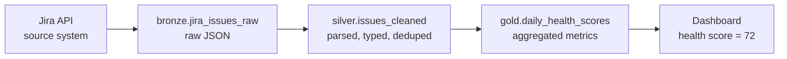
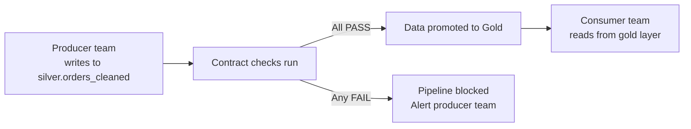

# SQL Quality, Security, Governance

> The guardrails that keep production data trustworthy, secure, and compliant. Quality checks catch problems before they reach dashboards. Security controls limit who sees what. Governance tracks where data came from and where it went.

---

## Data Quality Checks in SQL

Every production pipeline should run quality checks between the transform step and the write step. A bad write is harder to fix than a blocked write.

### The Five Essential Checks

```sql
-- 1. ROW COUNT: not empty, not suspiciously small
SELECT COUNT(*) AS row_count
FROM silver.orders_cleaned
WHERE order_date = CURRENT_DATE;
-- Expected: > 0 and within 20% of yesterday's count

-- 2. NULL RATE on critical columns
SELECT
    COUNT(*) AS total_rows,
    COUNTIF(order_id IS NULL) AS null_order_id,
    COUNTIF(customer_id IS NULL) AS null_customer_id,
    COUNTIF(amount IS NULL) AS null_amount,
    ROUND(COUNTIF(order_id IS NULL) / COUNT(*), 4) AS null_rate_order_id
FROM silver.orders_cleaned
WHERE order_date = CURRENT_DATE;
-- Threshold: null rate on order_id must be 0%

-- 3. UNIQUENESS: no duplicate primary keys
SELECT order_id, COUNT(*) AS duplicates
FROM silver.orders_cleaned
WHERE order_date = CURRENT_DATE
GROUP BY order_id
HAVING COUNT(*) > 1;
-- Expected: zero rows returned

-- 4. REFERENTIAL INTEGRITY: every order has a valid customer
SELECT o.order_id
FROM silver.orders_cleaned AS o
LEFT JOIN silver.customers AS c
    ON o.customer_id = c.customer_id
WHERE c.customer_id IS NULL
  AND o.order_date = CURRENT_DATE;
-- Expected: zero orphaned orders

-- 5. RANGE CHECKS: values within expected bounds
SELECT
    MIN(amount) AS min_amount,
    MAX(amount) AS max_amount,
    AVG(amount) AS avg_amount
FROM silver.orders_cleaned
WHERE order_date = CURRENT_DATE;
-- Expected: min >= 0, max < 1000000, avg within 2 standard deviations of historical mean
```

### Quality Check Summary Table

| Check | What It Catches | Severity |
|---|---|---|
| Row count | Broken ingestion, empty source, partial load | Critical |
| Null rate | Missing required fields, schema drift | Critical |
| Uniqueness | Duplicate ingestion, failed dedup | Critical |
| Referential integrity | Orphaned records, out-of-order loading | High |
| Range check | Data corruption, unit conversion errors | Medium |

---

## Schema Validation

Schema drift -- when the source system adds, removes, or renames columns -- is one of the most common causes of pipeline failures.

```sql
-- BigQuery: check that expected columns exist with expected types
SELECT column_name, data_type
FROM `project.silver.INFORMATION_SCHEMA.COLUMNS`
WHERE table_name = 'orders_cleaned'
ORDER BY ordinal_position;

-- Compare against expected schema
-- Expected columns and types:
-- order_id: INT64
-- customer_id: INT64
-- amount: NUMERIC
-- order_date: DATE
-- region: STRING
-- processed_at: TIMESTAMP
```

```sql
-- PostgreSQL: same check
SELECT column_name, data_type
FROM information_schema.columns
WHERE table_schema = 'silver'
  AND table_name = 'orders_cleaned'
ORDER BY ordinal_position;
```

**Automate this:** Compare the query result against a stored schema definition. If columns are missing or types have changed, block the pipeline and alert the team.

---

## Data Profiling Queries

Data profiling goes beyond pass/fail checks. It builds a statistical picture of your data so you can spot anomalies before they become incidents.

### Distribution Analysis

```sql
-- Value distribution for a categorical column
SELECT
    region,
    COUNT(*) AS row_count,
    ROUND(COUNT(*) * 100.0 / SUM(COUNT(*)) OVER(), 2) AS percentage
FROM silver.orders_cleaned
WHERE order_date = CURRENT_DATE
GROUP BY region
ORDER BY row_count DESC;
```

### Outlier Detection

```sql
-- Statistical outlier detection using z-score
WITH stats AS (
    SELECT
        AVG(amount) AS mean_amount,
        STDDEV(amount) AS stddev_amount
    FROM silver.orders_cleaned
    WHERE order_date >= DATE_SUB(CURRENT_DATE, INTERVAL 30 DAY)
)
SELECT
    o.order_id,
    o.amount,
    ROUND((o.amount - s.mean_amount) / s.stddev_amount, 2) AS z_score
FROM silver.orders_cleaned AS o
CROSS JOIN stats AS s
WHERE o.order_date = CURRENT_DATE
  AND ABS((o.amount - s.mean_amount) / s.stddev_amount) > 3
ORDER BY z_score DESC;
-- z-score > 3 means the value is more than 3 standard deviations from the mean
```

### Freshness Check

```sql
-- How stale is the data?
SELECT
    MAX(processed_at) AS latest_record,
    TIMESTAMP_DIFF(CURRENT_TIMESTAMP(), MAX(processed_at), MINUTE) AS minutes_since_last_update
FROM silver.orders_cleaned;
-- Alert if minutes_since_last_update > expected pipeline interval
```

---

## Access Control

### GRANT and REVOKE

SQL access control follows the principle of least privilege: each role gets only the permissions it needs.

```sql
-- Create roles
CREATE ROLE analyst;
CREATE ROLE engineer;
CREATE ROLE admin;

-- Analysts: read gold layer only
GRANT SELECT ON ALL TABLES IN SCHEMA gold TO analyst;

-- Engineers: read/write silver and gold, read bronze
GRANT SELECT ON ALL TABLES IN SCHEMA bronze TO engineer;
GRANT SELECT, INSERT, UPDATE, DELETE ON ALL TABLES IN SCHEMA silver TO engineer;
GRANT SELECT, INSERT, UPDATE, DELETE ON ALL TABLES IN SCHEMA gold TO engineer;

-- Revoke access that should not exist
REVOKE ALL ON ALL TABLES IN SCHEMA bronze FROM analyst;
```

### Row-Level Security (RLS)

Row-level security restricts which rows a user can see based on their identity or role.

```sql
-- PostgreSQL: row-level security
ALTER TABLE gold.team_metrics ENABLE ROW LEVEL SECURITY;

CREATE POLICY team_isolation ON gold.team_metrics
    FOR SELECT
    USING (team_id = current_setting('app.current_team_id')::INT);

-- Snowflake: row access policy
CREATE ROW ACCESS POLICY team_isolation AS (team_id INT)
RETURNS BOOLEAN ->
    team_id = CURRENT_ROLE()::INT
    OR IS_ROLE_IN_SESSION('ADMIN');

ALTER TABLE gold.team_metrics ADD ROW ACCESS POLICY team_isolation ON (team_id);
```

### Column-Level Masking

Mask sensitive columns so users see the data shape but not the actual values.

```sql
-- Snowflake: dynamic data masking
CREATE MASKING POLICY mask_email AS (val STRING)
RETURNS STRING ->
    CASE
        WHEN IS_ROLE_IN_SESSION('ADMIN') THEN val
        ELSE CONCAT(LEFT(val, 2), '****@', SPLIT_PART(val, '@', 2))
    END;

ALTER TABLE silver.customers
    MODIFY COLUMN email SET MASKING POLICY mask_email;

-- Result for non-admin: su****@example.com
```

---

## PII Detection in SQL

Personally Identifiable Information (PII) can enter your data lake from unexpected sources. Pattern matching helps find it.

```sql
-- Scan for common PII patterns in a text column
SELECT
    record_id,
    raw_text,
    CASE
        -- SSN pattern: XXX-XX-XXXX
        WHEN REGEXP_CONTAINS(raw_text, r'\b\d{3}-\d{2}-\d{4}\b')
        THEN 'SSN_DETECTED'

        -- Email pattern
        WHEN REGEXP_CONTAINS(raw_text, r'[a-zA-Z0-9._%+-]+@[a-zA-Z0-9.-]+\.[a-zA-Z]{2,}')
        THEN 'EMAIL_DETECTED'

        -- Phone pattern: (XXX) XXX-XXXX or XXX-XXX-XXXX
        WHEN REGEXP_CONTAINS(raw_text, r'\(?\d{3}\)?[-.\s]?\d{3}[-.\s]?\d{4}')
        THEN 'PHONE_DETECTED'

        -- Credit card pattern: 16 digits with optional separators
        WHEN REGEXP_CONTAINS(raw_text, r'\b\d{4}[-\s]?\d{4}[-\s]?\d{4}[-\s]?\d{4}\b')
        THEN 'CREDIT_CARD_DETECTED'

        ELSE 'CLEAN'
    END AS pii_flag
FROM bronze.support_tickets_raw
WHERE pii_flag != 'CLEAN';
```

**What to do when PII is found:** Route the record to a quarantine table. Mask or redact the PII before promoting to Silver. Log the detection for compliance reporting.

---

## Audit Logging

Every query against sensitive data should be logged: who ran it, when, and what they accessed.

```sql
-- BigQuery: query audit via INFORMATION_SCHEMA
SELECT
    user_email,
    query,
    creation_time,
    total_bytes_processed,
    total_slot_ms
FROM `region-us`.INFORMATION_SCHEMA.JOBS_BY_PROJECT
WHERE creation_time >= TIMESTAMP_SUB(CURRENT_TIMESTAMP(), INTERVAL 24 HOUR)
  AND statement_type IN ('SELECT', 'INSERT', 'UPDATE', 'DELETE', 'MERGE')
ORDER BY creation_time DESC;

-- PostgreSQL: enable query logging in postgresql.conf
-- log_statement = 'all'
-- log_min_duration_statement = 0
-- Then query pg_stat_statements for usage patterns:
SELECT
    usename,
    query,
    calls,
    total_exec_time,
    rows
FROM pg_stat_statements
JOIN pg_user ON pg_stat_statements.userid = pg_user.usesysid
ORDER BY total_exec_time DESC
LIMIT 20;
```

---

## Data Lineage

Data lineage answers: "Where did this number come from?" Tracing a value in a Gold table back through Silver to Bronze, back to the source system.



### Lineage Tools

| Tool | How It Works | Level of Effort |
|---|---|---|
| **dbt** | Generates lineage graph from SQL model references | Low -- built into dbt |
| **BigQuery Data Lineage** | Automatic column-level lineage for BigQuery jobs | Zero -- enabled in BigQuery settings |
| **OpenLineage** | Open standard for lineage metadata across tools | Medium -- requires integration |
| **Manual documentation** | Maintain a lineage map by hand | High -- drifts from reality quickly |

**Recommendation:** Use dbt lineage as the baseline. It is free, automatic, and covers the most common case (SQL model dependencies). Add BigQuery/Snowflake native lineage for column-level tracking.

---

## GDPR and Compliance

### Right to Deletion

When a user requests data deletion under GDPR (General Data Protection Regulation) or CCPA (California Consumer Privacy Act), you must be able to find and remove all their data.

```sql
-- Step 1: Find all tables containing the customer
-- (This requires a data catalog or manual inventory)

-- Step 2: Delete from each table
DELETE FROM silver.orders_cleaned WHERE customer_id = 12345;
DELETE FROM silver.customers WHERE customer_id = 12345;
DELETE FROM gold.customer_lifetime_value WHERE customer_id = 12345;

-- Step 3: Log the deletion for compliance
INSERT INTO audit.deletion_log (customer_id, tables_affected, deleted_by, deleted_at)
VALUES (12345, 'orders_cleaned,customers,customer_lifetime_value', 'compliance_bot', CURRENT_TIMESTAMP);
```

### Anonymization

When you need the data for analytics but cannot keep identifiable information.

```sql
-- Anonymize instead of delete: replace PII with hashed values
UPDATE silver.customers
SET
    name = 'ANONYMIZED',
    email = CONCAT(MD5(email), '@anon.local'),
    phone = 'ANONYMIZED',
    address = 'ANONYMIZED'
WHERE customer_id = 12345;
```

**Anonymization vs. deletion:** Anonymization preserves aggregate statistics (order counts, revenue trends) while removing identifiability. Deletion removes the data entirely. The right choice depends on your legal counsel's interpretation of the regulation.

---

## The Data Contract

A data contract is a formal agreement between the producer (team that writes data) and the consumer (team that reads data) on schema, quality, and freshness.

### What a Data Contract Specifies

| Element | Example |
|---|---|
| **Schema** | Table has columns: `order_id (INT64, NOT NULL)`, `amount (NUMERIC, NOT NULL)`, `order_date (DATE, NOT NULL)` |
| **Freshness** | Data is no more than 6 hours old |
| **Quality** | Null rate on `order_id` is 0%. Uniqueness on `order_id` is 100%. |
| **Volume** | Between 5,000 and 50,000 rows per day |
| **Owner** | Orders team (`orders-team@company.com`) |
| **SLA (Service Level Agreement)** | Pipeline runs by 04:00 UTC daily. Downtime communicated 24 hours in advance. |

### Enforcing Contracts in SQL

```sql
-- Contract check: run after every pipeline, block promotion on failure
WITH contract_checks AS (
    SELECT
        -- Freshness
        TIMESTAMP_DIFF(CURRENT_TIMESTAMP(), MAX(processed_at), HOUR) AS hours_since_update,
        -- Volume
        COUNT(*) AS row_count,
        -- Null rate
        COUNTIF(order_id IS NULL) AS null_order_ids,
        -- Uniqueness
        COUNT(DISTINCT order_id) AS distinct_order_ids
    FROM silver.orders_cleaned
    WHERE order_date = CURRENT_DATE
)
SELECT
    CASE WHEN hours_since_update > 6 THEN 'FAIL: stale data' ELSE 'PASS' END AS freshness_check,
    CASE WHEN row_count < 5000 THEN 'FAIL: volume too low'
         WHEN row_count > 50000 THEN 'FAIL: volume too high'
         ELSE 'PASS' END AS volume_check,
    CASE WHEN null_order_ids > 0 THEN 'FAIL: null order_ids' ELSE 'PASS' END AS null_check,
    CASE WHEN distinct_order_ids != row_count THEN 'FAIL: duplicate order_ids' ELSE 'PASS' END AS uniqueness_check
FROM contract_checks;
```



**Why contracts matter:** Without contracts, the producer changes a column name and the consumer's dashboard breaks at 3 AM. With contracts, the change is caught at the contract check layer and the producer is alerted before the consumer is impacted.

---

## Key Takeaways

1. **Five quality checks on every pipeline:** row count, null rate, uniqueness, referential integrity, range.
2. **Least-privilege access control is not optional.** Analysts read Gold. Engineers read/write Silver. No one touches Bronze by hand.
3. **PII detection should be automated.** Regex-based scanning catches the obvious patterns. Review quarantined records manually.
4. **Data lineage answers "where did this number come from?"** Use dbt lineage as the baseline. Add native engine lineage for column-level tracking.
5. **Data contracts formalize the producer-consumer agreement.** Schema, freshness, quality, volume -- in writing, enforced by SQL checks.

---

## Quick Links

| Chapter | Title |
|---|---|
| [01](01_Why.md) | SQL - Why It Matters |
| [02](02_Concepts.md) | SQL - Core Concepts |
| [03](03_Hello_World.md) | SQL - Hello World |
| [04](04_How_It_Works.md) | SQL - How It Works |
| [05](05_Building_It.md) | SQL - Building It |
| [06](06_Production_Patterns.md) | SQL - Production Patterns |
| [07](07_System_Design.md) | SQL - System Design |
| **08** | **SQL - Quality, Security, Governance** |
| [09](09_Observability_Troubleshooting.md) | SQL - Observability and Troubleshooting |
| [10](10_Decision_Guide.md) | SQL - Decision Guide |

**Reference notebook:** [Advanced SQL on Colab](https://colab.research.google.com/github/sunilmogadati/systems-in-production/blob/main/implementation/notebooks/Advanced_SQL.ipynb)
