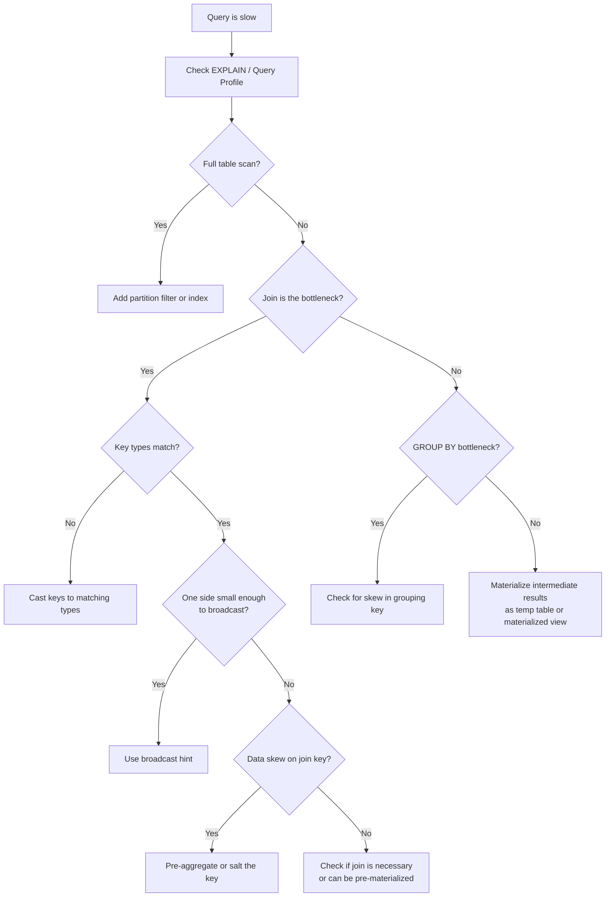
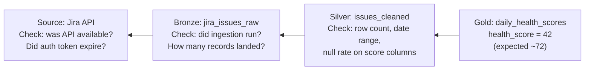

# SQL Observability and Troubleshooting

> When a query is slow, a pipeline fails, or a dashboard shows wrong numbers, this chapter is your diagnostic playbook. Systematic methods for finding the root cause, not guessing.

---

## Slow Query Diagnosis: EXPLAIN ANALYZE

Every SQL engine can show you its execution plan -- the steps it takes to run your query, how long each step takes, and how many rows it processes. This is where diagnosis starts.

```sql
-- PostgreSQL: EXPLAIN ANALYZE shows the actual execution plan with timing
EXPLAIN ANALYZE
SELECT
    c.region,
    COUNT(*) AS order_count,
    SUM(o.amount) AS total_revenue
FROM orders AS o
JOIN customers AS c ON o.customer_id = c.customer_id
WHERE o.order_date >= '2026-01-01'
GROUP BY c.region;
```

**What to look for in the output:**

| Signal | What It Means | Action |
|---|---|---|
| `Seq Scan` (Sequential Scan) | Full table scan -- reading every row | Add an index or partition filter |
| `Nested Loop` on large tables | For every row in table A, scan table B | Check if a Hash Join or Merge Join is possible |
| `Sort` with high cost | Sorting a large result set in memory or on disk | Add an index that matches the sort order |
| `Rows Removed by Filter: 9,999,000` | Read 10M rows, kept 1,000 | Push the filter earlier or add a partition |
| `actual time` much higher than `estimated` | Planner statistics are stale | Run `ANALYZE table_name` to update statistics |

### BigQuery Execution Details

BigQuery does not use `EXPLAIN ANALYZE`. Instead, check the **Query Execution Details** in the BigQuery console after running a query.

| BigQuery Metric | What to Watch |
|---|---|
| Bytes Processed | If this is unexpectedly high, you are scanning too much data. Add partition filters. |
| Slot Time | Total compute time across all workers. High slot time on a simple query means data skew. |
| Bytes Shuffled | Data moved between workers. High shuffle means expensive joins or GROUP BY. |
| Stage Timing | Shows which stage is the bottleneck. |

### Snowflake Query Profile

In the Snowflake web UI, click on a completed query and open the **Query Profile** tab.

| Snowflake Signal | What It Means |
|---|---|
| `TableScan` with high percentage | Full scan of a large table. Filter or partition. |
| `Spilling to Local/Remote Storage` | Not enough memory for the operation. Upsize the warehouse or reduce data volume. |
| Skewed partitions (one node doing 90% of work) | Data skew on the join or GROUP BY key. |

---

## Common Performance Problems

### 1. Full Table Scans

**Symptom:** Query takes minutes on a table with millions of rows, even though you only need one day of data.

**Cause:** Missing partition filter or missing index.

```sql
-- BAD: scans entire table
SELECT SUM(amount)
FROM silver.orders_cleaned
WHERE EXTRACT(YEAR FROM order_date) = 2026;
-- BigQuery cannot use partition pruning on a function applied to the partition column

-- GOOD: partition filter allows pruning
SELECT SUM(amount)
FROM silver.orders_cleaned
WHERE order_date >= '2026-01-01' AND order_date < '2027-01-01';
-- BigQuery scans only the 2026 partitions
```

```sql
-- PostgreSQL: add an index for frequent filter columns
CREATE INDEX idx_orders_date ON orders (order_date);
CREATE INDEX idx_orders_customer ON orders (customer_id);
```

### 2. Cartesian Joins

**Symptom:** Query returns billions of rows or runs for hours. Expected result was thousands of rows.

**Cause:** Missing or incorrect `ON` clause.

```sql
-- BAD: cartesian product (10,000 x 5,000 = 50,000,000 rows)
SELECT *
FROM orders, customers;

-- BAD: implicit join with missing condition
SELECT *
FROM orders o, customers c, products p
WHERE o.customer_id = c.customer_id;
-- Missing: AND o.product_id = p.product_id
-- This joins orders-customers correctly but crosses with every product row

-- GOOD: explicit joins with all conditions
SELECT *
FROM orders AS o
INNER JOIN customers AS c ON o.customer_id = c.customer_id
INNER JOIN products AS p ON o.product_id = p.product_id;
```

### 3. Skewed GROUP BY

**Symptom:** One worker takes 10 minutes while all others finish in 30 seconds.

**Cause:** One group has vastly more rows than others (e.g., 90% of events come from one `user_id`).

```sql
-- Diagnose: find the skew
SELECT
    region,
    COUNT(*) AS row_count
FROM silver.orders_cleaned
GROUP BY region
ORDER BY row_count DESC;

-- If one region has 10x the rows of others, that is the skew source
```

**Fixes:**
- In BigQuery: the engine handles skew automatically in most cases.
- In Snowflake: upsize the warehouse temporarily.
- In PostgreSQL: consider pre-aggregating the hot group separately.

### 4. Too Many Subqueries

**Symptom:** Deeply nested query that is hard to read and slow to execute.

```sql
-- BAD: nested subqueries
SELECT *
FROM (
    SELECT customer_id, total
    FROM (
        SELECT customer_id, SUM(amount) AS total
        FROM (
            SELECT * FROM orders WHERE order_date >= '2026-01-01'
        ) recent_orders
        GROUP BY customer_id
    ) customer_totals
    WHERE total > 1000
) high_value_customers;

-- GOOD: CTEs (Common Table Expressions) -- same logic, readable
WITH recent_orders AS (
    SELECT customer_id, amount
    FROM orders
    WHERE order_date >= '2026-01-01'
),
customer_totals AS (
    SELECT customer_id, SUM(amount) AS total
    FROM recent_orders
    GROUP BY customer_id
)
SELECT customer_id, total
FROM customer_totals
WHERE total > 1000;
```

**Performance note:** In PostgreSQL, CTEs were optimization barriers before version 12 (the engine materialized them). In PostgreSQL 12+ and in BigQuery/Snowflake, the optimizer can inline CTEs, so they perform the same as subqueries.

### 5. SELECT * Scanning Unnecessary Columns

**Symptom:** Query processes 10 GB but you only need 3 columns worth 200 MB.

```sql
-- BAD: scans all columns (columnar engines charge for every column scanned)
SELECT * FROM silver.orders_cleaned WHERE order_date = '2026-04-04';

-- GOOD: scan only what you need
SELECT order_id, customer_id, amount
FROM silver.orders_cleaned
WHERE order_date = '2026-04-04';
```

In BigQuery, this difference is directly reflected in bytes billed. In Snowflake, it affects memory usage and spill risk.

---

## The Drill-Down Method

When a query is slow, follow this sequence. Do not skip steps.



### Step-by-Step

1. **Query slow? Check EXPLAIN.** Look at the execution plan. Identify which operation consumes the most time.
2. **Full scan? Add a partition filter or index.** This resolves 60% of slow queries.
3. **Join slow? Check join key types match.** Joining an INT column to a STRING column forces a cast on every row. Fix the types.
4. **Join key types match but still slow? Consider broadcast.** If one table is small (< 100 MB), hint the engine to broadcast it to all workers.
5. **Still slow? Materialize intermediate results.** Create a temp table or materialized view for the expensive intermediate step, then query that.

---

## Query Cost Monitoring

### BigQuery: Bytes Scanned

```sql
-- Check recent query costs
SELECT
    user_email,
    query,
    total_bytes_processed,
    ROUND(total_bytes_processed / POW(1024, 3), 2) AS gb_processed,
    -- BigQuery on-demand pricing: $6.25 per TB scanned
    ROUND(total_bytes_processed / POW(1024, 4) * 6.25, 4) AS estimated_cost_usd,
    creation_time
FROM `region-us`.INFORMATION_SCHEMA.JOBS_BY_PROJECT
WHERE creation_time >= TIMESTAMP_SUB(CURRENT_TIMESTAMP(), INTERVAL 7 DAY)
  AND total_bytes_processed > 0
ORDER BY total_bytes_processed DESC
LIMIT 20;
```

### Snowflake: Credits Used

```sql
-- Check warehouse credit consumption
SELECT
    warehouse_name,
    SUM(credits_used) AS total_credits,
    -- Snowflake standard pricing: ~$2-4 per credit depending on edition
    ROUND(SUM(credits_used) * 3, 2) AS estimated_cost_usd,
    COUNT(*) AS query_count
FROM snowflake.account_usage.warehouse_metering_history
WHERE start_time >= DATEADD('day', -7, CURRENT_TIMESTAMP())
GROUP BY warehouse_name
ORDER BY total_credits DESC;
```

### Cost Anomaly Detection

```sql
-- Alert if today's cost exceeds 2x the 7-day average
WITH daily_costs AS (
    SELECT
        DATE(creation_time) AS query_date,
        SUM(total_bytes_processed) / POW(1024, 4) AS tb_scanned
    FROM `region-us`.INFORMATION_SCHEMA.JOBS_BY_PROJECT
    WHERE creation_time >= TIMESTAMP_SUB(CURRENT_TIMESTAMP(), INTERVAL 8 DAY)
    GROUP BY query_date
),
averages AS (
    SELECT AVG(tb_scanned) AS avg_daily_tb
    FROM daily_costs
    WHERE query_date < CURRENT_DATE
)
SELECT
    dc.query_date,
    dc.tb_scanned,
    a.avg_daily_tb,
    ROUND(dc.tb_scanned / a.avg_daily_tb, 2) AS ratio_to_avg
FROM daily_costs dc
CROSS JOIN averages a
WHERE dc.query_date = CURRENT_DATE
  AND dc.tb_scanned > 2 * a.avg_daily_tb;
-- If this returns a row, today's cost is anomalous
```

---

## Alerting on Data Quality

Quality checks are useless if no one sees the result. Automated alerts close the loop.

### Pattern: Quality Check Table + Alert Query

```sql
-- Step 1: Store quality check results
CREATE TABLE audit.quality_checks (
    check_id SERIAL PRIMARY KEY,
    check_name STRING,
    table_name STRING,
    check_date DATE,
    status STRING,  -- 'PASS' or 'FAIL'
    detail STRING,
    checked_at TIMESTAMP DEFAULT CURRENT_TIMESTAMP
);

-- Step 2: Insert check results after each pipeline run
INSERT INTO audit.quality_checks (check_name, table_name, check_date, status, detail)
VALUES
    ('row_count', 'silver.orders_cleaned', CURRENT_DATE,
     CASE WHEN (SELECT COUNT(*) FROM silver.orders_cleaned WHERE order_date = CURRENT_DATE) > 0
          THEN 'PASS' ELSE 'FAIL' END,
     CONCAT('row_count=', CAST((SELECT COUNT(*) FROM silver.orders_cleaned WHERE order_date = CURRENT_DATE) AS STRING))
    );

-- Step 3: Alert query (run by monitoring system)
SELECT check_name, table_name, check_date, detail
FROM audit.quality_checks
WHERE check_date = CURRENT_DATE
  AND status = 'FAIL';
-- If any rows returned, trigger alert (PagerDuty, Slack, email)
```

### Alert Priority Matrix

| Check Failure | Impact | Alert Channel | Response SLA |
|---|---|---|---|
| Row count = 0 | Dashboard shows no data | PagerDuty (page on-call) | 30 minutes |
| Null rate > threshold | Metrics are wrong | Slack channel alert | 2 hours |
| Duplicate primary keys | Double-counting in reports | Slack channel alert | 4 hours |
| Freshness > 6 hours | Stale dashboard | Email to data team | Next business day |
| Cost anomaly (2x average) | Budget overrun | Email to team lead | Next business day |

---

## Debugging Pipeline Failures

### Scenario: "Gold mart has wrong numbers"

This is the most common production issue: a dashboard shows a metric that does not match expectations. The debug path traces backward through the layers.



### Step-by-Step Debug Protocol

| Step | Query / Action | What You Are Looking For |
|---|---|---|
| 1. Confirm the problem | `SELECT * FROM gold.daily_health_scores WHERE report_date = CURRENT_DATE` | Is the value actually wrong? What is the expected value? |
| 2. Check Gold logic | Review the Gold transform SQL | Did the aggregation logic change? Is there a new filter? |
| 3. Check Silver input | `SELECT COUNT(*), MIN(created_date), MAX(created_date) FROM silver.issues_cleaned WHERE created_date = CURRENT_DATE` | Is the Silver data complete? Right date range? |
| 4. Check Bronze input | `SELECT COUNT(*) FROM bronze.jira_issues_raw WHERE _ingested_at >= CURRENT_DATE` | Did ingestion run? Did it bring the expected volume? |
| 5. Check source | Query the source API or check ingestion logs | Was the source available? Did auth fail? Did the schema change? |
| 6. Check pipeline logs | Review Airflow/dbt/scheduler logs | Did the pipeline run? Did it error? Did it run out of order? |

**The most common root causes:**

| Root Cause | Frequency | How to Spot It |
|---|---|---|
| Pipeline did not run (scheduler failure) | 30% | Bronze has no rows for today |
| Source API returned partial data | 25% | Bronze row count is 50% of normal |
| Schema change in source | 15% | Silver transform failed on a missing column |
| Transform logic bug (recent code change) | 15% | Gold numbers changed on the same day as a deploy |
| Data quality issue in source (bad data) | 10% | Bronze data is complete but contains corrupt values |
| Timezone mismatch | 5% | Records show up under the wrong date |

---

## Key Takeaways

1. **EXPLAIN ANALYZE (or Query Profile) is the first tool.** Never guess why a query is slow. Look at the plan.
2. **Full table scans cause most slow queries.** Add partition filters or indexes. Check this first.
3. **The drill-down method is systematic:** full scan? join bottleneck? GROUP BY skew? materialize intermediates.
4. **Monitor cost, not just performance.** A fast query that scans 10 TB every hour is an expensive query.
5. **Debug backward through the layers.** Gold is wrong? Check Silver. Silver is wrong? Check Bronze. Bronze is wrong? Check the source.

---

## Quick Links

| Chapter | Title |
|---|---|
| [01](01_Why.md) | SQL - Why It Matters |
| [02](02_Concepts.md) | SQL - Core Concepts |
| [03](03_Hello_World.md) | SQL - Hello World |
| [04](04_How_It_Works.md) | SQL - How It Works |
| [05](05_Building_It.md) | SQL - Building It |
| [06](06_Production_Patterns.md) | SQL - Production Patterns |
| [07](07_System_Design.md) | SQL - System Design |
| [08](08_Quality_Security_Governance.md) | SQL - Quality, Security, Governance |
| **09** | **SQL - Observability and Troubleshooting** |
| [10](10_Decision_Guide.md) | SQL - Decision Guide |

**Reference notebook:** [Advanced SQL on Colab](https://colab.research.google.com/github/sunilmogadati/systems-in-production/blob/main/implementation/notebooks/Advanced_SQL.ipynb)
