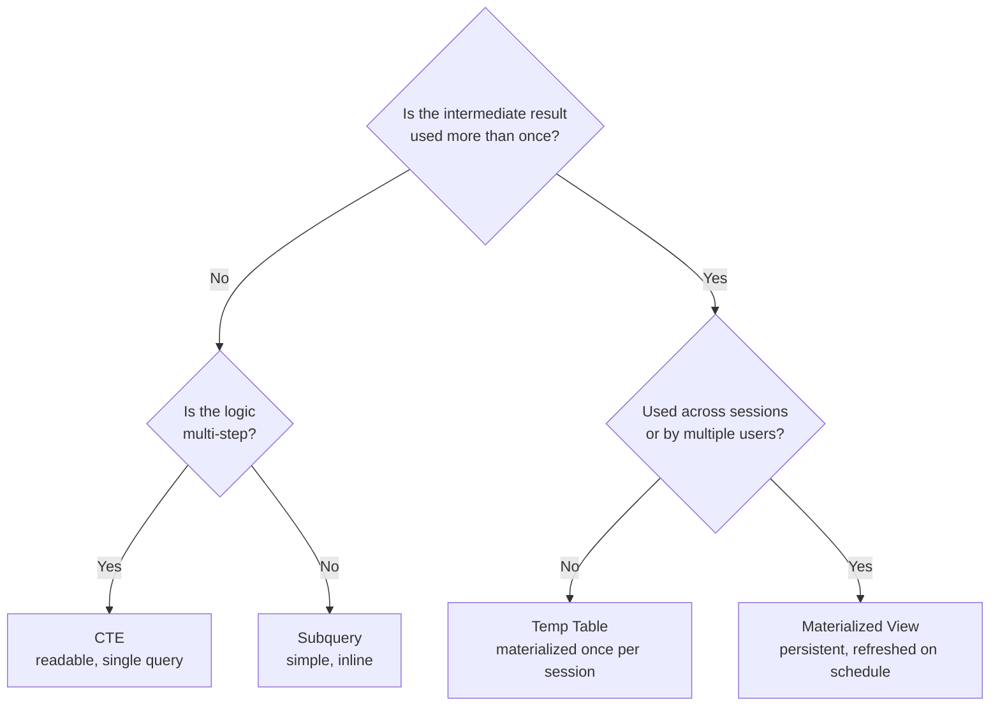

# SQL Decision Guide

> The decision tables and checklists that save you from analysis paralysis. When you are not sure which approach to use, start here.

---

## Which SQL Engine Should I Use?

| Scenario | Recommended Engine | Why |
|---|---|---|
| Application backend with row-level reads/writes | **PostgreSQL** (or Cloud SQL / RDS) | ACID transactions, row-level locking, rich extension ecosystem |
| Large-scale analytics on GCP | **BigQuery** | Serverless, scales to petabytes, native GCP integration |
| Large-scale analytics on AWS | **Redshift** or **Athena** | Redshift for persistent workloads, Athena for ad-hoc queries over S3 |
| Multi-cloud analytics or data sharing | **Snowflake** | Cloud-agnostic, zero-copy data sharing, separate compute and storage |
| Ad-hoc queries over files in S3 | **Athena** | No infrastructure, pay per query, reads Parquet/CSV/JSON directly |
| ML feature computation at scale | **BigQuery** or **Snowflake** | Both handle complex aggregations over billions of rows without cluster management |
| Real-time operational dashboards | **PostgreSQL** with materialized views | Sub-second reads on pre-computed results |
| Streaming analytics | **BigQuery** (streaming inserts) or **Apache Flink SQL** | BigQuery for near-real-time, Flink for true event-at-a-time |

**Default recommendation:** PostgreSQL for the application database. BigQuery or Snowflake for the analytics warehouse. Connect them with a pipeline.

---

## SQL vs. Python for This Transform?

| Scenario | Use SQL | Use Python | Why |
|---|---|---|---|
| Aggregations (SUM, COUNT, AVG, GROUP BY) | Yes | | SQL engines are optimized for this. |
| Joins between tables | Yes | | SQL join optimizers outperform most Python code. |
| Window functions (running totals, ranks) | Yes | | Declarative and readable. No manual iteration. |
| MERGE / upsert | Yes | | Atomic, idempotent, one statement. |
| Complex string parsing (regex, NLP) | | Yes | Python regex and NLP libraries are more powerful. |
| API calls per row | | Yes | SQL cannot call external APIs. |
| ML model inference per row | | Yes | Python has the model libraries. (But compute features in SQL first.) |
| Conditional logic with 20+ branches | | Yes | Deeply nested CASE WHEN becomes unreadable. |
| Data validation with custom business rules | Both | Both | Simple rules in SQL. Complex rules in Python with SQL as input. |
| Graph traversal / recursive relationships | SQL (recursive CTE) | Python (networkx) | SQL handles moderate recursion. Python for deep graphs. |

**Rule of thumb:** If it can be expressed as a SQL query that runs in the database engine, do it in SQL. The data does not leave the engine, and the engine's optimizer does the hard work. Use Python when the operation requires libraries or logic that SQL cannot express.

---

## CTE vs. Subquery vs. Temp Table?

| Approach | When to Use | Performance | Readability | Scope |
|---|---|---|---|---|
| **CTE** (Common Table Expression) | Multi-step transforms within a single query | Same as subquery in modern engines (PostgreSQL 12+, BigQuery, Snowflake) | Best -- named steps, top-to-bottom flow | Single query |
| **Subquery** | Simple one-off nested query | Same as CTE | Adequate for 1-2 levels; poor for deep nesting | Single query |
| **Temp Table** | Intermediate result used by multiple subsequent queries | Can be faster -- materialized once, read many times | Good -- explicit intermediate state | Session or transaction |
| **Materialized View** | Result reused across sessions and users | Pre-computed; fast reads | Good | Persistent until refreshed |



**Default recommendation:** Use CTEs for readability. Switch to temp tables when you need to reference the same intermediate result in multiple subsequent queries within a session. Switch to materialized views when the result is expensive and consumed by many users or dashboards.

---

## Partitioned Table vs. Materialized View?

| Dimension | Partitioned Table | Materialized View |
|---|---|---|
| **Purpose** | Reduce scan cost on large tables | Pre-compute expensive aggregations |
| **Data** | Raw or cleaned row-level data | Aggregated or joined result |
| **Freshness** | Real-time (data is the table) | Stale until refreshed (manual or auto) |
| **Best For** | Large fact tables queried by date | Dashboard-backing queries, repeated aggregations |
| **Cost Impact** | Reduces bytes scanned per query | Reduces compute per query (but adds storage) |
| **Maintenance** | Automatic (new partitions on insert) | Requires refresh schedule |

**Use both together:** Partition the base table by date. Create a materialized view over the partitioned table for the aggregation your dashboard needs. The partition reduces the materialized view's refresh cost; the materialized view eliminates the dashboard query cost.

---

## Join Type Selection Guide

| Join Type | Returns | Use When |
|---|---|---|
| `INNER JOIN` | Only rows that match in both tables | You need records that exist in both tables (e.g., orders with valid customers) |
| `LEFT JOIN` | All rows from left table + matching rows from right | You need all records from the primary table even if the lookup is missing (e.g., all orders, with customer info if available) |
| `RIGHT JOIN` | All rows from right table + matching rows from left | Rarely used. Rewrite as LEFT JOIN with tables swapped for clarity. |
| `FULL OUTER JOIN` | All rows from both tables, NULLs where no match | Reconciliation: find records in either system (e.g., compare two data sources) |
| `CROSS JOIN` | Every combination of rows (cartesian product) | Generating combinations (e.g., all products x all dates for a dense calendar) |
| `LEFT ANTI JOIN` (`WHERE NOT EXISTS`) | Rows in left table with no match in right | Finding orphans, missing records, new rows not yet processed |
| `SEMI JOIN` (`WHERE EXISTS`) | Rows in left table that have at least one match in right | Filtering by existence without duplicating rows from the right table |

```sql
-- ANTI JOIN: find orders with no matching customer
SELECT o.order_id
FROM silver.orders_cleaned AS o
WHERE NOT EXISTS (
    SELECT 1 FROM silver.customers AS c
    WHERE c.customer_id = o.customer_id
);

-- SEMI JOIN: find customers who have placed at least one order
SELECT c.customer_id, c.name
FROM silver.customers AS c
WHERE EXISTS (
    SELECT 1 FROM silver.orders_cleaned AS o
    WHERE o.customer_id = c.customer_id
);
```

---

## Window Function Selection Guide

| Problem | Window Function | Example |
|---|---|---|
| Rank items within a group | `ROW_NUMBER()`, `RANK()`, `DENSE_RANK()` | Top 3 products by revenue per region |
| Running total / cumulative sum | `SUM() OVER (ORDER BY ...)` | Cumulative revenue by day |
| Moving average | `AVG() OVER (ORDER BY ... ROWS BETWEEN N PRECEDING AND CURRENT ROW)` | 7-day rolling average of orders |
| Previous/next row value | `LAG()`, `LEAD()` | Day-over-day change in revenue |
| First/last value in a group | `FIRST_VALUE()`, `LAST_VALUE()` | First purchase date per customer |
| Percentage of total | `SUM() OVER () ` (no PARTITION) | Each region's share of total revenue |
| Percentile / distribution | `NTILE(N)`, `PERCENT_RANK()` | Assign customers to quartiles by spend |

```sql
-- ROW_NUMBER vs RANK vs DENSE_RANK (the difference matters)
SELECT
    region,
    product_name,
    revenue,
    ROW_NUMBER() OVER (PARTITION BY region ORDER BY revenue DESC) AS row_num,
    -- 1, 2, 3, 4 (always unique, even on ties)
    RANK() OVER (PARTITION BY region ORDER BY revenue DESC) AS rank,
    -- 1, 2, 2, 4 (ties get same rank, next rank skipped)
    DENSE_RANK() OVER (PARTITION BY region ORDER BY revenue DESC) AS dense_rank
    -- 1, 2, 2, 3 (ties get same rank, next rank NOT skipped)
FROM gold.product_revenue;
```

---

## Index Strategy Guide

Indexes speed up reads by creating a lookup structure. They slow down writes (the index must be updated on every INSERT/UPDATE). This tradeoff governs the strategy.

| Scenario | Index? | Index Type | Column(s) |
|---|---|---|---|
| Frequent WHERE filter on a column | Yes | B-tree (default) | The filtered column |
| JOIN key between two tables | Yes | B-tree | The foreign key column |
| Frequent ORDER BY | Yes | B-tree | The sorted column |
| Full-text search | Yes | GIN (PostgreSQL) or full-text index | The text column |
| High-write, low-read table (e.g., event log) | No | -- | Do not index; writes will slow down |
| Column with very low cardinality (e.g., boolean) | No | -- | Index provides little selectivity |
| Cloud warehouse (BigQuery, Snowflake) | No (use partitioning/clustering instead) | -- | These engines do not use traditional indexes |

```sql
-- PostgreSQL: create indexes for common query patterns
CREATE INDEX idx_orders_date ON orders (order_date);
CREATE INDEX idx_orders_customer_date ON orders (customer_id, order_date);

-- Composite index: useful when queries filter on both columns
-- The order matters: (customer_id, order_date) supports:
--   WHERE customer_id = 123
--   WHERE customer_id = 123 AND order_date = '2026-04-04'
-- But NOT efficiently:
--   WHERE order_date = '2026-04-04' (alone, without customer_id)
```

**BigQuery, Snowflake, Redshift:** These columnar engines do not use B-tree indexes. Use **partitioning** and **clustering** instead (see Chapter 07). Do not try to create indexes on these engines.

---

## Production Readiness Checklist for SQL Pipelines

Before promoting a SQL pipeline to production, verify every item.

### Data Quality

- [ ] Row count check: output is not empty and within expected range
- [ ] Null rate check on all NOT NULL business columns
- [ ] Uniqueness check on primary key columns
- [ ] Referential integrity check: no orphaned foreign keys
- [ ] Range check: numeric values within expected bounds
- [ ] Freshness check: data is not stale

### Performance

- [ ] Large tables are partitioned (by date or appropriate key)
- [ ] Queries include partition filters (no full scans on partitioned tables)
- [ ] Frequently queried columns are clustered (BigQuery, Snowflake) or indexed (PostgreSQL)
- [ ] Dashboard-backing queries use materialized views where appropriate
- [ ] No `SELECT *` in production queries

### Idempotency

- [ ] Every transform can be run twice without corrupting data
- [ ] INSERT statements use `WHERE NOT EXISTS` or `MERGE`
- [ ] DELETE statements target specific partitions or keys, not entire tables

### Security

- [ ] Roles follow least-privilege (analysts read Gold only)
- [ ] PII columns are masked or hashed before Gold layer
- [ ] Service accounts have only required permissions
- [ ] Audit logging is enabled

### Operations

- [ ] Pipeline is scheduled (not run by hand)
- [ ] Alerts are configured for pipeline failure and data quality check failure
- [ ] Runbook exists for common failure scenarios
- [ ] Cost monitoring is in place with budget alerts

---

## The SQL Anti-Patterns Checklist

Review your SQL against this list before merging to production.

| Anti-Pattern | Risk | Fix |
|---|---|---|
| `SELECT *` | Scans unnecessary columns; breaks on schema change | List specific columns |
| Implicit joins (`FROM a, b WHERE ...`) | Easy to miss a condition and create cartesian product | Use explicit `JOIN ... ON` |
| `DELETE` or `UPDATE` without `WHERE` | Destroys or corrupts entire table | Always include `WHERE`; code review should flag bare DELETE/UPDATE |
| Non-idempotent INSERT (no dedup guard) | Pipeline retry doubles the data | Use `MERGE` or `INSERT ... WHERE NOT EXISTS` |
| Hardcoded dates | Breaks tomorrow | Use `CURRENT_DATE` or parameterize |
| `ORDER BY` in subquery or CTE | Wastes compute; outer query re-sorts anyway | Only `ORDER BY` in the final SELECT |
| `DISTINCT` to hide a bad join | Masks the real problem (duplicate join path) | Fix the join condition instead |
| Functions on partition columns in WHERE | Prevents partition pruning | Filter on the raw column value |
| Missing transaction boundaries | Partial writes leave inconsistent state | Wrap multi-statement transforms in `BEGIN ... COMMIT` |
| Giant CASE WHEN chains (20+ branches) | Unreadable, unmaintainable | Move to a lookup table or Python |

---

## Quick Reference: SQL Syntax Across Engines

| Operation | BigQuery | PostgreSQL | Redshift | Snowflake |
|---|---|---|---|---|
| **Current date** | `CURRENT_DATE()` | `CURRENT_DATE` | `CURRENT_DATE` | `CURRENT_DATE` |
| **Current timestamp** | `CURRENT_TIMESTAMP()` | `NOW()` or `CURRENT_TIMESTAMP` | `GETDATE()` or `CURRENT_TIMESTAMP` | `CURRENT_TIMESTAMP()` |
| **Date difference** | `DATE_DIFF(end, start, DAY)` | `end - start` (returns interval) | `DATEDIFF('day', start, end)` | `DATEDIFF('day', start, end)` |
| **Date add** | `DATE_ADD(date, INTERVAL 7 DAY)` | `date + INTERVAL '7 days'` | `DATEADD('day', 7, date)` | `DATEADD('day', 7, date)` |
| **String concat** | `CONCAT(a, b)` or `a \|\| b` | `a \|\| b` or `CONCAT(a, b)` | `a \|\| b` or `CONCAT(a, b)` | `a \|\| b` or `CONCAT(a, b)` |
| **Conditional count** | `COUNTIF(condition)` | `COUNT(*) FILTER (WHERE condition)` | `SUM(CASE WHEN condition THEN 1 ELSE 0 END)` | `COUNT_IF(condition)` |
| **Create temp table** | `CREATE TEMP TABLE t AS ...` | `CREATE TEMP TABLE t AS ...` | `CREATE TEMP TABLE t AS ...` | `CREATE TEMPORARY TABLE t AS ...` |
| **MERGE / Upsert** | `MERGE INTO ... USING ...` | `INSERT ... ON CONFLICT DO UPDATE` (or `MERGE` in v15+) | `MERGE INTO ... USING ...` | `MERGE INTO ... USING ...` |
| **Partition a table** | `PARTITION BY date_col` in DDL | Table partitioning via `CREATE TABLE ... PARTITION BY RANGE(col)` | `DISTKEY` / `SORTKEY` in DDL | `CLUSTER BY (col)` in DDL |
| **Semi-structured data** | JSON functions on STRING | `JSONB` type with `->>` operators | `JSON_EXTRACT_PATH_TEXT()` | `VARIANT` type with `:` notation |
| **Regex match** | `REGEXP_CONTAINS(col, r'pattern')` | `col ~ 'pattern'` | `col ~ 'pattern'` (limited) | `REGEXP_LIKE(col, 'pattern')` |
| **Array functions** | `UNNEST(array_col)` | `unnest(array_col)` | `Not natively supported` | `FLATTEN(array_col)` |

---

## Key Takeaways

1. **Start with the decision tables.** They encode the experience of teams that have already made (and regretted) these choices.
2. **SQL first, Python second.** If the transform can run in the database engine, keep it there.
3. **CTEs are the default for multi-step logic.** Switch to temp tables only when the result is reused across queries.
4. **Indexes are for PostgreSQL. Partitioning and clustering are for cloud warehouses.** Do not mix the strategies.
5. **The production readiness checklist is the gate.** No pipeline ships without passing it.

---

## Quick Links

| Chapter | Title |
|---|---|
| [01](01_Why.md) | SQL - Why It Matters |
| [02](02_Concepts.md) | SQL - Core Concepts |
| [03](03_Hello_World.md) | SQL - Hello World |
| [04](04_How_It_Works.md) | SQL - How It Works |
| [05](05_Building_It.md) | SQL - Building It |
| [06](06_Production_Patterns.md) | SQL - Production Patterns |
| [07](07_System_Design.md) | SQL - System Design |
| [08](08_Quality_Security_Governance.md) | SQL - Quality, Security, Governance |
| [09](09_Observability_Troubleshooting.md) | SQL - Observability and Troubleshooting |
| **10** | **SQL - Decision Guide** |

**Reference notebook:** [Advanced SQL on Colab](https://colab.research.google.com/github/sunilmogadati/systems-in-production/blob/main/implementation/notebooks/Advanced_SQL.ipynb)
