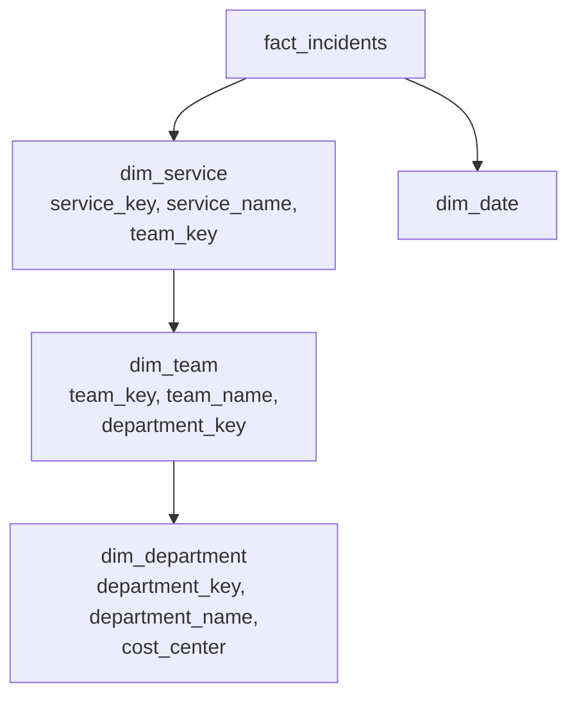
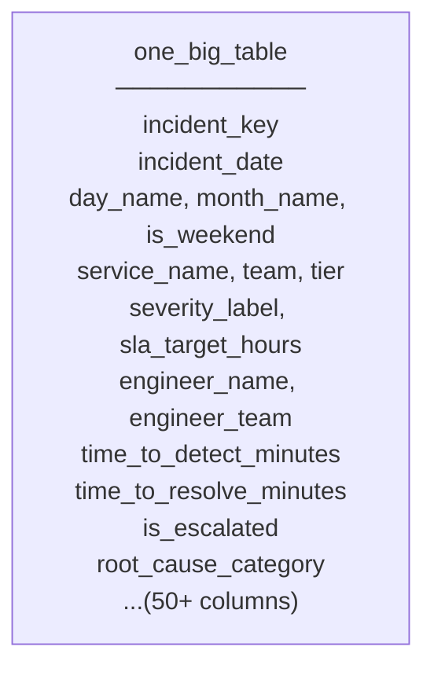
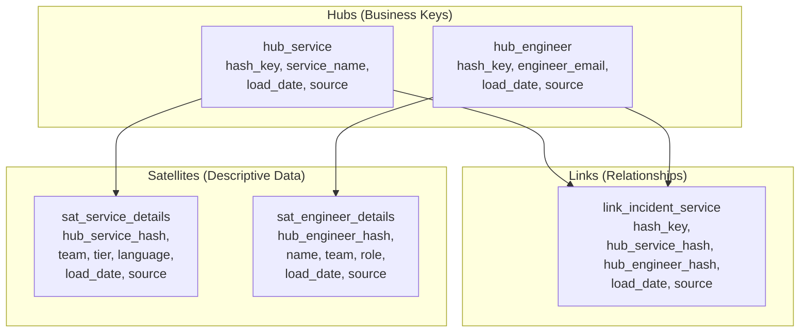
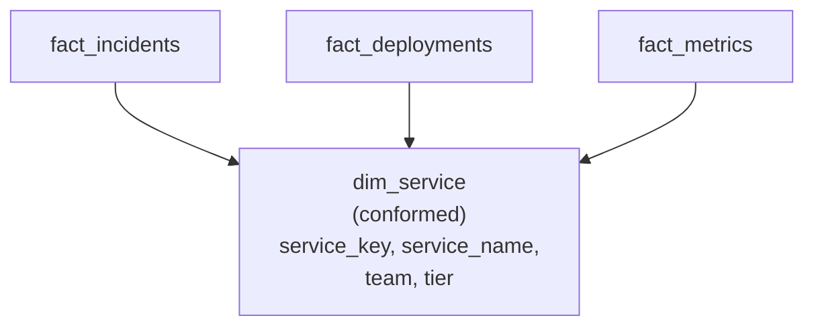
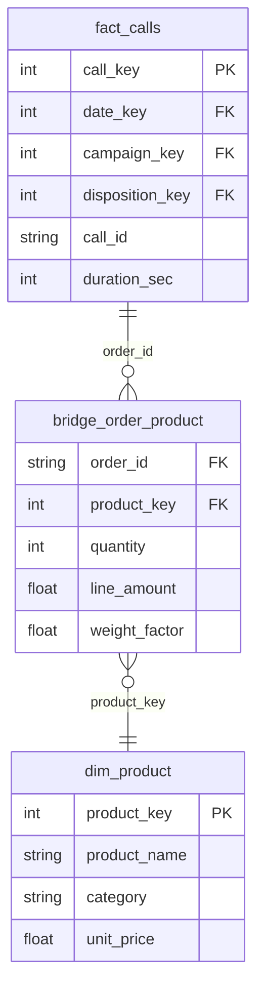

# Data Modeling — Production Patterns

**The six schema patterns used in production systems, when to use each, and the dimension techniques that make them work.**

---

## Star Schema

The star schema is the default pattern for analytical data models. One fact table at the center, dimension tables around it, all connected by surrogate keys.

**Structure:** Fact table + denormalized dimension tables. Each dimension is a single table — `dim_campaign` contains campaign name, client name, and channel in one table.

**Strengths:** Simple queries (one join per dimension), fast reads (integer key joins), easy for analysts to understand, optimized by every modern warehouse (BigQuery, Redshift, Snowflake the product).

**Weaknesses:** Dimension tables can get wide (many columns). Not ideal when dimensions have millions of rows with deep hierarchies.

**Use when:** This is the default. Start here unless you have a specific reason not to.

> For a complete deep dive on star schema — design decisions, DDL, load patterns, and the call center implementation — see [Star Schema Design](../star-schema-design/).

---

## Snowflake Schema

The snowflake schema normalizes dimension tables into sub-tables, creating a hierarchy.



**Star version:** `dim_service` contains service_name, team_name, department_name, cost_center — all in one table.

**Snowflake version:** `dim_service` contains only service_name and a team_key. `dim_team` contains team_name and a department_key. `dim_department` contains department_name and cost_center.

| Property | Star | Snowflake |
|:---|:---|:---|
| Query complexity | One join per dimension | Multiple joins to traverse the hierarchy |
| Storage | Slightly higher (redundancy in dimensions) | Slightly lower |
| Query performance | Faster (fewer joins) | Slower (more joins) |
| Maintenance | Update in one place (the dimension) | Updates cascade through sub-tables |

**Use when:**
- A dimension table has millions of rows AND a deep hierarchy (e.g., product catalog with category > subcategory > brand > product, 500K products)
- Storage cost is a real constraint (increasingly rare with modern warehouse pricing)
- A dimension is shared across many fact tables and the normalized version reduces load complexity

**Do not use when:**
- Dimension tables have fewer than 100K rows (the join overhead is not worth it)
- Analysts write ad hoc queries (more joins = more errors = more support tickets)
- You are using BigQuery, Redshift, or Snowflake (the product) — all three optimize for star schema patterns

> **Default rule:** Star schema. Only snowflake a dimension when it has 100K+ rows AND a hierarchy deeper than 2 levels AND you have measured a performance benefit.

---

## One Big Table (OBT)

The One Big Table pattern denormalizes everything — fact and dimension data — into a single wide table. No joins at query time.



**The tradeoff:** Zero joins means maximum query speed and simplicity. But every dimension attribute is duplicated across every fact row. If the `payment-api` service has 10,000 incidents, the string `'payment-api'`, the team name, the tier, and every other service attribute is stored 10,000 times.

| Property | Star Schema | One Big Table |
|:---|:---|:---|
| Query complexity | Simple joins | No joins at all |
| Storage | Moderate | High (massive redundancy) |
| Update difficulty | Update dimension once | Must update every row that references the changed value |
| Analyst experience | Need to know the schema (which dimension has which attribute) | Everything is in one table — just SELECT and GROUP BY |
| SCD support | Native (dimension versioning) | Extremely difficult (which rows get the old value vs new?) |

**Use when:**
- The data is consumed by a BI tool (Looker, Tableau, Power BI) that works best with flat tables
- The fact table is small (< 10M rows) and dimensions rarely change
- The use case is a specific dashboard, not general-purpose analysis
- You are building a **materialized view** or **Gold layer summary** on top of a star schema (the star schema is the source of truth, the OBT is a read-optimized copy)

**Do not use when:**
- Dimensions change frequently (SCD becomes a nightmare)
- The fact table has 100M+ rows (storage cost and update cost are real)
- Multiple teams query the data for different purposes (a star schema is more flexible)

---

## Data Vault

The data vault pattern is designed for enterprise-scale data warehouses where data comes from many source systems, business rules change over time, and full auditability is required.



**Three building blocks:**

| Component | What It Stores | Analogy |
|:---|:---|:---|
| **Hub** | Business keys only (the unique identifiers). No descriptive attributes. | The spine of a filing cabinet — the labels on each drawer |
| **Link** | Relationships between hubs. Captures which entities are connected. | The cross-references between drawers |
| **Satellite** | Descriptive attributes and their change history. Every change is a new row with a load timestamp. | The documents inside each drawer — with every version kept |

**Strengths:**
- Full auditability — every value change is tracked with source and timestamp
- Resilient to source system changes — adding a new source just means loading new hubs/links/satellites
- Parallelizable — each hub, link, and satellite can be loaded independently
- No business rules in the load — raw data goes in as-is, business rules are applied in the reporting layer

**Weaknesses:**
- Complex — many more tables than star schema (a 5-dimension star becomes 5 hubs + links + 10+ satellites)
- Queries are complex — analysts cannot query data vault tables directly; a reporting layer (often a star schema) sits on top
- Overkill for most teams — justified when you have 50+ source systems and regulatory audit requirements

**Use when:**
- Enterprise-scale warehouse (50+ source systems)
- Regulatory requirements for full data lineage and auditability (finance, healthcare)
- Business rules change frequently and you need the raw history to reapply them
- Multiple teams load data independently and you need parallel load capability

**Do not use when:**
- Single source system or small number of sources
- Team is small (< 5 data engineers)
- Stakeholders need fast time-to-value (data vault takes longer to build initially)
- No regulatory requirement for full auditability

---

## Activity Schema

The activity schema is designed for event-based systems where every interaction is a timestamped event with a common structure.

```sql
CREATE TABLE activities (
    activity_id INT64,
    activity_ts TIMESTAMP,
    entity_type STRING,       -- 'service', 'engineer', 'deployment'
    entity_id STRING,         -- The specific service/engineer/deployment
    activity_type STRING,     -- 'incident_created', 'deployed', 'metric_recorded'
    attribute_json STRING     -- JSON blob with activity-specific details
);
```

| Property | Star Schema | Activity Schema |
|:---|:---|:---|
| Schema changes | Requires ALTER TABLE or new tables | Just add a new activity_type — no schema change |
| Query simplicity | High (structured columns) | Lower (must parse JSON for details) |
| Flexibility | Fixed — the model defines what can be queried | Unlimited — any event type can be stored |
| Performance | Fast (columnar storage on typed columns) | Slower (JSON parsing at query time) |

**Use when:**
- The system generates many different event types and new types are added frequently
- You need a single table for all activity for downstream ML feature engineering
- The team values schema flexibility over query performance
- Product analytics (user clickstreams, in-app events) where event types change weekly

**Do not use when:**
- Stakeholders need fast, simple queries (JSON parsing is slow and error-prone)
- The event types are well-known and stable (a star schema is better)
- Compliance requires column-level access control (you cannot mask one field inside a JSON blob)

---

## Slowly Changing Dimension Patterns

SCDs (Slowly Changing Dimensions) handle the reality that dimension data changes over time. The choice of SCD type determines what history is preserved.

### Type 1 — Overwrite

Old value is replaced. No history.

```sql
-- Agent Sarah moves from Sales to Support
UPDATE dim_engineer
SET team = 'Support'
WHERE engineer_email = 'sarah@company.com' AND is_current = TRUE;
```

**Before:** team = 'Sales'. **After:** team = 'Support'. Sales is gone.

**Use for:** Corrections (typo in name), attributes nobody reports on historically.

### Type 2 — Versioned Rows

Old row is expired, new row is inserted. Full history.

```sql
-- Step 1: Expire the current row
UPDATE dim_engineer
SET expiry_date = CURRENT_DATE(), is_current = FALSE
WHERE engineer_email = 'sarah@company.com' AND is_current = TRUE;

-- Step 2: Insert the new version
INSERT INTO dim_engineer (engineer_key, engineer_name, engineer_email, team, role,
                          effective_date, expiry_date, is_current)
VALUES (NEXT_KEY(), 'Sarah', 'sarah@company.com', 'Support', 'Senior',
        CURRENT_DATE(), DATE '9999-12-31', TRUE);
```

**Before:** One row (Sales, current). **After:** Two rows (Sales expired, Support current).

**Use for:** Any attribute that affects historical reporting — team, tier, role, pricing.

### Type 3 — Previous Value Column

One row, two columns — current and previous.

```sql
ALTER TABLE dim_engineer ADD COLUMN previous_team STRING;

UPDATE dim_engineer
SET previous_team = team, team = 'Support'
WHERE engineer_email = 'sarah@company.com';
```

**Use for:** When you need exactly one level of comparison ("current team vs previous team") and Type 2 is overkill.

---

## Junk Dimensions

A **junk dimension** groups low-cardinality flags and indicators into a single table instead of scattering them as columns in the fact table.

**Without junk dimension:** The fact table has columns like `is_escalated`, `is_weekend`, `is_business_hours`, `is_first_contact` — each a boolean. Four boolean columns that are not true measures but filter criteria.

**With junk dimension:**

| junk_key | is_escalated | is_weekend | is_business_hours | is_first_contact |
|:---|:---|:---|:---|:---|
| 1 | FALSE | FALSE | TRUE | TRUE |
| 2 | FALSE | FALSE | TRUE | FALSE |
| 3 | TRUE | FALSE | TRUE | TRUE |
| ... | ... | ... | ... | ... |

The fact table has one column (`junk_key`) instead of four. With 4 booleans, there are at most 16 combinations — so the junk dimension has at most 16 rows.

**Use when:** You have 3+ low-cardinality flags that are used as filters but are not true measures.

---

## Conformed Dimensions

A **conformed dimension** is a dimension table shared across multiple fact tables. It has the same keys, same attributes, same values in every context.



`dim_service` means the same thing whether it is joined to incidents, deployments, or metrics. This enables cross-fact-table queries: "Show me services with P1 incidents that also had rollback deployments in the same week."

**The rule:** If two fact tables share a dimension, that dimension must be conformed — same surrogate keys, same attribute values, loaded from the same process. If each fact table has its own version of the dimension with different keys, cross-fact queries break.

---

## Comparison — Which Pattern for Which Situation

| Pattern | Best For | Team Size | Complexity | Query Simplicity | History |
|:---|:---|:---|:---|:---|:---|
| **Star schema** | General-purpose analytics, dashboards, ad hoc queries | Any | Low | High | Via SCD |
| **Snowflake** | Very large dimensions with deep hierarchies | Medium+ | Medium | Medium | Via SCD |
| **One Big Table** | BI tool consumption, specific dashboards, Gold layer summaries | Any | Low | Highest | Difficult |
| **Data vault** | Enterprise-scale, multi-source, regulated industries | Large (5+ DE) | High | Low (needs reporting layer) | Built-in |
| **Activity schema** | Product analytics, event streams, rapidly changing event types | Any | Medium | Low (JSON parsing) | Built-in |

| If You Have... | Use... |
|:---|:---|
| One source system, analyst team, dashboards | **Star schema** |
| One source, BI tool (Looker/Tableau), specific dashboards | **Star schema** + **OBT materialized view** for the dashboard |
| 50+ sources, regulatory audit, enterprise scale | **Data vault** (with star schema reporting layer) |
| Rapidly changing event types, product analytics | **Activity schema** |
| Very large product catalog (500K+ SKUs) with 4-level hierarchy | **Snowflake** for the product dimension, star for everything else |

---

## Many-to-Many Relationships (Bridge Tables)

Standard star schema joins are one-to-many: one dimension row maps to many fact rows. But some relationships are many-to-many: one order contains many products, and one product appears in many orders. Star schemas handle this with **bridge tables**.

### The Problem

A call center order can contain multiple products. If you put `product_id` directly in the fact table, you can only store one product per row. An order with 3 products would need 3 fact rows for the same call, inflating all your metrics.

### The Solution: Bridge Table



The bridge table sits between the fact and the dimension. Each row represents one order-product combination.

### The Weight Factor: Avoiding Double-Counting

When aggregating through a bridge, an order with 3 products could count the order total 3 times. Weight factors prevent this.

| order_id | product_key | quantity | line_amount | weight_factor |
|---|---|---|---|---|
| ORD-101 | 1 | 2 | $40.00 | 0.40 |
| ORD-101 | 2 | 1 | $35.00 | 0.35 |
| ORD-101 | 3 | 1 | $25.00 | 0.25 |

Weight factors sum to 1.0 per order.

```sql
-- Revenue by product (no double-counting)
SELECT 
    p.product_name,
    SUM(b.line_amount) AS product_revenue,
    SUM(b.quantity) AS units_sold
FROM fact_calls f
JOIN bridge_order_product b ON f.call_id = b.order_id
JOIN dim_product p ON b.product_key = p.product_key
GROUP BY p.product_name

-- Total revenue across all products (weighted to avoid inflation)
SELECT 
    SUM(b.line_amount) AS total_revenue,
    COUNT(DISTINCT b.order_id) AS total_orders
FROM bridge_order_product b
```

### Three Patterns for Many-to-Many

| Pattern | How It Works | When to Use |
|---|---|---|
| **Bridge table** | Separate table linking two dimensions through the fact. Each row is one combination. Standard keys and joins. | Clean, queryable, standard. Most common in production. |
| **Multi-valued dimension** | Store an array or JSON in the fact column (`product_ids: [1,2,3]`). Use UNNEST (BigQuery) or LATERAL FLATTEN (Snowflake) to expand. | Quick analysis. Hard to join to dimension attributes. |
| **Factless fact table** | A fact table with no measures, only keys. Records the existence of a relationship. | When the relationship IS the event: student enrolled in course, employee assigned to project. No "amount" to measure. |

### Common Many-to-Many Relationships in Production

| Relationship | Bridge Table | Why It's M:M |
|---|---|---|
| Orders and Products | `bridge_order_product` | One order has many products. One product in many orders. |
| Patients and Diagnoses | `bridge_patient_diagnosis` | One patient has many diagnoses. One diagnosis applies to many patients. |
| Incidents and Services | `bridge_incident_service` | One incident affects many services. One service has many incidents. |
| Users and Roles | `bridge_user_role` | One user has many roles. One role assigned to many users. |
| Calls and Agents | `bridge_call_agent` | One call transferred to multiple agents. One agent handles many calls. |

### When NOT to Use a Bridge

If the relationship is truly one-to-many (one campaign has many calls, but each call has exactly one campaign), use a foreign key directly in the fact table. Bridge tables add a join. Only use them when the many-to-many relationship is real.

**Test:** Can one fact row map to multiple dimension values for this attribute? If yes, you need a bridge. If no, use a foreign key.

---

**Hands-on notebook:** [Data Modeling on Colab](https://colab.research.google.com/github/sunilmogadati/systems-in-production/blob/main/implementation/notebooks/Data_Modeling.ipynb)

**Deep dive on star schema:** [Star Schema Design](../star-schema-design/)

---

### Quick Links — All Chapters

| Chapter | Title |
|:---|:---|
| [01](01_Why.md) | Why This Matters |
| [02](02_Concepts.md) | Concepts and Mental Models |
| [03](03_Hello_World.md) | Hello World |
| [04](04_How_It_Works.md) | How It Works |
| [05](05_Building_It.md) | Building It |
| [06](06_Production_Patterns.md) | Production Patterns |
| [07](07_System_Design.md) | System Design |
| [08](08_Quality_Security_Governance.md) | Quality, Security, Governance |
| [09](09_Observability_Troubleshooting.md) | Observability and Troubleshooting |
| [10](10_Decision_Guide.md) | Decision Guide |
