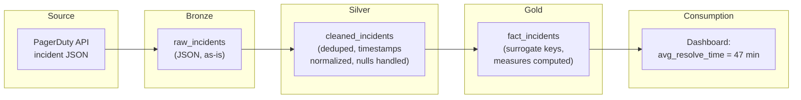

# Data Modeling — Quality, Security, Governance

**Referential integrity, data contracts, access control, lineage, and the cost of getting the model wrong.**

---

## Referential Integrity — The Foundation of Trust

**Referential integrity** means every foreign key in a fact table points to an existing row in the corresponding dimension table. If `fact_incidents` has `service_key = 42`, then `dim_service` must have a row where `service_key = 42`.

### OLTP vs OLAP: Different Enforcement

| System | How Integrity Is Enforced | Why |
|:---|:---|:---|
| **OLTP (PostgreSQL, MySQL)** | Database enforces it with `FOREIGN KEY` constraints. Insert a fact row with a non-existent dimension key? The database rejects it. | Write-time validation is acceptable because writes are one-at-a-time. |
| **OLAP (BigQuery, Redshift, Snowflake)** | The database does **not** enforce foreign keys. BigQuery does not even support them on standard tables. Redshift supports them but does not enforce them. | Analytical databases are optimized for bulk loads. Checking every row against every dimension during a multi-million-row load would be prohibitively slow. |

**The consequence for OLAP:** Referential integrity is your responsibility. The warehouse will happily load fact rows with service_key values that do not exist in dim_service. Those rows will silently disappear from any INNER JOIN query — or produce NULLs in LEFT JOIN queries. Either way, the numbers are wrong.

### How to Enforce Integrity in OLAP

```sql
-- Post-load validation: find orphan keys in fact_incidents
SELECT
    'service_key' AS fk_column,
    COUNT(*) AS orphan_count
FROM prod_diagnostics.fact_incidents AS f
LEFT JOIN prod_diagnostics.dim_service AS ds ON f.service_key = ds.service_key
WHERE ds.service_key IS NULL AND f.service_key != -1

UNION ALL

SELECT
    'severity_key',
    COUNT(*)
FROM prod_diagnostics.fact_incidents AS f
LEFT JOIN prod_diagnostics.dim_severity AS dsev ON f.severity_key = dsev.severity_key
WHERE dsev.severity_key IS NULL AND f.severity_key != -1

UNION ALL

SELECT
    'assignee_key',
    COUNT(*)
FROM prod_diagnostics.fact_incidents AS f
LEFT JOIN prod_diagnostics.dim_engineer AS de ON f.assignee_key = de.engineer_key
WHERE de.engineer_key IS NULL AND f.assignee_key != -1;
```

**Expected result:** Zero orphans for every foreign key column. If non-zero, the ETL has a bug — either the dimension load ran after the fact load, or the source data has values not yet mapped to the dimension.

**The unknown member pattern:** Instead of allowing NULL foreign keys, map unresolvable values to a dedicated "Unknown" row (key = -1) in each dimension. This keeps INNER JOINs intact and makes orphan detection explicit — `WHERE service_key = -1` shows exactly how many facts could not be resolved.

---

## Orphan Record Detection and Handling

An **orphan record** is a fact row whose foreign key does not match any dimension row. Orphans are the most common data quality issue in star schemas.

| Cause | Example | Fix |
|:---|:---|:---|
| Dimension load ran after fact load | New service appeared in incidents but dim_service has not been refreshed yet | Load dimensions BEFORE facts in the pipeline |
| Source data has unexpected values | Incident references service "payment-api-v2" but registry only has "payment-api" | Add fuzzy matching or a mapping table in Silver |
| Historical data predates the dimension | Incidents from 2024, but dim_service was loaded starting 2025 | Backfill the dimension from historical source data |
| Deleted dimension rows | A service was decommissioned and removed from dim_service, but historical facts still reference it | Never delete dimension rows — expire them (SCD Type 2) or soft-delete (add `is_active = FALSE`) |

**Pipeline rule:** Dimensions load first. Facts load second. Always. No exceptions.

---

## Data Contracts

A **data contract** is a formal agreement between the producer of a dataset (the team that loads the model) and the consumers (dashboards, ML pipelines, analysts).

### What a Data Contract Specifies

| Element | Example |
|:---|:---|
| **Schema** | fact_incidents has columns: incident_key (INT64, NOT NULL), date_key (INT64, NOT NULL), ... |
| **Grain** | One row per incident. No duplicates on incident_id. |
| **Freshness SLA** | Data is no more than 2 hours old by 8 AM local time. |
| **Completeness** | NULL rate for service_key must be < 0.1%. |
| **Referential integrity** | Every service_key in fact_incidents exists in dim_service. |
| **Breaking change policy** | Column removals require 30-day notice. Column additions are non-breaking. |
| **Owner** | Data Engineering team, contact: data-eng@company.com |

### Why Contracts Matter

Without a contract, any of these happen silently:
- The producer renames a column. Every dashboard breaks.
- The producer changes the grain (adds duplicate rows). Every aggregate is wrong.
- The producer delays the load by 6 hours. The 8 AM executive report shows yesterday's data.
- The producer adds a new severity level ("P0"). Queries with `WHERE severity_label IN ('P1','P2','P3','P4')` miss it.

With a contract, these changes require coordination. The contract is the mechanism that turns "it broke and nobody told us" into "we discussed the change, updated consumers, and deployed together."

### Contract Enforcement

| Method | How It Works |
|:---|:---|
| **dbt tests** | `unique`, `not_null`, `relationships` tests run after every model build. Pipeline fails if a test fails. |
| **Great Expectations** | Python-based expectation suites. "I expect fact_incidents to have between 100 and 10,000 new rows per day." |
| **Custom SQL checks** | Post-load queries (like the orphan check above) that fail the pipeline if thresholds are breached. |
| **Schema registry** | A versioned schema definition (JSON Schema, Protobuf, Avro) that the producer publishes and consumers validate against. |

---

## Column-Level Security

Not every user should see every column. PII (Personally Identifiable Information, pronounced "P-I-I") columns like `engineer_email`, `engineer_name`, or `customer_phone` must be restricted.

### BigQuery Column-Level Security

```sql
-- Create a policy tag for PII
-- (Done in the Data Catalog UI or via Terraform)

-- Apply the tag to sensitive columns
ALTER TABLE prod_diagnostics.dim_engineer
ALTER COLUMN engineer_email SET OPTIONS (
    description = 'PII - restricted to data-eng and HR roles'
);
```

In BigQuery, column-level access control uses **policy tags** defined in Data Catalog. Users without the appropriate IAM role see an error when querying tagged columns.

### Dynamic Data Masking

Some warehouses support **dynamic masking** — the column is visible but the value is masked based on the user's role.

| Role | Sees `engineer_email` As |
|:---|:---|
| Data Engineer | sarah.chen@company.com |
| Analyst | s***@company.com |
| Dashboard viewer | [MASKED] |

**The principle:** The data model should be queryable by anyone with access to the dataset. Sensitive columns are masked or restricted at the column level — the model structure remains the same for all users.

---

## Row-Level Security

Row-level security restricts which rows a user can see based on their identity or role.

**Use case:** A team lead in the Platform team should only see incidents, deployments, and metrics for Platform services — not for the Payments team.

### BigQuery Row-Level Security

```sql
-- Create a row access policy
CREATE OR REPLACE ROW ACCESS POLICY platform_team_only
ON prod_diagnostics.fact_incidents
GRANT TO ('group:platform-team@company.com')
FILTER USING (
    service_key IN (
        SELECT service_key FROM prod_diagnostics.dim_service
        WHERE team = 'Platform' AND is_current = TRUE
    )
);
```

When a Platform team member queries `fact_incidents`, BigQuery automatically filters to only Platform services. They cannot see other teams' incidents — and the filter is invisible to the query. The analyst writes `SELECT * FROM fact_incidents` and only sees their rows.

---

## Data Lineage

**Data lineage** answers: "Where did this number come from?" It traces a Gold-layer metric back through Silver to Bronze to the original source system.



**When lineage matters:**
- An executive asks "why does the dashboard show 47 minutes average resolution time? Last month it was 35."
- Without lineage: investigate manually. Check the dashboard query. Check the Gold table. Check the Silver table. Check the Bronze data. Check the source API. Hours of work.
- With lineage: trace the metric back automatically. See that 12 new P1 incidents from a source system change inflated the average. Identify the root cause in minutes.

### Lineage Tools

| Tool | How It Captures Lineage |
|:---|:---|
| **dbt** | Automatically tracks lineage from SQL `ref()` calls. `dbt docs generate` produces a visual lineage graph. |
| **Google Data Catalog / Dataplex** | Captures lineage for BigQuery transformations. |
| **Apache Atlas** | Open-source lineage for Hadoop/Hive ecosystems. |
| **Column-level lineage** | Traces which source columns feed which Gold columns. Available in dbt Cloud, Dataplex, and commercial tools (Atlan, Monte Carlo). |

---

## Schema Validation

**Schema validation** detects when the model has drifted from its expected structure — columns added, removed, or changed without updating the contract.

### Automated Schema Checks

```sql
-- Check that fact_incidents has the expected columns
-- Run this as a post-deployment validation step

WITH expected_columns AS (
    SELECT column_name FROM UNNEST([
        'incident_key', 'date_key', 'time_key', 'service_key',
        'severity_key', 'assignee_key', 'incident_id',
        'time_to_detect_minutes', 'time_to_resolve_minutes',
        'is_escalated', 'root_cause_category'
    ]) AS column_name
),
actual_columns AS (
    SELECT column_name
    FROM prod_diagnostics.INFORMATION_SCHEMA.COLUMNS
    WHERE table_name = 'fact_incidents'
)
SELECT
    e.column_name AS missing_column
FROM expected_columns AS e
LEFT JOIN actual_columns AS a ON e.column_name = a.column_name
WHERE a.column_name IS NULL;
-- Should return zero rows. Any result means the schema has drifted.
```

**Integrate into the pipeline:** Run schema validation after every deployment. If the schema has drifted, fail the pipeline before data loads. A missing column caught at deploy time is a 5-minute fix. A missing column caught after a week of wrong reports is a crisis.

---

## Documentation — Data Dictionaries and Business Glossaries

### Data Dictionary

A data dictionary documents every table and column in the model.

| Table | Column | Type | Description | Business Rule | Nullable |
|:---|:---|:---|:---|:---|:---|
| fact_incidents | incident_key | INT64 | Surrogate primary key | Auto-generated, unique | No |
| fact_incidents | time_to_resolve_minutes | FLOAT64 | Minutes from detection to resolution | resolved_at - detected_at, in minutes. NULL if unresolved. | Yes |
| fact_incidents | root_cause_category | STRING | Categorized root cause | One of: code_bug, config_change, infra_failure, dependency, unknown | No |
| dim_service | tier | STRING | Service criticality tier | One of: critical, standard. Determines SLA. | No |
| dim_service | is_current | BOOLEAN | SCD Type 2 current flag | TRUE for the active version. Only one row per service has is_current=TRUE. | No |

**Where to store it:**
- **dbt:** Column descriptions in `schema.yml` files. Auto-generated docs site with `dbt docs generate`.
- **BigQuery:** Column descriptions in the `INFORMATION_SCHEMA` or set via `ALTER TABLE ... ALTER COLUMN ... SET OPTIONS (description='...')`.
- **Standalone:** A Markdown or Confluence page, version-controlled alongside the model code.

### Business Glossary

A business glossary defines business terms and maps them to technical implementations.

| Business Term | Definition | Technical Implementation |
|:---|:---|:---|
| **Incident** | An unplanned interruption or degradation of a production service | One row in fact_incidents |
| **Resolution time** | Time from when the incident was detected to when it was resolved | `time_to_resolve_minutes` column in fact_incidents |
| **Critical service** | A service whose failure directly impacts revenue or customer experience | `tier = 'critical'` in dim_service |
| **Change failure rate** | Percentage of deployments that result in a rollback | `SUM(is_rollback) / COUNT(*)` from fact_deployments |

---

## The Cost of a Wrong Model

A wrong data model does not throw errors. It returns confident, plausible, wrong numbers.

**Scenario:** The data model defines grain as "one row per incident." But the ETL has a bug — incidents that are reopened create a second row with the same `incident_id` but a new `incident_key`. The fact table now has 550 rows instead of 500, and 50 of them are duplicates.

| Metric | Correct Value | Value with Duplicate Rows | Error |
|:---|:---|:---|:---|
| Total incidents this month | 500 | 550 | +10% |
| Average resolution time | 45 min | 42 min | -7% (duplicates have shorter resolution times because the reopen is measured from the second detection) |
| P1 incident count | 30 | 34 | +13% |
| Change failure rate (incidents / deployments) | 5.0% | 5.5% | +10% |

Every downstream consumer — dashboards, ML models, SLA calculations, executive reports — now has a 7-13% error. Nobody notices because the numbers are plausible. The VP sees 34 P1 incidents and thinks "bad month" instead of questioning the data. The ML model trains on inflated features and its predictions drift.

**This is caught by:**
- Grain validation: `SELECT incident_id, COUNT(*) FROM fact_incidents GROUP BY incident_id HAVING COUNT(*) > 1`
- Row count reconciliation: `SELECT COUNT(DISTINCT incident_id) FROM raw.incidents` vs `SELECT COUNT(*) FROM fact_incidents`
- Data contracts: "fact_incidents must have zero duplicate incident_ids"

These checks take 30 seconds to write and 2 seconds to run. The cost of not having them is wrong decisions made with false confidence.

---

## Summary — Governance Checklist

| Check | Frequency | What It Catches |
|:---|:---|:---|
| Orphan key detection | Every load | Fact rows with no matching dimension |
| Grain validation (duplicate check) | Every load | Duplicate events counted twice |
| Row count reconciliation (Bronze vs Silver vs Gold) | Every load | Dropped or inflated rows |
| Schema validation | Every deployment | Drift from the expected model |
| Freshness check | Every scheduled refresh | Stale data |
| Column-level security audit | Monthly | Unprotected PII columns |
| Row-level security audit | Monthly | Users seeing data outside their scope |
| Data dictionary completeness | Quarterly | Undocumented columns |

---

**Hands-on notebook:** [Data Modeling on Colab](https://colab.research.google.com/github/sunilmogadati/systems-in-production/blob/main/implementation/notebooks/Data_Modeling.ipynb)

**Deep dive on star schema:** [Star Schema Design](../star-schema-design/)

---

### Quick Links — All Chapters

| Chapter | Title |
|:---|:---|
| [01](01_Why.md) | Why This Matters |
| [02](02_Concepts.md) | Concepts and Mental Models |
| [03](03_Hello_World.md) | Hello World |
| [04](04_How_It_Works.md) | How It Works |
| [05](05_Building_It.md) | Building It |
| [06](06_Production_Patterns.md) | Production Patterns |
| [07](07_System_Design.md) | System Design |
| [08](08_Quality_Security_Governance.md) | Quality, Security, Governance |
| [09](09_Observability_Troubleshooting.md) | Observability and Troubleshooting |
| [10](10_Decision_Guide.md) | Decision Guide |
