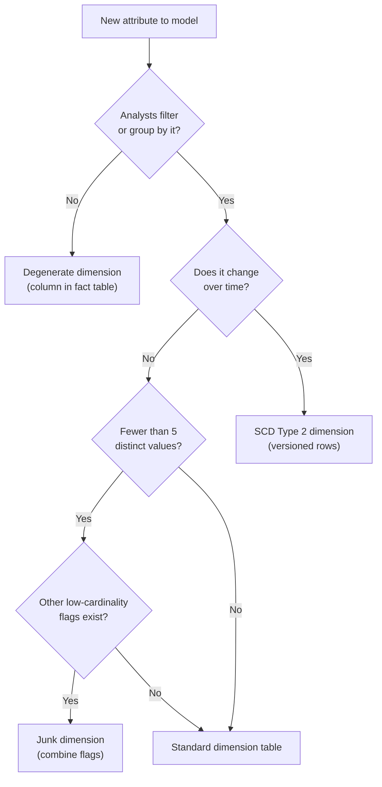

# Data Modeling — Decision Guide

**Every decision in one place. Pattern selection, key strategy, SCD types, grain, aggregation, and the anti-patterns that derail production models.**

---

## Which Modeling Pattern Should I Use?

| If Your Situation Is... | Use | Why |
|:---|:---|:---|
| General-purpose analytics for a team of analysts | **Star schema** | Simple queries, fast joins, understood by every BI tool, every warehouse optimizes for it |
| Feeding a specific dashboard in Looker/Tableau/Power BI | **Star schema** + **One Big Table (OBT)** materialized view | Star schema is the source of truth. OBT is a pre-joined, flat view for the dashboard tool. |
| Enterprise-scale with 50+ source systems and audit requirements | **Data vault** (with star schema reporting layer) | Parallel loading, full auditability, source-system-agnostic hub/link/satellite structure |
| Product analytics with rapidly changing event types | **Activity schema** | New event types do not require schema changes. Trade-off: JSON parsing at query time. |
| Very large dimension (500K+ rows) with deep hierarchy | **Snowflake** that specific dimension. Star schema for everything else. | Reduces storage and load complexity for that one dimension. Not worth it for small dimensions. |

### Pattern Comparison

| Property | Star | Snowflake | OBT | Data Vault | Activity |
|:---|:---|:---|:---|:---|:---|
| Query simplicity | High | Medium | Highest | Low | Low |
| Setup complexity | Low | Medium | Low | High | Medium |
| SCD support | Native | Native | Difficult | Built-in | Built-in |
| Multi-source integration | Medium | Medium | Low | Excellent | Medium |
| Storage efficiency | Medium | High | Low | Medium | Medium |
| Minimum team size | 1 | 1 | 1 | 5+ | 1 |
| Best warehouse | Any | Any | Any | Snowflake, Databricks | BigQuery, Snowflake |

---

## Do I Need a Dimension Table for This?

| Question | If Yes | If No |
|:---|:---|:---|
| Do analysts filter or group by this attribute? | **Yes — make it a dimension.** | Consider keeping it as a fact column (degenerate dimension). |
| Does this attribute change over time and history matters? | **Yes — SCD Type 2 dimension.** | Type 1 (overwrite) or degenerate dimension. |
| Does this attribute apply to multiple fact tables? | **Yes — conformed dimension.** Shared across facts. | Fact-specific dimension or degenerate dimension. |
| Does this attribute have fewer than 5 distinct values? | Consider a **junk dimension** (combine with other low-cardinality flags). | Stand-alone dimension. |
| Is this just an identifier for tracing back to the source? | **No separate table needed.** Store as a degenerate dimension (column in the fact table). | — |

### Decision Flowchart

---

## SCD Type 1 vs Type 2 vs Type 3?

| Scenario | SCD Type | Why |
|:---|:---|:---|
| Fix a typo in a service name | **Type 1** (overwrite) | Not a real change. No one reports on the typo. |
| Correct a data entry error (wrong team assignment on load) | **Type 1** | Correction, not historical change. |
| Engineer transfers to a new team | **Type 2** (versioned rows) | Historical incident reports must show the team at the time of the incident. |
| Service tier changes from standard to critical | **Type 2** | SLA calculations depend on the tier at the time of the incident, not today's tier. |
| Product price changes | **Type 2** | Revenue calculations need the price at time of purchase. |
| Company rebrands a product category name | **Type 1 or Type 3** | If no one reports on the old name, overwrite (Type 1). If one level of comparison matters ("current category vs previous"), Type 3. |
| Multiple attributes change simultaneously and you need to correlate the old set | **Type 2** | One new row captures the entire new state. All old attributes are preserved on the expired row. |

### Decision Rule

> **Default to Type 2** for any attribute that affects historical reporting accuracy. **Use Type 1** for corrections and attributes nobody reports on historically. **Use Type 3** only when you need exactly one level of "before vs after" comparison and Type 2 is disproportionate for the use case.

| SCD Type | Rows per Entity | History Depth | Complexity | Storage |
|:---|:---|:---|:---|:---|
| Type 1 | 1 (always) | None | Low | Low |
| Type 2 | 1 per version | Unlimited | Medium | Medium (grows with changes) |
| Type 3 | 1 (always) | One level | Low | Slightly higher (extra column per tracked attribute) |

---

## Natural Key vs Surrogate Key?

| Situation | Use | Why |
|:---|:---|:---|
| Primary key for a dimension table | **Surrogate key** | Fast integer joins, stable (never changes), supports SCD Type 2 |
| Foreign key in a fact table | **Surrogate key** (from the dimension) | Consistent with the dimension PK. Integer-to-integer join. |
| ETL matching (looking up the dimension row from source data) | **Natural key** (as a column in the dimension) | The natural key is what the source system provides. Match on it, then resolve to the surrogate key. |
| Degenerate dimension (source ID in fact table) | **Natural key** | `incident_id`, `order_number` — kept for tracing back to the source. No separate table. |
| Dimension table with < 10 rows that never changes | Either works | A date dimension with `date_key = 20260401` (integer, YYYYMMDD format) is both natural and surrogate. |

### Decision Rule

> **Always use surrogate keys for dimension PKs and fact FKs.** Keep natural keys as columns in the dimension for ETL matching and human readability. The only exception is dim_date, where the natural key (YYYYMMDD as integer) is commonly used as the surrogate key because it is already an integer, never changes, and is human-readable.

---

## Should I Pre-Aggregate?

| Signal | Action |
|:---|:---|
| Dashboard query takes > 5 seconds on the base fact table | **Yes — build an aggregate table** at the dashboard's grain |
| The same GROUP BY pattern is used in 10+ different queries | **Yes — materialize it** |
| Base fact table has > 100M rows, most queries need daily summaries | **Yes — build daily summary** |
| ML feature pipeline computes the same aggregations every run | **Yes — pre-compute as a feature table** |
| Base fact table has < 10M rows | **No — modern warehouses handle this without aggregates** |
| Queries filter on many different combinations | **No — aggregates only help the specific combination they cover** |
| Data refreshes more frequently than hourly | **Be cautious — aggregate staleness is a risk** |

### Aggregate Table Rules

1. **Always derive from the base fact table.** Never load aggregates directly from source data. The base fact is the source of truth.
2. **Refresh aggregates after the base fact refreshes.** Add the aggregate build as a dependent step in the pipeline.
3. **Validate that aggregate totals match base fact totals.** `SUM(incident_count) FROM fact_incidents_daily` must equal `COUNT(*) FROM fact_incidents` for the same date range.
4. **Document the grain of every aggregate table.** "One row per service per day" is clear. "Some kind of daily summary" leads to misuse.

---

## Grain Selection Guide

The grain is the most important decision in data modeling. It determines what questions the model can answer and what accuracy it provides.

### How to Choose the Right Grain

| Step | Question | Example |
|:---|:---|:---|
| 1 | What is the atomic business event? | An incident is created. A deployment completes. A metric is recorded. |
| 2 | At what level do stakeholders ask questions? | "Show me each incident" (transaction level). "Show me daily incident counts" (summary level). |
| 3 | What is the finest grain that supports both? | Transaction level — you can always aggregate up, but you cannot drill down below your grain. |
| 4 | Does any reporting need require finer grain? | If someone needs "time_to_first_response" (an event within the incident lifecycle), the grain might need to be "one row per incident event" (created, acknowledged, escalated, resolved) rather than "one row per incident." |

### Common Grain Mistakes

| Mistake | Consequence | Fix |
|:---|:---|:---|
| Grain too coarse (daily summaries when transaction data was available) | Cannot drill down to individual events. "Which specific incident caused the spike?" is unanswerable. | Store transaction-level facts. Build summary tables on top. |
| Grain too fine (one row per log line when incidents are the business event) | Billions of rows. Slow queries. Analysts must aggregate everything before using it. | Aggregate to the business event level. Keep raw logs in Bronze/Silver for forensics. |
| Mixed grains in one table (daily and hourly rows coexist) | Aggregations double-count or produce nonsensical averages. | Separate grains into separate tables. |
| Grain not documented | Different consumers assume different grains. One analyst thinks "one row per incident," another thinks "one row per incident per day." | Document the grain in the data dictionary and in a comment at the top of the table DDL. |

---

## Production Readiness Checklist

Before declaring a data model ready for production use, verify every item on this list.

### Schema

| Check | Status |
|:---|:---|
| Every fact table has a documented grain (what one row represents) | |
| Every dimension table has a surrogate key as PK | |
| Every fact table FK maps to a dimension PK (no orphan keys) | |
| Unknown member row (-1) exists in every dimension | |
| SCD strategy is defined for every dimension attribute | |
| Degenerate dimensions are documented (source IDs kept in fact) | |
| No mixed grains (each fact table has exactly one grain) | |

### Data Quality

| Check | Status |
|:---|:---|
| Grain validation: no duplicate business keys in fact tables | |
| Row count reconciliation: Bronze vs Silver vs Gold | |
| Orphan key detection: all FKs resolve to dimension rows | |
| NULL rate check: measure columns have acceptable NULL rates | |
| Range checks: no negative durations, no future dates, no impossible values | |
| SCD integrity: one current row per natural key per dimension | |

### Performance

| Check | Status |
|:---|:---|
| Fact tables > 1 GB are partitioned (by date) | |
| Frequently filtered columns are used as cluster keys | |
| Aggregate tables exist for known slow queries | |
| Aggregate totals match base fact totals | |

### Governance

| Check | Status |
|:---|:---|
| Data dictionary exists (every table and column documented) | |
| Business glossary maps business terms to technical columns | |
| Data contracts defined between producers and consumers | |
| Column-level security applied to PII columns | |
| Row-level security applied where required | |
| Schema validation runs after every deployment | |
| Freshness SLA defined and monitored | |

### Operations

| Check | Status |
|:---|:---|
| Pipeline loads dimensions before facts | |
| Incremental loads use MERGE or upsert (not bare INSERT) | |
| Post-load validation queries are automated | |
| Alerting is configured for validation failures | |
| Drill-down debugging path is documented (Gold > Silver > Bronze > Source) | |

---

## Common Anti-Patterns

### Anti-Pattern 1: Over-Normalization for Analytics

**What it looks like:** The analytical model is in 3NF with 30+ tables, requiring 8-10 joins for a single business question.

**Why it happens:** The team applied OLTP modeling principles to the warehouse. Or the model was copied directly from the source system without restructuring for analytics.

**The fix:** Denormalize into a star schema. Merge dimension sub-tables into flat dimension tables. Accept controlled redundancy in exchange for query simplicity.

### Anti-Pattern 2: Under-Normalization for OLTP

**What it looks like:** The transactional database stores everything in one table. Agent name, team name, campaign name — all repeated in every row. Update the team name? Change it in 50,000 rows.

**Why it happens:** "We'll just put it all in one table, it's simpler." It is simpler — until the first update anomaly.

**The fix:** Normalize the transactional system to 3NF. Separate entities into their own tables. Let the analytical model handle denormalization.

### Anti-Pattern 3: "Just Add Another Column"

**What it looks like:** The fact table started with 10 columns. Over 2 years, 40 more were added: `is_weekend`, `campaign_type`, `agent_seniority`, `region_name`, `product_category`. The fact table is now wide and slow, with most columns being descriptive attributes that belong in dimensions.

**Why it happens:** Adding a column to an existing table is faster than creating a new dimension table. So every request becomes "just add a column." Repeat 40 times.

**The fix:** Extract descriptive attributes into proper dimension tables. Keep the fact table tall and narrow — keys and measures only.

### Anti-Pattern 4: No Surrogate Keys

**What it looks like:** Joins are on natural keys — strings like `service_name`, `campaign_dnis`, `engineer_email`. Queries are slow. SCD Type 2 is impossible (two rows with the same natural key cannot be distinguished as FK targets).

**Why it happens:** "We don't need surrogate keys, the natural key works fine." It works fine until it does not.

**The fix:** Add surrogate keys to every dimension. Migrate fact table FKs from natural keys to surrogate keys. Keep natural keys as columns for ETL matching.

### Anti-Pattern 5: Fact Table as Dimension

**What it looks like:** Queries join `fact_incidents` to itself to get "previous incident for the same service." Or `fact_incidents` stores descriptive attributes (service team, engineer role) that change independently of the incident event.

**Why it happens:** The boundary between facts and dimensions is blurred. Descriptive data lands in the fact table because "it was in the source data."

**The fix:** Separate facts (events, measurements) from dimensions (context, descriptions). If a value describes the entity (team, tier, role), it goes in a dimension. If it measures an event (duration, count, amount), it goes in a fact.

### Anti-Pattern 6: No Grain Documentation

**What it looks like:** The fact table has rows, but nobody agrees on what one row represents. Some analysts think it is one row per incident. Others discover duplicate `incident_id` values and assume it is one row per incident update. The model silently serves different answers depending on who writes the query.

**Why it happens:** The grain was obvious to the person who built the model. They did not write it down. They left the company.

**The fix:** Document the grain in three places: (1) a SQL comment in the DDL, (2) the data dictionary, (3) the dbt schema.yml description. "One row per production incident, uniquely identified by incident_id. No duplicates."

---

**Hands-on notebook:** [Data Modeling on Colab](https://colab.research.google.com/github/sunilmogadati/systems-in-production/blob/main/implementation/notebooks/Data_Modeling.ipynb)

**Deep dive on star schema:** [Star Schema Design](../star-schema-design/)

---

### Quick Links — All Chapters

| Chapter | Title |
|:---|:---|
| [01](01_Why.md) | Why This Matters |
| [02](02_Concepts.md) | Concepts and Mental Models |
| [03](03_Hello_World.md) | Hello World |
| [04](04_How_It_Works.md) | How It Works |
| [05](05_Building_It.md) | Building It |
| [06](06_Production_Patterns.md) | Production Patterns |
| [07](07_System_Design.md) | System Design |
| [08](08_Quality_Security_Governance.md) | Quality, Security, Governance |
| [09](09_Observability_Troubleshooting.md) | Observability and Troubleshooting |
| [10](10_Decision_Guide.md) | Decision Guide |
