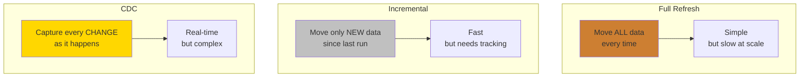
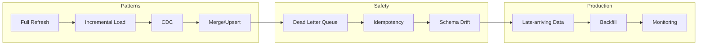

# ETL/ELT Patterns - Why They Matter

**Your pipeline works today. But data doubles every year. The pattern you pick now decides whether you spend your nights sleeping or debugging.**

---

## The 2 AM Dashboard

A data engineer builds a pipeline for a call center. The pipeline runs every night at midnight: drop all the tables, reload everything from the source systems, rebuild the dashboards. Full refresh. Simple and reliable.

Month one: 10,000 call records. Pipeline finishes in 5 minutes. Dashboards are fresh by 12:05 AM.

Month six: 500,000 records. Pipeline takes 45 minutes. Still fine. Dashboards ready by 12:45 AM.

Month twelve: 2 million records. Pipeline takes 3 hours. The operations team in the Eastern timezone starts at 7 AM. Dashboards are ready by 3 AM. Tight, but it works.

Month eighteen: 5 million records. Pipeline takes 7 hours. It finishes at 7 AM — the exact moment the operations team opens their dashboards. Sometimes it's still running. The VP sees "data as of yesterday morning" and asks why.

Month twenty-four: 10 million records. Pipeline takes 14 hours. It doesn't finish before the next run starts. Two pipelines run simultaneously. They fight over database locks. Both fail. Nobody has fresh data for two days.

The engineer didn't make a mistake. The pipeline was correct. The **pattern** was wrong.

---

## What Is an ETL Pattern?

An Extract-Transform-Load (ETL) pattern is the strategy for how data moves from where it's created (source systems) to where it's analyzed (warehouse).

The pattern answers one question: **How much data do you move each time?**

Think of it like moving offices:

- **Full Refresh** = Every morning, empty the entire office and bring everything back from the warehouse. Every desk, every chair, every monitor. Even though 99% of it didn't change.
- **Incremental** = Every morning, check what's new in the warehouse and bring just those items. The stuff already in the office stays put.
- **Change Data Capture (CDC)** = A camera at the warehouse door. Every time something enters or leaves, it records the change and sends a message to the office. The office is always current.

---

## The Cost of Getting It Wrong

| What Goes Wrong | How It Feels | Root Cause |
|---|---|---|
| Dashboards show stale data | VP asks "why is this from yesterday?" | Pipeline takes too long (full refresh at scale) |
| Duplicate records appear | Revenue report is 2x actual | No deduplication strategy |
| Updates are lost | Customer changed address but old one shows | Full refresh overwrites with stale snapshot |
| Deleted records persist | Churned customers still show as active | No mechanism to propagate deletes |
| Pipeline fails silently | Nobody knows data is wrong until someone checks | No error handling, no dead letter queue |
| Recovery takes hours | One bad record kills the whole pipeline | No incremental recovery, must re-run everything |

Every one of these is a pattern problem, not a code problem. The code might be perfect. The strategy is wrong.

---

## What This Playbook Covers

By the end of this playbook, you'll know:

- When to use full refresh, incremental, or CDC — and why
- How to implement MERGE/upsert for call records that get updated
- How to quarantine bad records instead of dropping them
- How to handle late-arriving data without re-running the full pipeline
- How to monitor pipeline health and catch problems before the VP does

---

## Who This Is For

This playbook is for data engineers building pipelines on cloud platforms (Google Cloud Platform, Amazon Web Services, or Azure). The examples use a call center dataset (calls, orders, payments, campaigns) and show both PySpark and BigQuery SQL.

If you're running a full refresh pipeline today and it's starting to hurt — this is where you start.

---

## Quick Links

| Chapter | Topic |
|---|---|
| [01 - Why](01_Why.md) | This page |
| [02 - Concepts](02_Concepts.md) | Full refresh, incremental, CDC, merge, DLQ in plain English |
| [03 - Hello World](03_Hello_World.md) | Your first incremental load in 10 minutes |
