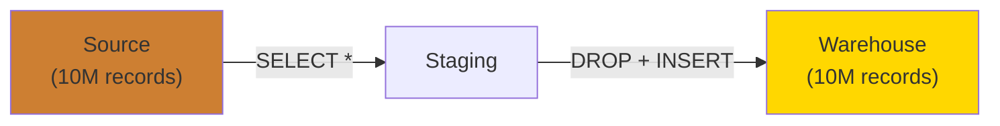
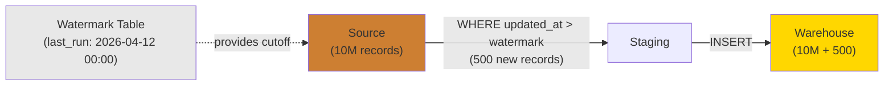
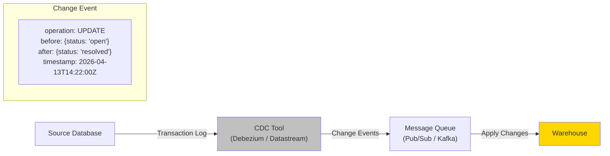
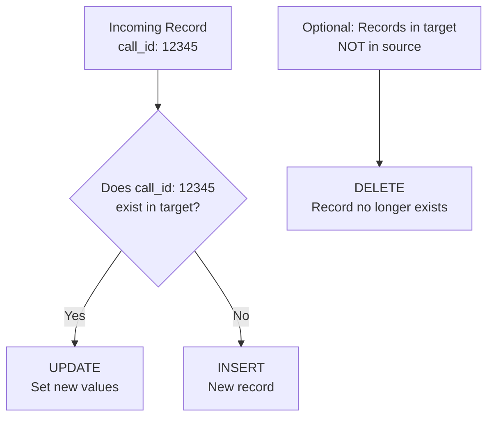
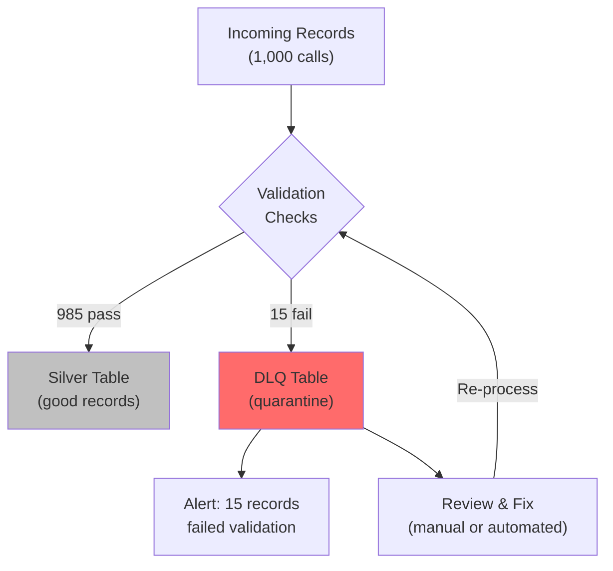

# ETL Patterns - Concepts

**Every pattern in plain English. What it does, when it works, when it breaks, and how to pick the right one.**

---

## Pattern 1: Full Refresh

**What it does:** Drop everything. Reload everything. Every single run.

**Analogy:** Erasing a whiteboard and rewriting everything from scratch. Even if only one number changed.



**How it works:**

```sql
-- Step 1: Truncate the target table
TRUNCATE TABLE gold.calls;

-- Step 2: Reload everything from source
INSERT INTO gold.calls
SELECT * FROM bronze.calls;
```

**When it works:**
- Small datasets (under 1 million rows)
- Reference data that changes rarely (product catalog, campaign list)
- Data where you can't reliably track changes (no `updated_at` column)
- Early stage projects where simplicity matters more than speed

**When it breaks:**
- Data grows past what can reload in the batch window
- Source systems can't handle full scans every night
- You need data freshness measured in minutes, not hours
- You need to preserve history (full refresh overwrites everything)

**The hidden danger:** Full refresh silently masks problems. If a source system loses 10,000 records, full refresh will faithfully load the reduced dataset. No error. No alert. Your dashboard just shows lower numbers and nobody notices until someone asks "why did call volume drop 20%?"

---

## Pattern 2: Incremental Load

**What it does:** Only move data that changed since the last run. Track your position using a watermark.

**Analogy:** Reading a book with a bookmark. You don't start from page one every time. You pick up where you left off.



**How it works:**

```sql
-- Step 1: Get the watermark (where we left off)
SELECT MAX(last_loaded_at) AS watermark FROM pipeline.watermarks WHERE table_name = 'calls';
-- Returns: 2026-04-12 00:00:00

-- Step 2: Load only new data
INSERT INTO silver.calls
SELECT * FROM bronze.calls
WHERE updated_at > '2026-04-12 00:00:00';

-- Step 3: Update the watermark
UPDATE pipeline.watermarks
SET last_loaded_at = CURRENT_TIMESTAMP()
WHERE table_name = 'calls';
```

**The watermark** is your bookmark. Common watermark columns:

| Watermark Type | Column | Best For |
|---|---|---|
| Timestamp | `updated_at`, `created_at` | Records with reliable timestamps |
| Auto-increment ID | `call_id`, `order_id` | Append-only tables (no updates) |
| File arrival time | `ingested_at` | File-based ingestion (CSV drops in GCS) |
| Offset | Kafka offset, Pub/Sub ack ID | Streaming sources |

**When it works:**
- Source has a reliable watermark column
- Data is mostly append-only (new records, few updates)
- You need fast pipeline runs (process thousands, not millions)

**When it breaks:**
- Source updates old records without changing the watermark (silent updates)
- Records arrive out of order (late-arriving data)
- Source deletes records (incremental doesn't know about deletes)
- Watermark column has duplicates at the boundary (millisecond collisions)

---

## Pattern 3: Change Data Capture (CDC)

**What it does:** Captures every change (INSERT, UPDATE, DELETE) at the source, as it happens, and sends it downstream.

**Analogy:** A security camera at the warehouse door. Instead of counting inventory every night (full refresh) or checking what's new on the shelf (incremental), you record every item that enters, moves, or leaves — in real time.



**Three types of CDC:**

| Type | How It Works | Latency | Impact on Source |
|---|---|---|---|
| **Log-based** | Reads the database transaction log (Write-Ahead Log) | Seconds | None (reads a log file) |
| **Query-based** | Polls the source with `WHERE updated_at > last_check` | Minutes | Medium (runs queries) |
| **Trigger-based** | Database triggers fire on INSERT/UPDATE/DELETE, write to a change table | Seconds | High (adds overhead to every write) |

**Log-based CDC is the gold standard.** It reads the same log the database uses for replication. Zero impact on the source. Captures everything including DELETEs. Tools: Debezium (open source), Google Cloud Datastream (managed), AWS Database Migration Service (managed).

**When it works:**
- You need near real-time data freshness
- Source has high update volume (records change frequently)
- You need to capture DELETEs (customer churn, order cancellations)
- You need the complete change history (audit trail)

**When it breaks:**
- Source database doesn't expose its transaction log (some managed databases don't)
- Schema changes in the source cascade through the entire CDC pipeline
- Ordering guarantees matter and the message queue doesn't guarantee order
- Setup and operational complexity is higher than incremental

---

## Pattern 4: Merge / Upsert

**What it does:** Compares incoming data against existing data. If a record is new, INSERT it. If it already exists, UPDATE it. Optionally, DELETE records that no longer appear in the source.

**Analogy:** A mail carrier with a package. Check the address. If nobody lives there yet, deliver and set up a new mailbox (INSERT). If someone already lives there, update their mail (UPDATE). If they moved away, remove the mailbox (DELETE).



**How it works (BigQuery SQL):**

```sql
MERGE INTO gold.calls AS target
USING staging.calls_incoming AS source
ON target.call_id = source.call_id

WHEN MATCHED THEN
    UPDATE SET
        target.status = source.status,
        target.duration = source.duration,
        target.updated_at = source.updated_at

WHEN NOT MATCHED THEN
    INSERT (call_id, customer_id, status, duration, created_at, updated_at)
    VALUES (source.call_id, source.customer_id, source.status, source.duration, source.created_at, source.updated_at);
```

**How it works (PySpark with Delta Lake):**

```python
from delta.tables import DeltaTable

delta_table = DeltaTable.forPath(spark, "gs://bucket/gold/calls")

delta_table.alias("target").merge(
    incoming_df.alias("source"),
    "target.call_id = source.call_id"
).whenMatchedUpdateAll(
).whenNotMatchedInsertAll(
).execute()
```

**When it works:**
- Records can be both inserted and updated (calls that start as "in-progress" then become "resolved")
- You want a single current view (no history, just the latest state)
- Downstream queries should see only current data

**When it breaks:**
- You need the full history of changes (use a Slowly Changing Dimension instead)
- MERGE on very large tables without partitioning is slow (scans the entire target)
- Merge key collisions (two sources with the same call_id)

---

## Pattern 5: Dead Letter Queue (DLQ)

**What it does:** Routes records that fail validation to a quarantine table instead of dropping them or crashing the pipeline.

**Analogy:** Airport security. Good passengers board the plane. Flagged passengers go to secondary screening. Nobody gets thrown out of the airport — they go somewhere for further review.



**What goes to the DLQ:**

| Failure Type | Example | Why Not Just Drop It? |
|---|---|---|
| Missing required field | `call_id` is null | Could be a source system bug — you want to know |
| Invalid data type | `duration` is "abc" instead of a number | Could be a schema change upstream |
| Referential integrity | Order references a `call_id` that doesn't exist | Could be a timing issue (call hasn't arrived yet) |
| Business rule violation | `duration` is negative or greater than 24 hours | Could be a legitimate edge case you didn't anticipate |
| Duplicate record | Same `call_id` appears twice in the batch | Need to determine which version to keep |

**The golden rule of DLQ: Never silently drop data.** If you drop a record, you'll never know it was missing. If you quarantine it, you can investigate, fix, and reprocess.

---

## Pattern 6: Idempotency

**What it does:** Ensures that running the same pipeline twice with the same input produces the same result. No duplicates. No missing data.

**Analogy:** An elevator button. Press it once, the elevator comes. Press it five times, the elevator still comes once. The extra presses don't create extra elevators.

**Why it matters:** Pipelines fail and get restarted. Jobs get triggered twice by accident. Airflow retries a task. If your pipeline isn't idempotent, a retry creates duplicate records.

**How to make a pipeline idempotent:**

1. **Use MERGE instead of INSERT** — MERGE checks if the record exists before writing
2. **Process by partition** — Reprocess a full day, not individual records. `DELETE WHERE date = '2026-04-13'` then `INSERT WHERE date = '2026-04-13'`
3. **Use write modes carefully** — PySpark `mode("overwrite")` on a partition is idempotent. `mode("append")` is not.

---

## The Comparison

| Factor | Full Refresh | Incremental | CDC |
|---|---|---|---|
| **Data freshness** | Hours | Minutes to hours | Seconds to minutes |
| **Pipeline runtime** | Scales with total data size | Scales with change volume | Constant (stream) |
| **Captures deletes** | Yes (by replacement) | No (unless tracked) | Yes (explicitly) |
| **Complexity** | Low | Medium | High |
| **Source impact** | High (full scan) | Medium (filtered scan) | None (log-based) |
| **Recovery** | Easy (just re-run) | Medium (reset watermark) | Complex (replay events) |
| **Best for** | Small/reference data | Growing append-heavy data | High-change, real-time needs |

---

## Quick Links

| Chapter | Topic |
|---|---|
| [01 - Why](01_Why.md) | Why ETL patterns matter |
| [02 - Concepts](02_Concepts.md) | This page |
| [03 - Hello World](03_Hello_World.md) | Your first incremental load in 10 minutes |
| [04 - How It Works](04_How_It_Works.md) | CDC mechanics under the hood |
