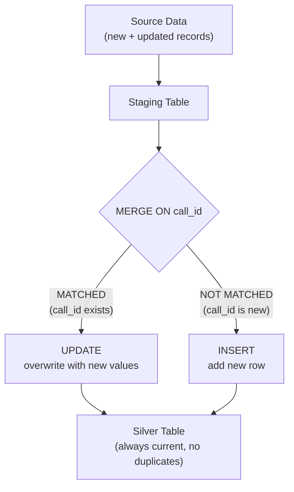

# ETL/ELT Patterns - Hello World

**Your first incremental load. Then your first MERGE. Both in under 20 minutes.**

> Hands-on notebook: [ETL/ELT Patterns](../../../implementation/notebooks/ETL_ELT_Patterns.ipynb) | [](https://colab.research.google.com/github/sunilmogadati/systems-in-production/blob/main/implementation/notebooks/ETL_ELT_Patterns.ipynb)

---

## What We're Building

Two things, in order:

1. **Incremental load** — load only new call records (skip what's already in the warehouse)
2. **Merge/Upsert** — handle updated call records (a call that was "in-progress" is now "resolved")

We'll use the call center dataset: `calls.csv` with columns `call_id`, `customer_id`, `status`, `duration`, `created_at`, `updated_at`.

---

## Part 1: Incremental Load (Standard SQL)

### Step 1: Create the watermark table

The watermark tracks "where we left off" — the timestamp of the last record we loaded.

```sql
-- Create a table to track watermarks for each source table
CREATE TABLE IF NOT EXISTS pipeline.watermarks (
    table_name STRING,
    last_loaded_at TIMESTAMP,
    records_loaded INT64,
    run_timestamp TIMESTAMP DEFAULT CURRENT_TIMESTAMP()
);

-- Initialize the watermark for calls (start from the beginning)
INSERT INTO pipeline.watermarks (table_name, last_loaded_at, records_loaded)
VALUES ('calls', TIMESTAMP('1970-01-01'), 0);
```

**You Should See:** A `watermarks` table with one row: `calls | 1970-01-01 00:00:00 | 0`.

### Step 2: Run the first load (acts like full refresh)

```sql
-- Get the current watermark
DECLARE watermark TIMESTAMP;
SET watermark = (
    SELECT last_loaded_at 
    FROM pipeline.watermarks 
    WHERE table_name = 'calls'
);

-- Load records newer than the watermark
INSERT INTO silver.calls
SELECT * FROM bronze.calls
WHERE updated_at > watermark;

-- Update the watermark
UPDATE pipeline.watermarks
SET 
    last_loaded_at = (SELECT MAX(updated_at) FROM silver.calls),
    records_loaded = (SELECT COUNT(*) FROM bronze.calls WHERE updated_at > watermark),
    run_timestamp = CURRENT_TIMESTAMP()
WHERE table_name = 'calls';
```

**You Should See:** All records loaded (since watermark was 1970, everything is "new"). Watermark updated to the latest `updated_at` value.

### Step 3: Run it again

Run the exact same script. This time, the watermark is set to the latest timestamp from the previous run.

**You Should See:** Zero records loaded (nothing is newer than the watermark). The pipeline ran in under a second instead of scanning the full table.

### Step 4: Add new data and run again

```sql
-- Simulate a new call arriving in bronze
INSERT INTO bronze.calls VALUES (
    'CALL-99999', 'CUST-100', 'resolved', 340, 
    CURRENT_TIMESTAMP(), CURRENT_TIMESTAMP()
);
```

Run the incremental load script again.

**You Should See:** Exactly 1 record loaded. Watermark updated. This is incremental loading — only new data moves.

---

## Part 2: Merge / Upsert (Standard SQL)

Incremental load handles new records. But what about updated records? A call that started as `status: 'in-progress'` is now `status: 'resolved'`. The `call_id` already exists in the target.

If you use INSERT, you'll get a duplicate. You need MERGE.

### Step 1: Create a staging table with updates

```sql
-- Simulate incoming data that includes both new AND updated records
CREATE TEMP TABLE staging_calls AS
SELECT * FROM (
    -- An UPDATED record (call_id exists, status changed)
    SELECT 'CALL-00001' AS call_id, 'CUST-001' AS customer_id, 
           'resolved' AS status, 480 AS duration,
           TIMESTAMP('2026-04-10 09:00:00') AS created_at,
           CURRENT_TIMESTAMP() AS updated_at
    UNION ALL
    -- A NEW record (call_id doesn't exist)
    SELECT 'CALL-NEW-001', 'CUST-200', 
           'in-progress', 0,
           CURRENT_TIMESTAMP(),
           CURRENT_TIMESTAMP()
);
```

### Step 2: Run the MERGE

```sql
MERGE INTO silver.calls AS target
USING staging_calls AS source
ON target.call_id = source.call_id

-- Record exists: update it
WHEN MATCHED THEN
    UPDATE SET
        target.status = source.status,
        target.duration = source.duration,
        target.updated_at = source.updated_at

-- Record is new: insert it
WHEN NOT MATCHED THEN
    INSERT (call_id, customer_id, status, duration, created_at, updated_at)
    VALUES (source.call_id, source.customer_id, source.status, 
            source.duration, source.created_at, source.updated_at);
```

**You Should See:**
- `CALL-00001` now has `status: 'resolved'` and `duration: 480` (updated)
- `CALL-NEW-001` is a new row in the table (inserted)
- No duplicates

### Step 3: Verify

```sql
-- Check the updated record
SELECT call_id, status, duration, updated_at 
FROM silver.calls 
WHERE call_id IN ('CALL-00001', 'CALL-NEW-001');
```

**You Should See:** Two rows. One updated, one new. No duplicates of CALL-00001.

---

## The Pattern



This is the foundation. Every production pipeline uses some version of this. The next chapters show how to add:

- **DLQ** — what happens when a record fails validation during the merge
- **CDC** — how to get those change events in real time instead of batch
- **Idempotency** — how to make the merge safe to re-run

---

## Apply It

| Cloud | Notebook | What You'll Build |
|---|---|---|
| No cloud | [](https://colab.research.google.com/github/sunilmogadati/systems-in-production/blob/main/implementation/notebooks/ETL_ELT_Patterns.ipynb) | Incremental + MERGE + DLQ in pure Python |
| GCP | [](https://colab.research.google.com/github/sunilmogadati/systems-in-production/blob/main/implementation/notebooks/GCP_Full_Pipeline.ipynb) | MERGE in BigQuery SQL |
| AWS | Coming soon | MERGE in Redshift/Athena SQL |
| Azure | Coming soon | MERGE in Synapse SQL |

---

## Quick Links

| Chapter | Topic |
|---|---|
| [02 - Concepts](02_Concepts.md) | Full refresh, incremental, CDC, merge, DLQ |
| [03 - Hello World](03_Hello_World.md) | This page |
| [04 - How It Works](04_How_It_Works.md) | CDC mechanics under the hood |
| [05 - Building It](05_Building_It.md) | Full incremental pipeline with DLQ |
