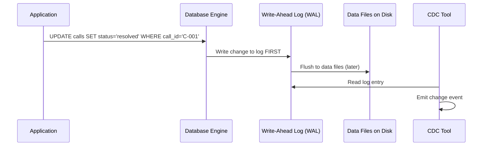
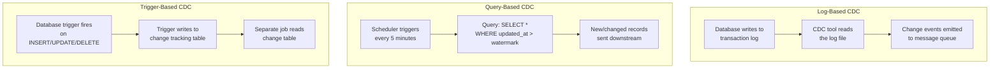
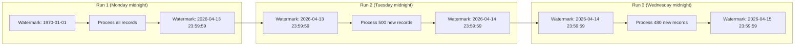
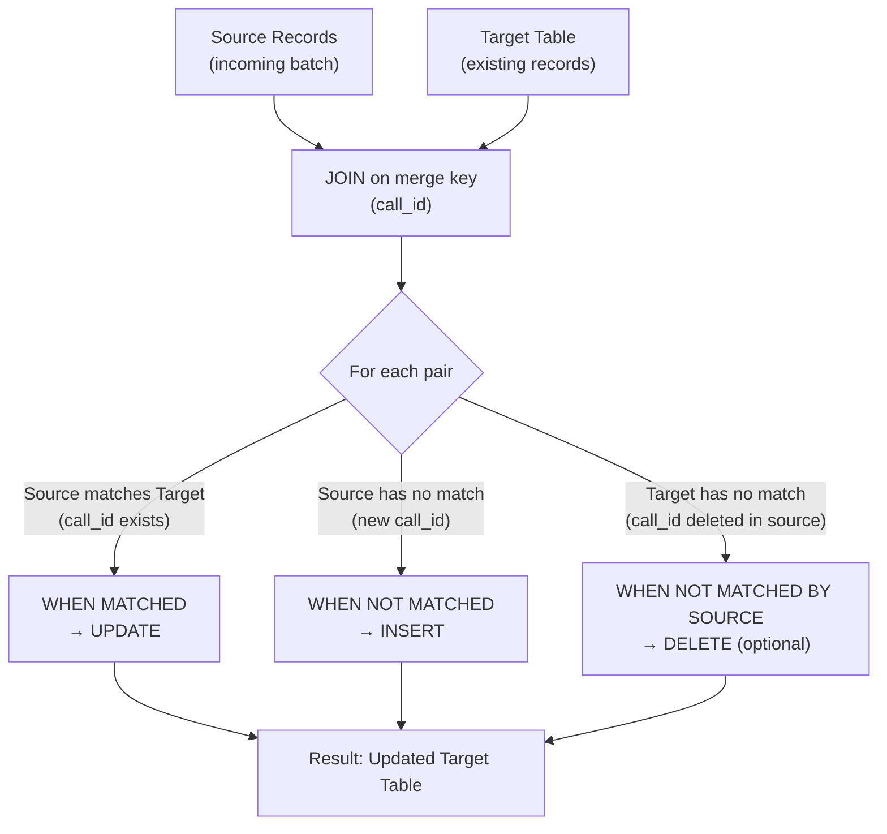

# ETL/ELT Patterns - How It Works

**What happens under the hood. How CDC reads the transaction log, how watermarks track position, and how MERGE decides what to insert vs update.**

---

## How Change Data Capture (CDC) Works

Every database keeps a transaction log — a sequential record of every change (INSERT, UPDATE, DELETE) that happens. The database uses this log for crash recovery and replication. CDC reads the same log.

### The Transaction Log

When an application writes to a database:



The Write-Ahead Log (WAL) — also called the transaction log, binlog (MySQL), or redo log (Oracle) — is the source of truth. The database writes to the log BEFORE writing to the data files. This guarantees durability: if the database crashes, it replays the log on startup.

CDC tools read this same log. They don't query the database. They don't add load. They just read a file that the database is already writing.

### What a CDC Event Looks Like

A single change event from Debezium (the most widely used open-source CDC tool):

```json
{
    "op": "u",
    "before": {
        "call_id": "C-001",
        "status": "in-progress",
        "duration": 0,
        "updated_at": "2026-04-13T10:00:00Z"
    },
    "after": {
        "call_id": "C-001",
        "status": "resolved",
        "duration": 480,
        "updated_at": "2026-04-13T10:08:00Z"
    },
    "source": {
        "db": "callcenter",
        "table": "calls",
        "ts_ms": 1713013680000
    }
}
```

| Field | Meaning |
|---|---|
| `op` | Operation type: `c` = create (INSERT), `u` = update, `d` = delete, `r` = read (snapshot) |
| `before` | The record BEFORE the change (null for INSERTs) |
| `after` | The record AFTER the change (null for DELETEs) |
| `source` | Metadata: which database, which table, when it happened |

This event tells you exactly what changed, what it changed FROM, and what it changed TO. This is far richer than a simple `SELECT * WHERE updated_at > watermark` — which only gives you the current state, not what it was before.

### Three Types of CDC Compared



| Aspect | Log-Based | Query-Based | Trigger-Based |
|---|---|---|---|
| **Latency** | Seconds | Minutes (poll interval) | Seconds |
| **Captures DELETEs** | Yes | No (deleted rows can't be queried) | Yes |
| **Before + After values** | Yes | No (only current state) | Depends on trigger logic |
| **Source impact** | None (reads a log file) | Medium (runs queries) | High (fires on every write) |
| **Setup complexity** | High (log access, permissions) | Low (just a SQL query) | Medium (create triggers) |
| **Tools** | Debezium, GCP Datastream, AWS DMS, Azure Data Factory | Custom scripts, Airbyte | Custom triggers |
| **Best for** | Production, real-time | Simple incremental, prototyping | Legacy systems without log access |

**Recommendation:** Use log-based CDC for production. Use query-based for prototyping or when you can't access the transaction log. Avoid trigger-based unless there's no alternative — triggers add overhead to every write operation on the source database.

---

## How Watermarks Track Position

A watermark is a saved position marker. It answers: "What was the last record I processed?"

### High Watermark Pattern



**Critical rule:** Update the watermark AFTER the data is committed, not before. If you update the watermark first and the data load fails, you've moved your bookmark past records you never actually processed. Those records are lost.

```python
# WRONG: watermark moves before data commits
update_watermark(new_position)  # <-- moved the bookmark
load_data(records)              # <-- this fails. Records are lost.

# RIGHT: watermark moves after data commits
load_data(records)              # <-- data committed
update_watermark(new_position)  # <-- now move the bookmark
```

### The Boundary Problem

What happens if two records have the exact same timestamp at the watermark boundary?

```
Record A: updated_at = 2026-04-13 23:59:59.999
Record B: updated_at = 2026-04-13 23:59:59.999  (same millisecond)

Watermark after Run 1: 2026-04-13 23:59:59.999
Run 2 query: WHERE updated_at > '2026-04-13 23:59:59.999'
```

Record B was processed in Run 1. But if Record B was still being written when Run 1 read the data, it might not have been included. Now Run 2 skips it because `>` doesn't include `=`.

**Fix:** Use `>=` with deduplication:

```sql
-- Use >= to catch boundary records, then deduplicate
INSERT INTO silver.calls
SELECT * FROM bronze.calls
WHERE updated_at >= @watermark
QUALIFY ROW_NUMBER() OVER (PARTITION BY call_id ORDER BY updated_at DESC) = 1;
```

---

## How MERGE Works Under the Hood

The MERGE statement does three things in one atomic operation:



### Performance Considerations

MERGE does a JOIN between source and target. On large tables, this can be expensive.

| Table Size | Without Partitioning | With Partitioning |
|---|---|---|
| 1M rows | 5 seconds | 2 seconds |
| 10M rows | 45 seconds | 5 seconds |
| 100M rows | 15 minutes | 30 seconds |
| 1B rows | Hours or OOM | 2 minutes |

**The fix:** Always partition the target table by date. Then MERGE only against the relevant partition:

```sql
MERGE INTO silver.calls AS target
USING staging.calls_incoming AS source
ON target.call_id = source.call_id
    AND target.call_date = source.call_date  -- partition pruning

WHEN MATCHED THEN UPDATE SET ...
WHEN NOT MATCHED THEN INSERT ...;
```

Adding the partition column to the ON clause tells the query engine to scan only the matching partition, not the entire table. This is the difference between minutes and seconds.

---

## CDC Tools by Cloud

| Cloud | Managed CDC Service | Open Source Alternative |
|---|---|---|
| GCP | Datastream | Debezium on GKE |
| AWS | Database Migration Service (DMS) | Debezium on ECS/EKS |
| Azure | Azure Data Factory (Change Data Capture) | Debezium on AKS |
| Any | — | Debezium (runs anywhere) |

---

## Quick Links

| Chapter | Topic |
|---|---|
| [03 - Hello World](03_Hello_World.md) | First incremental load and MERGE |
| [04 - How It Works](04_How_It_Works.md) | This page |
| [05 - Building It](05_Building_It.md) | Full incremental pipeline with DLQ |
| [06 - Production Patterns](06_Production_Patterns.md) | Late-arriving data, backfill, idempotency |
