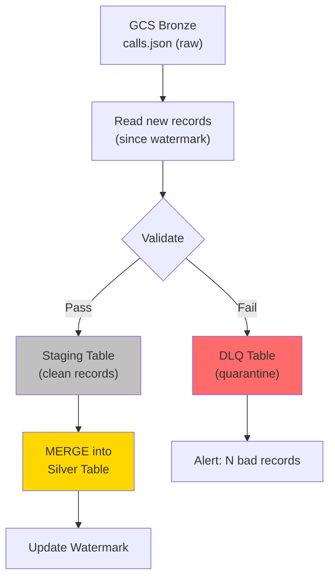
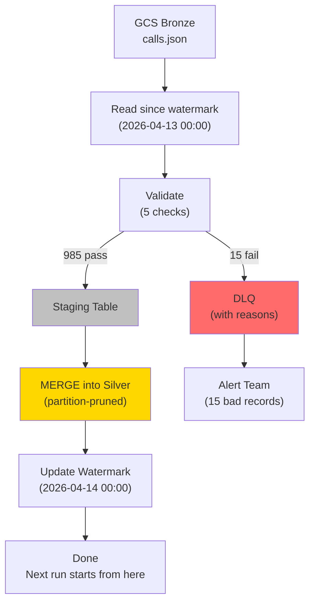

# ETL Patterns - Building It

**Build a complete incremental pipeline with merge/upsert and a dead letter queue. Every step runs on the call center dataset.**

---

## What We're Building

An incremental pipeline for call center data that:

1. Loads only new/changed records from Bronze (GCS) into Silver (BigQuery)
2. Uses MERGE to handle both new calls and updated calls
3. Routes bad records to a Dead Letter Queue (DLQ) instead of dropping them
4. Tracks watermarks for each source table
5. Is idempotent — safe to re-run without creating duplicates



---

## Step 1: Set Up the Infrastructure

### Create datasets and tables in BigQuery

```sql
-- Create datasets for each layer
CREATE SCHEMA IF NOT EXISTS bronze;
CREATE SCHEMA IF NOT EXISTS silver;
CREATE SCHEMA IF NOT EXISTS pipeline;

-- Watermark tracking table
CREATE TABLE IF NOT EXISTS pipeline.watermarks (
    table_name STRING NOT NULL,
    last_loaded_at TIMESTAMP NOT NULL,
    records_loaded INT64,
    records_failed INT64,
    run_timestamp TIMESTAMP DEFAULT CURRENT_TIMESTAMP()
);

-- Dead Letter Queue
CREATE TABLE IF NOT EXISTS pipeline.dlq (
    source_table STRING,
    record_json STRING,
    failure_reason STRING,
    failed_at TIMESTAMP DEFAULT CURRENT_TIMESTAMP(),
    reprocessed BOOL DEFAULT FALSE
);

-- Silver calls table (target for MERGE)
CREATE TABLE IF NOT EXISTS silver.calls (
    call_id STRING NOT NULL,
    customer_id STRING,
    agent_id STRING,
    status STRING,
    duration INT64,
    campaign_id STRING,
    call_date DATE,
    created_at TIMESTAMP,
    updated_at TIMESTAMP,
    ingested_at TIMESTAMP DEFAULT CURRENT_TIMESTAMP()
)
PARTITION BY call_date
CLUSTER BY status, campaign_id;
```

**You Should See:** Three datasets created. Silver.calls is partitioned by `call_date` for fast MERGE performance.

---

## Step 2: Build the Incremental Load with Validation (PySpark)

```python
from pyspark.sql import SparkSession
from pyspark.sql import functions as F
from pyspark.sql.types import (
    StructType, StructField, StringType, IntegerType, TimestampType
)
from datetime import datetime

spark = SparkSession.builder.appName("calls_incremental").getOrCreate()

# --- Configuration ---
BRONZE_PATH = "gs://your-bucket/bronze/calls/"
WATERMARK_TABLE = "pipeline.watermarks"
SILVER_TABLE = "silver.calls"
DLQ_TABLE = "pipeline.dlq"
SOURCE_NAME = "calls"

# --- Step 2a: Get watermark ---
watermark_df = spark.read.format("bigquery").load(WATERMARK_TABLE)
watermark_row = watermark_df.filter(
    F.col("table_name") == SOURCE_NAME
).first()

if watermark_row:
    watermark = watermark_row["last_loaded_at"]
else:
    watermark = datetime(1970, 1, 1)
    
print(f"Watermark for {SOURCE_NAME}: {watermark}")

# --- Step 2b: Read new records from Bronze ---
# WHY: Only read files modified after the watermark.
# This avoids scanning the entire Bronze layer every run.
raw_df = (
    spark.read.json(BRONZE_PATH)
    .filter(F.col("updated_at") > F.lit(watermark))
)

record_count = raw_df.count()
print(f"New records since watermark: {record_count}")

if record_count == 0:
    print("No new records. Pipeline complete.")
    spark.stop()
```

**You Should See:** A count of new records since the last watermark. If this is the first run, all records are "new."

---

## Step 3: Validate and Route to DLQ

```python
# --- Step 3: Define validation rules ---

# WHY: Each validation rule maps to a real data quality problem
# we've seen in the call center data.

# Expected schema
EXPECTED_SCHEMA = StructType([
    StructField("call_id", StringType(), nullable=False),
    StructField("customer_id", StringType(), nullable=True),
    StructField("agent_id", StringType(), nullable=True),
    StructField("status", StringType(), nullable=True),
    StructField("duration", IntegerType(), nullable=True),
    StructField("campaign_id", StringType(), nullable=True),
    StructField("created_at", TimestampType(), nullable=True),
    StructField("updated_at", TimestampType(), nullable=True),
])

VALID_STATUSES = ["in-progress", "resolved", "missed", "voicemail", "transferred"]

# Apply validation checks
validated_df = raw_df.withColumn(
    "validation_errors",
    F.array_remove(
        F.array(
            # Check 1: call_id must not be null
            F.when(F.col("call_id").isNull(), F.lit("call_id is null")),
            # Check 2: duration must be non-negative
            F.when(F.col("duration") < 0, F.lit("negative duration")),
            # Check 3: duration must be reasonable (max 8 hours = 28800 seconds)
            F.when(F.col("duration") > 28800, F.lit("duration exceeds 8 hours")),
            # Check 4: status must be a known value
            F.when(
                ~F.col("status").isin(VALID_STATUSES), 
                F.lit("invalid status")
            ),
            # Check 5: created_at must not be in the future
            F.when(
                F.col("created_at") > F.current_timestamp(), 
                F.lit("created_at is in the future")
            ),
        ),
        ""  # Remove empty strings (passed checks)
    )
)

# Split into good and bad records
good_df = validated_df.filter(F.size("validation_errors") == 0).drop("validation_errors")
bad_df = validated_df.filter(F.size("validation_errors") > 0)

good_count = good_df.count()
bad_count = bad_df.count()
print(f"Good records: {good_count}, Bad records: {bad_count}")
```

---

## Step 4: Write Bad Records to DLQ

```python
# --- Step 4: Route bad records to DLQ ---
if bad_count > 0:
    dlq_df = bad_df.select(
        F.lit(SOURCE_NAME).alias("source_table"),
        F.to_json(F.struct("*")).alias("record_json"),
        F.concat_ws(", ", "validation_errors").alias("failure_reason"),
        F.current_timestamp().alias("failed_at"),
        F.lit(False).alias("reprocessed"),
    )
    
    dlq_df.write.format("bigquery") \
        .option("table", DLQ_TABLE) \
        .mode("append") \
        .save()
    
    print(f"WARNING: {bad_count} records sent to DLQ")
```

**You Should See:** Bad records written to `pipeline.dlq` with the exact reason each one failed. Nothing is dropped.

---

## Step 5: MERGE Good Records into Silver

```python
# --- Step 5: Write good records to staging, then MERGE ---
STAGING_TABLE = "pipeline.staging_calls"

# Write validated records to a staging table
good_df.write.format("bigquery") \
    .option("table", STAGING_TABLE) \
    .mode("overwrite") \
    .save()

# Run MERGE via BigQuery SQL
merge_sql = f"""
MERGE INTO {SILVER_TABLE} AS target
USING {STAGING_TABLE} AS source
ON target.call_id = source.call_id
    AND target.call_date = source.call_date

WHEN MATCHED AND source.updated_at > target.updated_at THEN
    UPDATE SET
        target.status = source.status,
        target.duration = source.duration,
        target.agent_id = source.agent_id,
        target.updated_at = source.updated_at,
        target.ingested_at = CURRENT_TIMESTAMP()

WHEN NOT MATCHED THEN
    INSERT (call_id, customer_id, agent_id, status, duration, 
            campaign_id, call_date, created_at, updated_at, ingested_at)
    VALUES (source.call_id, source.customer_id, source.agent_id, source.status,
            source.duration, source.campaign_id, source.call_date,
            source.created_at, source.updated_at, CURRENT_TIMESTAMP())
"""

# WHY: MERGE runs in BigQuery, not Spark. PySpark wrote the staging table,
# but the actual MERGE is a BigQuery SQL operation. We use the BigQuery
# Python client to execute it.
from google.cloud import bigquery
client = bigquery.Client()
job = client.query(merge_sql)
job.result()  # Wait for completion
print(f"MERGE complete: {job.num_dml_affected_rows} rows affected")
```

**Key detail:** The MERGE condition includes `AND target.call_date = source.call_date` for partition pruning. Without it, BigQuery scans the entire table. With it, it scans only the relevant date partitions.

**The `source.updated_at > target.updated_at` guard** prevents older versions of a record from overwriting newer ones. If a late-arriving event shows up with an older timestamp, it won't clobber the current data.

---

## Step 6: Update the Watermark

```python
# --- Step 6: Update watermark ---
new_watermark_sql = f"""
UPDATE pipeline.watermarks
SET 
    last_loaded_at = (SELECT MAX(updated_at) FROM {SILVER_TABLE}),
    records_loaded = {good_count},
    records_failed = {bad_count},
    run_timestamp = CURRENT_TIMESTAMP()
WHERE table_name = '{SOURCE_NAME}'
"""

job = client.query(new_watermark_sql)
job.result()
print(f"Watermark updated. Good: {good_count}, DLQ: {bad_count}")
```

**You Should See:** Watermark updated to the latest `updated_at` from the loaded records. The next run will start from here.

---

## The Complete Flow



---

## Verifying It Works

Run these queries after the pipeline completes:

```sql
-- Check: No duplicates on call_id
SELECT call_id, COUNT(*) AS cnt
FROM silver.calls
GROUP BY call_id
HAVING cnt > 1;
-- Expected: 0 rows (no duplicates)

-- Check: DLQ has captured bad records with reasons
SELECT source_table, failure_reason, COUNT(*) 
FROM pipeline.dlq
GROUP BY source_table, failure_reason;

-- Check: Watermark moved forward
SELECT * FROM pipeline.watermarks WHERE table_name = 'calls';

-- Check: Record count makes sense
SELECT COUNT(*) AS silver_count FROM silver.calls;
SELECT COUNT(*) AS dlq_count FROM pipeline.dlq WHERE source_table = 'calls';
-- silver_count + dlq_count should equal total records processed
```

---

## Quick Links

| Chapter | Topic |
|---|---|
| [04 - How It Works](04_How_It_Works.md) | CDC mechanics under the hood |
| [05 - Building It](05_Building_It.md) | This page |
| [06 - Production Patterns](06_Production_Patterns.md) | Late-arriving data, backfill, idempotency |
| [07 - System Design](07_System_Design.md) | CDC architecture at scale |
