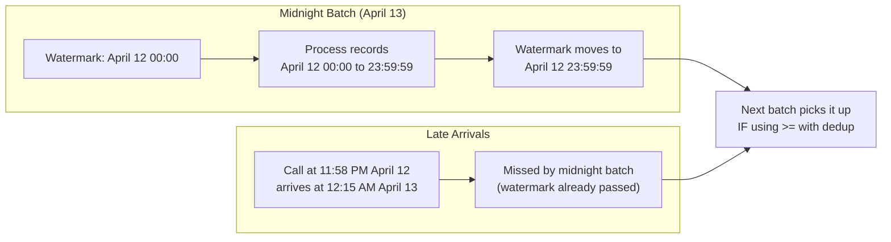
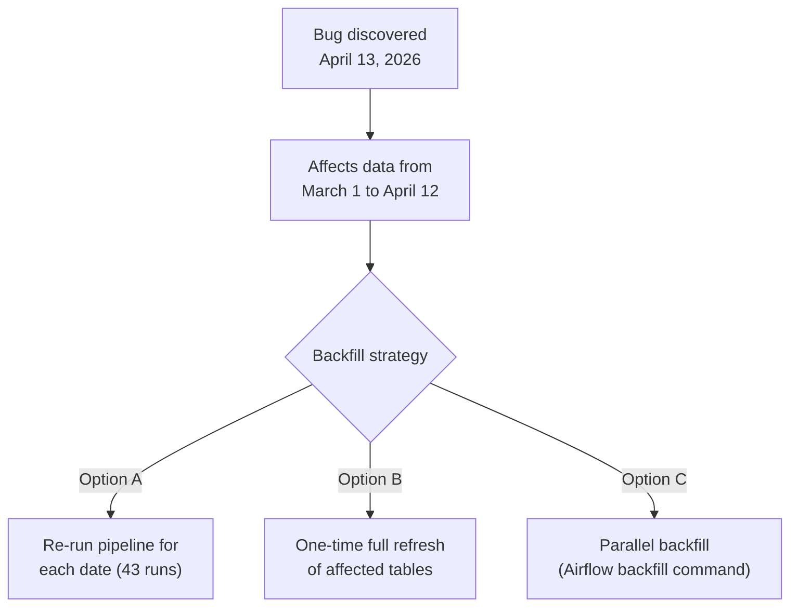

# ETL/ELT Patterns - Production Patterns

**What happens after "it works on my laptop." Late-arriving data, out-of-order events, backfill, and making pipelines safe to re-run.**

---

## Late-Arriving Data

Data doesn't always arrive on time. A call at 11:58 PM might not land in the data lake until 12:15 AM — after the midnight batch already ran. The call belongs to yesterday's partition but arrives in today's window.

**Analogy:** Mail delivered to the wrong day's mailbox. Monday's mail shows up in Tuesday's pile. You can't just throw it away — you need to sort it into Monday's folder.



### Solutions

**Option 1: Overlap window.** Subtract a buffer from the watermark. If your watermark is `April 12 23:59:59`, query from `April 12 23:00:00` instead. The one-hour overlap catches late arrivals. Combine with MERGE so duplicates are handled automatically.

```sql
-- Watermark with 1-hour overlap
DECLARE watermark TIMESTAMP;
SET watermark = (
    SELECT TIMESTAMP_SUB(last_loaded_at, INTERVAL 1 HOUR)
    FROM pipeline.watermarks 
    WHERE table_name = 'calls'
);

-- MERGE handles duplicates from the overlap
MERGE INTO silver.calls AS target
USING (SELECT * FROM bronze.calls WHERE updated_at >= watermark) AS source
ON target.call_id = source.call_id
WHEN MATCHED AND source.updated_at > target.updated_at THEN UPDATE SET ...
WHEN NOT MATCHED THEN INSERT ...;
```

**Option 2: Event-time partitioning.** Partition by when the event happened (`call_date`), not when it arrived. Late-arriving data lands in the correct partition regardless of when the pipeline processes it.

**Option 3: Reprocessing window.** Every day, reprocess the last 3 days. This catches anything that arrived late. Simple but reprocesses more data than necessary.

---

## Out-of-Order Events

In streaming or multi-source pipelines, events can arrive out of order. A call's "resolved" event might arrive before its "created" event.

```
Event 1 (arrives second):  call_id=C-001, status=created, timestamp=10:00
Event 2 (arrives first):   call_id=C-001, status=resolved, timestamp=10:08
```

If you process Event 2 first, the call is marked "resolved." Then Event 1 arrives and your pipeline overwrites "resolved" with "created" — going backwards.

### Solution: Timestamp Guard in MERGE

```sql
WHEN MATCHED AND source.updated_at > target.updated_at THEN
    UPDATE SET ...
```

The `source.updated_at > target.updated_at` condition ensures an older event never overwrites a newer one. Event 1 (10:00) won't overwrite Event 2 (10:08) because `10:00 > 10:08` is false.

---

## Idempotent Pipeline Design

An idempotent pipeline produces the same result whether you run it once, twice, or ten times with the same input. This is essential because:

- Airflow retries failed tasks automatically
- Engineers re-run pipelines manually during debugging
- Scheduler glitches can trigger duplicate runs

### Pattern: Partition Overwrite

Instead of appending to the target, overwrite the entire partition for the date being processed:

```python
# WHY: If this job runs twice for April 13, the second run
# overwrites the first. No duplicates.
(
    silver_df
    .write
    .format("bigquery")
    .option("table", "silver.calls")
    .option("partitionField", "call_date")
    .option("partitionType", "DAY")
    .mode("overwrite")  # overwrites only the partition being written
    .save()
)
```

### Pattern: Delete-then-Insert

For SQL-based pipelines where partition overwrite isn't available:

```sql
-- Step 1: Delete existing data for the processing date
DELETE FROM silver.calls WHERE call_date = @processing_date;

-- Step 2: Insert fresh data
INSERT INTO silver.calls
SELECT * FROM staging.calls WHERE call_date = @processing_date;
```

Wrap both statements in a transaction. If the INSERT fails, the DELETE rolls back too.

### Anti-Pattern: Append Without Deduplication

```python
# WRONG: Every re-run creates duplicate rows
df.write.mode("append").save()
```

Never use `append` without a deduplication mechanism (MERGE, or a downstream dedup query).

---

## Backfill

Backfill is reprocessing historical data. Common triggers:

- You fixed a bug in the Silver transform — need to reprocess all affected dates
- A new column was added to the source — need to populate it historically
- A data quality issue was discovered — need to revalidate past data



### Airflow Backfill

Airflow has built-in backfill support. It runs your DAG (Directed Acyclic Graph) for each date in the range:

```bash
# Re-run the pipeline for each day from March 1 to April 12
airflow dags backfill calls_pipeline \
    --start-date 2026-03-01 \
    --end-date 2026-04-12 \
    --reset-dagruns
```

**Key requirement:** Your pipeline must be parameterized by date. Instead of "process today's data," it must accept a date parameter and process that specific date.

```python
# WRONG: hardcoded to today
processing_date = datetime.today()

# RIGHT: parameterized (Airflow passes the logical date)
processing_date = kwargs["logical_date"]  # Airflow template
```

---

## Graceful Degradation

What happens when the source system is down? Your pipeline runs at midnight but the source database is in maintenance mode.

### Pattern: Detect and Skip

```python
try:
    raw_df = spark.read.json(BRONZE_PATH)
    record_count = raw_df.count()
except Exception as e:
    # Source is down. Don't crash — log and exit cleanly.
    log.warning(f"Source unavailable: {e}. Skipping run.")
    update_pipeline_status(SOURCE_NAME, status="skipped", reason=str(e))
    spark.stop()
    sys.exit(0)  # Exit 0 so Airflow doesn't retry endlessly
```

### Pattern: Staleness Alert

Even if the pipeline completes, check if the data is fresh:

```sql
-- Alert if the most recent call is more than 4 hours old
SELECT
    TIMESTAMP_DIFF(CURRENT_TIMESTAMP(), MAX(updated_at), HOUR) AS hours_stale
FROM silver.calls
HAVING hours_stale > 4;
```

If this returns a result, the pipeline ran but no new data arrived — the source may be down silently.

---

## Summary

| Pattern | Problem It Solves | Implementation |
|---|---|---|
| Overlap window | Late-arriving data | Subtract buffer from watermark, MERGE handles dupes |
| Timestamp guard | Out-of-order events | `WHERE source.updated_at > target.updated_at` in MERGE |
| Partition overwrite | Duplicate runs (idempotency) | `mode("overwrite")` on specific partition |
| Delete-then-insert | Idempotency in SQL | Transaction: DELETE + INSERT for processing date |
| Parameterized dates | Backfill support | Pipeline accepts date parameter, not hardcoded to today |
| Detect and skip | Source downtime | Try/catch, exit cleanly, alert on staleness |

---

## Orchestrator Mapping

The backfill and scheduling patterns above use Airflow. Here's where Airflow runs on each cloud:

| Cloud | Managed Airflow | Alternative |
|---|---|---|
| GCP | Cloud Composer | Cloud Scheduler + Cloud Functions |
| AWS | MWAA (Managed Workflows for Apache Airflow) | Step Functions |
| Azure | Azure Data Factory (orchestration mode) | Azure Functions + Logic Apps |
| Self-hosted | Docker Compose or Kubernetes | — |

The DAG code is identical across all managed Airflow services. Only the operator imports change (e.g., `BigQueryInsertJobOperator` vs `RedshiftSQLOperator`).

---

## Quick Links

| Chapter | Topic |
|---|---|
| [05 - Building It](05_Building_It.md) | Full incremental pipeline with DLQ |
| [06 - Production Patterns](06_Production_Patterns.md) | This page |
| [07 - System Design](07_System_Design.md) | CDC architecture at scale |
| [08 - Quality Security Governance](08_Quality_Security_Governance.md) | PII, schema drift, audit trails |
