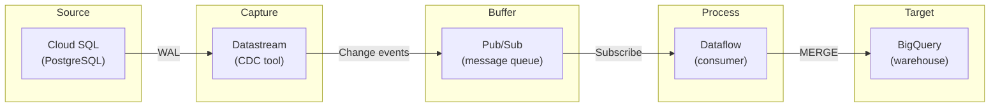
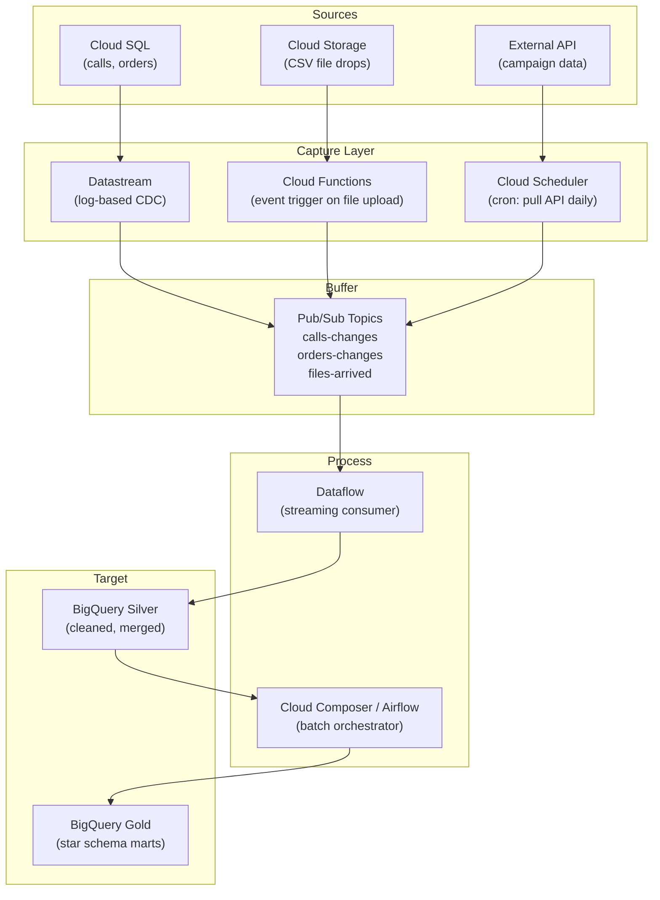
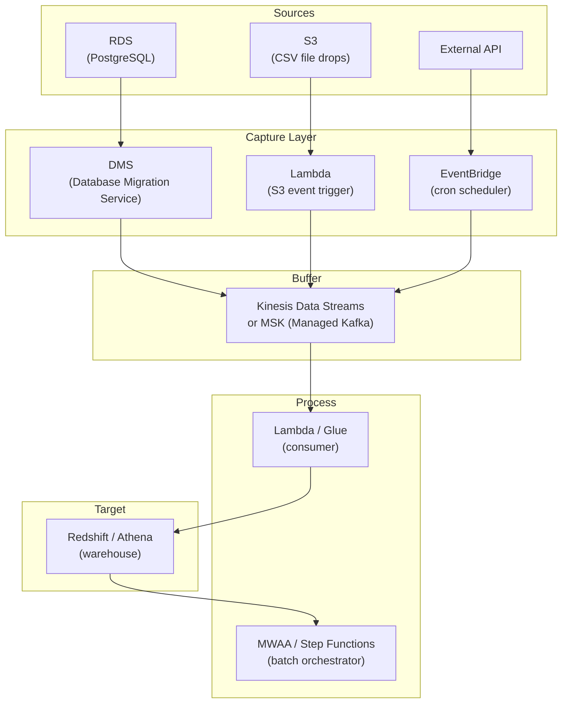
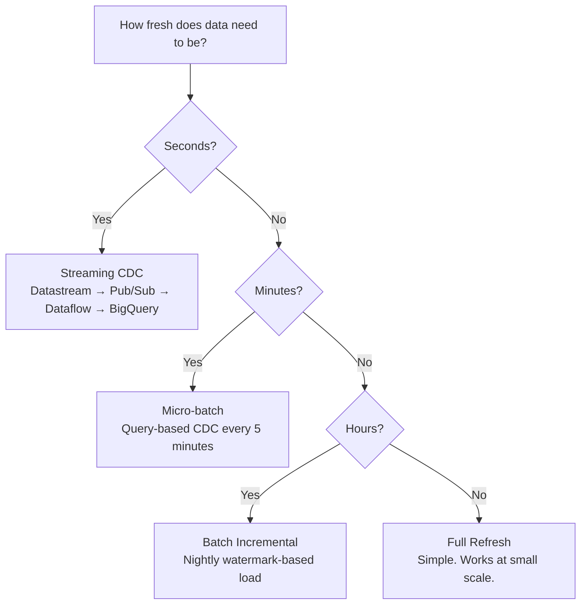
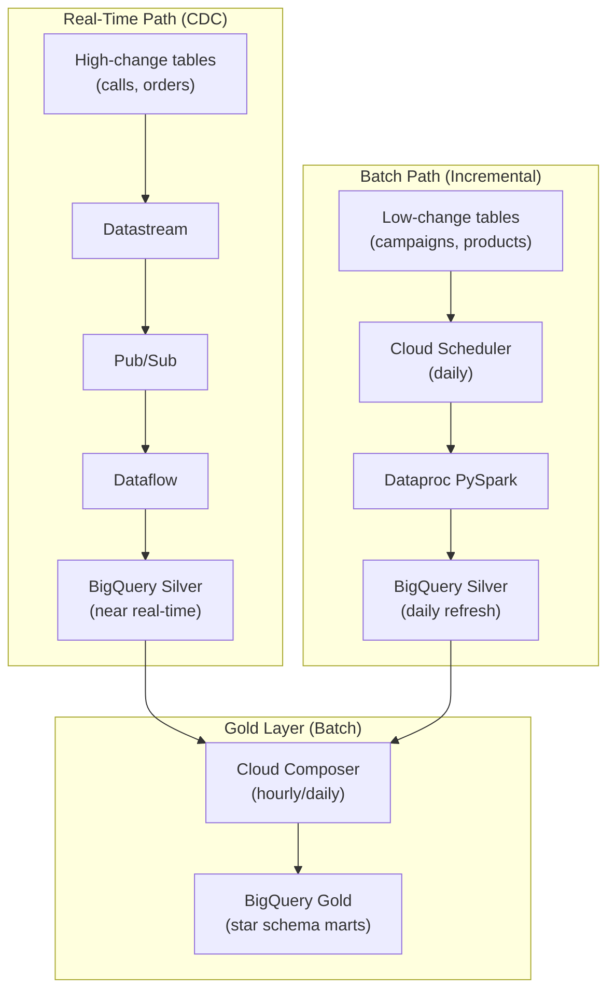

# ETL/ELT Patterns - System Design

**Architecture for CDC at scale. How the pieces connect on GCP and AWS. When to stream and when to batch.**

---

## The Full CDC Architecture

A production Change Data Capture (CDC) system has five components:

1. **Source database** — where data originates (PostgreSQL, MySQL, MongoDB, Cloud SQL)
2. **CDC tool** — reads the transaction log and emits change events
3. **Message queue** — buffers events between producer and consumer
4. **Consumer** — reads events, transforms, and writes to the target
5. **Target warehouse** — where analytics queries run (BigQuery, Redshift, Snowflake)

### Why a Message Queue?

You could connect the CDC tool directly to the warehouse. But a message queue in between gives you:

| Benefit | What It Means |
|---|---|
| **Decoupling** | Source and target don't know about each other. Source can be down while the queue buffers events. |
| **Replay** | If the consumer crashes, replay events from the queue. No data loss. |
| **Fan-out** | Multiple consumers can read the same events. Send to BigQuery AND a monitoring system. |
| **Backpressure** | If the consumer is slow, the queue holds events until it catches up. Source isn't affected. |

---

## GCP Architecture

### GCP Service Mapping

| Component | GCP Service | What It Does |
|---|---|---|
| CDC tool | **Datastream** | Reads PostgreSQL/MySQL WAL, emits change events to GCS or Pub/Sub |
| Message queue | **Pub/Sub** | Serverless message queue. Auto-scales. Pay per message. |
| Stream consumer | **Dataflow** | Apache Beam on GCP. Processes streaming events and writes to BigQuery. |
| Batch orchestrator | **Cloud Composer** | Managed Airflow. Schedules Silver→Gold transforms. |
| Warehouse | **BigQuery** | SQL analytics. Supports MERGE natively. |
| Event trigger | **Cloud Functions** | Serverless function triggered by file upload to GCS. |

### Cost Perspective

For a call center processing 500,000 calls per month:

| Service | Estimated Monthly Cost |
|---|---|
| Datastream | $0 (free tier covers up to 500 GB/month) |
| Pub/Sub | ~$5 (low message volume) |
| Dataflow | ~$50-$100 (streaming job) |
| BigQuery | ~$10-$30 (on-demand queries) |
| Cloud Composer | ~$300-$400 (the most expensive piece — managed Airflow environment) |

**The lesson:** Cloud Composer is often the most expensive component. For simple pipelines, consider using Cloud Scheduler + Cloud Functions instead of a full Airflow environment.

---

## AWS Architecture

### AWS Service Mapping

| Component | AWS Service | GCP Equivalent |
|---|---|---|
| CDC tool | **DMS** (Database Migration Service) | Datastream |
| Message queue | **Kinesis** or **MSK** (Managed Kafka) | Pub/Sub |
| Stream consumer | **Lambda** or **Glue Streaming** | Dataflow |
| Batch orchestrator | **MWAA** (Managed Airflow) or **Step Functions** | Cloud Composer |
| Warehouse | **Redshift** or **Athena** (on S3) | BigQuery |
| Event trigger | **Lambda** (S3 event) | Cloud Functions |

---

## Streaming vs Batch: When to Use Which

| Factor | Streaming CDC | Batch Incremental | Full Refresh |
|---|---|---|---|
| **Freshness** | Seconds | Minutes to hours | Hours |
| **Complexity** | High | Medium | Low |
| **Cost** | Higher (always-on) | Lower (runs periodically) | Lowest (simple job) |
| **Captures deletes** | Yes | No (unless tracked) | Yes (by replacement) |
| **Operational burden** | High (monitor stream lag) | Medium (monitor watermarks) | Low (monitor job success) |
| **Best for** | Real-time dashboards, fraud detection | Standard analytics, daily reports | Small reference tables |

**The practical answer:** Most data engineering teams start with batch incremental and graduate to streaming CDC only when business requirements demand real-time freshness. Don't build streaming complexity for data that's consumed in daily reports.

---

## Hybrid Architecture

Most production systems use both patterns:

**The pattern:** Stream the high-volume, frequently changing data (calls, orders). Batch the slow-changing reference data (campaigns, products, agents). Build Gold marts on a schedule regardless.

---

## Quick Links

| Chapter | Topic |
|---|---|
| [06 - Production Patterns](06_Production_Patterns.md) | Late-arriving data, backfill, idempotency |
| [07 - System Design](07_System_Design.md) | This page |
| [08 - Quality Security Governance](08_Quality_Security_Governance.md) | PII, schema drift, audit trails |
| [09 - Observability Troubleshooting](09_Observability_Troubleshooting.md) | Monitoring CDC lag, debugging failures |
