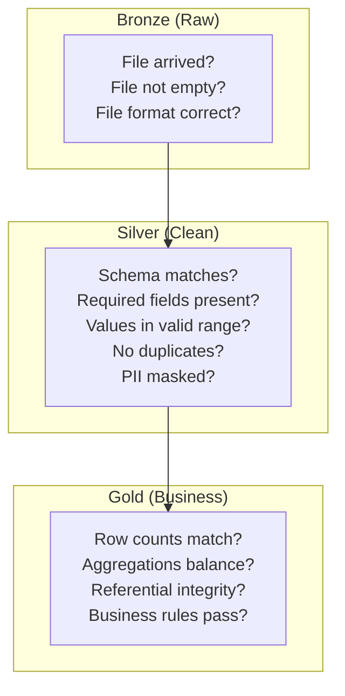
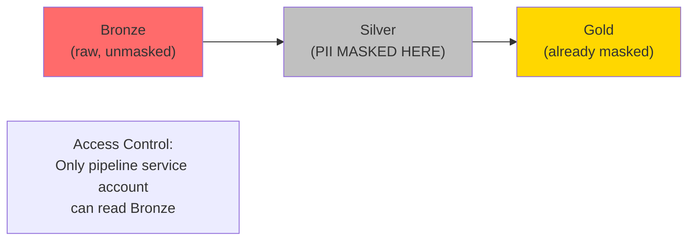

# ETL Patterns - Quality, Security, Governance

**Validating data at every stage. Masking Personally Identifiable Information (PII). Catching schema drift before it breaks the pipeline. Building an audit trail.**

---

## Data Validation by Layer

Each layer of the pipeline has different validation responsibilities:



### Bronze Checks (Before Processing)

| Check | What It Catches | Example |
|---|---|---|
| File exists | Ingestion failure | No `calls.json` arrived today |
| File not empty | Source system sent empty export | `calls.json` is 0 bytes |
| File format valid | Corrupted file | JSON file with malformed syntax |
| Row count minimum | Partial export | Expected 500+ calls, got 12 |
| No duplicate files | Double delivery | Same file uploaded twice in one hour |

```python
import os
from google.cloud import storage

def validate_bronze(bucket_name, file_path, min_rows=100):
    """Validate a file in GCS before processing."""
    client = storage.Client()
    bucket = client.bucket(bucket_name)
    blob = bucket.blob(file_path)
    
    # Check 1: File exists
    if not blob.exists():
        raise ValueError(f"File not found: gs://{bucket_name}/{file_path}")
    
    # Check 2: File not empty
    blob.reload()
    if blob.size == 0:
        raise ValueError(f"Empty file: gs://{bucket_name}/{file_path}")
    
    # Check 3: Row count (read first to count)
    content = blob.download_as_text()
    import json
    records = json.loads(content)
    if len(records) < min_rows:
        raise ValueError(
            f"Row count {len(records)} below minimum {min_rows}. "
            f"Possible partial export."
        )
    
    return len(records)
```

### Silver Checks (During Processing)

These run on every record and determine whether it goes to the Silver table or the Dead Letter Queue (DLQ):

```python
from pyspark.sql import functions as F

def apply_silver_checks(df):
    """Apply validation checks. Returns (good_df, bad_df)."""
    validated = df.withColumn(
        "errors",
        F.array_remove(F.array(
            F.when(F.col("call_id").isNull(), F.lit("null_call_id")),
            F.when(F.col("duration") < 0, F.lit("negative_duration")),
            F.when(F.col("duration") > 28800, F.lit("duration_over_8hrs")),
            F.when(F.col("customer_id").isNull(), F.lit("null_customer_id")),
            F.when(
                F.col("created_at") > F.current_timestamp(),
                F.lit("future_created_at")
            ),
        ), "")
    )
    
    good = validated.filter(F.size("errors") == 0).drop("errors")
    bad = validated.filter(F.size("errors") > 0)
    return good, bad
```

### Gold Checks (After Processing)

```sql
-- Check 1: Row count consistency
-- Silver calls minus DLQ should equal Gold fact table
SELECT
    (SELECT COUNT(*) FROM silver.calls) AS silver_count,
    (SELECT COUNT(*) FROM gold.fact_calls) AS gold_count,
    (SELECT COUNT(*) FROM pipeline.dlq WHERE source_table = 'calls' AND NOT reprocessed) AS dlq_count;
-- silver_count should approximately equal gold_count + dlq_count

-- Check 2: Referential integrity
-- Every call in fact_calls should have a valid customer in dim_customer
SELECT f.call_id
FROM gold.fact_calls f
LEFT JOIN gold.dim_customer c ON f.customer_key = c.customer_key
WHERE c.customer_key IS NULL;
-- Expected: 0 rows

-- Check 3: No orphaned orders
SELECT o.order_id
FROM silver.orders o
LEFT JOIN silver.calls c ON o.call_id = c.call_id
WHERE c.call_id IS NULL;
-- Log orphans to DLQ — don't drop them
```

---

## Schema Drift Detection

Schema drift happens when the source system changes without telling the pipeline team. A column is renamed, a new column is added, a data type changes.

### The Three Types of Schema Drift

| Type | Example | Impact |
|---|---|---|
| **Column added** | Source adds `agent_language` column | Mild — extra column ignored or lost |
| **Column removed** | Source drops `campaign_id` | Severe — pipeline fails or fills with nulls |
| **Type changed** | `duration` changes from INT to STRING | Severe — transforms break |

### Detection Pattern

Compare the incoming schema against the expected schema before processing:

```python
from pyspark.sql.types import StructType, StructField, StringType, IntegerType, TimestampType

EXPECTED_SCHEMA = StructType([
    StructField("call_id", StringType()),
    StructField("customer_id", StringType()),
    StructField("status", StringType()),
    StructField("duration", IntegerType()),
    StructField("created_at", TimestampType()),
    StructField("updated_at", TimestampType()),
])

def check_schema_drift(incoming_df, expected_schema):
    """Compare incoming schema against expected. Return drift details."""
    incoming_fields = {f.name: f.dataType for f in incoming_df.schema.fields}
    expected_fields = {f.name: f.dataType for f in expected_schema.fields}
    
    added = set(incoming_fields.keys()) - set(expected_fields.keys())
    removed = set(expected_fields.keys()) - set(incoming_fields.keys())
    type_changes = {
        name: (expected_fields[name], incoming_fields[name])
        for name in set(incoming_fields.keys()) & set(expected_fields.keys())
        if incoming_fields[name] != expected_fields[name]
    }
    
    if removed or type_changes:
        # BREAKING change — alert and halt
        raise SchemaBreakingChange(
            f"Removed columns: {removed}, Type changes: {type_changes}"
        )
    
    if added:
        # NON-BREAKING change — log warning, continue
        log.warning(f"New columns detected (ignored): {added}")
    
    return {"added": added, "removed": removed, "type_changes": type_changes}
```

**Rule of thumb:** Added columns are warnings. Removed columns or type changes are errors. Never silently continue when a column disappears.

---

## PII Handling in Pipelines

Call center data contains Personally Identifiable Information (PII): phone numbers, customer names, email addresses. Payment data contains Payment Card Industry (PCI) data: credit card numbers, billing addresses.

### Where to Mask



**Bronze keeps raw PII** — you need it for reprocessing. But access to Bronze is restricted to the pipeline service account only. No human should query Bronze directly.

**Silver masks PII** — this is where analysts and dashboards read from. PII is hashed or redacted.

### Masking Techniques

```python
from pyspark.sql import functions as F

def mask_pii(df):
    """Apply PII masking. Run during Silver transform."""
    return df.select(
        # Keep non-PII columns as-is
        "call_id",
        "status",
        "duration",
        "campaign_id",
        "call_date",
        
        # Hash customer_id (preserves join ability without exposing real ID)
        F.sha2(F.col("customer_id"), 256).alias("customer_id_hash"),
        
        # Redact phone number (keep last 4 digits)
        F.regexp_replace(
            F.col("phone_number"), 
            r"^\d{6}", "XXX-XXX"
        ).alias("phone_masked"),
        
        # Drop email entirely (not needed for analytics)
        # F.col("email")  -- intentionally excluded
        
        # Keep timestamps
        "created_at",
        "updated_at",
    )
```

| Technique | When to Use | Example |
|---|---|---|
| **Hash (SHA-256)** | Need to join/group but not see the value | `customer_id` → `a3f2b8c...` |
| **Partial redaction** | Show structure but hide specifics | `555-123-4567` → `XXX-XXX-4567` |
| **Full redaction** | Value not needed downstream | `john@email.com` → `[REDACTED]` |
| **Drop column** | Column not needed at all | Remove `email` from Silver |
| **Tokenization** | Need reversible masking (with key) | `customer_id` → `TOKEN-12345` |

---

## Audit Trail

Every pipeline run should leave a trace. When something goes wrong six months from now, you need to answer: What data was loaded? When? How many records? Any errors?

```sql
-- Pipeline run log
CREATE TABLE IF NOT EXISTS pipeline.run_log (
    run_id STRING DEFAULT GENERATE_UUID(),
    dag_name STRING,
    task_name STRING,
    table_name STRING,
    run_timestamp TIMESTAMP DEFAULT CURRENT_TIMESTAMP(),
    records_read INT64,
    records_written INT64,
    records_failed INT64,
    watermark_before TIMESTAMP,
    watermark_after TIMESTAMP,
    status STRING,  -- 'success', 'partial', 'failed'
    error_message STRING,
    duration_seconds FLOAT64
);
```

Log every run:

```python
def log_pipeline_run(client, dag_name, task_name, table_name,
                     records_read, records_written, records_failed,
                     watermark_before, watermark_after, status, 
                     error_message=None, duration_seconds=None):
    # WHY: Use parameterized queries in production to prevent SQL injection.
    # This example uses f-strings for readability. In production, use
    # BigQuery's query parameters: client.query(sql, job_config=config)
    sql = f"""
    INSERT INTO pipeline.run_log 
    (dag_name, task_name, table_name, records_read, records_written,
     records_failed, watermark_before, watermark_after, status,
     error_message, duration_seconds)
    VALUES ('{dag_name}', '{task_name}', '{table_name}',
            {records_read}, {records_written}, {records_failed},
            TIMESTAMP('{watermark_before}'), TIMESTAMP('{watermark_after}'),
            '{status}', '{error_message}', {duration_seconds})
    """
    client.query(sql).result()
```

---

## GDPR: Right to Delete

The General Data Protection Regulation (GDPR) gives individuals the right to request deletion of their data. In a pipeline, this means:

1. Customer requests deletion
2. Delete from source database
3. CDC captures the DELETE event
4. Pipeline propagates DELETE to Silver and Gold tables
5. If using Delta Lake or Iceberg, run VACUUM to physically remove the data from files

```sql
-- Propagate a delete through the pipeline
-- Step 1: Delete from Silver
DELETE FROM silver.calls WHERE customer_id_hash = @customer_hash;
DELETE FROM silver.orders WHERE customer_id_hash = @customer_hash;

-- Step 2: Delete from Gold
DELETE FROM gold.fact_calls WHERE customer_key IN (
    SELECT customer_key FROM gold.dim_customer 
    WHERE customer_id_hash = @customer_hash
);
DELETE FROM gold.dim_customer WHERE customer_id_hash = @customer_hash;

-- Step 3: Delete from DLQ (they might have PII in the JSON payload)
DELETE FROM pipeline.dlq WHERE record_json LIKE CONCAT('%', @customer_hash, '%');
```

**Don't forget Bronze.** If Bronze contains raw PII and you need GDPR compliance, you must either delete from Bronze too or ensure Bronze has a data retention policy that automatically purges old data.

---

## Quick Links

| Chapter | Topic |
|---|---|
| [07 - System Design](07_System_Design.md) | CDC architecture at scale |
| [08 - Quality Security Governance](08_Quality_Security_Governance.md) | This page |
| [09 - Observability Troubleshooting](09_Observability_Troubleshooting.md) | Monitoring CDC lag, debugging failures |
| [10 - Decision Guide](10_Decision_Guide.md) | Which pattern for which situation |
