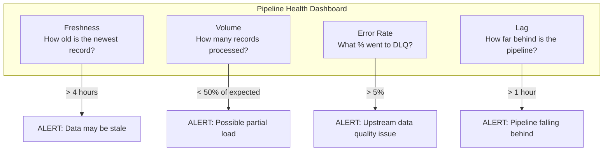
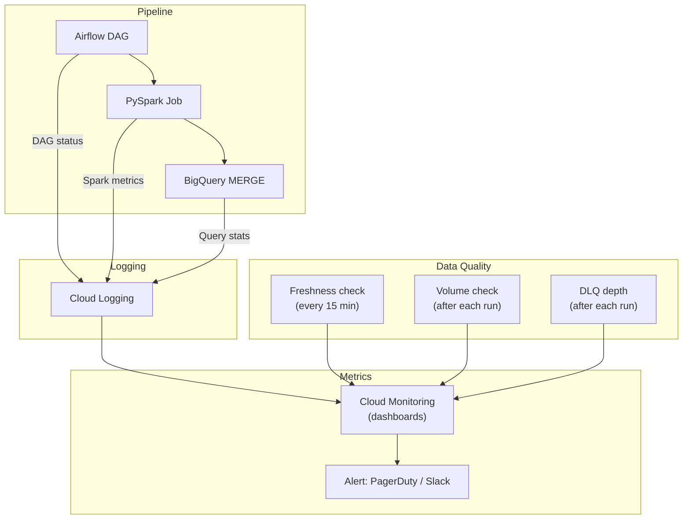

# ETL/ELT Patterns - Observability & Troubleshooting

**What to monitor, what breaks, and how to fix it. A debugging playbook for every common pipeline failure.**

---

## The Four Metrics That Matter

Every pipeline needs exactly four metrics. If you monitor nothing else, monitor these:



| Metric | What It Measures | Alert Threshold | Query |
|---|---|---|---|
| **Freshness** | Time since newest record | > 4 hours | `SELECT TIMESTAMP_DIFF(CURRENT_TIMESTAMP(), MAX(updated_at), HOUR) FROM silver.calls` |
| **Volume** | Records processed per run | < 50% of daily average | `SELECT records_loaded FROM pipeline.watermarks WHERE table_name = 'calls'` |
| **Error rate** | % of records sent to DLQ | > 5% | `records_failed / (records_loaded + records_failed) * 100` |
| **Lag** | Gap between source and warehouse | > 1 hour (batch) or > 5 min (CDC) | `SELECT TIMESTAMP_DIFF(CURRENT_TIMESTAMP(), MAX(ingested_at), MINUTE) FROM silver.calls` |

---

## Common Failures and How to Fix Them

### Failure 1: Watermark Gap (Missed Records)

**Symptom:** Dashboard shows a dip in call volume for a specific hour, but the source system shows no dip.

**Root cause:** The watermark jumped past records that hadn't been committed yet. Records were being written to the source at 11:59 PM. The pipeline ran at midnight and set the watermark to 11:58 PM (the latest record it could see). The 11:59 PM records committed at 12:01 AM — after the watermark moved past them.

**Debug steps:**

```sql
-- Step 1: Find the gap
SELECT 
    DATE(call_date) AS day,
    COUNT(*) AS call_count
FROM silver.calls
WHERE call_date BETWEEN '2026-04-10' AND '2026-04-14'
GROUP BY day
ORDER BY day;
-- Look for the day with abnormally low count

-- Step 2: Compare with Bronze
SELECT 
    DATE(created_at) AS day,
    COUNT(*) AS bronze_count
FROM bronze.calls
WHERE created_at BETWEEN '2026-04-12' AND '2026-04-13'
GROUP BY day;
-- If bronze_count > silver_count for that day, records were missed

-- Step 3: Check watermark history
SELECT * FROM pipeline.watermarks WHERE table_name = 'calls';
```

**Fix:** Reprocess the affected date with a backfill. Prevent recurrence by using an overlap window (subtract 1 hour from the watermark).

---

### Failure 2: Duplicate Records After Re-run

**Symptom:** Revenue doubled overnight. Same orders appearing twice.

**Root cause:** The pipeline was re-run (manual or Airflow retry) and used `INSERT` instead of `MERGE`. Each run appended the same records.

**Debug steps:**

```sql
-- Find duplicates
SELECT call_id, COUNT(*) AS copies
FROM silver.calls
GROUP BY call_id
HAVING copies > 1
ORDER BY copies DESC
LIMIT 20;
```

**Fix (immediate):** Deduplicate the table:

```sql
-- Create clean version
CREATE OR REPLACE TABLE silver.calls AS
SELECT * FROM silver.calls
QUALIFY ROW_NUMBER() OVER (PARTITION BY call_id ORDER BY updated_at DESC) = 1;
```

**Fix (permanent):** Switch from INSERT to MERGE. Or use the partition-overwrite pattern (see [06 - Production Patterns](06_Production_Patterns.md)).

---

### Failure 3: Schema Mismatch

**Symptom:** Pipeline fails with `Column not found: campaign_id` or `Type mismatch: expected INT64, got STRING`.

**Root cause:** The source system changed its schema without notifying the data team. A column was renamed, removed, or its type changed.

**Debug steps:**

```python
# Compare schemas
incoming_schema = spark.read.json(BRONZE_PATH).schema
print("Incoming schema:")
for field in incoming_schema.fields:
    print(f"  {field.name}: {field.dataType}")

print("\nExpected schema:")
for field in EXPECTED_SCHEMA.fields:
    print(f"  {field.name}: {field.dataType}")
```

**Fix:** Update the pipeline to handle the new schema. If a column was added, decide whether to include it. If a column was renamed, add a mapping. Add schema drift detection (see [08 - Quality Security Governance](08_Quality_Security_Governance.md)).

---

### Failure 4: DLQ Overflow

**Symptom:** Error rate jumps from 0.1% to 40%. DLQ table grows by thousands of records per run.

**Root cause:** This is almost always an upstream problem, not a pipeline problem. Common causes:
- Source system deployed a code change that broke data formatting
- A third-party integration started sending malformed data
- Database migration changed data types

**Debug steps:**

```sql
-- What's failing and why?
SELECT 
    failure_reason,
    COUNT(*) AS count,
    MIN(failed_at) AS first_seen,
    MAX(failed_at) AS last_seen
FROM pipeline.dlq
WHERE source_table = 'calls'
    AND failed_at > TIMESTAMP_SUB(CURRENT_TIMESTAMP(), INTERVAL 24 HOUR)
GROUP BY failure_reason
ORDER BY count DESC;
```

**Fix:** The fix is upstream. Contact the source system team with:
1. The specific failure reason
2. Example records (from DLQ)
3. When it started (first_seen timestamp)
4. How many records are affected

---

### Failure 5: MERGE Performance Degradation

**Symptom:** MERGE that used to take 30 seconds now takes 20 minutes.

**Root cause:** The MERGE is scanning the entire target table because:
- The target table isn't partitioned
- The MERGE ON clause doesn't include the partition column
- The staging table is much larger than expected

**Debug steps:**

```sql
-- Check table size and partitioning
SELECT 
    table_name,
    total_rows,
    total_logical_bytes / 1024 / 1024 / 1024 AS size_gb,
    ARRAY_TO_STRING(
        ARRAY(SELECT partition_id FROM `project.dataset.INFORMATION_SCHEMA.PARTITIONS` 
              WHERE table_name = 'calls' LIMIT 5), 
        ', '
    ) AS sample_partitions
FROM `project.dataset.INFORMATION_SCHEMA.TABLE_STORAGE`
WHERE table_name = 'calls';

-- Check staging table size (should be small)
SELECT COUNT(*) FROM pipeline.staging_calls;
```

**Fix:** Add the partition column to the MERGE ON clause:

```sql
-- BEFORE (scans entire table)
ON target.call_id = source.call_id

-- AFTER (scans only matching partitions)
ON target.call_id = source.call_id
    AND target.call_date = source.call_date
```

---

## Monitoring Architecture



### Alerting Rules

| Condition | Severity | Action |
|---|---|---|
| Pipeline failed | High | Page on-call |
| Freshness > 4 hours | High | Page on-call |
| DLQ error rate > 5% | Medium | Slack alert, investigate upstream |
| Volume < 50% of average | Medium | Slack alert, check source |
| MERGE takes > 10x normal | Low | Investigate partitioning |
| DLQ depth > 1,000 records | Medium | Review and reprocess or escalate |

---

## Quick Links

| Chapter | Topic |
|---|---|
| [08 - Quality Security Governance](08_Quality_Security_Governance.md) | PII, schema drift, audit trails |
| [09 - Observability Troubleshooting](09_Observability_Troubleshooting.md) | This page |
| [10 - Decision Guide](10_Decision_Guide.md) | Which pattern for which situation |
