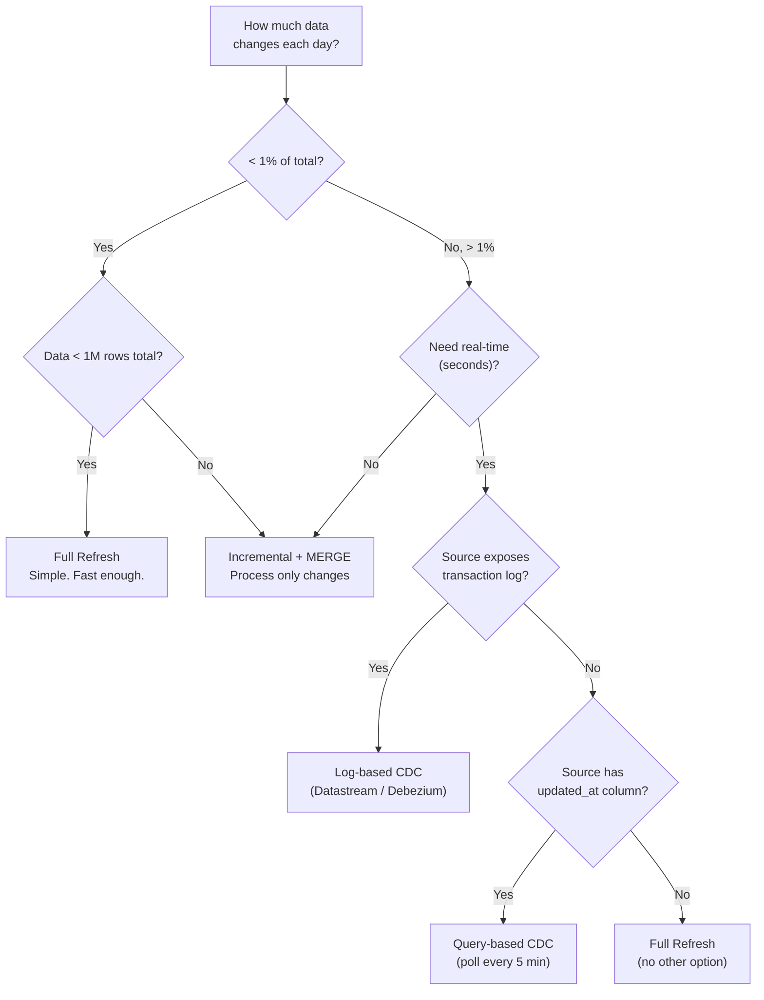
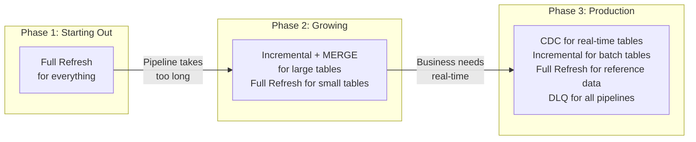

# ETL/ELT Patterns - Decision Guide

**Which pattern for which situation. A decision tree, a comparison matrix, and the one rule that covers 80% of cases.**

---

## The One Rule

**If you're unsure, start with batch incremental + MERGE. Graduate to CDC when the business demands real-time.**

Most data engineering teams don't need streaming CDC. They need a reliable batch pipeline that runs nightly, processes only new data, handles updates without duplicates, and alerts when something breaks.

Streaming CDC adds operational complexity (message queues, stream consumers, lag monitoring) that only pays off when the business requires data freshness measured in seconds, not hours.

---

## Decision Tree

---

## Comparison Matrix

| Factor | Full Refresh | Incremental + MERGE | Query-Based CDC | Log-Based CDC |
|---|---|---|---|---|
| **Freshness** | Hours | Minutes to hours | Minutes | Seconds |
| **Complexity** | Low | Medium | Medium | High |
| **Setup time** | 1 day | 2-3 days | 3-5 days | 1-2 weeks |
| **Captures INSERTs** | Yes | Yes | Yes | Yes |
| **Captures UPDATEs** | Yes (by overwrite) | Yes (with MERGE) | Yes (with MERGE) | Yes (before + after) |
| **Captures DELETEs** | Yes (by replacement) | No (unless tracked) | No | Yes |
| **Source impact** | High (full scan) | Medium (filtered scan) | Medium (frequent polls) | None (reads log) |
| **Handles schema drift** | Naturally (reloads all) | Needs detection | Needs detection | Needs detection |
| **Recovery** | Re-run the job | Reset watermark | Reset watermark | Replay from offset |
| **Operational cost** | Lowest | Low | Medium | Highest |
| **Infrastructure** | Scheduler + warehouse | Scheduler + warehouse + watermark table | Scheduler + warehouse + watermark table | CDC tool + message queue + stream consumer + warehouse |

---

## Pattern by Data Type

| Data Type | Example | Recommended Pattern | Why |
|---|---|---|---|
| **Reference/dimension** | Products, campaigns, agents | Full refresh (daily) | Small, changes rarely. Simplicity wins. |
| **Append-only events** | Call logs, web clicks, sensor data | Incremental (append) | New records only, never updated. Watermark on timestamp. |
| **Mutable records** | Orders (status changes), customer profiles | Incremental + MERGE | Records get updated. Need upsert logic. |
| **High-volume, real-time** | Payment transactions, fraud signals | Log-based CDC | Seconds matter. Volume is high. Need deletes. |
| **Legacy system, no timestamps** | Old ERP, mainframe exports | Full refresh | No way to detect changes. Only option. |
| **Third-party API** | Salesforce, HubSpot, Stripe | Incremental (API pagination) | Use API's cursor/pagination. Don't full-scan. |

---

## Pattern by Team Maturity

**Don't jump to Phase 3.** Each phase is a valid production state. A well-built Phase 2 pipeline (incremental + MERGE with DLQ and monitoring) serves most organizations well for years.

---

## Common Mistakes

| Mistake | Why It's Wrong | What to Do Instead |
|---|---|---|
| Building streaming CDC for daily reports | Over-engineering. Data is consumed once a day. | Batch incremental is enough. |
| Full refresh on a 100M-row table | Will exceed the batch window as data grows. | Switch to incremental + MERGE. |
| Incremental without DLQ | Bad records silently crash or get dropped. | Always route failures to a quarantine table. |
| MERGE without partition pruning | Scans entire target table. Gets slower every day. | Add partition column to MERGE ON clause. |
| Watermark update before data commit | If the load fails, records are permanently skipped. | Update watermark AFTER successful commit. |
| No schema drift detection | Source change breaks pipeline at 2 AM. | Compare schemas before processing (see Chapter 8). |

---

## Quick Links

| Chapter | Topic |
|---|---|
| [09 - Observability Troubleshooting](09_Observability_Troubleshooting.md) | Monitoring and debugging |
| [10 - Decision Guide](10_Decision_Guide.md) | This page |
| [01 - Why](01_Why.md) | Back to the beginning |
| [02 - Concepts](02_Concepts.md) | All patterns explained |
