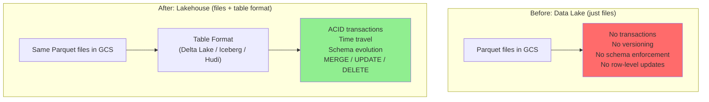
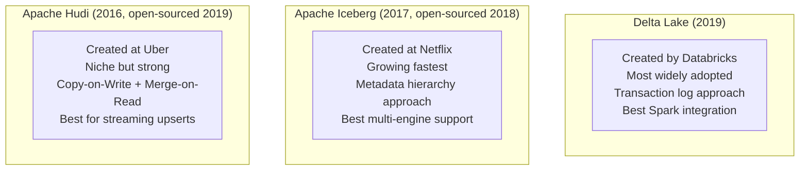

# Lakehouse Formats - Why They Matter

**Your data lake is a liability without ACID transactions. One crashed write corrupts everything downstream. Table formats fix this.**

---

## The Corrupted Parquet File

A data engineer runs a nightly pipeline. The pipeline reads 2 million call records from staging, transforms them, and writes the result as Parquet files to Google Cloud Storage (GCS). This has worked for months.

One Thursday night, the pipeline crashes midway through the write. Out of 50 Parquet files that should have been written, 31 completed and 19 did not. The half-written file — file 32 — is corrupted. It has a valid header but truncated data.

Friday morning:
- BigQuery reads the folder. It picks up 31 good files and 1 corrupted file. The query returns 1.4 million rows instead of 2 million.
- The dashboard shows a 30% drop in call volume. The VP of Operations emails the data team: "What happened to call volume overnight?"
- The analyst checking the dashboard doesn't know it's a pipeline issue. She starts investigating whether the phone system was down.
- Two hours later, someone finds the corrupted file. But they can't just delete it — they don't know which version of the data was correct. The previous version was already overwritten.

This entire incident happened because Parquet files on GCS have no transactional guarantees. A write either fully succeeds or leaves garbage behind. There's no rollback. There's no "previous version."

---

## The Problem: Files Aren't Tables

Cloud storage (GCS, Amazon Simple Storage Service / S3, Azure Blob) stores files. When you write a Parquet file to a folder, the storage system doesn't know or care about:

| What a Database Does | What Cloud Storage Does |
|---|---|
| ACID transactions (all or nothing) | Writes individual files (partial is possible) |
| Rollback on failure | Failed write leaves partial data |
| Concurrent write handling | Last write wins, previous overwritten |
| Schema enforcement | Any file format in any folder |
| Version history | Previous version gone once overwritten |
| DELETE a single row | Must rewrite the entire file |
| UPDATE a single row | Must rewrite the entire file |

Data warehouses (BigQuery, Redshift, Snowflake) handle all of this. But data warehouses are expensive to store large volumes and lock you into one vendor.

Data lakes (GCS, S3) are cheap and open. But they're just folders of files with none of these guarantees.

**The lakehouse idea:** Keep data in cheap, open cloud storage BUT add a metadata layer on top that provides transactions, versioning, and schema enforcement. That metadata layer is a **table format**.

---

## What Table Formats Solve

| Capability | What It Means | Why You Care |
|---|---|---|
| **ACID transactions** | A write either fully succeeds or fully rolls back. No partial files. | The Thursday night crash scenario never happens. |
| **Time travel** | Query data as it was at any point in the past. | "Show me yesterday's version" — no need to restore from backup. |
| **Schema evolution** | Add or rename columns without rewriting all data. | Source system adds a column? Handle it gracefully. |
| **MERGE / UPDATE / DELETE** | Modify individual rows without rewriting entire files. | A call status changes from "in-progress" to "resolved" — update one row, not one million. |
| **Concurrent access** | Multiple writers can safely write to the same table. | Two pipelines writing to the same table won't corrupt each other's data. |
| **Audit history** | Every change is logged: who, when, what. | Compliance, debugging, and trust. |

---

## The Three Formats

Three open-source table formats dominate the industry:

| Factor | Delta Lake | Apache Iceberg | Apache Hudi |
|---|---|---|---|
| **Created by** | Databricks | Netflix | Uber |
| **Open source** | Yes (Linux Foundation) | Yes (Apache Foundation) | Yes (Apache Foundation) |
| **Primary use case** | General lakehouse | Multi-engine analytics | Streaming upserts |
| **Adoption** | Highest (Databricks ecosystem) | Growing fast (Snowflake, AWS, Apple, Netflix) | Moderate (AWS EMR, Uber) |
| **Engine support** | Spark (best), Trino, Flink | Spark, Trino, Flink, Presto, Dremio | Spark, Flink, Presto |
| **Cloud native support** | Databricks, Azure, GCP BigLake | Snowflake, AWS Athena, GCP BigLake | AWS EMR, Athena |
| **How it works** | JSON transaction log | Metadata files + manifest hierarchy | Timeline + index |

You don't need to learn all three in depth. **Learn one well (Delta Lake is the safest bet) and understand how the others differ.**

---

## Where BigQuery Fits

BigQuery already provides many of these features natively:

| Feature | BigQuery Native | Delta Lake / Iceberg on GCS |
|---|---|---|
| ACID transactions | Yes | Yes |
| Time travel | Yes (7 days default, up to 7 days max) | Yes (configurable retention) |
| MERGE | Yes | Yes |
| Schema evolution | Yes (add columns) | Yes (add, rename, reorder) |
| Concurrent access | Yes | Yes |
| Open format | No (proprietary) | Yes (Parquet + metadata) |
| Multi-engine | No (BigQuery only) | Yes (Spark, Trino, Flink, etc.) |
| Storage cost | Higher (BigQuery storage pricing) | Lower (GCS pricing) |

**When BigQuery is enough:** If all your analytics happens in BigQuery and you don't need to share data with Spark or other engines, BigQuery's native features cover most lakehouse needs.

**When you need a table format:** If you process data in Spark (Dataproc) and serve it through BigQuery, or if you want to avoid vendor lock-in, or if you need longer time travel retention, a table format on GCS gives you flexibility.

**GCP BigLake** bridges both worlds: it lets BigQuery read Delta Lake and Iceberg tables stored in GCS. You get GCS storage pricing with BigQuery query capability.

---

## Quick Links

| Chapter | Topic |
|---|---|
| [01 - Why](01_Why.md) | This page |
| [02 - Concepts](02_Concepts.md) | Delta Lake, Iceberg, Hudi in plain English |
| [03 - Hello World](03_Hello_World.md) | Write, read, update, and time-travel a Delta table |
