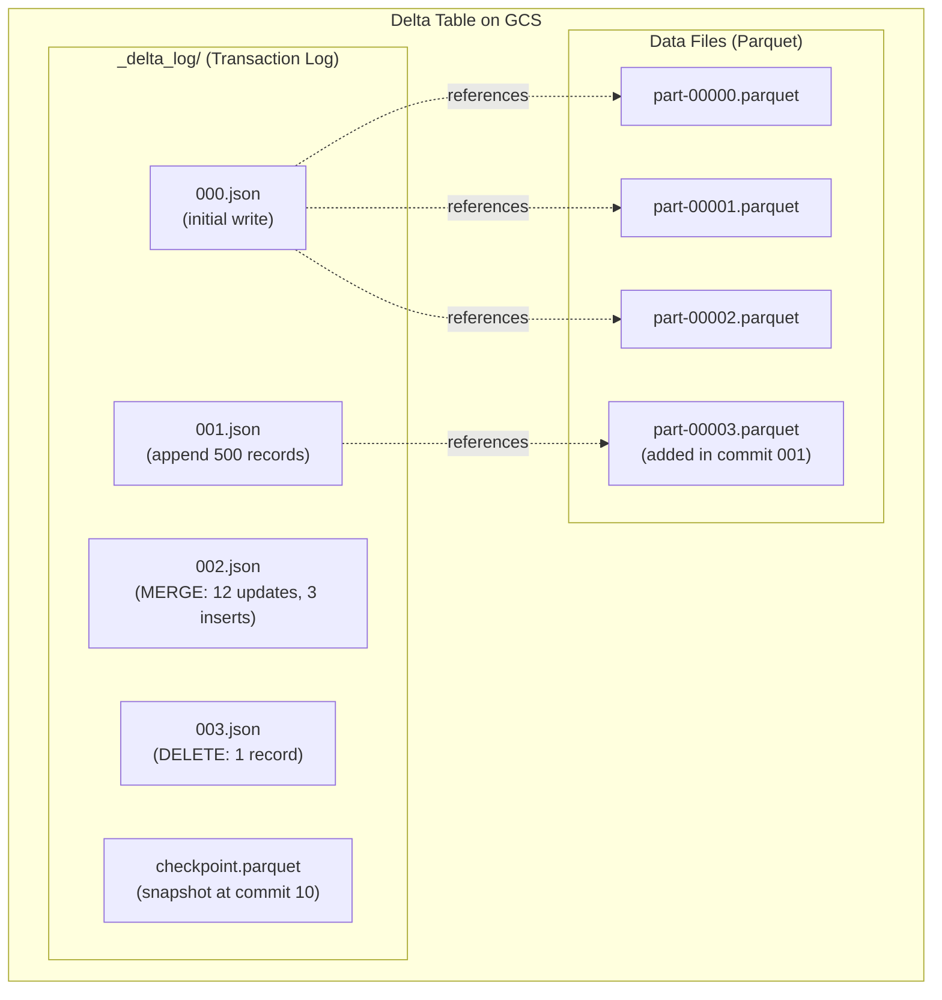
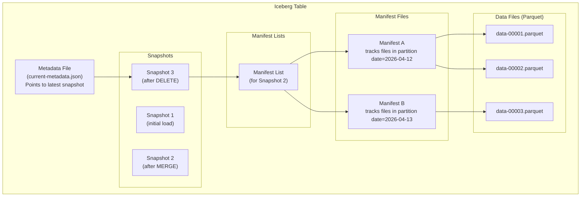

# Lakehouse Formats - Concepts

**How ACID transactions work on plain files. The metadata layer that turns a folder of Parquet into a table with rollback, versioning, and schema enforcement.**

---

## ACID on Files

Atomicity, Consistency, Isolation, Durability (ACID) — the four guarantees that make databases reliable. Table formats bring these guarantees to files in cloud storage.

**Analogy:** Imagine editing a shared Google Doc. Without version history, if two people edit the same paragraph at the same time, one person's changes overwrite the other's. With version history, every edit is tracked, conflicts are detected, and you can always go back to a previous version.

Table formats add version history to your data lake.

| ACID Property | What It Means for a Data Lake |
|---|---|
| **Atomicity** | A write either fully completes or has no effect. No partial files. |
| **Consistency** | The table always reflects a valid state. Readers never see half-written data. |
| **Isolation** | Concurrent writers don't interfere. Two pipelines writing at the same time produce correct results. |
| **Durability** | Once a write is committed, it survives crashes. The data is permanently stored. |

### How It Works (Conceptually)

Without a table format:
```
Write 50 Parquet files to GCS → crash at file 32 → 31 files exist, 1 corrupted, 19 missing
Readers see: partial, inconsistent data
```

With a table format:
```
Write 50 Parquet files to GCS → crash at file 32 → all 50 files exist but NOT committed
Readers see: previous version (consistent, correct data)
Pipeline retries → all 50 files written → commit → readers see new version
```

The key insight: **the data files are written first, but they're invisible until the metadata is updated**. The metadata update is atomic (a single file write), so the switch from "old version" to "new version" is instantaneous.

---

## Delta Lake

Created by Databricks in 2019. The most widely adopted table format. Uses a transaction log.

### How Delta Lake Organizes Data



**The transaction log** (`_delta_log/`) is a sequence of JSON files. Each file records one commit: which Parquet files were added, which were removed, and what metadata changed.

**Reading a Delta table:** Read all log entries (or the latest checkpoint + subsequent entries), build a list of "active" Parquet files, read only those files. Files that were "removed" in a later commit are skipped.

**Writing to a Delta table:** Write new Parquet files, then write a new log entry referencing those files. If the write fails before the log entry is written, the Parquet files exist but are invisible — readers skip them.

### Key Delta Lake Features

| Feature | How It Works |
|---|---|
| **MERGE** | `DeltaTable.merge()` — compare incoming data against existing, INSERT/UPDATE/DELETE in one operation |
| **Time travel** | `spark.read.format("delta").option("versionAsOf", 3).load(path)` — read any historical version |
| **Schema evolution** | `.option("mergeSchema", "true")` — automatically add new columns |
| **Schema enforcement** | Rejects writes that don't match the table schema (by default) |
| **VACUUM** | Remove old Parquet files that are no longer referenced. Frees storage. |
| **OPTIMIZE** | Compact small files into larger ones for better read performance. |
| **Z-ORDER** | Co-locate related data within files for faster filtered queries. |

---

## Apache Iceberg

Created at Netflix in 2017, donated to the Apache Foundation. Uses a metadata hierarchy instead of a flat transaction log.

### How Iceberg Organizes Data



**The hierarchy:** Metadata file → Snapshot → Manifest list → Manifest files → Data files.

**Why the hierarchy?** Performance at scale. Delta Lake's flat log must be read sequentially. Iceberg's tree structure allows the query engine to skip entire branches. For a table with 10,000 partitions, Iceberg can identify the relevant files without reading metadata for all 10,000 partitions.

### Key Iceberg Features

| Feature | How It Works |
|---|---|
| **Hidden partitioning** | Partition by `month(timestamp)` without creating physical directories. Query engines handle it automatically. |
| **Partition evolution** | Change the partitioning strategy (e.g., from daily to hourly) without rewriting existing data. |
| **Schema evolution** | Add, rename, drop, or reorder columns. Old data files are read with the updated schema. |
| **Snapshot isolation** | Each query reads a consistent snapshot. Long-running queries aren't affected by concurrent writes. |
| **Time travel** | Query any previous snapshot by snapshot ID or timestamp. |
| **Multi-engine** | Same table readable by Spark, Trino, Flink, Presto, Dremio, BigQuery, Snowflake, Athena. |

### Iceberg's Killer Feature: Hidden Partitioning

In traditional Hive-style partitioning, the user must manually specify partition values in queries:

```sql
-- Hive-style: user must know the partition structure
SELECT * FROM calls WHERE year=2026 AND month=4 AND day=13;
```

In Iceberg, the table is partitioned by a transform of the column:

```sql
-- Iceberg: partition by month(call_date) is defined in the table spec
-- The user just writes a normal WHERE clause
SELECT * FROM calls WHERE call_date = '2026-04-13';
-- Iceberg automatically prunes to the correct partition
```

The partition strategy is metadata, not directory structure. This means you can change it later without rewriting data.

---

## Apache Hudi

Created at Uber in 2016, open-sourced in 2019. Optimized for streaming upserts — the pattern Uber needed for their rider/driver location data.

### Two Storage Types

Hudi offers two ways to store data, each with different trade-offs:

| Type | How UPDATEs Work | Read Performance | Write Performance | Best For |
|---|---|---|---|---|
| **Copy-on-Write (COW)** | Rewrite the entire file containing the updated row | Fast (Parquet files, no merge needed at read time) | Slower (must rewrite file) | Read-heavy workloads |
| **Merge-on-Read (MOR)** | Write a small delta log file next to the data file | Slower (must merge delta at read time) | Fast (small write) | Write-heavy, streaming |

**Analogy:**
- **COW** = Rewriting an entire page of a notebook when you change one line. Reading is fast because the page is clean. Writing is slow because you rewrite the whole page.
- **MOR** = Writing the correction in the margin. Writing is fast (tiny note). Reading is slower because you must check the margin before reading each line.

### When to Consider Hudi

Hudi is a strong choice when:
- You have streaming data with frequent updates (ride tracking, IoT sensor readings)
- Write performance matters more than read performance
- You're on AWS (Hudi has strong EMR integration)

For most data engineering teams building batch pipelines, Delta Lake or Iceberg is a better fit.

---

## Side-by-Side Comparison

| Feature | Delta Lake | Apache Iceberg | Apache Hudi |
|---|---|---|---|
| **ACID transactions** | Yes | Yes | Yes |
| **Time travel** | Yes (version number or timestamp) | Yes (snapshot ID or timestamp) | Yes (timeline-based) |
| **Schema evolution** | Add columns | Add, rename, drop, reorder columns | Add columns |
| **MERGE / Upsert** | Yes (DeltaTable.merge) | Yes (Spark SQL MERGE) | Yes (built-in upsert) |
| **Partition evolution** | No (must rewrite) | Yes (change without rewrite) | No (must rewrite) |
| **Hidden partitioning** | No | Yes | No |
| **Multi-engine support** | Good (Spark, Trino, Flink) | Best (Spark, Trino, Flink, Presto, Dremio) | Good (Spark, Flink, Presto) |
| **Streaming support** | Good (Structured Streaming) | Growing (Flink) | Best (native streaming) |
| **Compaction** | OPTIMIZE command | Rewrite manifests + data files | Automatic (configurable) |
| **Cloud-native support** | Databricks, Azure, GCP BigLake | Snowflake, AWS Athena/Glue, GCP BigLake | AWS EMR, Athena |
| **Community size** | Largest | Growing fastest | Moderate |

---

## Quick Links

| Chapter | Topic |
|---|---|
| [01 - Why](01_Why.md) | Why table formats matter |
| [02 - Concepts](02_Concepts.md) | This page |
| [03 - Hello World](03_Hello_World.md) | Write, read, update, and time-travel a Delta table |
| [04 - How It Works](04_How_It_Works.md) | Transaction logs and metadata internals |
