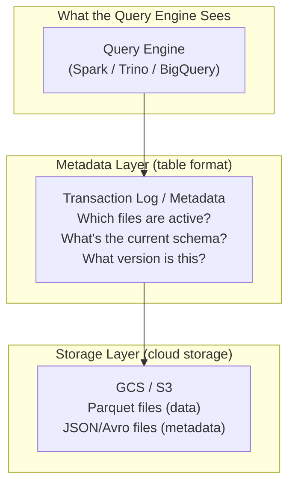
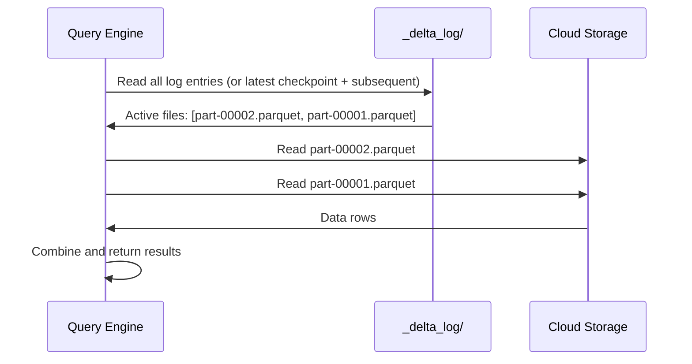
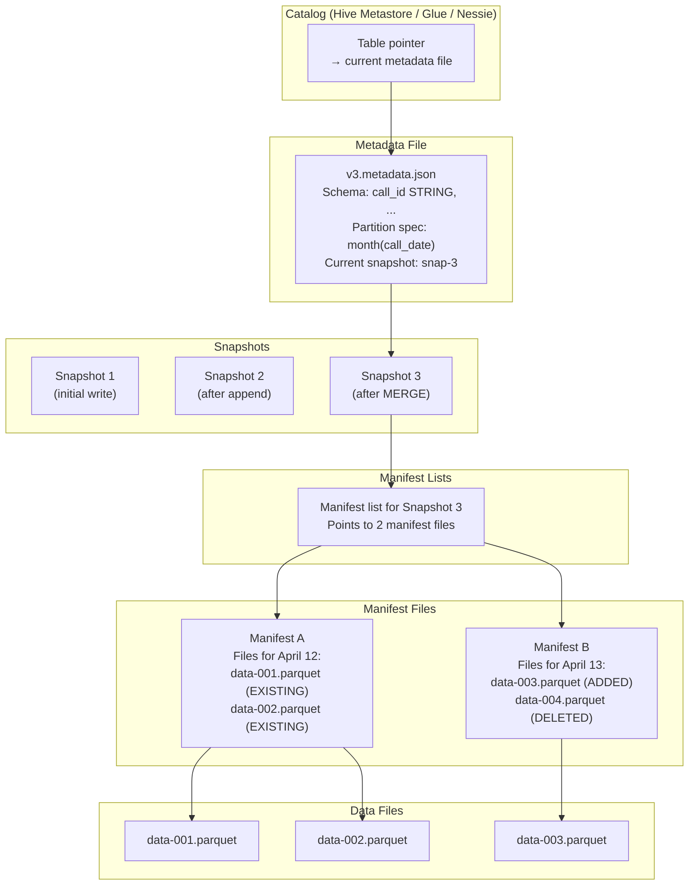
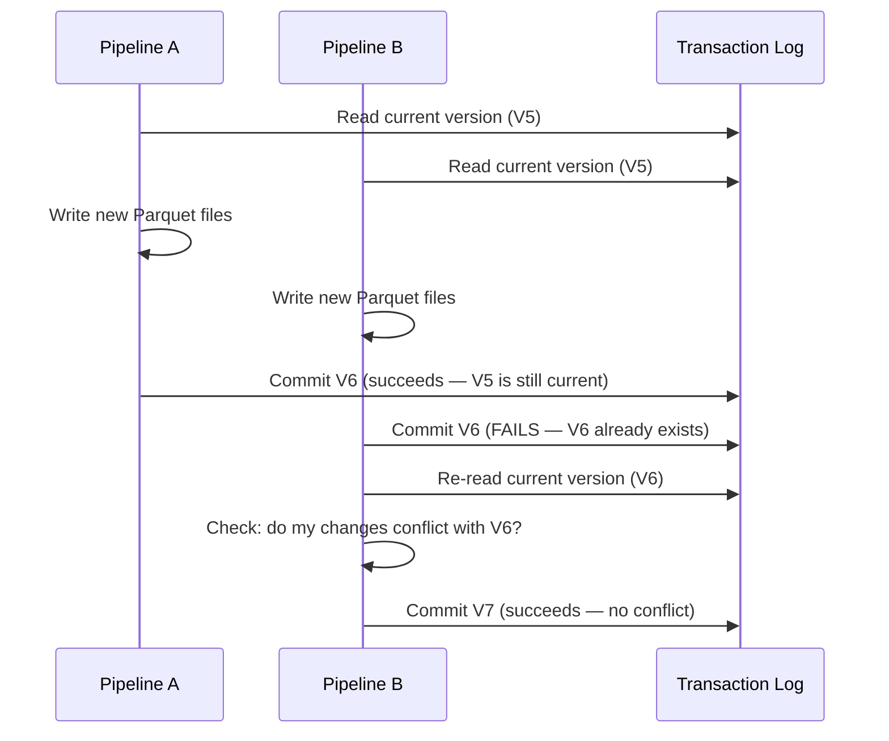

# Lakehouse Formats - How It Works

**Inside the transaction log. How Delta Lake and Iceberg track every change, ensure ACID, and enable time travel — without a database server.**

---

## The Core Idea

Table formats don't replace the data files. They add a **metadata layer** on top. The data is still Parquet files in cloud storage. The metadata tracks which files are "current," which are "old," and what happened at each commit.



The query engine never reads "all files in the folder." It reads the metadata first, gets a list of active files, and reads only those. This is what makes time travel possible — old files aren't deleted, they're just removed from the "active" list.

---

## Delta Lake Internals

### The Transaction Log (`_delta_log/`)

Every Delta table has a `_delta_log/` directory containing numbered JSON files. Each file represents one commit.

**Commit 0** (initial write):

```json
{
    "commitInfo": {
        "operation": "WRITE",
        "timestamp": 1713013200000,
        "operationMetrics": {"numFiles": 2, "numOutputRows": 500}
    }
}
{
    "add": {
        "path": "part-00000-abc123.parquet",
        "size": 45231,
        "partitionValues": {"call_date": "2026-04-13"},
        "stats": "{\"numRecords\":250,\"minValues\":{\"call_id\":\"C-001\"},\"maxValues\":{\"call_id\":\"C-250\"}}"
    }
}
{
    "add": {
        "path": "part-00001-def456.parquet",
        "size": 44820,
        "partitionValues": {"call_date": "2026-04-13"},
        "stats": "{\"numRecords\":250,\"minValues\":{\"call_id\":\"C-251\"},\"maxValues\":{\"call_id\":\"C-500\"}}"
    }
}
```

**Commit 1** (MERGE — update 1 record):

```json
{
    "commitInfo": {
        "operation": "MERGE",
        "timestamp": 1713016800000,
        "operationMetrics": {"numTargetRowsUpdated": 1}
    }
}
{
    "remove": {
        "path": "part-00000-abc123.parquet",
        "deletionTimestamp": 1713016800000
    }
}
{
    "add": {
        "path": "part-00002-ghi789.parquet",
        "size": 45300,
        "partitionValues": {"call_date": "2026-04-13"}
    }
}
```

**What happened:** The MERGE updated one record in `part-00000`. Since Parquet files are immutable (you can't edit a row inside a Parquet file), Delta wrote a NEW file (`part-00002`) with the updated data and marked the OLD file (`part-00000`) as "removed."

The old file still exists on disk. It's just no longer in the "active" file list. This is why time travel works — Version 0 reads `part-00000` + `part-00001`. Version 1 reads `part-00002` + `part-00001`.

### How a Read Works



### Checkpoint Files

Reading every JSON log file from the beginning gets slow as commits accumulate. Every 10 commits (configurable), Delta writes a **checkpoint file** — a Parquet file that contains the complete state (all active files) at that point.

After 100 commits, instead of reading 100 JSON files, the reader reads:
1. The latest checkpoint (commit 90, one Parquet file)
2. The 10 JSON files after the checkpoint (commits 91-100)

This keeps read performance constant regardless of how many commits exist.

---

## Iceberg Internals

### The Metadata Hierarchy

Iceberg uses a tree structure instead of a flat log:



### Why the Tree?

| Delta Lake (flat log) | Iceberg (tree hierarchy) |
|---|---|
| Read all log entries sequentially | Navigate the tree to relevant branches only |
| Checkpoint files help but are periodic | Every read starts from metadata file (always current) |
| Stats per file stored in log entries | Stats per file stored in manifest files |
| Good for small-to-medium tables | Better for very large tables (millions of files) |

For a table with 100,000 partitions, Delta must read the full log (or checkpoint) to find the right files. Iceberg can skip manifest files for irrelevant partitions — it only reads the manifests that contain the partitions it needs.

### How Hidden Partitioning Works

Traditional (Hive-style):
```
gs://bucket/calls/year=2026/month=04/day=13/data.parquet
```
The directory structure IS the partition. Changing the partition strategy requires rewriting all files into new directories.

Iceberg:
```
gs://bucket/calls/data-00001.parquet
gs://bucket/calls/data-00002.parquet
```
The partition information is in the manifest file metadata, not the directory structure. The file `data-00001.parquet` contains rows for April 2026, but it doesn't need to live in a `year=2026/month=04/` directory. The manifest says which partitions each file belongs to.

**Why this matters:** You can change the partition strategy (e.g., from monthly to daily) without touching existing data files. New files use the new strategy. Old files are read using the old strategy. The query engine handles it transparently.

---

## Concurrent Writes: Optimistic Concurrency

Both Delta Lake and Iceberg use **optimistic concurrency control** for concurrent writes.



**How conflicts are resolved:**
- If both writers modified different partitions → no conflict → both succeed
- If both writers modified the same partition → conflict → second writer retries with the merged state
- If retry also conflicts → operation fails → pipeline surfaces an error

**Practical impact:** Partition your tables well. If Pipeline A writes `call_date=2026-04-12` and Pipeline B writes `call_date=2026-04-13`, they never conflict because they touch different partitions.

---

## Quick Links

| Chapter | Topic |
|---|---|
| [03 - Hello World](03_Hello_World.md) | Hands-on Delta Lake basics |
| [04 - How It Works](04_How_It_Works.md) | This page |
| [05 - Building It](05_Building_It.md) | Full pipeline with Delta Lake |
| [06 - Production Patterns](06_Production_Patterns.md) | Compaction, Z-ORDER, concurrent writes |
