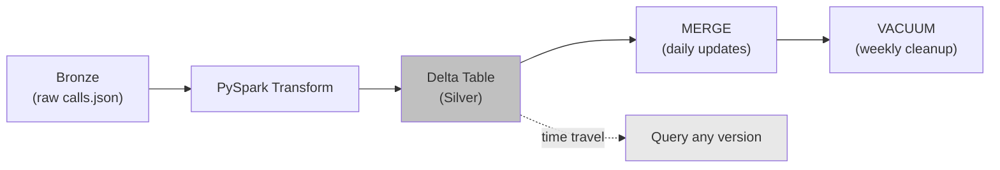
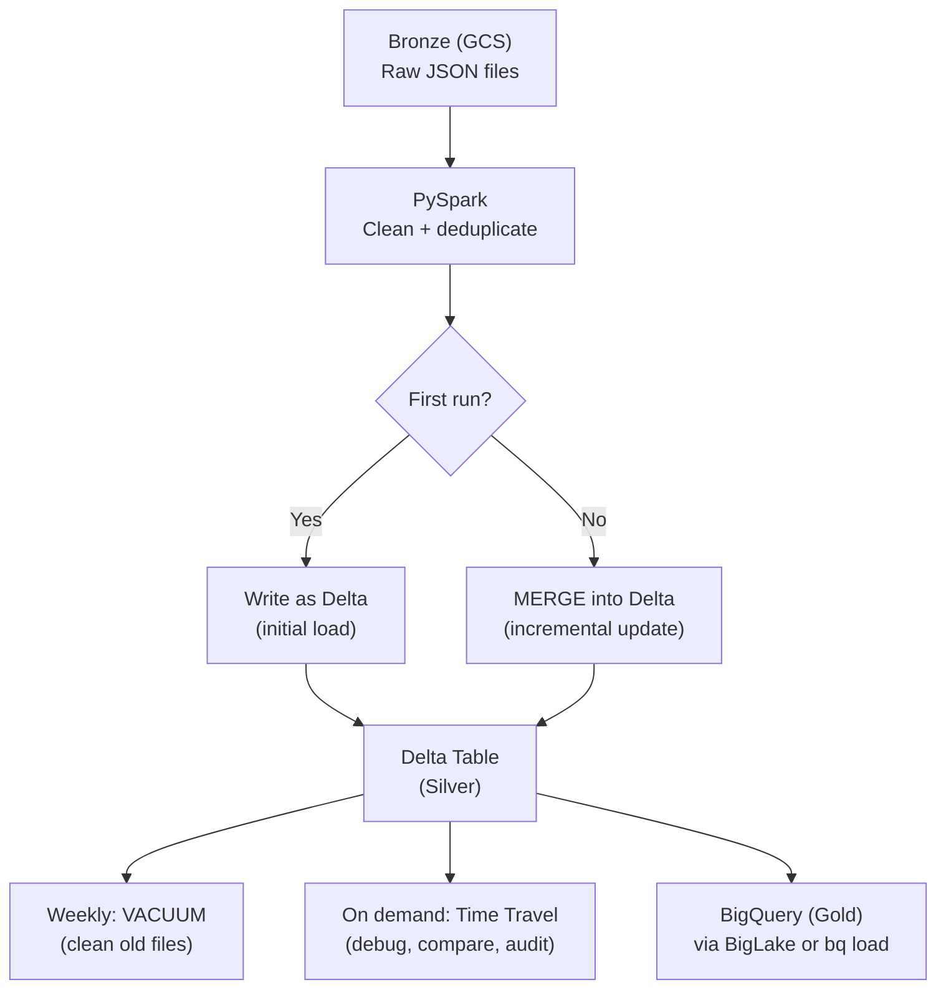

# Lakehouse Formats - Building It

**Build a Delta Lake pipeline for the call center dataset. MERGE, time travel, VACUUM, and schema evolution — step by step.**

---

## What We're Building

A pipeline that:
1. Writes call data as a Delta table (initial load)
2. Runs a MERGE to handle updated calls (upsert)
3. Uses time travel to compare before and after
4. Runs VACUUM to clean up old files
5. Handles schema evolution when the source adds a column



---

## Step 1: Initial Load — Write Calls as Delta

```python
from pyspark.sql import SparkSession
from pyspark.sql import functions as F
from delta import configure_spark_with_delta_pip
from delta.tables import DeltaTable

builder = (
    SparkSession.builder
    .appName("calls-delta-pipeline")
    .config("spark.sql.extensions", "io.delta.sql.DeltaSparkSessionExtension")
    .config("spark.sql.catalog.spark_catalog", "org.apache.spark.sql.delta.catalog.DeltaCatalog")
)
spark = configure_spark_with_delta_pip(builder).getOrCreate()

# Read raw calls from Bronze (GCS or local)
BRONZE_PATH = "gs://your-bucket/bronze/calls/"  # or local path
DELTA_PATH = "gs://your-bucket/silver/calls_delta/"

raw_df = spark.read.json(BRONZE_PATH)

# Transform: clean and type-cast
silver_df = (
    raw_df
    .withColumn("call_date", F.to_date("created_at"))
    .withColumn("duration", F.col("duration").cast("int"))
    .withColumn("ingested_at", F.current_timestamp())
    # Deduplicate on call_id (keep latest)
    .dropDuplicates(["call_id"])
)

# Write as Delta, partitioned by call_date
silver_df.write \
    .format("delta") \
    .partitionBy("call_date") \
    .mode("overwrite") \
    .save(DELTA_PATH)

print(f"Initial load: {silver_df.count()} records written as Delta")
```

**You Should See:** A Delta table with Parquet files organized by `call_date` partitions and a `_delta_log/` directory.

---

## Step 2: Daily MERGE — Handle Updates

Calls change state: "in-progress" becomes "resolved," duration increases, agents get reassigned. The daily pipeline brings in all changes since the last run and MERGEs them.

```python
# Read today's incoming changes (incremental from Bronze)
incoming_df = (
    spark.read.json(BRONZE_PATH)
    .filter(F.col("updated_at") > F.lit("2026-04-12"))  # watermark
    .withColumn("call_date", F.to_date("created_at"))
    .withColumn("duration", F.col("duration").cast("int"))
    .withColumn("ingested_at", F.current_timestamp())
    .dropDuplicates(["call_id"])
)

# Load the Delta table
delta_table = DeltaTable.forPath(spark, DELTA_PATH)

# MERGE: update existing calls, insert new ones
(
    delta_table.alias("target")
    .merge(
        incoming_df.alias("source"),
        "target.call_id = source.call_id AND target.call_date = source.call_date"
    )
    # WHY: Only update if the incoming record is NEWER than what we have.
    # This prevents out-of-order events from overwriting current data.
    .whenMatchedUpdate(
        condition="source.updated_at > target.updated_at",
        set={
            "status": "source.status",
            "duration": "source.duration",
            "agent_id": "source.agent_id",
            "updated_at": "source.updated_at",
            "ingested_at": "source.ingested_at",
        }
    )
    .whenNotMatchedInsertAll()
    .execute()
)

print("MERGE complete")
```

### Why `target.call_date = source.call_date` in the MERGE condition?

This is **partition pruning**. Without it, Spark scans every partition in the Delta table to find matching `call_id` values. With it, Spark only scans the partition that matches the call's date.

| Without partition pruning | With partition pruning |
|---|---|
| Scans all 365 date partitions | Scans only the 1-2 partitions with matching dates |
| Reads millions of rows | Reads thousands of rows |
| Takes minutes | Takes seconds |

---

## Step 3: Time Travel — Compare Before and After

After the MERGE, verify what changed:

```python
# How many versions exist?
delta_table = DeltaTable.forPath(spark, DELTA_PATH)
history = delta_table.history()
history.select("version", "timestamp", "operation", "operationMetrics").show(truncate=False)

# Read the version BEFORE the MERGE
latest_version = history.select("version").first()[0]
previous_version = latest_version - 1

before_df = spark.read.format("delta").option("versionAsOf", previous_version).load(DELTA_PATH)
after_df = spark.read.format("delta").load(DELTA_PATH)

# Find records that changed
changed = (
    before_df.alias("before")
    .join(after_df.alias("after"), "call_id")
    .filter("before.status != after.status OR before.duration != after.duration")
    .select(
        "call_id",
        F.col("before.status").alias("old_status"),
        F.col("after.status").alias("new_status"),
        F.col("before.duration").alias("old_duration"),
        F.col("after.duration").alias("new_duration"),
    )
)

print(f"Records changed in this MERGE:")
changed.show()
```

**You Should See:** A list of calls whose status or duration changed between the two versions.

---

## Step 4: VACUUM — Clean Up Old Files

Every MERGE creates new Parquet files and marks old ones as "removed." But the old files still sit in storage — that's what enables time travel. Over time, this accumulates.

VACUUM deletes files that are no longer referenced by any version within the retention window.

```python
# Check current table size
detail = spark.sql(f"DESCRIBE DETAIL delta.`{DELTA_PATH}`")
detail.select("numFiles", "sizeInBytes").show()

# VACUUM: remove files older than 7 days (default retention)
# WHY 7 days: gives you a week to discover issues and time-travel back.
# Shorter retention saves storage. Longer retention gives more safety.
delta_table.vacuum(retentionHours=168)  # 168 hours = 7 days

print("VACUUM complete. Old files removed.")
```

**Critical warning:** After VACUUM, you can no longer time-travel to versions older than the retention period. Those Parquet files are gone.

```python
# This will FAIL after VACUUM if version 0 is older than 7 days:
# spark.read.format("delta").option("versionAsOf", 0).load(DELTA_PATH)
# FileNotFoundException: part-00000-abc123.parquet does not exist
```

### VACUUM Decision

| Retention | Storage Cost | Time Travel Window | Best For |
|---|---|---|---|
| 1 day | Lowest | Very short — risky | Cost-sensitive, non-critical data |
| 7 days (default) | Moderate | Comfortable recovery window | Most production tables |
| 30 days | Higher | Full month of history | Regulated/compliance data |
| Never VACUUM | Highest | Unlimited time travel | Audit tables, legal hold |

---

## Step 5: Schema Evolution — Source Adds a Column

One day, the source system starts sending a new field: `agent_language`. Your pipeline needs to handle it without breaking.

```python
# Incoming data now has a new column: agent_language
new_data = spark.createDataFrame([
    {"call_id": "C-999", "customer_id": "CUST-500", "status": "resolved",
     "duration": 200, "agent_language": "Spanish",
     "created_at": "2026-04-14T10:00:00", "updated_at": "2026-04-14T10:03:20"}
])

# Without mergeSchema, this would FAIL because the Delta table
# doesn't have an agent_language column.

# Option A: Schema enforcement (strict — rejects the write)
# This is the DEFAULT behavior. Protects against accidental schema changes.
# new_data.write.format("delta").mode("append").save(DELTA_PATH)
# --> AnalysisException: schema mismatch

# Option B: Schema evolution (flexible — adds the new column)
new_data.write \
    .format("delta") \
    .option("mergeSchema", "true") \
    .mode("append") \
    .save(DELTA_PATH)

# Verify: the table now has agent_language
spark.read.format("delta").load(DELTA_PATH).printSchema()
```

**You Should See:** The schema now includes `agent_language`. Older records have `null` for this column (it didn't exist when they were written). New records have the value.

### Schema Evolution Strategies

| Strategy | Config | When to Use |
|---|---|---|
| **Enforce (reject)** | Default — no option needed | Production tables where schema changes need review |
| **Evolve (add columns)** | `mergeSchema = true` | Tables where source adds columns regularly |
| **Overwrite schema** | `overwriteSchema = true` | Complete schema replacement (rare, destructive) |

**Recommendation:** Use enforcement (default) for production. Use evolution only for columns you've validated upstream. Never use schema overwrite in automated pipelines.

---

## The Complete Pipeline



---

## Quick Links

| Chapter | Topic |
|---|---|
| [04 - How It Works](04_How_It_Works.md) | Transaction logs and metadata internals |
| [05 - Building It](05_Building_It.md) | This page |
| [06 - Production Patterns](06_Production_Patterns.md) | Compaction, Z-ORDER, concurrent writes |
| [07 - System Design](07_System_Design.md) | Lakehouse architecture on GCP and AWS |
