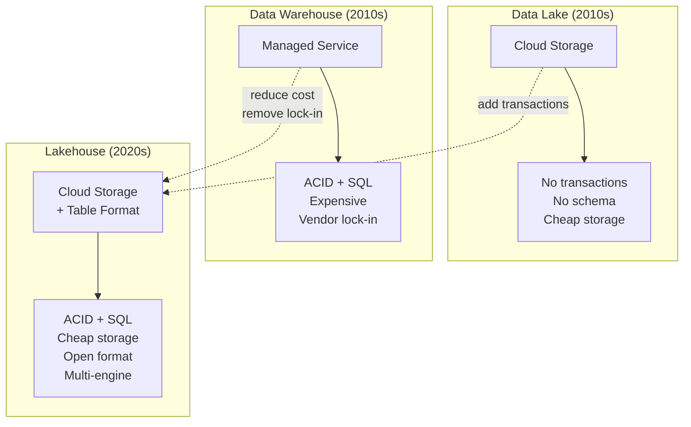
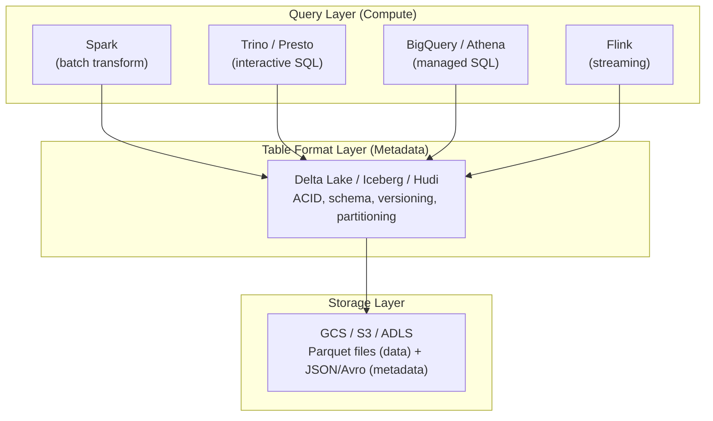
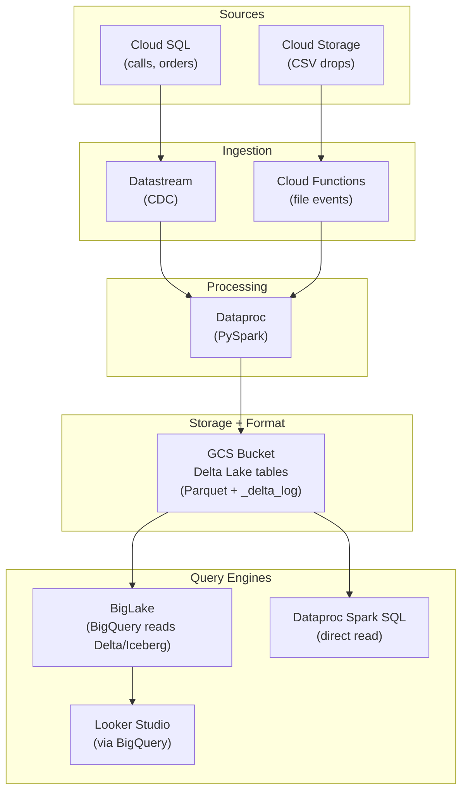
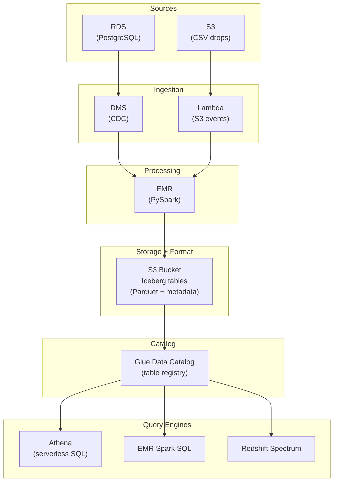

# Lakehouse Formats - System Design

**Lakehouse architecture on GCP and AWS. How storage, table formats, and query engines connect. The open table format movement.**

---

## The Lakehouse Idea

A lakehouse combines the best of data lakes and data warehouses:

| Property | Data Lake | Data Warehouse | Lakehouse |
|---|---|---|---|
| **Storage cost** | Low (GCS/S3) | High (BigQuery/Redshift) | Low (GCS/S3) |
| **ACID transactions** | No | Yes | Yes (via table format) |
| **Open format** | Yes (Parquet, JSON) | No (proprietary) | Yes (Parquet + metadata) |
| **Multi-engine** | Yes (Spark, Trino, etc.) | No (one engine only) | Yes |
| **SQL support** | Limited | Full | Full (via query engine) |
| **Schema enforcement** | No | Yes | Yes (via table format) |
| **Time travel** | No | Limited (7 days in BigQuery) | Configurable (weeks/months) |



---

## The Three-Layer Architecture

Every lakehouse has three distinct layers:



**The key insight:** Each layer is independent. You can swap the query engine without changing the storage or table format. You can switch from Delta Lake to Iceberg without changing how you store Parquet files.

---

## GCP Lakehouse Architecture



### GCP Service Roles

| Layer | Service | Role |
|---|---|---|
| **Storage** | GCS | Stores Parquet data files and Delta/Iceberg metadata |
| **Format** | Delta Lake or Iceberg | Adds ACID, versioning, schema enforcement on GCS files |
| **Processing** | Dataproc | Runs PySpark jobs that read/write Delta tables |
| **Serving** | BigLake | Lets BigQuery query Delta/Iceberg tables in GCS directly |
| **Orchestration** | Cloud Composer | Schedules pipeline: ingest → transform → OPTIMIZE → VACUUM |

### BigLake: Bridge Between GCS and BigQuery

BigLake lets BigQuery read Delta Lake and Iceberg tables stored in GCS without copying data into BigQuery storage:

```sql
-- Create a BigLake table pointing to Delta Lake on GCS
CREATE EXTERNAL TABLE gold.calls
WITH CONNECTION `projects/my-project/locations/us/connections/biglake-conn`
OPTIONS (
    format = 'DELTA_LAKE',
    uris = ['gs://my-bucket/silver/calls_delta/']
);

-- Query it with standard SQL
SELECT campaign_id, COUNT(*) AS total_calls
FROM gold.calls
WHERE call_date = '2026-04-13'
GROUP BY campaign_id;
```

**Benefit:** GCS storage pricing ($0.02/GB/month) instead of BigQuery storage pricing ($0.02/GB/month active, but $0.01/GB long-term). For large tables, this can be significant.

**Tradeoff:** Query performance may be slightly slower than native BigQuery tables because BigQuery reads from GCS instead of its internal storage. For most workloads, the difference is negligible.

---

## AWS Lakehouse Architecture



### AWS Service Roles

| Layer | Service | Role |
|---|---|---|
| **Storage** | S3 | Stores data and metadata files |
| **Format** | Iceberg (preferred on AWS) | ACID, versioning, schema enforcement |
| **Catalog** | Glue Data Catalog | Central registry of all tables (replaces Hive Metastore) |
| **Processing** | EMR | Runs PySpark jobs |
| **Serving** | Athena | Serverless SQL queries on Iceberg tables in S3 |
| **Alternative serving** | Redshift Spectrum | Redshift queries data in S3 without loading it |

**Why Iceberg on AWS?** AWS has invested heavily in Iceberg support. Athena, EMR, Glue, and Redshift all support Iceberg natively. Snowflake also supports Iceberg tables on S3.

---

## Databricks Lakehouse

Databricks is the company behind Delta Lake. Their platform is the most integrated lakehouse offering:

| Component | Databricks |
|---|---|
| **Storage** | Cloud storage (GCS/S3/ADLS) — customer's account |
| **Format** | Delta Lake (default) |
| **Catalog** | Unity Catalog (centralized governance) |
| **Processing** | Managed Spark clusters |
| **SQL** | Databricks SQL (serverless warehouse) |
| **Orchestration** | Databricks Workflows |

**Benefit:** Everything is pre-integrated. Delta Lake, Spark, SQL, and governance work together without configuration.

**Tradeoff:** Higher cost than assembling your own stack. Vendor dependency on Databricks (though Delta Lake itself is open source).

---

## Choosing Your Architecture

| If Your Situation Is | Recommended Architecture |
|---|---|
| Already on BigQuery, no multi-engine needs | BigQuery native (skip table formats) |
| BigQuery + Spark (Dataproc) processing | GCS + Delta Lake + BigLake |
| AWS, serverless analytics | S3 + Iceberg + Athena |
| Multi-cloud or multi-engine | GCS/S3 + Iceberg (widest engine support) |
| Databricks customer | Delta Lake + Unity Catalog |
| Streaming-heavy workloads | Delta Lake (Structured Streaming) or Hudi (MOR) |

---

## Quick Links

| Chapter | Topic |
|---|---|
| [06 - Production Patterns](06_Production_Patterns.md) | Compaction, Z-ORDER, concurrent writes |
| [07 - System Design](07_System_Design.md) | This page |
| [08 - Quality Security Governance](08_Quality_Security_Governance.md) | Schema enforcement, data retention, GDPR |
| [09 - Observability Troubleshooting](09_Observability_Troubleshooting.md) | Debugging Delta/Iceberg issues |
