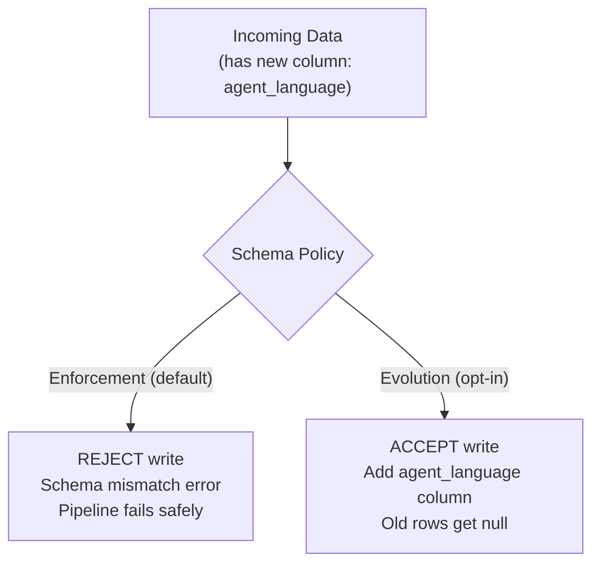
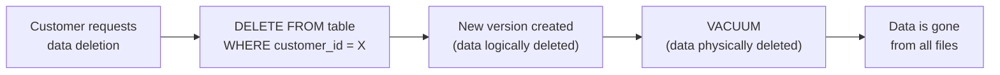

# Lakehouse Formats - Quality, Security, Governance

**Schema enforcement, data retention policies, column-level security, audit history, and GDPR compliance with table formats.**

---

## Schema Enforcement vs Schema Evolution

Table formats give you a choice: strict or flexible.



### When to Use Each

| Policy | Config | Use When |
|---|---|---|
| **Enforcement** | Default (no config needed) | Production tables where schema changes need review |
| **Evolution** | `mergeSchema = true` | Staging/Bronze tables where new columns are expected |
| **Overwrite** | `overwriteSchema = true` | One-time migration (dangerous — replaces entire schema) |

### Delta Lake Schema Enforcement in Action

```python
# This FAILS (enforcement is default):
# new_data has column "agent_language" that doesn't exist in the Delta table
new_data.write.format("delta").mode("append").save(DELTA_PATH)
# AnalysisException: A schema mismatch detected when writing to the Delta table.
# To enable schema migration, set 'mergeSchema' = 'true'

# This SUCCEEDS (evolution enabled):
new_data.write \
    .format("delta") \
    .option("mergeSchema", "true") \
    .mode("append") \
    .save(DELTA_PATH)
```

### Iceberg Schema Evolution

Iceberg supports richer schema evolution than Delta Lake:

```sql
-- Add a column
ALTER TABLE calls ADD COLUMN agent_language STRING;

-- Rename a column (Delta Lake cannot do this)
ALTER TABLE calls RENAME COLUMN agent_language TO language;

-- Drop a column (Delta Lake cannot do this)
ALTER TABLE calls DROP COLUMN language;

-- Reorder columns (Delta Lake cannot do this)
ALTER TABLE calls ALTER COLUMN duration AFTER status;
```

| Operation | Delta Lake | Iceberg | Hudi |
|---|---|---|---|
| Add column | Yes | Yes | Yes |
| Rename column | No | Yes | No |
| Drop column | No | Yes | No |
| Reorder columns | No | Yes | No |
| Change type (widen) | Yes (e.g., INT → LONG) | Yes | Yes |

---

## Data Retention Policies

Table formats keep old versions for time travel. But storage isn't free. You need a retention policy.

### VACUUM Policy

```python
# Default retention: 7 days
# Files older than 7 days and no longer referenced → deleted
delta_table.vacuum(retentionHours=168)  # 168 hours = 7 days

# Aggressive: 1 day (saves storage, short time travel window)
delta_table.vacuum(retentionHours=24)

# Conservative: 30 days (compliance, audit needs)
delta_table.vacuum(retentionHours=720)
```

### Automated VACUUM Schedule

```python
# In your Airflow DAG or Cloud Composer:
# Run VACUUM every Sunday at 3 AM

# dag_definition.py
vacuum_task = PythonOperator(
    task_id="vacuum_calls_table",
    python_callable=run_vacuum,
    op_kwargs={
        "table_path": DELTA_PATH,
        "retention_hours": 168,
    },
    dag=dag,
)
```

### Retention by Data Classification

| Data Type | Retention | VACUUM Schedule | Reason |
|---|---|---|---|
| Operational data (calls, orders) | 7 days | Weekly | Balance storage vs recovery needs |
| Financial data | 30+ days | Monthly | Regulatory — need audit trail |
| PII-containing tables | Minimum viable | As soon as possible | Less PII in old files = less risk |
| Audit/compliance tables | Never VACUUM | Never | Legal hold — preserve all versions |

---

## Column-Level Security

Not all columns should be visible to all users. PII columns (phone numbers, email addresses) should be restricted.

### BigQuery Column-Level Security (with BigLake)

```sql
-- Create a policy tag for PII
-- (done once in the Data Catalog UI or via API)

-- Apply the tag to specific columns
ALTER TABLE gold.calls
ALTER COLUMN phone_number SET POLICY TAG 'projects/my-project/locations/us/taxonomies/pii/policyTags/restricted';

-- Now: users without the "PII Reader" role see an error when querying phone_number
SELECT phone_number FROM gold.calls;
-- Error: Access Denied: User does not have permission to access column phone_number
```

### Delta Lake Column Masking (via Views)

Delta Lake doesn't have built-in column-level security. Use views:

```sql
-- Create a masked view for analysts
CREATE VIEW silver.calls_masked AS
SELECT
    call_id,
    status,
    duration,
    campaign_id,
    call_date,
    -- Mask PII
    SHA2(customer_id, 256) AS customer_id_hash,
    CONCAT('XXX-XXX-', RIGHT(phone_number, 4)) AS phone_masked,
    created_at,
    updated_at
FROM silver.calls;

-- Grant analysts access to the VIEW, not the TABLE
-- GRANT SELECT ON silver.calls_masked TO ROLE analyst;
```

---

## Audit History

Every table format tracks changes. This is your audit trail.

### Delta Lake: DESCRIBE HISTORY

```python
delta_table = DeltaTable.forPath(spark, DELTA_PATH)
history = delta_table.history()

history.select(
    "version", "timestamp", "operation", "userName", 
    "operationMetrics"
).show(truncate=False)
```

**Output:**

```
+-------+-------------------+---------+-----------+--------------------------------------------+
|version|timestamp          |operation|userName   |operationMetrics                            |
+-------+-------------------+---------+-----------+--------------------------------------------+
|5      |2026-04-13 03:00:00|VACUUM   |pipeline-sa|{numDeletedFiles: 23, numVacuumedDirs: 5}   |
|4      |2026-04-13 02:00:00|OPTIMIZE |pipeline-sa|{numCompactedFiles: 45, numOutputFiles: 5}   |
|3      |2026-04-13 01:00:00|MERGE    |pipeline-sa|{numTargetRowsUpdated: 12, numOutputRows: 500}|
|2      |2026-04-12 01:00:00|MERGE    |pipeline-sa|{numTargetRowsUpdated: 8, numOutputRows: 495} |
|1      |2026-04-11 01:00:00|MERGE    |pipeline-sa|{numTargetRowsUpdated: 15, numOutputRows: 488}|
|0      |2026-04-10 00:00:00|WRITE    |pipeline-sa|{numFiles: 3, numOutputRows: 480}            |
+-------+-------------------+---------+-----------+--------------------------------------------+
```

### Iceberg: Snapshot Log

```sql
-- View all snapshots (Iceberg)
SELECT * FROM calls.snapshots;

-- View metadata log
SELECT * FROM calls.metadata_log_entries;
```

---

## GDPR: Right to Delete

The General Data Protection Regulation (GDPR) requires that you can delete a specific person's data upon request. With table formats, this is a two-step process:



### Step 1: Logical Delete

```python
# Delta Lake
delta_table = DeltaTable.forPath(spark, DELTA_PATH)
delta_table.delete("customer_id = 'CUST-100'")

# This creates a new version of the table WITHOUT the customer's records.
# But the old Parquet files containing the customer's data still exist on disk.
```

### Step 2: Physical Delete (VACUUM)

```python
# Remove old files — this physically deletes the customer's data
delta_table.vacuum(retentionHours=0)  # 0 = delete immediately

# WARNING: retentionHours=0 disables time travel for ALL old versions.
# In practice, run VACUUM with a short retention (24 hours) for GDPR,
# not 0, so you have a safety window.
```

### The Tradeoff

| Approach | Retention | GDPR Compliance | Recovery |
|---|---|---|---|
| VACUUM with 0 hours | Immediate physical deletion | Fully compliant | No recovery possible |
| VACUUM with 24 hours | Deleted within 1 day | Compliant (reasonable timeframe) | 24-hour recovery window |
| VACUUM with 7 days | Deleted within 1 week | May not satisfy auditors | Full week recovery |

**Recommendation:** Run a targeted VACUUM with 24-hour retention after GDPR deletion requests. Keep normal VACUUM at 7 days for operational safety.

---

## Quick Links

| Chapter | Topic |
|---|---|
| [07 - System Design](07_System_Design.md) | Lakehouse architecture |
| [08 - Quality Security Governance](08_Quality_Security_Governance.md) | This page |
| [09 - Observability Troubleshooting](09_Observability_Troubleshooting.md) | Debugging Delta/Iceberg issues |
| [10 - Decision Guide](10_Decision_Guide.md) | Delta vs Iceberg vs Hudi |
