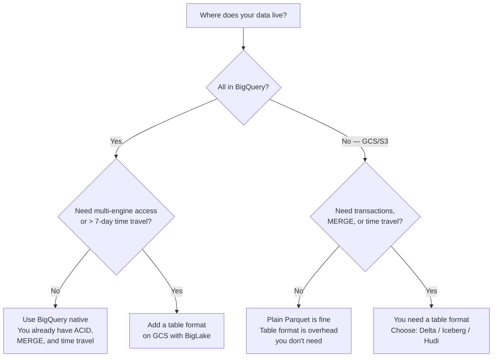
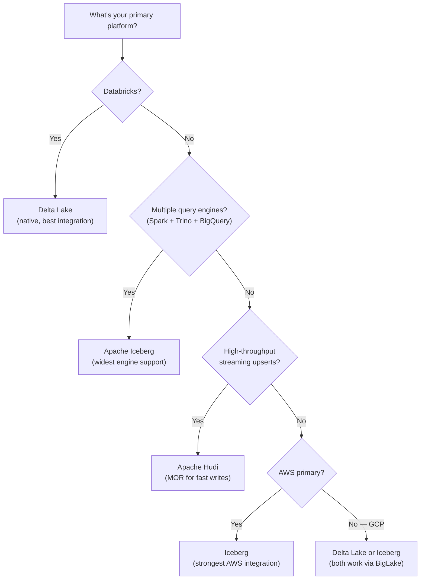

# Lakehouse Formats - Decision Guide

**Delta Lake vs Iceberg vs Hudi. When to use a table format vs BigQuery native. A decision tree for real-world situations.**

---

## The First Decision: Do You Even Need a Table Format?

Before choosing between Delta, Iceberg, and Hudi, ask whether you need a table format at all.

**Most data teams on GCP:** If everything runs through BigQuery and you don't process data with Spark, **BigQuery native is sufficient.** Don't add complexity you don't need.

**When a table format becomes necessary:**
- You process data in Spark (Dataproc/EMR) and serve it through BigQuery/Athena
- You need time travel beyond 7 days (BigQuery's limit)
- You want open format data (avoid vendor lock-in)
- Multiple query engines need to read the same data (Spark + Trino + BigQuery)

---

## The Second Decision: Which Format?

### Decision Matrix

| Factor | Delta Lake | Apache Iceberg | Apache Hudi |
|---|---|---|---|
| **Best for** | General-purpose lakehouse | Multi-engine analytics | Streaming upserts |
| **Pick if** | You use Databricks OR want the largest community | You need the widest engine support OR use Snowflake | You need high-throughput streaming upserts |
| **Community** | Largest | Growing fastest | Moderate |
| **Engine support** | Spark (best), Trino, Flink | Spark, Trino, Flink, Presto, Dremio, Snowflake, BigQuery, Athena | Spark, Flink, Presto |
| **Schema evolution** | Add columns only | Add, rename, drop, reorder columns | Add columns only |
| **Partition evolution** | No (must rewrite) | Yes (change without rewrite) | No (must rewrite) |
| **Hidden partitioning** | No | Yes | No |
| **Streaming support** | Good (Structured Streaming) | Growing (Flink) | Best (native streaming) |
| **Tooling maturity** | Most mature | Maturing fast | Mature for its niche |
| **GCP support** | BigLake reads Delta tables | BigLake reads Iceberg tables | Limited |
| **AWS support** | EMR, Glue | Athena, EMR, Glue, Redshift (strongest) | EMR, Athena |
| **Databricks support** | Native (they created it) | Supported via UniForm | Supported |

### Decision Flowchart

---

## The Simple Answer

For most teams making this decision for the first time:

**Delta Lake** if:
- You're on Databricks
- You use Spark as your primary processing engine
- You want the largest community and most tutorials/documentation
- You're building your first lakehouse and want the most established option

**Iceberg** if:
- You're on AWS (strongest native support)
- You need multiple engines to read the same data
- You need partition evolution (table partitioning will change over time)
- You're on Snowflake (Iceberg Tables are native)

**Hudi** if:
- You have high-volume streaming data with frequent updates
- You're on AWS EMR
- You need Merge-on-Read (fast writes, acceptable read overhead)

**BigQuery native** if:
- You're on GCP and everything runs through BigQuery
- You don't need multi-engine access
- 7-day time travel is sufficient
- You want simplicity over flexibility

---

## The Convergence Trend

The three formats are converging. Features that were unique to one format are being adopted by others:

| Feature | Originally Unique To | Now Available In |
|---|---|---|
| Hidden partitioning | Iceberg | Delta Lake (coming via UniForm) |
| Column rename/drop | Iceberg | Delta Lake 3.0+ (limited) |
| Merge-on-Read | Hudi | Delta Lake (deletion vectors) |
| Multi-engine | Iceberg | Delta Lake (via UniForm compatibility) |

**Delta UniForm** (Universal Format) allows Delta tables to be read as Iceberg tables, reducing the format lock-in concern. Databricks announced this to address the "which format?" question — the answer may soon be "it doesn't matter, they're interoperable."

---

## For Your Call Center Pipeline

Given the current architecture (GCP, BigQuery, Dataproc, call center data):

| Option | Recommendation |
|---|---|
| **Today** | BigQuery native. You have MERGE, time travel (7 days), and ACID. No table format needed yet. |
| **If you add Spark processing** | Delta Lake on GCS + BigLake. Well-supported on GCP, large community, straightforward to learn. |
| **If you need multi-engine** | Iceberg on GCS + BigLake. Widest engine compatibility if you add Trino or other engines later. |
| **If you move to AWS** | Iceberg on S3 + Athena. Best native AWS integration. |

**The honest answer:** For a junior data engineer at a call center building batch pipelines on GCP, BigQuery native covers everything you need right now. Learn Delta Lake conceptually — know what it does, why it exists, how MERGE/time travel/VACUUM work. When the day comes that BigQuery native isn't enough, you'll know exactly what to reach for.

---

## Quick Links

| Chapter | Topic |
|---|---|
| [09 - Observability Troubleshooting](09_Observability_Troubleshooting.md) | Debugging Delta/Iceberg issues |
| [10 - Decision Guide](10_Decision_Guide.md) | This page |
| [01 - Why](01_Why.md) | Back to the beginning |
| [02 - Concepts](02_Concepts.md) | Delta, Iceberg, Hudi concepts |
