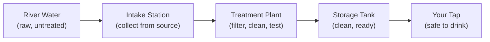
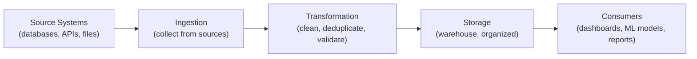
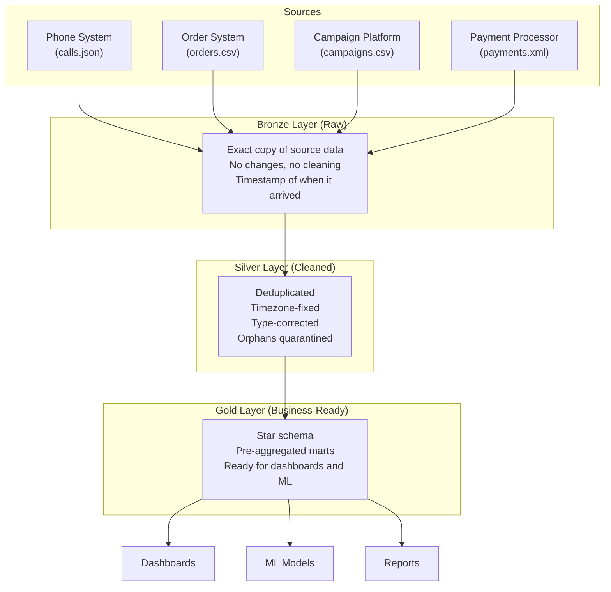
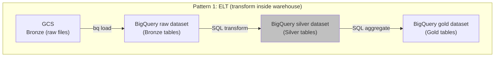
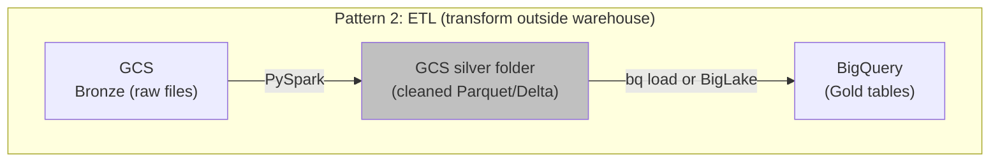
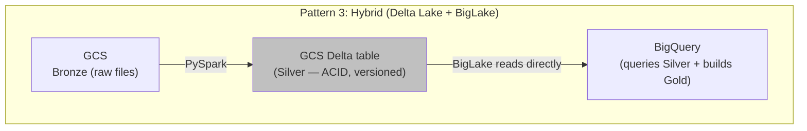
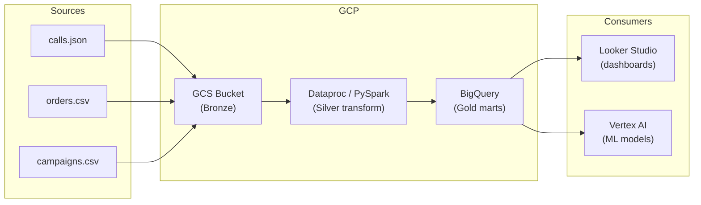

# Cloud Data Pipelines - Why They Matter

**Why data doesn't just "appear" in a dashboard, and why the path it takes determines whether you can trust it.**

> These concepts apply to any cloud (GCP, AWS, Azure). Examples use GCP as the primary, with AWS equivalents noted. The hands-on notebooks are cloud-specific: [GCP Pipeline](../../../../implementation/notebooks/GCP_Full_Pipeline.ipynb) | AWS Pipeline (coming soon).

---

## The 3 AM Call

A VP of Operations looks at the morning dashboard. Total orders yesterday: 12,847. But Finance says their system shows 13,201. The warehouse shipped based on a third number. Three systems, three different answers, and a meeting in 2 hours where someone has to explain which one is right.

Nobody can. Because nobody knows where each number came from, what transformations it went through, or when it was last updated.

This is what happens when data moves through a system without a pipeline.

---

## What Is a Data Pipeline?

A data pipeline is the path data travels from where it's created to where it's used.

Think of it like a water treatment plant:

Now replace water with data:

Without the treatment plant, you're drinking river water. Without a pipeline, you're making decisions on raw, unvalidated data.

---

## Why Not Just Query the Source Directly?

This is the most common question, and the answer matters.

Source systems (the database behind your application, the CRM, the payment processor) are designed to **write fast**. They're optimized for transactions: "record this order," "update this customer," "log this event."

They are NOT designed to answer questions like: "What was the average order value by campaign by month for the last year, compared to the same period last year?"

| Source System | Optimized For | Bad At |
|---|---|---|
| Application database (PostgreSQL, MongoDB) | Writing one record fast | Aggregating millions of records |
| CRM (Salesforce, HubSpot) | Managing customer records | Joining with order and payment data |
| Payment processor (Stripe) | Processing transactions | Historical trend analysis |
| Log system (Datadog, CloudWatch) | Streaming events | Ad-hoc queries across months |

If you query the source directly:
- You slow down the production system (your app gets slow)
- You get inconsistent results (data is changing while you query)
- You can't join across systems (data lives in different places)
- You can't go back in time (source systems overwrite, they don't version)

A pipeline solves all of these by copying data out of source systems, transforming it, and putting it somewhere designed for analysis.

---

## The Three Layers: Bronze, Silver, Gold

This is called the **Medallion Architecture**. Every modern data pipeline uses some version of this.

### Bronze: "Save everything, change nothing"

The raw data exactly as it arrived from the source. If the source sent a duplicate, Bronze has the duplicate. If a timestamp is in the wrong timezone, Bronze keeps it wrong.

**Why keep raw data?** Because if your Silver transform has a bug, you can reprocess from Bronze. If business rules change, you can reprocess from Bronze. Bronze is your insurance policy.

**Analogy:** A security camera recording. You don't edit the footage. You keep the original. If someone asks "what really happened?", you go back to the tape.

### Silver: "Clean it, validate it, trust it"

This is where data engineering happens. The raw data gets:
- **Deduplicated**: Same call recorded twice? Keep one.
- **Timezone-fixed**: UTC timestamps converted to business timezone.
- **Type-corrected**: String "123.45" becomes number 123.45.
- **Joined**: Customer data linked to their orders.
- **Quarantined**: Orphaned records (order with no matching call) go to a dead letter queue, not deleted.

**Analogy:** The water treatment plant. Filter out the dirt, test for contaminants, make it safe. But keep a record of what you filtered out and why.

**The key rule:** Never silently drop data. Quarantine it, log it, alert on it. You can always decide to delete later. You can never get back data you already dropped.

### Where Does Silver Actually Live?

Silver is a concept — a layer of cleaned data. But WHERE it lives depends on your pipeline pattern:

| Pattern | Where Silver lives | Transform runs in | When to use |
|---|---|---|---|
| **ELT** | BigQuery dataset (`silver`) | BigQuery SQL | Warehouse can handle the transform. Most common today. |
| **ETL** | GCS folder (`gs://bucket/silver/`) | PySpark on Dataproc | Heavy processing, multi-source joins, ML features |
| **Hybrid** | GCS Delta table, BigQuery reads via BigLake | PySpark writes, BigQuery reads | Need ACID on files + SQL analytics on same data |

**In this material, we use ELT** — Silver is a BigQuery dataset. The transform is SQL running inside BigQuery. If you see `silver.calls`, that's a BigQuery table, not a file in GCS.

When the processing is too heavy for SQL (complex joins, ML feature engineering, or the data is too large), you move the Silver step to PySpark and Silver becomes files in GCS. The concept doesn't change — only the location does.

### Gold: "Answer business questions"

Pre-computed answers to the questions people actually ask. Star schema tables optimized for analysis.

**Examples:**
- `mart_daily_campaign`: How did each campaign perform today?
- `mart_hourly_volume`: When do calls peak?
- `mart_conversion`: What's our call-to-order conversion rate?

**Analogy:** A menu at a restaurant. The kitchen (Silver) can make anything. But the menu (Gold) lists the dishes people actually order. Pre-made, consistent, fast to serve.

---

## Why Cloud? Why Not a Local Server?

| Factor | Local Server | Cloud (GCP/AWS) |
|---|---|---|
| **Cost to start** | Buy hardware ($10K-$100K) | Pay per use ($0 to start) |
| **Scale** | Buy more hardware (weeks) | Click a button (minutes) |
| **Maintenance** | Your team patches, updates, fixes | Cloud provider handles it |
| **Disaster recovery** | Build it yourself | Built in |
| **Global availability** | Build data centers | Already there |

The tradeoff: cloud is cheaper to start but can get expensive at scale if you're not careful. That's why cost optimization is a critical pipeline skill (covered in later chapters).

---

## What We're Building

In this material, we build a complete pipeline on Google Cloud Platform:

Every step is executable. Every step has a "You Should See" checkpoint. Every step explains WHY before HOW.

---

## The Skills This Builds

| What You Learn | Where It Shows Up |
|---|---|
| Ingestion patterns (batch, streaming, CDC) | Every data engineering role |
| Data quality enforcement | Every production system |
| Cloud services (GCS, BigQuery, Dataproc) | GCP certifications, job interviews |
| Medallion architecture | System design interviews |
| Cost optimization | Real-world cloud bills |
| Monitoring and alerting | Production operations |

---

## Quick Links

| Chapter | Topic |
|---|---|
| [01 - Why](01_Why.md) | This page |
| [02 - Concepts](02_Concepts.md) | Cloud services in plain English, how they connect |
| [03 - Hello World](03_Hello_World.md) | Upload data to GCS, query in BigQuery, see a result |
