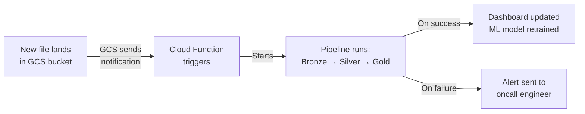
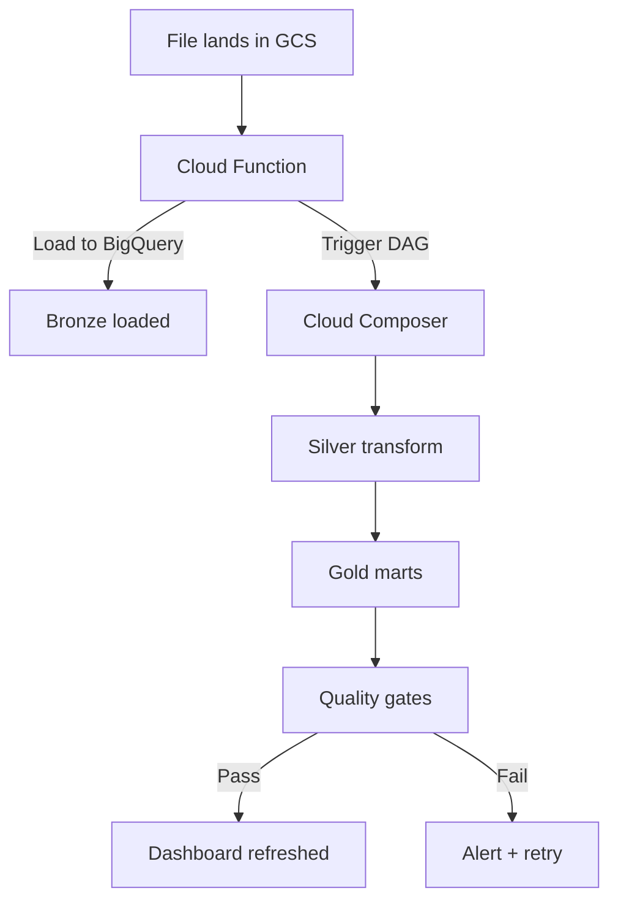

# Cloud Data Pipelines - Automation

**How to make your pipeline run without you. Event-driven triggers that fire when data arrives.**

> These concepts apply to any cloud (GCP, AWS, Azure). Examples use GCP as the primary, with AWS equivalents noted. Hands-on notebook: [GCP Pipeline Automation](../../../../implementation/notebooks/GCP_Pipeline_Automation.ipynb) | [](https://colab.research.google.com/github/sunilmogadati/systems-in-production/blob/main/implementation/notebooks/GCP_Pipeline_Automation.ipynb)

---

## The Problem with Manual Pipelines

In GCP_Full_Pipeline, you ran every command by hand:
1. Upload files to GCS (you typed it)
2. Load into BigQuery (you typed it)
3. Run Silver transform (you typed it)
4. Build Gold marts (you typed it)

This works for learning. It does not work at 3 AM when new data arrives and nobody is awake to type commands.

---

## The Production Pattern: Event-Driven

Instead of a human running commands, the pipeline runs itself when something happens.



**The trigger is the file, not the person.**

---

## What Is a Cloud Function?

A small piece of code that runs when an event happens. No servers to manage. You write the code, deploy it, and forget it. Google runs it for you.

**Analogy:** A doorbell. When someone presses it (event), the bell rings (function runs). You don't keep someone standing at the door waiting. The doorbell handles it automatically.

**In pipeline terms:**
- Event: A new file arrives in the GCS bronze bucket
- Function: Load that file into BigQuery, trigger the Silver transform

---

## How It Works

### Step 1: A File Lands in GCS

Something upstream (a source system, an SFTP transfer, an API export) drops a file into your GCS bucket:

```
gs://my-pipeline/bronze/calls/calls_2026_03_15.json
```

### Step 2: GCS Sends a Notification

GCS can be configured to send an event whenever a file is created, deleted, or modified. This event contains:
- Bucket name
- File name
- File size
- Timestamp

### Step 3: Cloud Function Receives the Event

Your Cloud Function code runs automatically:

```python
# cloud_function.py
# This function runs AUTOMATICALLY when a file lands in GCS

from google.cloud import bigquery

def process_new_file(event, context):
    """Triggered by a new file in GCS bronze bucket."""
    
    bucket = event['bucket']
    file_name = event['name']
    
    # Only process files in the bronze/ folder
    if not file_name.startswith('bronze/'):
        return
    
    print(f"New file detected: gs://{bucket}/{file_name}")
    
    # Determine which table to load into
    if 'calls' in file_name:
        table = 'raw.calls'
        source_format = 'NEWLINE_DELIMITED_JSON'
    elif 'orders' in file_name:
        table = 'raw.orders'
        source_format = 'CSV'
    elif 'campaigns' in file_name:
        table = 'raw.campaigns'
        source_format = 'CSV'
    else:
        print(f"Unknown file type: {file_name}")
        return
    
    # Load into BigQuery (append, not replace)
    client = bigquery.Client()
    job_config = bigquery.LoadJobConfig(
        source_format=source_format,
        autodetect=True,
        write_disposition='WRITE_APPEND',  # Append, not replace
    )
    
    uri = f"gs://{bucket}/{file_name}"
    load_job = client.load_table_from_uri(uri, table, job_config=job_config)
    load_job.result()  # Wait for completion
    
    print(f"Loaded {load_job.output_rows} rows into {table}")
```

### Step 4: Deploy the Function

```bash
gcloud functions deploy process_new_file \
    --runtime python311 \
    --trigger-resource my-pipeline \
    --trigger-event google.storage.object.finalize \
    --region us-central1
```

That's it. Now every file that lands in the bucket automatically gets loaded into BigQuery.

---

## Event Types

| Event | When It Fires | Use Case |
|---|---|---|
| `object.finalize` | File is created or overwritten | Load new data files |
| `object.delete` | File is deleted | Audit trail, cleanup |
| `object.archive` | File moves to archive storage | Cost tracking |

For pipelines, you almost always use `object.finalize`.

---

## What Triggers What: The Full Chain

The Cloud Function handles Bronze (file to BigQuery). But what about Silver and Gold?

**Option A: Cloud Function triggers everything**

The function loads the file, then runs the Silver SQL, then runs the Gold SQL. Simple but fragile. If the Gold step fails, you have to re-run everything.

**Option B: Cloud Function triggers the orchestrator**

The function loads the file, then tells Cloud Composer (Airflow) to run the rest. The orchestrator handles Silver, Gold, quality gates, and failure recovery.



**Option B is the production pattern.** The Cloud Function does one thing (load the file). The orchestrator does everything else.

---

## The AWS Equivalent

| GCP | AWS | What It Does |
|---|---|---|
| Cloud Functions | Lambda | Serverless function triggered by events |
| GCS notification | S3 Event Notification | "A file arrived" event |
| Cloud Composer | MWAA (Managed Airflow) | Orchestration |
| Pub/Sub | SNS/SQS | Message queue between services |

The pattern is identical. File arrives, function triggers, orchestrator runs the pipeline.

---

## Cost

Cloud Functions are nearly free for pipeline triggers:
- First 2 million invocations per month: free
- After that: $0.40 per million invocations
- Execution time: $0.0000025 per GB-second

A function that loads a file into BigQuery runs for 2-5 seconds. At one file per day, the annual cost is approximately $0.

---

## Quick Links

| Chapter | Topic |
|---|---|
| [01 - Why](01_Why.md) | Why pipelines matter |
| [02 - Concepts](02_Concepts.md) | Cloud services in plain English |
| [03 - Hello World](03_Hello_World.md) | Upload, query, see a result |
| [04 - Automation](04_Automation.md) | This page |
| [05 - Orchestration](05_Orchestration.md) | DAGs, scheduling, failure handling |
| [06 - Scale](06_Scale.md) | Spark, distributed compute, ETL vs ELT |
