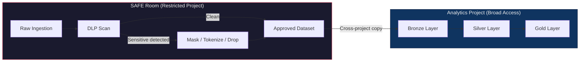
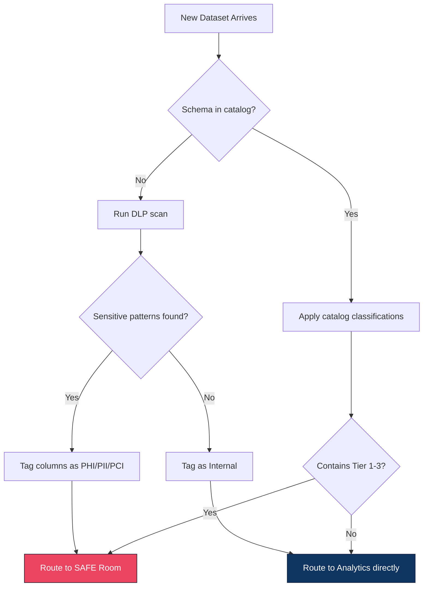
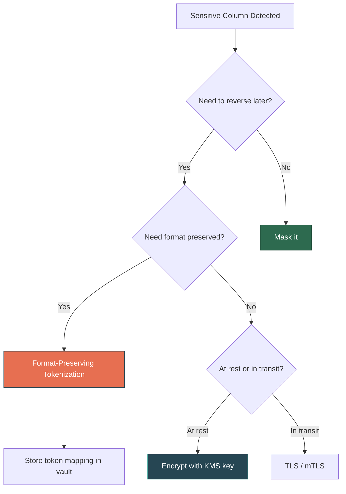

# Chapter 02 --- Patterns

## The SAFE Room / Landing Zone Pattern

A hospital's analytics team ingested claims data from a third-party payer into the same BigQuery dataset used by 80 analysts. The claims feed included diagnosis codes, procedure codes, and member IDs. Within 24 hours, three analysts had joined the claims data to an internal patient table to build a "high-cost patient" report. Nobody had reviewed whether those analysts were authorized to see PHI (Protected Health Information). The data never passed through a DLP (Data Loss Prevention) scan. It went straight from ingestion to a shared analytics layer.

The SAFE Room pattern exists to make this impossible.

### How It Works

Raw data lands in a **restricted project or account** --- the SAFE Room. This environment has tight IAM (Identity and Access Management) controls: only the pipeline service account and a small number of data engineers can access it. No analysts, no dashboards, no BI (Business Intelligence) tools connect here.

Inside the SAFE Room, every incoming dataset passes through a DLP scan. The scan identifies columns containing sensitive patterns: Social Security numbers, credit card numbers, ICD-10 (International Classification of Diseases, 10th Revision) diagnosis codes, CPT (Current Procedural Terminology) procedure codes, email addresses, phone numbers. Columns flagged as sensitive are either masked, tokenized, or dropped before the data moves to the analytics project.

Only sanitized data crosses the boundary into the analytics project, where broader access is permitted.

### Why Two Projects, Not Two Datasets

Separating by dataset (e.g., two schemas in the same database) does not create a true security boundary. In most cloud platforms, IAM policies at the project or account level are the strongest isolation mechanism. A user with project-level access can often enumerate all datasets within that project. Two projects means two IAM boundaries, two audit scopes, and two blast radii.

| Separation Level | IAM Boundary | Blast Radius | Audit Scope | Verdict |
|------------------|-------------|--------------|-------------|---------|
| Same dataset, different tables | None | Entire dataset | Shared logs | Not sufficient |
| Same project, different datasets | Weak (dataset-level ACLs) | Entire project | Shared project logs | Marginal |
| Different projects/accounts | Strong (project-level IAM) | Single project | Isolated logs | Recommended |
| Different organizations | Strongest | Single org | Fully isolated | Overkill for most cases |

---

## Data Classification

Classification is the act of labeling data at ingestion so downstream systems know how to handle it. Without classification, every consumer must independently decide whether a column is sensitive --- and they will get it wrong.

### Classification Tiers

| Tier | Label | Examples | Access Level |
|------|-------|----------|-------------|
| 1 | **PHI** | Diagnosis codes, treatment records, patient IDs | Named individuals with BAA (Business Associate Agreement) |
| 2 | **PII** (Personally Identifiable Information) | Name, SSN, email, phone, date of birth | Role-based, need-to-know |
| 3 | **PCI** | PAN (Primary Account Number), CVV, cardholder name | CDE (Cardholder Data Environment) only |
| 4 | **Confidential** | Revenue figures, internal strategy docs, employee compensation | Internal, role-restricted |
| 5 | **Internal** | Operational metrics, system logs, non-sensitive aggregates | All internal employees |
| 6 | **Public** | Published reports, marketing content, open datasets | Unrestricted |

### How to Tag at Ingestion

Classification happens at the column level, not the table level. A table may contain both `patient_name` (Tier 2 --- PII) and `visit_department` (Tier 5 --- Internal). The pipeline must tag each column independently.

Tagging approaches:

- **Schema registry with sensitivity metadata** --- Define column classifications in a central catalog. Every pipeline reads the catalog at ingestion and applies tags.
- **DLP scan results as tags** --- Run the DLP scan, then store the scan results as column-level metadata (BigQuery column policy tags, Glue column tags, Purview labels).
- **Convention-based** --- Column naming conventions (`_phi_`, `_pii_`, `_pci_` suffixes) that downstream policies interpret. Fragile but simple for small teams.

---

## DLP --- Data Loss Prevention Scanning

DLP scanning is pattern matching at scale. The scanner looks for data that matches known sensitive formats: 9-digit numbers matching SSN structure, 16-digit numbers matching credit card checksums (Luhn algorithm), alphanumeric codes matching ICD-10 or CPT patterns.

### What DLP Scanners Detect

| Data Type | Pattern | Example |
|-----------|---------|---------|
| SSN (Social Security Number) | `\d{3}-\d{2}-\d{4}` | 123-45-6789 |
| Credit card (PAN) | Luhn-valid 13--19 digit number | 4111 1111 1111 1111 |
| ICD-10 diagnosis code | `[A-Z]\d{2}(\.\d{1,4})?` | E11.65 (Type 2 diabetes with hyperglycemia) |
| CPT procedure code | `\d{5}` (within medical context) | 99213 (office visit) |
| Email address | Standard email regex | person@example.com |
| Phone number | Various formats, country-specific | (555) 867-5309 |
| Date of birth | Date fields labeled DOB, birth_date, etc. | 1985-03-14 |

### Cloud DLP Service Mapping

| Capability | GCP | AWS | Azure |
|-----------|-----|-----|-------|
| DLP scanning service | Cloud DLP API | Macie | Purview (formerly Compliance Manager) |
| Custom detectors | Yes (custom infoTypes) | Yes (custom data identifiers) | Yes (custom sensitive info types) |
| Structured data scan | Yes (BigQuery, Datastore) | Yes (S3 + Glue tables) | Yes (SQL, Data Lake, Blob) |
| Unstructured data scan | Yes (Cloud Storage) | Yes (S3) | Yes (Blob Storage) |
| Automated classification | Yes (DLP inspection jobs) | Yes (Macie classification jobs) | Yes (Purview auto-labeling) |

---

## Tokenization vs Masking vs Encryption

Three techniques for protecting sensitive data in pipelines. Each serves a different purpose. Choosing the wrong one creates either a false sense of security or an unusable dataset.

### Comparison

| Dimension | Tokenization | Masking | Encryption |
|-----------|-------------|---------|------------|
| **What it does** | Replaces value with a random token; original stored in a token vault | Irreversibly obscures part or all of the value | Transforms value using a key; reversible with the key |
| **Reversible** | Yes (via vault lookup) | No | Yes (with decryption key) |
| **Preserves format** | Can (format-preserving tokenization) | Partially (e.g., last 4 digits visible) | No (ciphertext is opaque) |
| **Use case** | Need to re-identify later (e.g., linking records across systems) | Analytics where original value is not needed | Data at rest / in transit protection |
| **PCI-DSS compliance** | Preferred for PAN | Acceptable for display | Required for storage |
| **GDPR erasure** | Delete the token mapping | Already irreversible | Delete the encryption key |
| **Performance cost** | Vault lookup per record | Negligible (string operation) | Moderate (crypto operations) |

### When to Use Each

- **Tokenization**: You need to join datasets across systems without exposing the real value. Common for patient IDs across care settings, or customer IDs across payment and CRM (Customer Relationship Management) systems.
- **Masking**: You need the data for analytics but the real value is irrelevant. Common for showing `***-**-6789` in reports or replacing names with `REDACTED`.
- **Encryption**: You need to protect data at rest or in transit and authorized users must be able to see the original value. Common for database-level encryption, TLS (Transport Layer Security) in transit, and envelope encryption for files.

---

## Right-to-Delete (GDPR Article 17 / CCPA)

When a user exercises their right to erasure, the pipeline must delete their data from every layer: Bronze (raw), Silver (cleaned), and Gold (aggregated). This is not a simple `DELETE FROM` statement --- it is a cascade through immutable storage formats.

### The Problem with Immutable Formats

Delta Lake, Apache Iceberg, and Apache Hudi store data as immutable Parquet files. A `DELETE` statement does not remove data from disk --- it writes a new file without the deleted rows and marks the old file as tombstoned. The old file still exists until `VACUUM` runs.

### Erasure Propagation Pattern

1. **Receive deletion request** --- Log the request with timestamp and requester identity (audit trail).
2. **Identify all occurrences** --- Query every layer (Bronze, Silver, Gold) for the subject's identifier. This requires a data lineage map or a subject-to-table index.
3. **Execute DELETE in each layer** --- Run `DELETE FROM table WHERE subject_id = ?` in every table that contains the subject's data.
4. **Run VACUUM** --- After deletion, run `VACUUM` with a retention period of 0 (or the minimum allowed) to physically remove old files. In Delta Lake: `VACUUM table RETAIN 0 HOURS` (requires disabling the retention check). In Iceberg: expire snapshots and remove orphan files.
5. **Verify and certify** --- Query all layers again to confirm zero rows remain. Log the verification as proof of compliance.

### Pitfall: Aggregates and Derived Data

If Gold-layer aggregates include the deleted subject's data (e.g., average spend per region), the aggregate is now stale. You must decide: recompute the aggregate, or accept that pre-deletion aggregates are not re-derived. Document this decision --- regulators may ask.

---

## Audit Trail Requirements

Regulators do not ask "did you protect the data?" They ask "prove it." Proof means immutable, timestamped logs showing who accessed what data, when, from where, and for what purpose.

### What Regulators Expect

| Requirement | HIPAA | PCI-DSS | GDPR |
|-------------|-------|---------|------|
| Log all access to sensitive data | Yes | Yes | Yes (accountability principle) |
| Log retention period | 6 years | 1 year | As long as processing occurs |
| Tamper-proof logs | Required | Required | Implied by "appropriate measures" |
| Include user identity | Yes | Yes | Yes |
| Include timestamp | Yes | Yes | Yes |
| Include data accessed | Yes (what PHI) | Yes (what cardholder data) | Yes (what personal data) |
| Alerting on anomalous access | Best practice | Required (Req 10.6) | Best practice |

### Implementation

- **Cloud audit logs** --- Enable data access logging (GCP Cloud Audit Logs, AWS CloudTrail data events, Azure Monitor diagnostic logs). These are off by default for data-plane operations. Turn them on explicitly.
- **Application-level logging** --- Log every query that touches classified columns. Include the query text, the user, the timestamp, and the rows returned.
- **Immutable storage** --- Write audit logs to a separate project/account with write-once policies (GCP bucket lock, S3 Object Lock, Azure immutable blob storage). Nobody --- including admins --- should be able to delete audit logs.

---

## Quick Links

| Resource | Link |
|----------|------|
| NIST SP 800-188 (De-identification) | https://csrc.nist.gov/publications/detail/sp/800-188/final |
| Delta Lake VACUUM docs | https://docs.delta.io/latest/delta-utility.html#vacuum |
| Iceberg Expire Snapshots | https://iceberg.apache.org/docs/latest/maintenance/#expire-snapshots |
| Previous: Why | [01_Why.md](01_Why.md) |
| Next: Building It | [03_Building_It.md](03_Building_It.md) |
