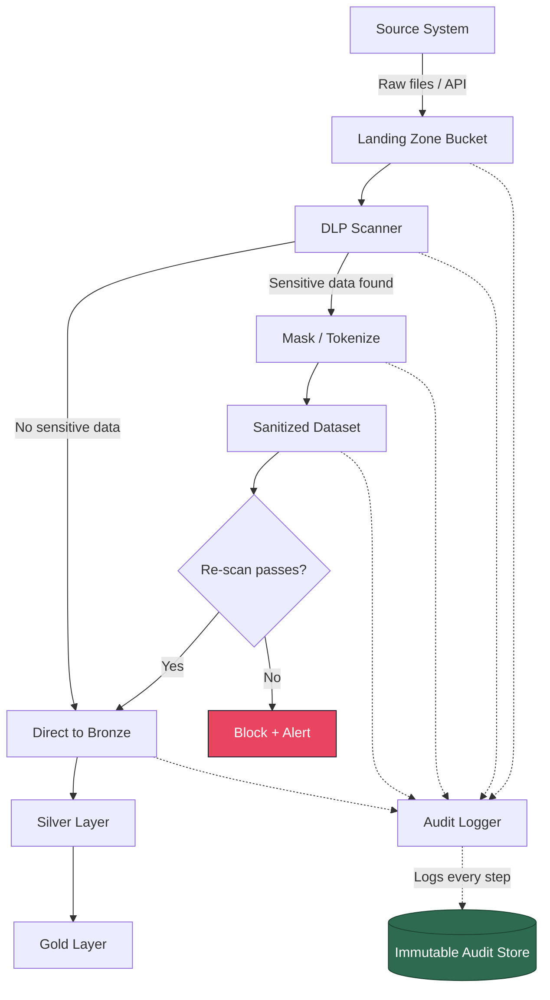

# Chapter 03 --- Building It

## From Pattern to Pipeline

A fintech company processed merchant settlement files containing PANs (Primary Account Numbers) in a shared data lake. Their compliance officer asked, "Can you prove that no credit card number ever reaches the analytics layer?" The engineering team could not. The card brands gave them 90 days to remediate or lose the ability to process payments.

This chapter builds the pipeline that answers that question with proof.

---

## Step 1: Landing Zone (SAFE Room)

The landing zone is a separate cloud project or account with restricted IAM (Identity and Access Management). Only the ingestion service account and a designated compliance engineer have access. No BI (Business Intelligence) tools, no analyst roles, no dashboard connections.

### Infrastructure Setup (Cloud-Agnostic)

```python
# landing_zone_config.py
# Configuration for the restricted landing zone

LANDING_ZONE = {
    "project": "acme-data-safe-room",       # Separate project/account
    "bucket": "acme-raw-ingestion",          # Raw data lands here
    "allowed_roles": [
        "pipeline-sa@acme-data-safe-room.iam.gserviceaccount.com",
        "compliance-eng@acme.com",
    ],
    "denied_actions": [
        "bigquery.tables.export",            # No bulk exports from SAFE Room
        "storage.objects.getIamPolicy",      # No IAM enumeration
    ],
    "encryption": "CMEK",                    # Customer-Managed Encryption Keys
    "retention_days": 90,                    # Raw data retained for audit
}

ANALYTICS_PROJECT = {
    "project": "acme-data-analytics",        # Broad access for analysts
    "dataset": "silver_layer",
    "allowed_roles": [
        "analyst-group@acme.com",
        "dashboard-sa@acme-data-analytics.iam.gserviceaccount.com",
    ],
}
```

The separation is the foundation. Everything that follows depends on raw data being physically isolated from analytics consumers.

---

## Step 2: DLP Scan (Detect PHI/PII Before Processing)

Before any transformation runs, every incoming dataset passes through a DLP (Data Loss Prevention) scan. The scan identifies columns containing sensitive patterns and produces a classification report.

### Python DLP Scanner

```python
"""
dlp_scanner.py
Scans a DataFrame for sensitive data patterns.
Returns a classification report: column name -> list of detected types.
"""

import re
from typing import Any

# --- Pattern definitions ---
# SSN: Social Security Number (US)
SSN_PATTERN = re.compile(r"\b\d{3}-\d{2}-\d{4}\b")

# PAN: Primary Account Number (credit/debit cards)
# Luhn check validates the number is a real card format
PAN_PATTERN = re.compile(r"\b\d{13,19}\b")

# ICD-10: International Classification of Diseases, 10th Revision
ICD10_PATTERN = re.compile(r"\b[A-TV-Z]\d{2}(?:\.\d{1,4})?\b")

# CPT: Current Procedural Terminology (medical procedure codes)
CPT_PATTERN = re.compile(r"\b\d{5}\b")

# Email
EMAIL_PATTERN = re.compile(r"\b[A-Za-z0-9._%+-]+@[A-Za-z0-9.-]+\.[A-Z|a-z]{2,}\b")

# Phone (US formats)
PHONE_PATTERN = re.compile(r"\b(?:\(\d{3}\)\s?|\d{3}[-.])\d{3}[-.]?\d{4}\b")

DETECTORS = {
    "SSN": SSN_PATTERN,
    "PAN": PAN_PATTERN,
    "ICD-10": ICD10_PATTERN,
    "EMAIL": EMAIL_PATTERN,
    "PHONE": PHONE_PATTERN,
}

# Minimum number of matches in a sample to flag a column
MATCH_THRESHOLD = 3


def luhn_check(number: str) -> bool:
    """Validate a number using the Luhn algorithm (ISO/IEC 7812-1)."""
    digits = [int(d) for d in number]
    checksum = 0
    reverse = digits[::-1]
    for i, d in enumerate(reverse):
        if i % 2 == 1:
            d *= 2
            if d > 9:
                d -= 9
        checksum += d
    return checksum % 10 == 0


def scan_column(values: list[Any], column_name: str) -> list[str]:
    """Scan a single column's values and return detected sensitive types."""
    detections = []
    sample = [str(v) for v in values[:1000] if v is not None]

    for label, pattern in DETECTORS.items():
        matches = [v for v in sample if pattern.search(v)]

        # PAN requires Luhn validation to reduce false positives
        if label == "PAN":
            matches = [m for m in matches if luhn_check(re.search(PAN_PATTERN, m).group())]

        if len(matches) >= MATCH_THRESHOLD:
            detections.append(label)

    return detections


def scan_dataframe(df) -> dict[str, list[str]]:
    """
    Scan every column in a pandas DataFrame.
    Returns: {"column_name": ["SSN", "EMAIL"], ...}
    Only columns with detections are included.
    """
    report = {}
    for col in df.columns:
        detected = scan_column(df[col].tolist(), col)
        if detected:
            report[col] = detected
    return report


# --- Usage ---
# import pandas as pd
# df = pd.read_csv("incoming_claims.csv")
# findings = scan_dataframe(df)
# if findings:
#     raise ComplianceGateError(f"Sensitive data detected: {findings}")
```

### DLP Scan as a Pipeline Gate

The scan result determines whether data proceeds or halts. This is not advisory --- it is a hard gate.

```python
def compliance_gate(df, pipeline_name: str) -> None:
    """
    Hard gate: blocks pipeline if sensitive data is detected.
    Raises an exception with the scan report for investigation.
    """
    findings = scan_dataframe(df)
    if findings:
        # Log the finding (never log the actual sensitive values)
        log_dlp_finding(pipeline_name, findings)
        raise ComplianceGateError(
            f"Pipeline '{pipeline_name}' blocked. "
            f"Sensitive data detected in columns: {list(findings.keys())}. "
            f"Types: {findings}. "
            f"Route to SAFE Room for remediation."
        )
```

---

## Step 3: Mask / Tokenize Sensitive Columns

Once the DLP scan identifies sensitive columns, the pipeline applies the appropriate protection technique. The choice depends on whether downstream consumers need to reverse the protection (see Chapter 02 comparison table).

### SQL Masking Examples

```sql
-- SHA-256 hashing: one-way, deterministic (same input = same hash)
-- Use for: joining across tables without exposing the original value
SELECT
    SHA256(CAST(patient_id AS STRING))  AS patient_id_hash,
    visit_date,
    department
FROM safe_room.raw_claims;

-- Partial masking: preserve format, hide sensitive digits
-- Use for: display in reports where partial visibility is acceptable
SELECT
    CONCAT('***-**-', RIGHT(ssn, 4))    AS ssn_masked,
    REGEXP_REPLACE(email, r'(.).*@', r'\1***@') AS email_masked,
    REGEXP_REPLACE(phone, r'\d(?=\d{4})', '*')  AS phone_masked
FROM safe_room.raw_patients;

-- Column-level security (BigQuery example)
-- Use for: allowing some roles to see the real value, others see NULL
-- Requires policy tags configured in Data Catalog
SELECT
    name,
    IF(
        SESSION_USER() IN (SELECT member FROM compliance.authorized_phi_users),
        diagnosis_code,
        'REDACTED'
    ) AS diagnosis_code
FROM analytics.patient_visits;
```

### Python Tokenization

```python
"""
tokenizer.py
Format-preserving tokenization using a token vault (dictionary).
Production systems use a dedicated vault (HashiCorp Vault, AWS Secrets Manager, etc.)
"""

import hashlib
import secrets

# In production: replace with a database-backed vault
_token_vault: dict[str, str] = {}
_reverse_vault: dict[str, str] = {}


def tokenize(value: str, prefix: str = "TOK") -> str:
    """
    Replace a sensitive value with a random token.
    The mapping is stored in the vault for reversal by authorized systems.
    """
    if value in _token_vault:
        return _token_vault[value]

    token = f"{prefix}-{secrets.token_hex(8)}"
    _token_vault[value] = token
    _reverse_vault[token] = value
    return token


def detokenize(token: str) -> str:
    """Reverse a token to its original value. Requires vault access."""
    if token not in _reverse_vault:
        raise KeyError(f"Token '{token}' not found in vault.")
    return _reverse_vault[token]


# --- Usage ---
# original_ssn = "123-45-6789"
# token = tokenize(original_ssn, prefix="SSN")
# print(token)         # SSN-a1b2c3d4e5f6g7h8
# print(detokenize(token))  # 123-45-6789
```

---

## Step 4: Move Sanitized Data to Analytics Project

After masking/tokenization, the sanitized dataset crosses the project boundary into the analytics layer. This cross-project transfer must itself be logged.

```python
def transfer_to_analytics(
    source_table: str,
    destination_table: str,
    safe_room_project: str,
    analytics_project: str,
) -> None:
    """
    Copy sanitized data from SAFE Room to analytics project.
    Validates that no sensitive columns remain before transfer.
    """
    from google.cloud import bigquery

    client = bigquery.Client(project=safe_room_project)

    # Final validation: re-scan the source table before transfer
    query = f"SELECT * FROM `{safe_room_project}.{source_table}` LIMIT 1000"
    sample_df = client.query(query).to_dataframe()
    findings = scan_dataframe(sample_df)

    if findings:
        raise ComplianceGateError(
            f"Transfer blocked: sensitive data still present in {source_table}. "
            f"Findings: {findings}"
        )

    # Cross-project copy
    copy_query = f"""
        CREATE OR REPLACE TABLE `{analytics_project}.{destination_table}` AS
        SELECT * FROM `{safe_room_project}.{source_table}`
    """
    client.query(copy_query).result()

    # Audit log the transfer
    log_transfer_event(
        source=f"{safe_room_project}.{source_table}",
        destination=f"{analytics_project}.{destination_table}",
        row_count=client.get_table(f"{analytics_project}.{destination_table}").num_rows,
    )
```

---

## Step 5: Audit Log Every Access

Every query against classified data must be logged. Cloud-native audit logs capture infrastructure-level access. Application-level logging captures query-level detail.

```python
"""
audit_logger.py
Structured audit logging for compliance pipelines.
Logs are written to an immutable, append-only store.
"""

import json
import datetime


def log_data_access(
    user: str,
    action: str,
    table: str,
    columns_accessed: list[str],
    row_count: int,
    purpose: str,
) -> dict:
    """
    Create an immutable audit log entry for a data access event.
    In production: write to a locked Cloud Storage bucket or append-only table.
    """
    entry = {
        "timestamp": datetime.datetime.utcnow().isoformat() + "Z",
        "user": user,
        "action": action,            # READ, WRITE, DELETE, EXPORT
        "table": table,
        "columns_accessed": columns_accessed,
        "row_count": row_count,
        "purpose": purpose,          # Required for HIPAA minimum necessary
        "source_ip": get_client_ip(),
        "session_id": get_session_id(),
    }

    # Write to immutable audit store
    write_to_audit_store(entry)
    return entry
```

---

## End-to-End Flow



Every arrow in this diagram is a logged event. Every gate is a hard stop, not a warning. The pipeline either proves compliance at every step or it does not run.

---

## Quick Links

| Resource | Link |
|----------|------|
| HashiCorp Vault Tokenization | https://developer.hashicorp.com/vault/docs/secrets/transform |
| BigQuery Column-Level Security | https://cloud.google.com/bigquery/docs/column-level-security |
| Lake Formation Column Filters | https://docs.aws.amazon.com/lake-formation/latest/dg/data-filters-about.html |
| Previous: Patterns | [02_Patterns.md](02_Patterns.md) |
| Next: Cloud Walkthroughs | [04_Cloud_Walkthroughs.md](04_Cloud_Walkthroughs.md) |
