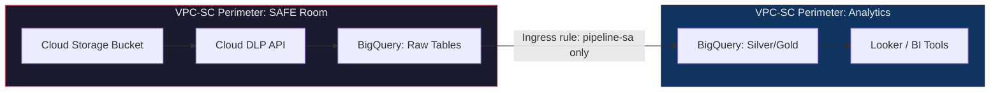
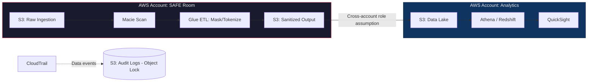

# Chapter 04 --- Cloud Walkthroughs

## Why Cloud-Specific Implementation Matters

A healthcare analytics company built a compliant pipeline architecture on paper: SAFE Room, DLP scanning, column masking, audit trails. Then they implemented it on GCP using only Cloud Storage bucket permissions and BigQuery dataset-level ACLs (Access Control Lists). No VPC Service Controls (Virtual Private Cloud Service Controls). No Data Catalog policy tags. No DLP API integration.

During a SOC 2 (Service Organization Control, Type 2) audit, the auditor asked: "Can a compromised service account in the analytics project read data from the SAFE Room project?" The answer was yes --- because without VPC Service Controls, cross-project API calls were unrestricted. The architecture was correct in theory and broken in implementation.

Each cloud provider has specific services that enforce the patterns from Chapters 02 and 03. This chapter maps those patterns to concrete services.

---

## GCP (Google Cloud Platform)

### Key Services

| Pattern | GCP Service | What It Does |
|---------|------------|--------------|
| DLP scanning | Cloud DLP API | Inspects structured and unstructured data for 150+ built-in infoTypes. Supports custom infoTypes (e.g., internal patient ID formats). |
| Data classification | Dataplex + Data Catalog | Policy tags on columns. Tags integrate with BigQuery column-level security. |
| Project separation | Resource Manager + IAM | Projects are the primary IAM boundary. Separate projects = separate blast radius. |
| Network isolation | VPC Service Controls | Creates a security perimeter around projects. Blocks data exfiltration even from authorized service accounts. |
| Audit logging | Cloud Audit Logs | Admin Activity (always on), Data Access (must be enabled), System Event. Data Access logs capture BigQuery queries. |
| Encryption | Cloud KMS (Key Management Service) | CMEK (Customer-Managed Encryption Keys) for BigQuery, Cloud Storage, Dataproc. |
| Column-level security | BigQuery + Data Catalog Policy Tags | Restrict which roles can see specific columns. Queries against restricted columns return an error unless the user has the `Fine-Grained Reader` role for that policy tag. |

### Setting Up a DLP Inspection Job (Console Steps)

1. Navigate to **Security > Data Loss Prevention** in the GCP Console.
2. Click **Create inspection job**.
3. Select **Input data**: choose the BigQuery dataset or Cloud Storage bucket in the SAFE Room project.
4. Under **Detection configuration**, select the infoTypes to scan for: `US_SOCIAL_SECURITY_NUMBER`, `CREDIT_CARD_NUMBER`, `ICD10_CODE` (custom), `EMAIL_ADDRESS`, `PHONE_NUMBER`.
5. Set **Likelihood threshold** to `LIKELY` or higher (reduces false positives).
6. Under **Actions**, configure:
   - **Save findings to BigQuery** --- stores scan results in a findings table for downstream automation.
   - **Publish to Pub/Sub** --- triggers a Cloud Function to block or mask flagged columns.
7. Set **Schedule** to run on every new table or partition arrival (event-driven via Cloud Storage notifications or BigQuery audit log triggers).

### VPC Service Controls --- Why They Matter

VPC Service Controls create a perimeter around one or more projects. API calls that cross the perimeter boundary are blocked by default. This prevents:

- A compromised service account in the analytics project from reading SAFE Room data via the BigQuery API.
- Data exfiltration via `gsutil cp` from a SAFE Room bucket to an external bucket.
- Cross-project joins that would combine SAFE Room data with analytics data without going through the sanitization pipeline.

Configure an **ingress rule** that allows only the pipeline service account to read from the SAFE Room project and write to the analytics project.



---

## AWS (Amazon Web Services)

### Key Services

| Pattern | AWS Service | What It Does |
|---------|------------|--------------|
| DLP scanning | Amazon Macie | Discovers and classifies sensitive data in S3 (Simple Storage Service). Detects PII (Personally Identifiable Information), PHI (Protected Health Information), financial data. |
| Data classification | Macie + Glue Data Catalog | Macie findings label S3 objects. Glue Data Catalog column-level tags for downstream consumers. |
| Account separation | AWS Organizations + SCPs (Service Control Policies) | Separate AWS accounts for SAFE Room and analytics. SCPs restrict what actions are allowed in each account. |
| Network isolation | AWS PrivateLink + VPC Endpoints | S3 Gateway endpoints keep data traffic off the public internet. Cross-account access via resource policies. |
| Audit logging | CloudTrail (data events) | Logs S3 object-level access and Athena/Redshift queries. Data events are OFF by default --- enable explicitly. |
| Encryption | AWS KMS | CMK (Customer Master Key) per account. Cross-account key grants for the pipeline service role. |
| Column-level security | Lake Formation | Column-level permissions on Glue Catalog tables. Users see only the columns they are granted. Queries against restricted columns return an error. |

### Setting Up Macie Classification

1. Enable Macie in the SAFE Room account (it is off by default).
2. Create a **classification job**:
   - **S3 buckets**: select the raw ingestion bucket.
   - **Managed data identifiers**: enable `CREDIT_CARD_NUMBER`, `US_SOCIAL_SECURITY_NUMBER`, `AWS_CREDENTIALS`, `US_PHONE_NUMBER`, `EMAIL_ADDRESS`.
   - **Custom data identifiers**: create regex-based identifiers for ICD-10 codes (`[A-TV-Z]\d{2}(\.\d{1,4})?`) and CPT codes (`\d{5}` with medical context keywords).
   - **Schedule**: one-time or recurring (daily recommended for continuous ingestion).
3. Configure **findings export** to an S3 bucket in the SAFE Room account.
4. Create an **EventBridge rule** that triggers a Lambda function when Macie publishes a finding with severity `HIGH`. The Lambda blocks the pipeline and alerts the compliance engineer.

### Cross-Account Pipeline Architecture



### Lake Formation Column-Level Security

```sql
-- Grant analyst role access to non-sensitive columns only
-- This is configured via Lake Formation API or Console, not SQL
-- Shown here for clarity

-- Analyst sees: visit_date, department, visit_type
-- Analyst does NOT see: patient_name, diagnosis_code, ssn

-- In Athena, the analyst runs:
SELECT * FROM analytics_db.patient_visits;
-- Result: only visit_date, department, visit_type columns returned
-- patient_name, diagnosis_code, ssn are invisible (not masked, absent)
```

---

## Azure

### Key Services

| Pattern | Azure Service | What It Does |
|---------|--------------|--------------|
| DLP scanning | Microsoft Purview (formerly Azure Compliance Manager) | Scans Azure SQL, Data Lake, Blob Storage, Microsoft 365. 300+ built-in sensitive info types. |
| Data classification | Purview Data Map + Sensitivity Labels | Auto-classification with labels (Confidential, Highly Confidential, etc.). Labels flow to downstream Azure services. |
| Subscription separation | Azure Management Groups + Subscriptions | Separate subscriptions for SAFE Room and analytics. Azure Policy enforces guardrails per subscription. |
| Network isolation | Private Endpoints + NSGs (Network Security Groups) | Storage accounts and SQL databases accessible only via private endpoints. No public internet exposure. |
| Audit logging | Azure Monitor + Diagnostic Settings | Activity logs (control plane) + Diagnostic logs (data plane). Data plane logs must be enabled per resource. |
| Encryption | Azure Key Vault | CMK (Customer-Managed Key) for Storage, SQL, Synapse. BYOK (Bring Your Own Key) and HSM (Hardware Security Module) options. |
| Column-level security | Azure SQL Dynamic Data Masking + Synapse Column-Level Security | Dynamic masking shows partial values to non-privileged users. Synapse supports GRANT/DENY on specific columns. |

### Setting Up Purview Auto-Classification

1. Create a **Purview account** in the SAFE Room subscription.
2. Register **data sources**: Azure SQL Database, Data Lake Storage Gen2, or Blob Storage containing raw ingestion data.
3. Create a **scan rule set**:
   - Include system classification rules for: `Credit Card Number`, `US Social Security Number`, `Email Address`, `US Phone Number`.
   - Add custom classification rules for ICD-10 and CPT codes using regex patterns.
4. Run a **scan** against registered sources. Purview creates classification labels on discovered columns.
5. Apply **sensitivity labels** (from Microsoft Information Protection) to classified assets. Labels propagate to Azure SQL, Synapse, and Power BI.
6. Configure **Purview policies** to automatically restrict access to assets labeled `Highly Confidential`.

### Azure SQL Dynamic Data Masking

```sql
-- Apply dynamic masking to sensitive columns
-- Non-privileged users see masked values; privileged users see originals

ALTER TABLE dbo.patients
ALTER COLUMN ssn ADD MASKED WITH (FUNCTION = 'partial(0,"***-**-",4)');
-- Result for non-privileged user: ***-**-6789

ALTER TABLE dbo.patients
ALTER COLUMN email ADD MASKED WITH (FUNCTION = 'email()');
-- Result: aXXX@XXXX.com

ALTER TABLE dbo.patients
ALTER COLUMN diagnosis_code ADD MASKED WITH (FUNCTION = 'default()');
-- Result: xxxx

-- Grant unmasking to specific roles
GRANT UNMASK TO [ComplianceAnalyst];
```

---

## Comparison: GCP vs AWS vs Azure Compliance Tools

| Capability | GCP | AWS | Azure |
|-----------|-----|-----|-------|
| **DLP / sensitive data discovery** | Cloud DLP API | Amazon Macie | Microsoft Purview |
| **Built-in detectors** | 150+ infoTypes | 100+ managed data identifiers | 300+ sensitive info types |
| **Custom detectors** | Custom infoTypes (regex, dictionary, stored) | Custom data identifiers (regex + keyword) | Custom classification rules (regex + keyword) |
| **Column-level security** | BigQuery + Data Catalog Policy Tags | Lake Formation column filters | Synapse GRANT/DENY + SQL Dynamic Data Masking |
| **Project/account separation** | Resource Manager projects | AWS Organizations + SCPs | Management Groups + Subscriptions |
| **Network perimeter** | VPC Service Controls | PrivateLink + VPC Endpoints | Private Endpoints + NSGs |
| **Audit logging (data plane)** | Cloud Audit Logs (Data Access) | CloudTrail (data events) | Azure Monitor (Diagnostic Settings) |
| **Key management** | Cloud KMS | AWS KMS | Azure Key Vault |
| **Data catalog** | Dataplex + Data Catalog | Glue Data Catalog | Purview Data Map |
| **Lineage tracking** | Dataplex lineage (preview) | Not native (use OpenLineage) | Purview lineage (native) |
| **Cost model for DLP** | Per GB scanned + per finding | Per S3 object evaluated | Included with Purview (scan capacity pricing) |

---

## Per-Cloud Architecture Summary

```mermaid
flowchart TB
    subgraph GCP["GCP Architecture"]
        G1[Cloud Storage] --> G2[Cloud DLP API]
        G2 --> G3[BigQuery + Policy Tags]
        G4[VPC-SC Perimeter] -.-> G1
        G4 -.-> G3
        G5[Cloud Audit Logs] -.-> G1
        G5 -.-> G3
    end

    subgraph AWS["AWS Architecture"]
        A1[S3] --> A2[Macie]
        A2 --> A3[Glue + Lake Formation]
        A3 --> A4[Athena / Redshift]
        A5[CloudTrail] -.-> A1
        A5 -.-> A4
    end

    subgraph AZ["Azure Architecture"]
        Z1[Blob / ADLS Gen2] --> Z2[Purview Scan]
        Z2 --> Z3[Synapse + Dynamic Masking]
        Z4[Azure Monitor] -.-> Z1
        Z4 -.-> Z3
    end

    style GCP fill:#1a1a2e,stroke:#4285f4,color:#eee
    style AWS fill:#1a1a2e,stroke:#ff9900,color:#eee
    style AZ fill:#1a1a2e,stroke:#00a4ef,color:#eee
```



---

## Which Cloud to Start With

This is not a technology decision --- it is a regulatory geography and existing infrastructure decision.

| Scenario | Recommended Starting Point | Reason |
|----------|---------------------------|--------|
| US healthcare, existing GCP footprint | GCP | Cloud DLP has the strongest structured data scanning. VPC-SC is the most mature perimeter service. |
| US healthcare or fintech, existing AWS footprint | AWS | Lake Formation column-level security is production-proven. Organizations + SCPs give the cleanest account separation. |
| EU organization, Microsoft 365 ecosystem | Azure | Purview integrates with M365 sensitivity labels. GDPR tooling is tightly coupled with Azure AD (now Entra ID) and Conditional Access. |
| Multi-cloud or cloud-agnostic | Start with the cloud where the data lands | The SAFE Room pattern is identical across clouds. Implement it where raw data enters, then extend to other clouds as needed. |

---

## Quick Links

| Resource | Link |
|----------|------|
| GCP Cloud DLP Documentation | https://cloud.google.com/sensitive-data-protection/docs |
| GCP VPC Service Controls | https://cloud.google.com/vpc-service-controls/docs |
| AWS Macie Documentation | https://docs.aws.amazon.com/macie/latest/userguide/ |
| AWS Lake Formation | https://docs.aws.amazon.com/lake-formation/latest/dg/ |
| Azure Purview Documentation | https://learn.microsoft.com/en-us/azure/purview/ |
| Azure SQL Dynamic Data Masking | https://learn.microsoft.com/en-us/sql/relational-databases/security/dynamic-data-masking |
| Previous: Building It | [03_Building_It.md](03_Building_It.md) |
| Back to Index | [README.md](README.md) |
