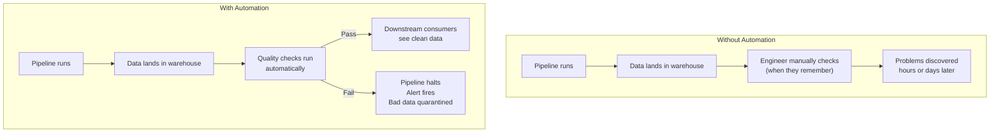
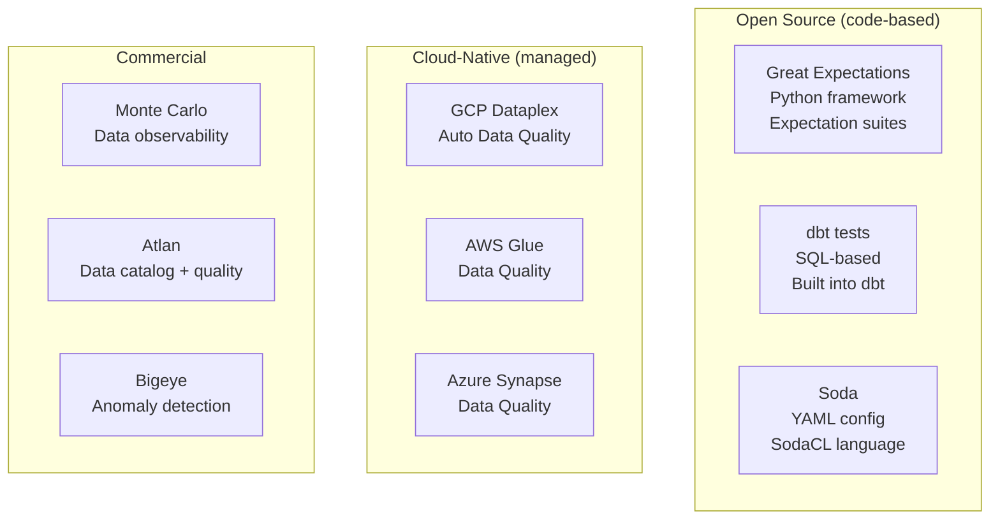

# Data Quality Tools - Why They Matter

**Manual data checks don't scale. You need automated quality gates that run on every pipeline execution, catch problems before downstream consumers do, and tell you exactly what broke and where.**

---

## The Manual Check That Missed

A data engineer builds a pipeline. After every run, she opens the warehouse and runs a few queries:

```sql
SELECT COUNT(*) FROM silver.calls;              -- "Looks about right"
SELECT COUNT(*) FROM silver.calls WHERE call_id IS NULL;  -- "Zero, good"
```

This works for months. Then:

- She goes on vacation. Nobody runs the checks. Bad data ships for 5 days.
- The table grows to 50M rows. She can't manually spot that 200 records have negative durations.
- A new column appears in the source. She doesn't notice because she only checks `call_id` and `count`.
- Friday's pipeline runs twice (Airflow retry). She doesn't check for duplicates because "it never happens."

Every one of these is a data quality failure that automated checks would have caught.

---

## What Data Quality Automation Does



Automated quality checks are **gates in the pipeline**, not afterthoughts. They run after every load, on every table, against defined expectations. If checks fail, downstream steps don't run.

---

## The Three Layers of Quality Checks

| Layer | When It Runs | What It Checks | Example |
|---|---|---|---|
| **Source validation** | At ingestion (before Bronze) | Did data arrive? Is the file valid? | File not empty, API returned 200, row count > 0 |
| **Transform validation** | After Silver transform | Is the data clean and consistent? | No nulls in primary key, no duplicates, values in range |
| **Business validation** | After Gold build | Do the numbers make sense? | Revenue > 0, conversion rate between 0-100%, totals reconcile |

Most teams only check at one layer. Production systems check at all three.

---

## The Tools Landscape



The next chapter compares these in detail. The chapter after that shows how to implement them.

---

## Quick Links

| Chapter | Topic |
|---|---|
| [01 - Why](01_Why.md) | This page |
| [02 - Tools Compared](02_Tools_Compared.md) | Great Expectations vs dbt vs Soda vs cloud-native |
| [03 - Building It](03_Building_It.md) | Implement quality checks with code |
| [04 - Cloud Walkthroughs](04_Cloud_Walkthroughs.md) | Dataplex, Glue DQ, Synapse DQ setup |
