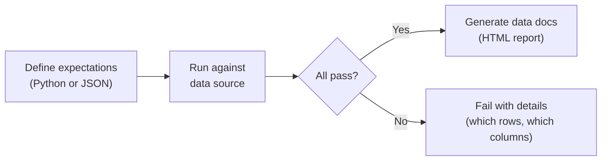
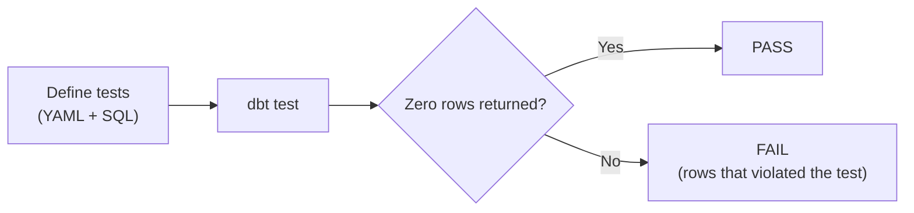
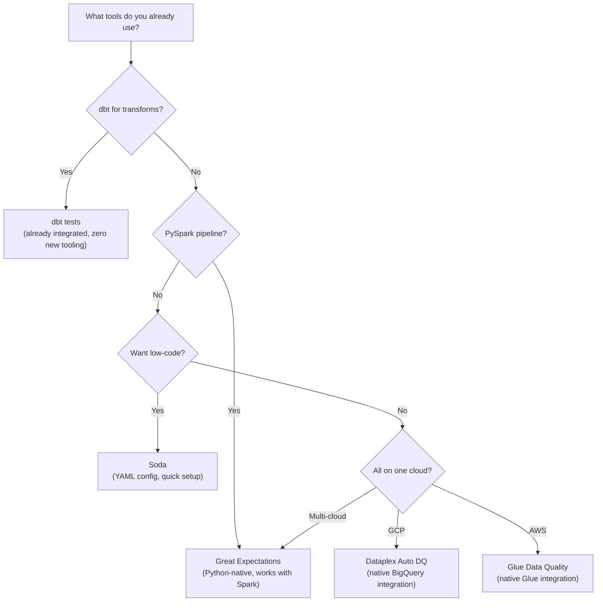

# Data Quality Tools - Tools Compared

**Great Expectations, dbt tests, Soda, Dataplex, Glue DQ, and Synapse DQ. What each does, how it works, and when to pick it.**

---

## The Big Picture

| Tool | Type | Language | Best For | Cost |
|---|---|---|---|---|
| **Great Expectations** | Open source | Python | Teams with Python pipelines (PySpark, pandas, Airflow) | Free |
| **dbt tests** | Open source | SQL | Teams using dbt for transforms | Free (dbt Core) or paid (dbt Cloud) |
| **Soda** | Open source + SaaS | YAML (SodaCL) | Teams wanting low-code quality checks | Free (Core) or paid (Cloud) |
| **Dataplex Auto DQ** | Cloud-native (GCP) | SQL rules in console | GCP-native pipelines on BigQuery | Pay per scan |
| **Glue Data Quality** | Cloud-native (AWS) | DQDL rules | AWS-native pipelines on Glue/Redshift | Pay per evaluation |
| **Synapse Data Quality** | Cloud-native (Azure) | SQL rules | Azure-native pipelines on Synapse | Included in Synapse |
| **Monte Carlo** | Commercial SaaS | Config | Enterprise data observability (anomaly detection) | $$$ |

---

## Great Expectations

**What it is:** A Python framework for defining, running, and documenting data quality checks ("expectations"). Each check is an "expectation" — a declarative statement about what the data should look like.

**How it works:**



**Key concepts:**

| Concept | What It Is |
|---|---|
| **Expectation** | A single check: "column X should never be null" |
| **Expectation Suite** | A collection of checks for one table |
| **Validator** | Runs expectations against a data source |
| **Data Docs** | Auto-generated HTML report of check results |
| **Checkpoint** | A runnable unit that validates data and triggers actions on pass/fail |

**Example expectations:**

```python
# Column-level checks
validator.expect_column_values_to_not_be_null("call_id")
validator.expect_column_values_to_be_in_set("status", 
    ["in-progress", "resolved", "missed", "voicemail", "transferred"])
validator.expect_column_values_to_be_between("duration", min_value=0, max_value=28800)

# Table-level checks
validator.expect_table_row_count_to_be_between(min_value=100, max_value=100000)
validator.expect_compound_columns_to_be_unique(["call_id", "call_date"])

# Cross-table checks (referential integrity)
# Not built-in — implement as custom expectation
```

**Strengths:**
- Rich library of 300+ built-in expectations
- Auto-generated documentation (Data Docs)
- Works with pandas, PySpark, SQL databases, and cloud warehouses
- Profiling: auto-discover expectations from existing data

**Weaknesses:**
- Learning curve — heavy configuration for initial setup
- No native anomaly detection (doesn't learn "normal" patterns)
- Checkpoint/store configuration is verbose

---

## dbt Tests

**What it is:** Data quality checks built into dbt (data build tool). Tests are SQL queries that return rows when the check fails. Zero failing rows = pass.

**How it works:**



**Two types of tests:**

### Generic Tests (YAML — no SQL needed)

```yaml
# models/schema.yml
models:
  - name: silver_calls
    columns:
      - name: call_id
        tests:
          - not_null
          - unique
      - name: status
        tests:
          - accepted_values:
              values: ['in-progress', 'resolved', 'missed', 'voicemail', 'transferred']
      - name: duration
        tests:
          - not_null
          - dbt_utils.accepted_range:
              min_value: 0
              max_value: 28800
```

### Singular Tests (Custom SQL)

```sql
-- tests/assert_no_orphaned_orders.sql
-- Returns rows where an order references a call_id that doesn't exist
SELECT o.order_id, o.call_id
FROM {{ ref('silver_orders') }} o
LEFT JOIN {{ ref('silver_calls') }} c ON o.call_id = c.call_id
WHERE c.call_id IS NULL
```

**Strengths:**
- Zero additional tooling if you already use dbt
- SQL-based — accessible to analysts, not just engineers
- Runs as part of `dbt build` (test + build in one command)
- dbt Cloud has built-in alerting on test failures

**Weaknesses:**
- Only works if you use dbt for transforms
- No profiling (can't auto-discover checks)
- No data docs equivalent (dbt docs are model-focused, not quality-focused)
- Limited to SQL-expressible checks

---

## Soda

**What it is:** A data quality tool with its own language (SodaCL) for defining checks. Designed to be simpler than Great Expectations with less configuration.

**How it works:**

```yaml
# checks/calls.yml
checks for silver_calls:
  # Row count
  - row_count > 0
  - row_count between 100 and 100000

  # Column checks
  - missing_count(call_id) = 0
  - invalid_count(status) = 0:
      valid values: [in-progress, resolved, missed, voicemail, transferred]
  - min(duration) >= 0
  - max(duration) <= 28800

  # Freshness
  - freshness(updated_at) < 4h

  # Duplicates
  - duplicate_count(call_id) = 0

  # Anomaly detection (Soda Cloud only)
  - anomaly detection for row_count
```

**Strengths:**
- YAML-based — readable by non-engineers
- Built-in freshness checks and anomaly detection
- SodaCL is concise compared to Great Expectations config
- Works with any SQL database

**Weaknesses:**
- Anomaly detection requires Soda Cloud (paid)
- Smaller community than Great Expectations or dbt
- Less flexible than Python-based tools for complex checks

---

## Cloud-Native Tools

### GCP: Dataplex Auto Data Quality

**What it is:** Google's managed data quality service. Define rules in SQL, run them on BigQuery tables on a schedule.

```sql
-- Dataplex Auto DQ rule examples
-- These are configured in the Dataplex console or via API

-- Rule: call_id must not be null
NOT_NULL(call_id)

-- Rule: status must be in a set
SET(status) IN ('in-progress', 'resolved', 'missed', 'voicemail', 'transferred')

-- Rule: duration must be in range
RANGE(duration) BETWEEN 0 AND 28800

-- Rule: no duplicates on call_id
UNIQUENESS(call_id) = 1.0

-- Rule: row count within expected range
ROW_COUNT BETWEEN 100 AND 100000
```

**Key feature:** Integrated with BigQuery — no separate infrastructure. Rules run as BigQuery jobs. Results visible in Dataplex console with pass/fail history.

### AWS: Glue Data Quality

**What it is:** AWS's managed data quality within Glue. Uses Data Quality Definition Language (DQDL).

```
-- Glue DQDL rules
Rules = [
    ColumnValues "call_id" != NULL,
    ColumnValues "status" in ["in-progress", "resolved", "missed", "voicemail", "transferred"],
    ColumnValues "duration" between 0 and 28800,
    IsUnique "call_id",
    RowCount between 100 and 100000
]
```

### Azure: Synapse Data Quality (via Data Factory)

**What it is:** Data quality rules defined within Azure Data Factory data flows or Synapse pipelines using SQL assertions.

---

## Comparison Matrix

| Feature | Great Expectations | dbt Tests | Soda | Dataplex | Glue DQ |
|---|---|---|---|---|---|
| **Language** | Python | SQL/YAML | YAML (SodaCL) | SQL rules | DQDL |
| **Requires existing tool** | No | dbt | No | BigQuery | Glue |
| **Column checks** | 300+ built-in | 4 generic + custom SQL | 20+ built-in | 10+ rule types | 10+ rule types |
| **Cross-table checks** | Custom expectations | Singular tests (SQL) | Custom SQL | Limited | Limited |
| **Freshness checks** | Custom | Custom | Built-in | Built-in | Built-in |
| **Anomaly detection** | No | No | Soda Cloud only | No | Recommendation engine |
| **Auto-profiling** | Yes (infer expectations from data) | No | Yes (discover) | No | Yes (recommend rules) |
| **Data docs / reports** | Yes (HTML) | dbt docs | Soda Cloud dashboard | Dataplex console | Glue console |
| **Alerting** | Custom (webhook, email) | dbt Cloud or custom | Soda Cloud | Cloud Monitoring | CloudWatch |
| **Works with PySpark** | Yes | No | Limited | No | Yes (Glue Spark) |
| **Works with BigQuery** | Yes | Yes | Yes | Native | No |
| **Works with Redshift** | Yes | Yes | Yes | No | Native |
| **Cost** | Free | Free / paid | Free / paid | Pay per scan | Pay per eval |

---

## Decision Guide



**The practical answer:** If you use dbt, use dbt tests. If you use PySpark, use Great Expectations. If you want the simplest possible setup, use Soda. If everything is on one cloud and you want zero infrastructure, use the cloud-native tool. Most production systems combine two: cloud-native for simple checks + Great Expectations or dbt for complex/custom checks.

---

## Quick Links

| Chapter | Topic |
|---|---|
| [01 - Why](01_Why.md) | Why automated quality checks matter |
| [02 - Tools Compared](02_Tools_Compared.md) | This page |
| [03 - Building It](03_Building_It.md) | Implement quality checks with Great Expectations + custom Python |
| [04 - Cloud Walkthroughs](04_Cloud_Walkthroughs.md) | Dataplex, Glue DQ, Synapse DQ console setup |
