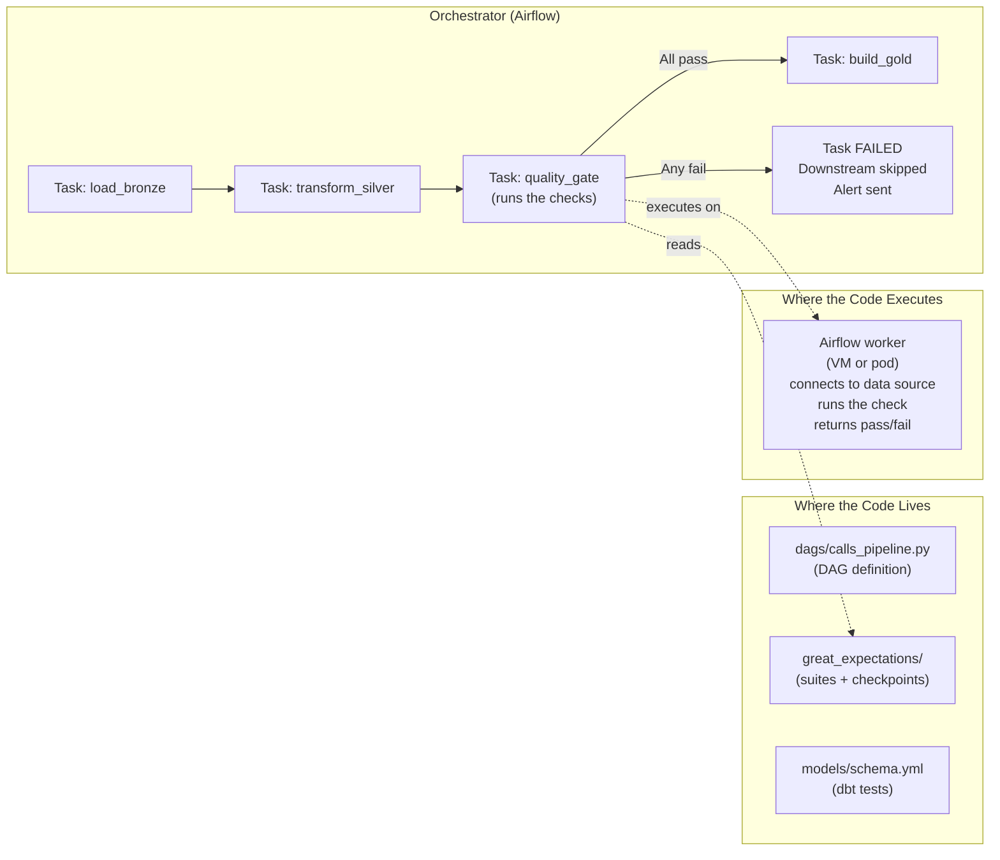
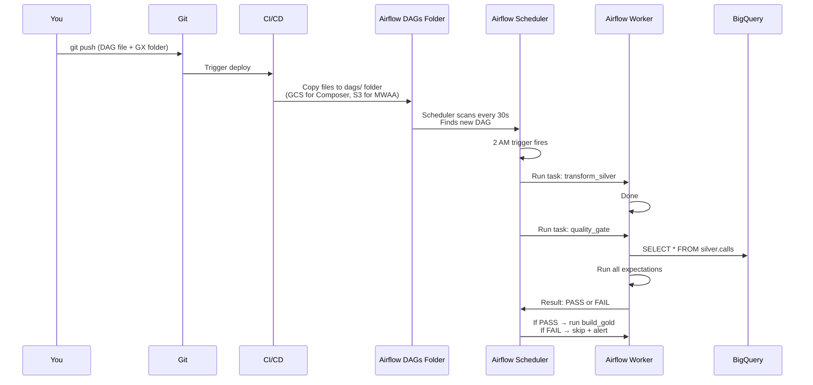
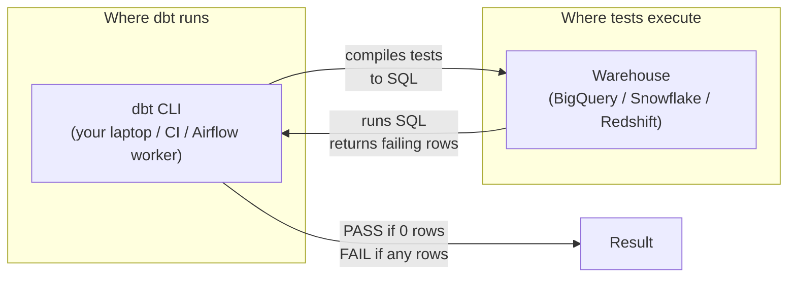

# Data Quality Tools - Building It

**Implement automated quality checks three ways: Great Expectations, dbt tests, and custom Python. Each approach runs against the call center dataset.**

---

## Where Quality Checks Run in the Pipeline

Before the code: the quality check is a **task in your orchestrator** (Airflow, Cloud Composer, MWAA, Synapse Pipelines, dbt Cloud). It is not a separate system.



**The key idea:** Your DAG file (`dags/calls_pipeline.py`) is just a Python file describing the workflow. Airflow's scheduler reads it, sees there's a `quality_gate` task, and dispatches it to a worker. The worker:
1. Connects to your data source (BigQuery, Redshift, etc.)
2. Runs the quality check (Great Expectations, dbt, custom Python)
3. Reports pass/fail back to Airflow
4. Airflow either continues to the next task (pass) or stops the pipeline (fail)

You write the check logic once. Airflow runs it on a schedule.

---

## Approach 1: Great Expectations

### Where the Files Live

Great Expectations (GX) projects have a standard directory structure. This is what you create on disk:

```
your-pipeline-repo/
├── dags/
│   └── calls_pipeline.py          # Airflow DAG (orchestrator)
├── great_expectations/             # GX project root (created by `great_expectations init`)
│   ├── great_expectations.yml      # Main config (data sources, stores, etc.)
│   ├── expectations/
│   │   └── calls_quality_suite.json  # Your expectation suite (checks defined as JSON)
│   ├── checkpoints/
│   │   └── calls_checkpoint.yml    # Runnable unit (suite + actions)
│   └── uncommitted/
│       └── data_docs/              # Auto-generated HTML reports
└── requirements.txt                # great_expectations, apache-airflow, etc.
```

**This entire structure lives in your pipeline repo (Git).** The DAG file references the GX directory by path.

### Step 1: Initialize the GX Project

```bash
# Run this ONCE on your laptop or in CI/CD to create the directory structure.
# This creates the great_expectations/ folder shown above.
cd your-pipeline-repo
great_expectations init
```

### Step 2: Define an Expectation Suite

This Python script defines what "good data" looks like. **You run this once on your laptop** to generate the `calls_quality_suite.json` file. After that, the JSON file is checked into Git and Airflow uses it.

```python
# File: scripts/create_calls_suite.py
# WHERE TO RUN: On your laptop, once. Output is committed to Git.
# The generated suite (JSON) is what Airflow will execute on every pipeline run.

import great_expectations as gx
from datetime import datetime

# Load the GX context — points to ./great_expectations/ directory
context = gx.get_context()

# Connect to the data source — in production this would be BigQuery/Redshift,
# not a CSV. CSV is for the suite-creation step only.
datasource = context.sources.add_pandas("calls_source")
data_asset = datasource.add_csv_asset(
    "calls",
    filepath_or_buffer="sample_silver_calls.csv"  # Sample data for designing checks
)
batch_request = data_asset.build_batch_request()

# Create a validator — the object you call expectation methods on
validator = context.get_validator(
    batch_request=batch_request,
    create_expectation_suite_with_name="calls_quality_suite",
)

# --- Define expectations (these become the rules in calls_quality_suite.json) ---

# Table-level: how many rows do we expect?
validator.expect_table_row_count_to_be_between(min_value=100, max_value=500000)

# Primary key: never null, always unique
validator.expect_column_values_to_not_be_null("call_id")
validator.expect_column_values_to_be_unique("call_id")

# Status: must be one of these values (catches typos, schema drift)
validator.expect_column_values_to_be_in_set(
    "status",
    ["in-progress", "resolved", "missed", "voicemail", "transferred"]
)

# Duration: non-negative, max 8 hours (28800 seconds)
validator.expect_column_values_to_be_between(
    "duration", min_value=0, max_value=28800
)

# No nulls in required fields
validator.expect_column_values_to_not_be_null("customer_id")
validator.expect_column_values_to_not_be_null("created_at")

# Timestamp sanity: created_at should not be in the future
validator.expect_column_values_to_be_between(
    "created_at", max_value=datetime.now().isoformat()
)

# Save the suite — writes great_expectations/expectations/calls_quality_suite.json
validator.save_expectation_suite(discard_failed_expectations=False)
print("Suite saved to great_expectations/expectations/calls_quality_suite.json")
print("Commit this file to Git. Airflow will read it on every pipeline run.")
```

### Step 3: Configure the Data Source for Production

The suite was created against a CSV. In production, point GX at your warehouse (BigQuery/Redshift/Snowflake). This is configured in `great_expectations.yml`:

```yaml
# File: great_expectations/great_expectations.yml
# Tells GX how to connect to BigQuery (or Redshift, Snowflake, etc.)

datasources:
  bigquery_silver:
    class_name: Datasource
    execution_engine:
      class_name: SqlAlchemyExecutionEngine
      connection_string: bigquery://my-project/silver
    data_connectors:
      default_runtime_data_connector:
        class_name: RuntimeDataConnector
        batch_identifiers:
          - default_identifier_name
```

### Step 4: Define the Checkpoint

A **checkpoint** ties together: which suite to run, against which data, and what to do with the results. It's the runnable unit Airflow will trigger.

```yaml
# File: great_expectations/checkpoints/calls_checkpoint.yml
# Created by running: great_expectations checkpoint new calls_checkpoint
# Or written manually.

name: calls_checkpoint
config_version: 1.0
class_name: Checkpoint

validations:
  - batch_request:
      datasource_name: bigquery_silver
      data_connector_name: default_runtime_data_connector
      data_asset_name: calls
      runtime_parameters:
        query: "SELECT * FROM silver.calls WHERE call_date = CURRENT_DATE()"
      batch_identifiers:
        default_identifier_name: daily_run
    expectation_suite_name: calls_quality_suite

action_list:
  # Action 1: Store the validation result (history of pass/fail)
  - name: store_validation_result
    action:
      class_name: StoreValidationResultAction
  # Action 2: Update Data Docs (auto-generated HTML report at uncommitted/data_docs/)
  - name: update_data_docs
    action:
      class_name: UpdateDataDocsAction
```

### Step 5: Wire It Into Airflow

This is the DAG file Airflow reads. **It lives in your Airflow `dags/` folder** (which Airflow scans every 30 seconds for new or changed DAG files).

```python
# File: dags/calls_pipeline.py
# WHERE THIS LIVES:
#   - Self-hosted Airflow:    /opt/airflow/dags/calls_pipeline.py
#   - Cloud Composer (GCP):   gs://composer-bucket/dags/calls_pipeline.py
#   - MWAA (AWS):             s3://mwaa-bucket/dags/calls_pipeline.py
#   - Astronomer:             dags/calls_pipeline.py in your repo (deployed via CLI)
#
# HOW IT GETS THERE:
#   - Self-hosted: Git sync, Docker volume mount, or scp
#   - Cloud Composer: gcloud composer environments storage dags import
#   - MWAA: Upload to S3 (manually or via CI/CD)
#   - Astronomer: astro deploy command from your repo
#
# Airflow's scheduler scans this folder every ~30 seconds. New/changed files
# automatically appear in the Airflow UI. No restart needed.

from airflow import DAG
from airflow.operators.python import PythonOperator
from airflow.operators.empty import EmptyOperator
from datetime import datetime, timedelta

# --- DAG configuration ---
default_args = {
    "owner": "data-team",
    "retries": 2,                              # Retry failed tasks 2x before giving up
    "retry_delay": timedelta(minutes=5),
    "email_on_failure": True,
    "email": ["data-oncall@company.com"],
}

dag = DAG(
    dag_id="calls_pipeline",
    default_args=default_args,
    description="Daily pipeline: load bronze → silver → quality gate → gold",
    schedule="0 2 * * *",                      # Run at 2 AM daily (cron syntax)
    start_date=datetime(2026, 4, 1),
    catchup=False,                             # Don't run for missed dates between start_date and now
    tags=["calls", "production"],
)

# --- Task 1: Transform Bronze → Silver (placeholder — your real transform here) ---
transform_silver = EmptyOperator(task_id="transform_silver", dag=dag)

# --- Task 2: Quality Gate (the new piece) ---
def run_quality_checks(**context):
    """
    Runs the Great Expectations checkpoint.
    
    Executes ON the Airflow worker that picks up this task.
    Worker needs:
      - great_expectations package installed (in requirements.txt)
      - The great_expectations/ folder accessible (mounted volume or in repo)
      - Credentials to query BigQuery (service account on the worker)
    
    Returns nothing. Raises exception on failure to fail the Airflow task.
    """
    import great_expectations as gx
    
    # Load the GX context — looks for great_expectations/ folder
    # In Cloud Composer: GX folder is in the same GCS bucket as the DAG
    # In MWAA: GX folder is in the same S3 bucket
    gx_context = gx.get_context(context_root_dir="/opt/airflow/great_expectations")
    
    # Get the checkpoint we defined in calls_checkpoint.yml
    checkpoint = gx_context.get_checkpoint("calls_checkpoint")
    
    # Run all expectations in the suite against today's data
    result = checkpoint.run()
    
    # If any expectation failed, raise — this fails the Airflow task,
    # which prevents downstream tasks from running and triggers the alert.
    if not result.success:
        failed = [
            f"{r['expectation_config']['expectation_type']} on {r['expectation_config']['kwargs'].get('column', 'table')}"
            for r in result.run_results[list(result.run_results.keys())[0]]['validation_result']['results']
            if not r['success']
        ]
        raise ValueError(
            f"Data quality gate FAILED. {len(failed)} checks failed: {failed}"
        )
    
    print(f"Data quality gate PASSED. All checks succeeded.")

quality_gate = PythonOperator(
    task_id="quality_gate",
    python_callable=run_quality_checks,
    dag=dag,
)

# --- Task 3: Build Gold (only runs if quality gate passes) ---
build_gold = EmptyOperator(task_id="build_gold", dag=dag)

# --- Task 4: Refresh Dashboards (only runs if gold built successfully) ---
refresh_dashboards = EmptyOperator(task_id="refresh_dashboards", dag=dag)

# --- Define task dependencies (this is the DAG structure) ---
# >> means "runs after"
# If any task fails, downstream tasks are SKIPPED (not run).
transform_silver >> quality_gate >> build_gold >> refresh_dashboards
```

### What Happens When This Deploys



### How to Deploy by Platform

| Platform | How DAG Files Get to Airflow |
|---|---|
| **Self-hosted Airflow** | Git sync (Argo/Flux), shared volume (NFS), or `scp dags/*.py airflow-server:/opt/airflow/dags/` |
| **Cloud Composer (GCP)** | `gcloud composer environments storage dags import --source=dags/calls_pipeline.py` (uploads to GCS bucket) |
| **MWAA (AWS)** | `aws s3 sync dags/ s3://mwaa-bucket/dags/` (CI/CD pipeline syncs on every push to main) |
| **Astronomer** | `astro deploy` from your repo (handles upload + restart) |
| **Databricks Workflows** | Push to repo, Databricks auto-syncs |

In all cases: you write the DAG file, your CI/CD copies it to the right location, Airflow's scheduler picks it up automatically. **No Airflow restart needed.**

---

## Approach 2: dbt Tests

### Where the Files Live

dbt projects have a standard structure. Tests live alongside the models they validate — same Git repo:

```
your-dbt-repo/
├── dbt_project.yml                 # Project config (profiles, paths)
├── profiles.yml                    # Connection details (warehouse credentials)
├── models/
│   ├── silver/
│   │   ├── silver_calls.sql        # The model (transform SQL)
│   │   └── schema.yml              # Tests defined here (this file's content shown below)
│   └── gold/
│       └── fact_calls.sql
├── tests/                          # Custom singular tests (one .sql file per test)
│   └── assert_no_orphaned_orders.sql
└── packages.yml                    # Optional: dbt_utils, dbt_expectations
```

### Where the Tests Run

dbt tests execute **inside your warehouse**, not on a separate worker.



dbt compiles each test into a SQL query. The query runs on the warehouse. The warehouse returns matching rows. Zero rows = pass. Any rows = fail. dbt itself is just an orchestrator — your warehouse does the actual work.

### Generic Tests (YAML)

```yaml
# File: models/silver/schema.yml
# WHERE: Same folder as silver_calls.sql in your dbt repo.
# WHO RUNS IT: dbt CLI (you locally, CI/CD, or Airflow via DbtRunOperator)
# HOW IT EXECUTES: dbt compiles each test to SQL, runs against your warehouse.

version: 2

models:
  - name: silver_calls
    description: "Cleaned call records — deduplicated, timezone-fixed, validated"
    columns:
      - name: call_id
        description: "Unique call identifier"
        tests:
          - not_null
          - unique

      - name: status
        description: "Call outcome"
        tests:
          - not_null
          - accepted_values:
              values: ['in-progress', 'resolved', 'missed', 'voicemail', 'transferred']

      - name: duration
        description: "Call duration in seconds"
        tests:
          - not_null
          - dbt_utils.accepted_range:
              min_value: 0
              max_value: 28800

      - name: customer_id
        tests:
          - not_null
          - relationships:
              to: ref('dim_customer')
              field: customer_id

      - name: created_at
        tests:
          - not_null
```

### Singular Tests (Custom SQL)

```sql
-- tests/assert_no_duplicate_calls_per_day.sql
-- Fails if any call_id appears more than once on the same day
SELECT
    call_id,
    call_date,
    COUNT(*) AS occurrences
FROM {{ ref('silver_calls') }}
GROUP BY call_id, call_date
HAVING COUNT(*) > 1
```

```sql
-- tests/assert_row_count_reasonable.sql
-- Fails if today's load has < 50% of the 7-day average
WITH daily_counts AS (
    SELECT
        call_date,
        COUNT(*) AS daily_count
    FROM {{ ref('silver_calls') }}
    WHERE call_date >= CURRENT_DATE - 8
    GROUP BY call_date
),
avg_count AS (
    SELECT AVG(daily_count) AS avg_7d
    FROM daily_counts
    WHERE call_date < CURRENT_DATE
)
SELECT
    dc.call_date,
    dc.daily_count,
    ac.avg_7d,
    dc.daily_count / ac.avg_7d AS ratio
FROM daily_counts dc
CROSS JOIN avg_count ac
WHERE dc.call_date = CURRENT_DATE
    AND dc.daily_count < ac.avg_7d * 0.5
```

### How to Run dbt Tests

**Locally (during development):**

```bash
# Run from your dbt project root
cd your-dbt-repo

# Run all tests against the warehouse defined in profiles.yml
dbt test

# Run tests for one model only
dbt test --select silver_calls

# Run models + tests together (production pattern)
dbt build  # equivalent to: dbt run + dbt test
```

**In production via Airflow (recommended):**

```python
# File: dags/calls_pipeline.py
# WHERE THIS LIVES: Same Airflow dags/ folder as the GX example above.

from airflow import DAG
from airflow.providers.dbt.cloud.operators.dbt import DbtCloudRunJobOperator
# OR for self-hosted dbt:
# from airflow.providers.dbt.core.operators import DbtRunOperator, DbtTestOperator

dag = DAG(
    dag_id="calls_pipeline_dbt",
    schedule="0 2 * * *",
    start_date=datetime(2026, 4, 1),
    catchup=False,
)

# WHY: dbt build runs models THEN tests in dependency order.
# If a test fails, downstream models don't run.
# This is the quality gate — built into dbt natively.
dbt_build = DbtCloudRunJobOperator(
    task_id="dbt_build",
    dbt_cloud_conn_id="dbt_cloud",      # Airflow connection to dbt Cloud
    job_id=12345,                        # The dbt Cloud job that runs `dbt build`
    dag=dag,
)

# Or with self-hosted dbt-core (runs dbt CLI on the Airflow worker):
# dbt_build = BashOperator(
#     task_id="dbt_build",
#     bash_command="cd /opt/airflow/dbt && dbt build --target prod",
#     dag=dag,
# )
```

**Where dbt-core runs in self-hosted mode:** The Airflow worker. The worker needs the `dbt-core` package installed (in `requirements.txt`) and the dbt project files accessible (mounted as a volume or pulled from Git in the Dockerfile).

---

## Approach 3: Custom Python (No Framework)

When you don't want a framework — just Python functions that return pass/fail.

**Where this code runs:** Same as Great Expectations — on the Airflow worker that picks up the task. The function reads from your warehouse (via SQLAlchemy/psycopg2/google-cloud-bigquery), runs the checks, raises an exception on failure to fail the Airflow task.

```python
import pandas as pd
from dataclasses import dataclass
from typing import List, Optional

@dataclass
class CheckResult:
    check_name: str
    passed: bool
    details: Optional[str] = None
    failing_rows: int = 0

def run_quality_checks(df: pd.DataFrame) -> List[CheckResult]:
    """Run all quality checks on a DataFrame. Return results."""
    results = []
    
    # Check 1: Row count
    count = len(df)
    results.append(CheckResult(
        check_name="row_count_minimum",
        passed=count >= 100,
        details=f"Row count: {count}" if count < 100 else None,
        failing_rows=0 if count >= 100 else 1,
    ))
    
    # Check 2: No null primary keys
    null_pks = df["call_id"].isna().sum()
    results.append(CheckResult(
        check_name="call_id_not_null",
        passed=null_pks == 0,
        details=f"{null_pks} null call_ids" if null_pks > 0 else None,
        failing_rows=null_pks,
    ))
    
    # Check 3: No duplicates
    dupes = df.duplicated(subset=["call_id"]).sum()
    results.append(CheckResult(
        check_name="call_id_unique",
        passed=dupes == 0,
        details=f"{dupes} duplicate call_ids" if dupes > 0 else None,
        failing_rows=dupes,
    ))
    
    # Check 4: Valid status values
    valid_statuses = {"in-progress", "resolved", "missed", "voicemail", "transferred"}
    invalid = df[~df["status"].isin(valid_statuses)]
    results.append(CheckResult(
        check_name="status_valid",
        passed=len(invalid) == 0,
        details=f"Invalid statuses: {invalid['status'].unique().tolist()}" if len(invalid) > 0 else None,
        failing_rows=len(invalid),
    ))
    
    # Check 5: Duration range
    bad_duration = df[(df["duration"] < 0) | (df["duration"] > 28800)]
    results.append(CheckResult(
        check_name="duration_in_range",
        passed=len(bad_duration) == 0,
        details=f"Out of range: min={df['duration'].min()}, max={df['duration'].max()}" if len(bad_duration) > 0 else None,
        failing_rows=len(bad_duration),
    ))
    
    return results

def report_results(results: List[CheckResult]):
    """Print results and raise if any failed."""
    passed = sum(1 for r in results if r.passed)
    failed = sum(1 for r in results if not r.passed)
    
    print(f"\nQuality Gate: {passed} passed, {failed} failed")
    print("-" * 50)
    for r in results:
        status = "PASS" if r.passed else "FAIL"
        print(f"  [{status}] {r.check_name}", end="")
        if r.details:
            print(f" — {r.details}", end="")
        print()
    
    if failed > 0:
        raise Exception(f"Quality gate FAILED: {failed} checks failed")

# Usage
# df = pd.read_parquet("silver_calls.parquet")
# results = run_quality_checks(df)
# report_results(results)
```

### Wire It Into Airflow

```python
# File: dags/calls_pipeline.py
# Same DAG file as the GX example. Just replaces the run_quality_checks function.

from airflow import DAG
from airflow.operators.python import PythonOperator
from datetime import datetime

dag = DAG(
    dag_id="calls_pipeline_custom_qa",
    schedule="0 2 * * *",
    start_date=datetime(2026, 4, 1),
    catchup=False,
)

def run_custom_quality_checks(**context):
    """
    Runs on the Airflow worker.
    Worker needs:
      - pandas + your warehouse client (google-cloud-bigquery / psycopg2 / etc.) in requirements.txt
      - Credentials to query the warehouse (service account, IAM role, or Airflow connection)
    """
    from google.cloud import bigquery     # Or your warehouse client
    
    # Pull today's silver data into a DataFrame
    client = bigquery.Client()
    df = client.query("SELECT * FROM silver.calls WHERE call_date = CURRENT_DATE()").to_dataframe()
    
    # Run the checks defined above
    results = run_quality_checks(df)
    
    # report_results raises on failure → fails the Airflow task → halts the pipeline
    report_results(results)

quality_gate = PythonOperator(
    task_id="quality_gate",
    python_callable=run_custom_quality_checks,
    dag=dag,
)
```

**When to use custom instead of a framework:**
- You have < 10 tables to check
- You don't want to learn Great Expectations' configuration system
- You need full control over check logic and reporting
- You plan to migrate to a framework later (custom checks translate easily)

---

## Which Approach for Which Situation

| Situation | Recommended Approach |
|---|---|
| Already using dbt | dbt tests — zero new tooling |
| PySpark pipeline, many tables | Great Expectations — richest library |
| Small team, few tables | Custom Python — simplest, no dependencies |
| Want YAML config, low code | Soda — SodaCL is concise |
| All on GCP BigQuery | Dataplex Auto DQ + dbt tests or custom |
| Enterprise, need observability | Monte Carlo or Great Expectations + dashboarding |

---

## Quick Links

| Chapter | Topic |
|---|---|
| [02 - Tools Compared](02_Tools_Compared.md) | Feature comparison matrix |
| [03 - Building It](03_Building_It.md) | This page |
| [04 - Cloud Walkthroughs](04_Cloud_Walkthroughs.md) | Dataplex, Glue DQ, Synapse DQ |
