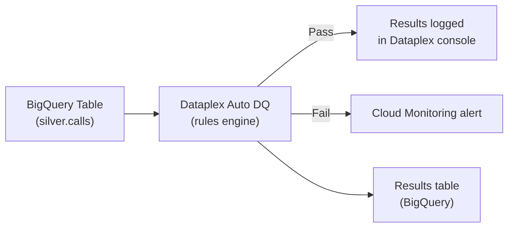
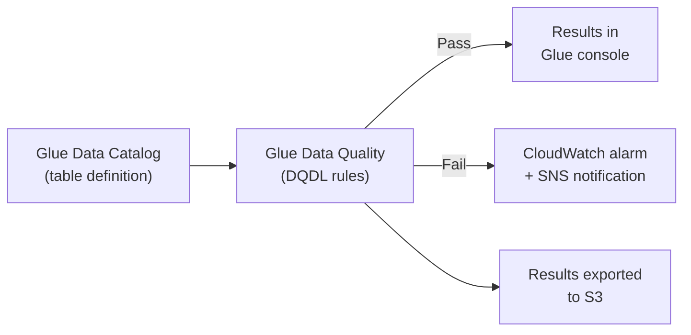
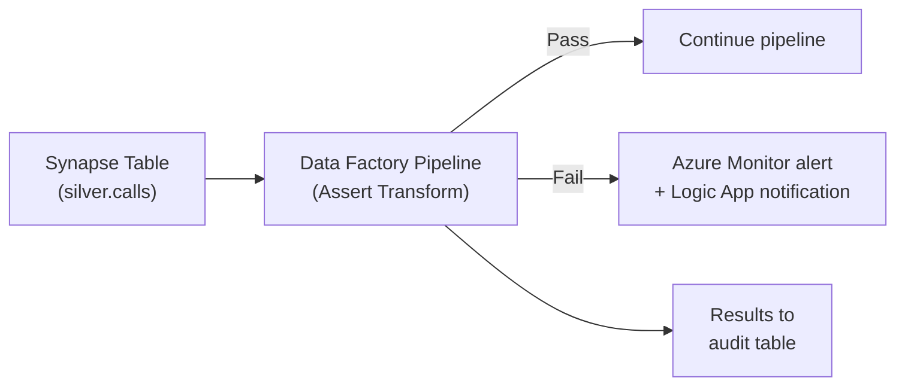
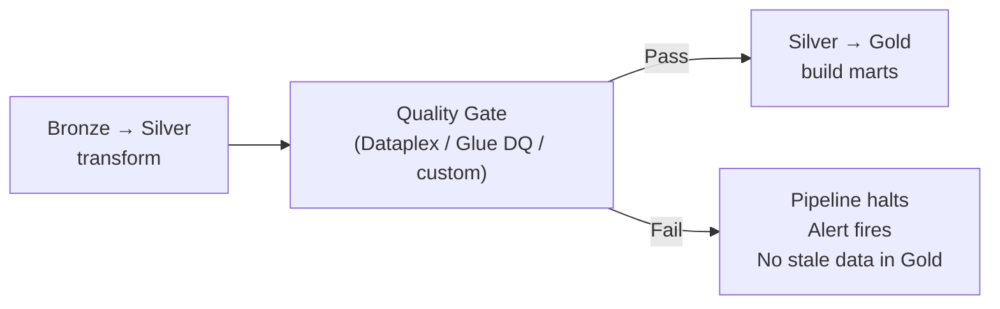

# Data Quality Tools - Cloud Walkthroughs

**How to set up automated data quality checks on GCP (Dataplex), AWS (Glue DQ), and Azure (Synapse). Console steps + API/CLI equivalents.**

---

## GCP: Dataplex Auto Data Quality

### What It Is

Dataplex Auto Data Quality runs SQL-based quality rules against BigQuery tables. Results are stored in BigQuery and visible in the Dataplex console. No infrastructure to manage.

### Architecture



### Setup via Console

**Step 1:** Navigate to Dataplex > Data Quality in the GCP Console.

**Step 2:** Create a Data Quality Scan:
- **Source:** Select your BigQuery table (`silver.calls`)
- **Schedule:** Set cadence (after each pipeline run, or on a cron schedule)
- **Rules:** Add quality rules

**Step 3:** Define rules:

| Rule Type | Configuration | What It Checks |
|---|---|---|
| **NOT_NULL** | Column: `call_id` | No null primary keys |
| **SET** | Column: `status`, Values: `in-progress, resolved, missed, voicemail, transferred` | Valid status values |
| **RANGE** | Column: `duration`, Min: `0`, Max: `28800` | Duration within bounds |
| **UNIQUENESS** | Column: `call_id`, Threshold: `1.0` | No duplicate call IDs |
| **ROW_COUNT** | Min: `100`, Max: `500000` | Expected data volume |
| **FRESHNESS** | Column: `updated_at`, Max age: `4 hours` | Data is recent |

### Setup via CLI / Terraform

```bash
# Create a data quality scan
gcloud dataplex datascans create data-quality calls-quality-scan \
    --location=us-central1 \
    --data-source-resource="//bigquery.googleapis.com/projects/PROJECT/datasets/silver/tables/calls" \
    --schedule-cron="0 3 * * *" \
    --rules-file=quality_rules.yaml
```

```yaml
# quality_rules.yaml
rules:
  - column: call_id
    nonNullExpectation: {}
    dimension: COMPLETENESS
    
  - column: call_id
    uniquenessExpectation: {}
    dimension: UNIQUENESS
    
  - column: status
    setExpectation:
      values: ["in-progress", "resolved", "missed", "voicemail", "transferred"]
    dimension: VALIDITY
    
  - column: duration
    rangeExpectation:
      minValue: "0"
      maxValue: "28800"
    dimension: VALIDITY
    
  - rowConditionExpectation:
      sqlExpression: "created_at <= CURRENT_TIMESTAMP()"
    dimension: VALIDITY
```

### Alerting

```bash
# Create Cloud Monitoring alert on DQ scan failure
gcloud monitoring policies create \
    --notification-channels=CHANNEL_ID \
    --condition-filter='resource.type="dataplex.googleapis.com/DataScan" AND metric.type="dataplex.googleapis.com/datascan/data_quality/passed" AND metric.value < 1'
```

### Cost

- Dataplex Auto DQ charges per BigQuery scan (same as running a query)
- A quality scan on a 1GB table costs ~$0.005 per run
- Running daily = ~$0.15/month per table

---

## AWS: Glue Data Quality

### What It Is

Glue Data Quality evaluates rules against data in the Glue Data Catalog (which maps to S3, Redshift, or other sources). Uses Data Quality Definition Language (DQDL).

### Architecture



### Setup

**Step 1:** In the AWS Glue Console, navigate to Data Quality.

**Step 2:** Select a table from the Data Catalog.

**Step 3:** Define DQDL rules:

```
Rules = [
    IsComplete "call_id",
    IsUnique "call_id",
    ColumnValues "status" in ["in-progress", "resolved", "missed", "voicemail", "transferred"],
    ColumnValues "duration" between 0 and 28800,
    RowCount between 100 and 500000,
    IsFresh "updated_at" with maxAge = 4 hours
]
```

**Step 4:** Run the evaluation (on-demand or scheduled via Glue Workflow / EventBridge).

### Recommendation Engine

Glue DQ has a unique feature: it can **analyze your data and recommend rules** automatically.

```bash
# Generate recommended rules
aws glue start-data-quality-rule-recommendation-run \
    --data-source '{"GlueTable": {"DatabaseName": "silver", "TableName": "calls"}}' \
    --role arn:aws:iam::123456789:role/GlueRole
```

This scans the data and suggests rules like "call_id is always unique" or "duration is between 0 and 7200 based on observed data."

### Cost

- Glue DQ charges per Data Processing Unit (DPU) hour
- A quality evaluation on a small table = ~$0.44 per run (1 DPU for ~1 minute)
- Running daily = ~$13/month per table

---

## Azure: Synapse Data Quality

### What It Is

Azure doesn't have a dedicated "data quality" service like Dataplex or Glue DQ. Instead, you build quality checks using:

1. **Synapse Pipelines** — data flow validation activities
2. **Data Factory** — mapping data flow with assert transforms
3. **Microsoft Purview** — data governance (catalog, lineage, not quality rules)
4. **Custom SQL** — stored procedures that run quality checks

### Architecture



### Data Factory Assert Transform

In a Mapping Data Flow, add an **Assert** transformation:

| Assert Type | Configuration | What It Checks |
|---|---|---|
| **isNotNull** | Column: `call_id` | No null primary keys |
| **isUnique** | Column: `call_id` | No duplicates |
| **isIn** | Column: `status`, Values: list | Valid status values |
| **between** | Column: `duration`, Min: 0, Max: 28800 | Range check |
| **expression** | `created_at <= current_timestamp()` | Custom SQL expression |

### Custom SQL Approach (Simpler)

```sql
-- Synapse stored procedure for quality checks
CREATE PROCEDURE pipeline.run_quality_checks
AS
BEGIN
    DECLARE @failures INT = 0;
    
    -- Check 1: No null call_ids
    IF EXISTS (SELECT 1 FROM silver.calls WHERE call_id IS NULL)
    BEGIN
        INSERT INTO pipeline.quality_log VALUES ('null_call_id', GETDATE(), 'FAIL');
        SET @failures = @failures + 1;
    END
    ELSE
        INSERT INTO pipeline.quality_log VALUES ('null_call_id', GETDATE(), 'PASS');
    
    -- Check 2: No duplicates
    IF EXISTS (
        SELECT call_id FROM silver.calls 
        GROUP BY call_id HAVING COUNT(*) > 1
    )
    BEGIN
        INSERT INTO pipeline.quality_log VALUES ('duplicate_call_id', GETDATE(), 'FAIL');
        SET @failures = @failures + 1;
    END
    ELSE
        INSERT INTO pipeline.quality_log VALUES ('duplicate_call_id', GETDATE(), 'PASS');
    
    -- Raise error if any checks failed (halts pipeline)
    IF @failures > 0
        THROW 50001, 'Data quality checks failed', 1;
END;
```

---

## Cross-Cloud Comparison

| Feature | GCP Dataplex | AWS Glue DQ | Azure (custom) |
|---|---|---|---|
| **Dedicated DQ service** | Yes | Yes | No (use Data Factory + SQL) |
| **Rule language** | YAML / SQL | DQDL | SQL / Data Flow config |
| **Auto-recommend rules** | No | Yes | No |
| **Schedule** | Cron or on-demand | Glue Workflow / EventBridge | Pipeline trigger |
| **Results storage** | BigQuery | S3 | Custom table |
| **Alerting** | Cloud Monitoring | CloudWatch + SNS | Azure Monitor |
| **Cost per daily check** | ~$0.15/month/table | ~$13/month/table | Included in Synapse compute |
| **Setup complexity** | Low | Low | Medium (build your own) |

---

## Integrating with Your Pipeline

Regardless of cloud, the quality check fits in the same place:



The quality gate runs BETWEEN Silver and Gold. If Silver data doesn't meet expectations, Gold marts don't rebuild. Dashboards show yesterday's clean data instead of today's corrupt data.

---

## Quick Links

| Chapter | Topic |
|---|---|
| [02 - Tools Compared](02_Tools_Compared.md) | Feature comparison matrix |
| [03 - Building It](03_Building_It.md) | Great Expectations, dbt tests, custom Python |
| [04 - Cloud Walkthroughs](04_Cloud_Walkthroughs.md) | This page |
| [01 - Why](01_Why.md) | Why automated quality checks matter |
