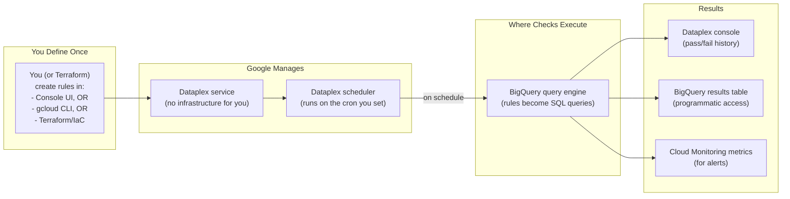
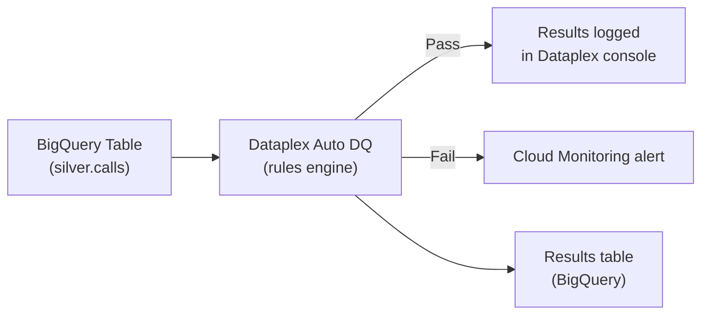
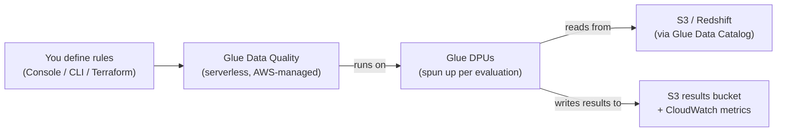
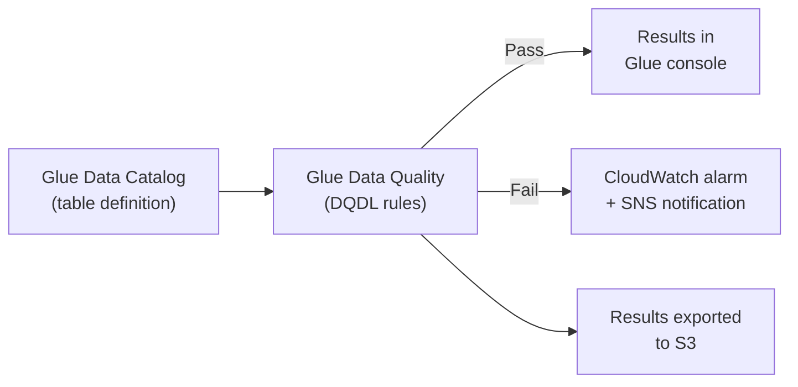
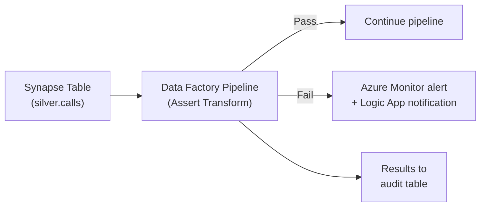
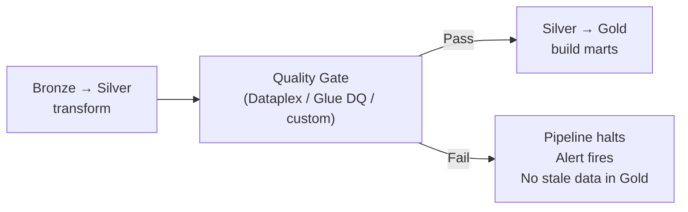

# Data Quality Tools - Cloud Walkthroughs

**How to set up automated data quality checks on GCP (Dataplex), AWS (Glue DQ), and Azure (Synapse). Console steps + API/CLI equivalents.**

---

## GCP: Dataplex Auto Data Quality

### What It Is

Dataplex Auto Data Quality runs SQL-based quality rules against BigQuery tables. **Unlike Great Expectations or dbt, you don't write code or run anything yourself** — you define rules once (in the console, CLI, or Terraform), and Google's managed service runs them on a schedule and stores results.

### Where It Runs



**The key idea:** A Dataplex scan is **not code that you deploy**. It's a configuration object stored in GCP. Once created, it runs on the schedule you set. You see results in the Dataplex console. No DAG, no worker, no Airflow needed (unless you want to gate downstream tasks on the result — see "Trigger from Airflow" below).

### Architecture



### Setup via Console (One-Time)

**Step 1:** Navigate to Dataplex > Data Quality in the GCP Console.

**Step 2:** Create a Data Quality Scan:
- **Source:** Select your BigQuery table (e.g., `silver.calls`)
- **Schedule:** Set cadence — "On-demand" (you trigger it) or cron (e.g., `0 3 * * *` for daily 3 AM)
- **Rules:** Add quality rules (next step)

**Step 3:** Define rules:

| Rule Type | Configuration | What It Checks |
|---|---|---|
| **NOT_NULL** | Column: `call_id` | No null primary keys |
| **SET** | Column: `status`, Values: `in-progress, resolved, missed, voicemail, transferred` | Valid status values |
| **RANGE** | Column: `duration`, Min: `0`, Max: `28800` | Duration within bounds |
| **UNIQUENESS** | Column: `call_id`, Threshold: `1.0` | No duplicate call IDs |
| **ROW_COUNT** | Min: `100`, Max: `500000` | Expected data volume |
| **FRESHNESS** | Column: `updated_at`, Max age: `4 hours` | Data is recent |

### Setup via CLI / Terraform

```bash
# Create a data quality scan
gcloud dataplex datascans create data-quality calls-quality-scan \
    --location=us-central1 \
    --data-source-resource="//bigquery.googleapis.com/projects/PROJECT/datasets/silver/tables/calls" \
    --schedule-cron="0 3 * * *" \
    --rules-file=quality_rules.yaml
```

```yaml
# quality_rules.yaml
rules:
  - column: call_id
    nonNullExpectation: {}
    dimension: COMPLETENESS
    
  - column: call_id
    uniquenessExpectation: {}
    dimension: UNIQUENESS
    
  - column: status
    setExpectation:
      values: ["in-progress", "resolved", "missed", "voicemail", "transferred"]
    dimension: VALIDITY
    
  - column: duration
    rangeExpectation:
      minValue: "0"
      maxValue: "28800"
    dimension: VALIDITY
    
  - rowConditionExpectation:
      sqlExpression: "created_at <= CURRENT_TIMESTAMP()"
    dimension: VALIDITY
```

### Alerting

```bash
# Create Cloud Monitoring alert on DQ scan failure
gcloud monitoring policies create \
    --notification-channels=CHANNEL_ID \
    --condition-filter='resource.type="dataplex.googleapis.com/DataScan" AND metric.type="dataplex.googleapis.com/datascan/data_quality/passed" AND metric.value < 1'
```

### Two Ways to Trigger a Scan

**Option A: Scheduled (Dataplex's own scheduler)**

Set a cron in the scan config (`--schedule-cron="0 3 * * *"`). Google runs it. You don't need Airflow for this. Good for: independent quality monitoring that runs regardless of pipeline state.

**Option B: Triggered from Airflow (after Silver loads)**

Use Airflow as the orchestrator and trigger Dataplex on-demand after the Silver transform finishes. Good for: gating Gold builds on quality results.

```python
# File: dags/calls_pipeline.py
# WHERE THIS LIVES: Cloud Composer DAGs bucket (gs://composer-bucket/dags/)
# 
# This DAG triggers a Dataplex scan AFTER the silver transform,
# waits for the result, and only builds Gold if quality passes.

from airflow import DAG
from airflow.providers.google.cloud.operators.dataplex import (
    DataplexRunDataQualityScanOperator,
    DataplexGetDataQualityScanResultOperator,
)
from airflow.operators.empty import EmptyOperator
from datetime import datetime

dag = DAG(
    dag_id="calls_pipeline_dataplex",
    schedule="0 2 * * *",
    start_date=datetime(2026, 4, 1),
    catchup=False,
)

# Task 1: Transform Bronze → Silver (your existing transform)
transform_silver = EmptyOperator(task_id="transform_silver", dag=dag)

# Task 2: Trigger the Dataplex Auto DQ scan
# WHY: This kicks off the scan you defined in the console/CLI.
# It returns a job_id you can wait on.
trigger_quality_scan = DataplexRunDataQualityScanOperator(
    task_id="trigger_quality_scan",
    project_id="my-project",
    region="us-central1",
    data_scan_id="calls-quality-scan",  # The scan you created in the console
    dag=dag,
)

# Task 3: Wait for the scan to complete and check result
# WHY: The trigger above starts the scan but doesn't wait for it.
# This operator polls until the scan finishes, then fails if any rules failed.
get_scan_result = DataplexGetDataQualityScanResultOperator(
    task_id="get_scan_result",
    project_id="my-project",
    region="us-central1",
    data_scan_id="calls-quality-scan",
    job_id="{{ ti.xcom_pull(task_ids='trigger_quality_scan')['job']['name'].split('/')[-1] }}",
    fail_on_dq_failure=True,  # KEY: fails the Airflow task if quality rules failed
    dag=dag,
)

# Task 4: Build Gold (only runs if quality scan passed)
build_gold = EmptyOperator(task_id="build_gold", dag=dag)

# Pipeline order
transform_silver >> trigger_quality_scan >> get_scan_result >> build_gold
```

### Cost

- Dataplex Auto DQ charges per BigQuery scan (same as running a query)
- A quality scan on a 1GB table costs ~$0.005 per run
- Running daily = ~$0.15/month per table

---

## AWS: Glue Data Quality

### What It Is

Glue Data Quality evaluates rules against data in the Glue Data Catalog (which maps to S3, Redshift, or other sources). Uses Data Quality Definition Language (DQDL).

### Where It Runs

Same model as Dataplex — **AWS manages the execution**. You define DQDL rules once (Glue Console, CLI, or Terraform), and they run on Glue's serverless infrastructure (DPUs — Data Processing Units). No EC2, no Spark cluster for you to manage.



**Two ways to trigger:**
- **Glue Workflow / EventBridge schedule** — managed cron, no Airflow needed
- **From Airflow** — `GlueDataQualityRuleSetEvaluationRunOperator` from `apache-airflow-providers-amazon`

### Architecture



### Setup

**Step 1:** In the AWS Glue Console, navigate to Data Quality.

**Step 2:** Select a table from the Data Catalog.

**Step 3:** Define DQDL rules:

```
Rules = [
    IsComplete "call_id",
    IsUnique "call_id",
    ColumnValues "status" in ["in-progress", "resolved", "missed", "voicemail", "transferred"],
    ColumnValues "duration" between 0 and 28800,
    RowCount between 100 and 500000,
    IsFresh "updated_at" with maxAge = 4 hours
]
```

**Step 4:** Run the evaluation (on-demand or scheduled via Glue Workflow / EventBridge).

### Recommendation Engine

Glue DQ has a unique feature: it can **analyze your data and recommend rules** automatically.

```bash
# Generate recommended rules
aws glue start-data-quality-rule-recommendation-run \
    --data-source '{"GlueTable": {"DatabaseName": "silver", "TableName": "calls"}}' \
    --role arn:aws:iam::123456789:role/GlueRole
```

This scans the data and suggests rules like "call_id is always unique" or "duration is between 0 and 7200 based on observed data."

### Cost

- Glue DQ charges per Data Processing Unit (DPU) hour
- A quality evaluation on a small table = ~$0.44 per run (1 DPU for ~1 minute)
- Running daily = ~$13/month per table

---

## Azure: Synapse Data Quality

### What It Is

Azure doesn't have a dedicated "data quality" service like Dataplex or Glue DQ. Instead, you build quality checks using:

1. **Synapse Pipelines** — data flow validation activities
2. **Data Factory** — mapping data flow with assert transforms
3. **Microsoft Purview** — data governance (catalog, lineage, not quality rules)
4. **Custom SQL** — stored procedures that run quality checks

### Where It Runs

| Approach | Where It Lives | Where It Executes | Triggered By |
|---|---|---|---|
| Data Factory Assert | Data flow inside an ADF pipeline | ADF integration runtime (managed by Azure) | ADF schedule or external trigger |
| Synapse stored procedure | Synapse SQL pool | Synapse compute (your warehouse) | Synapse Pipeline activity, Airflow `MsSqlOperator`, or schedule |
| Custom Python | Azure Functions or Synapse Spark notebook | Function runtime or Spark pool | Function trigger, ADF schedule, or Airflow |

**The pattern is the same:** Define checks once. Trigger them either via Azure's native scheduler (ADF Pipeline) or from Airflow. Azure runs the check; results land in a log table or Azure Monitor.

### Architecture



### Data Factory Assert Transform

In a Mapping Data Flow, add an **Assert** transformation:

| Assert Type | Configuration | What It Checks |
|---|---|---|
| **isNotNull** | Column: `call_id` | No null primary keys |
| **isUnique** | Column: `call_id` | No duplicates |
| **isIn** | Column: `status`, Values: list | Valid status values |
| **between** | Column: `duration`, Min: 0, Max: 28800 | Range check |
| **expression** | `created_at <= current_timestamp()` | Custom SQL expression |

### Custom SQL Approach (Simpler)

```sql
-- Synapse stored procedure for quality checks
CREATE PROCEDURE pipeline.run_quality_checks
AS
BEGIN
    DECLARE @failures INT = 0;
    
    -- Check 1: No null call_ids
    IF EXISTS (SELECT 1 FROM silver.calls WHERE call_id IS NULL)
    BEGIN
        INSERT INTO pipeline.quality_log VALUES ('null_call_id', GETDATE(), 'FAIL');
        SET @failures = @failures + 1;
    END
    ELSE
        INSERT INTO pipeline.quality_log VALUES ('null_call_id', GETDATE(), 'PASS');
    
    -- Check 2: No duplicates
    IF EXISTS (
        SELECT call_id FROM silver.calls 
        GROUP BY call_id HAVING COUNT(*) > 1
    )
    BEGIN
        INSERT INTO pipeline.quality_log VALUES ('duplicate_call_id', GETDATE(), 'FAIL');
        SET @failures = @failures + 1;
    END
    ELSE
        INSERT INTO pipeline.quality_log VALUES ('duplicate_call_id', GETDATE(), 'PASS');
    
    -- Raise error if any checks failed (halts pipeline)
    IF @failures > 0
        THROW 50001, 'Data quality checks failed', 1;
END;
```

---

## Cross-Cloud Comparison

| Feature | GCP Dataplex | AWS Glue DQ | Azure (custom) |
|---|---|---|---|
| **Dedicated DQ service** | Yes | Yes | No (use Data Factory + SQL) |
| **Rule language** | YAML / SQL | DQDL | SQL / Data Flow config |
| **Auto-recommend rules** | No | Yes | No |
| **Schedule** | Cron or on-demand | Glue Workflow / EventBridge | Pipeline trigger |
| **Results storage** | BigQuery | S3 | Custom table |
| **Alerting** | Cloud Monitoring | CloudWatch + SNS | Azure Monitor |
| **Cost per daily check** | ~$0.15/month/table | ~$13/month/table | Included in Synapse compute |
| **Setup complexity** | Low | Low | Medium (build your own) |

---

## Integrating with Your Pipeline

Regardless of cloud, the quality check fits in the same place:



The quality gate runs BETWEEN Silver and Gold. If Silver data doesn't meet expectations, Gold marts don't rebuild. Dashboards show yesterday's clean data instead of today's corrupt data.

---

## Quick Links

| Chapter | Topic |
|---|---|
| [02 - Tools Compared](02_Tools_Compared.md) | Feature comparison matrix |
| [03 - Building It](03_Building_It.md) | Great Expectations, dbt tests, custom Python |
| [04 - Cloud Walkthroughs](04_Cloud_Walkthroughs.md) | This page |
| [01 - Why](01_Why.md) | Why automated quality checks matter |
