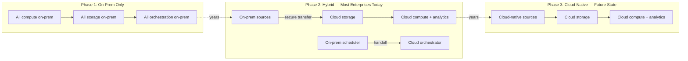
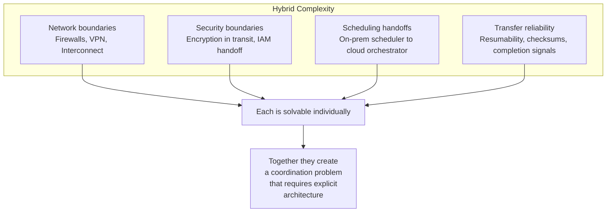

# Hybrid Data Movement - Why It Matters

**The hardest part of a cloud data platform isn't BigQuery or Spark. It's getting data from Point A to Point B reliably, securely, on schedule, every day, without breaking the production systems that run the business.**

---

## The 200-Source Problem

A financial services company has 200 source systems on-prem. Mainframes, Oracle databases, flat-file drops from vendors, internal APIs, and batch extracts from systems that were installed before anyone on the current team was hired. The analytics team moves to the cloud. They stand up BigQuery, build dbt models, deploy dashboards. The executives love the demos.

Then they try to connect it to real data.

The Oracle extract takes four hours and can only run after the nightly batch closes at 2 AM. The mainframe team won't expose a direct connection — they'll produce a flat file, dropped to a shared NFS mount, sometime between midnight and 4 AM. The vendor feed arrives via SFTP with no guaranteed delivery time and no retry mechanism. Three of the API systems require VPN tunnels that the network team provisions on a six-week lead time. The enterprise scheduler (AutoSys) controls the extraction sequence, and its job dependencies are a graph that no single person fully understands.

Six months later, the cloud platform is live — but the team spends 60% of its time managing data movement. The transforms are clean. The warehouse is fast. The problem is the space between.

---

## Why Hybrid Is the Reality

The industry narrative says "move to the cloud." The reality in most enterprises is that full cloud migration takes three to seven years. During that window — which is most of the time — you're hybrid.

The dangerous assumption is that hybrid is temporary. In practice, enterprises operate in Phase 2 for the majority of their cloud journey. Some systems will never migrate — mainframes with 30 years of COBOL, vendor appliances with contractual hosting requirements, regulated systems that require on-prem data residency. The hybrid architecture isn't a waypoint. It's the operating model.

---

## What Makes This Harder Than You'd Expect

Moving data from on-prem to cloud introduces problems that don't exist in either environment alone.

### Network Boundaries

On-prem systems sit behind firewalls, NAT gateways, and private IP Address (IP) ranges. Cloud services expect public endpoints or Virtual Private Cloud (VPC) peering. Bridging the two requires VPN tunnels, dedicated interconnects, or partner interconnects — each with different latency, bandwidth, cost, and provisioning timelines.

### Security Boundaries

Data at rest on-prem is governed by one set of controls. Data in transit crosses network boundaries where encryption, certificate management, and key rotation become mandatory. Data at rest in the cloud is governed by a different set of Identity and Access Management (IAM) policies, encryption keys, and audit logs. The seam between the two is where compliance gaps appear.

### Scheduling Handoffs

On-prem pipelines are orchestrated by enterprise schedulers: AutoSys, Control-M, Tidal Enterprise Scheduler (Tidal). These tools manage thousands of job dependencies, have SLA monitoring built in, and are deeply integrated with on-prem infrastructure. Cloud pipelines use different orchestrators: Cloud Composer (managed Apache Airflow on Google Cloud Platform (GCP)), Amazon Managed Workflows for Apache Airflow (MWAA), or Azure Data Factory. The handoff between the two — on-prem scheduler completes extraction, cloud orchestrator detects the output and begins processing — is the most fragile point in the entire system.

### Transfer Reliability

Moving multi-gigabyte files across a Wide Area Network (WAN) link introduces failure modes that don't exist in local storage: partial uploads, connection drops, checksum mismatches, and transfer timeouts. Unlike a local `cp` command, cloud transfers need resumability, integrity verification, and explicit completion signaling.

### Two CI/CD Pipelines

On-prem deployments go through Jenkins with IBM UrbanCode Deploy (UDeploy) or similar release management tools. Cloud deployments go through GitHub Actions, GitLab Continuous Integration/Continuous Deployment (CI/CD), or Harness. The same codebase — or related codebases — must flow through two different deployment systems with different approval gates, artifact stores, and rollback mechanisms. This isn't a tooling decision. It's an organizational boundary that affects how fast you can ship fixes when data movement breaks at 3 AM.

---

## The Architect's Responsibility

Hybrid data movement is not a DevOps problem, not a network problem, and not a cloud engineering problem. It's an architecture problem. The architect must design for:

| Concern | Question |
|---|---|
| **Reliability** | What happens when the transfer fails at 80% completion? |
| **Observability** | How do you know the 2 AM extraction succeeded before the 6 AM dashboard refresh? |
| **Security** | Who holds the encryption keys, and how are they rotated without downtime? |
| **Ordering** | If yesterday's data hasn't arrived, should today's pipeline run anyway? |
| **Cost** | Are you paying for a dedicated interconnect that runs at 5% utilization 23 hours a day? |
| **Migration path** | When this source system moves to the cloud next year, how much of this pipeline do you throw away? |

The chapters that follow cover the patterns, implementations, and cloud-specific services that address these concerns.

---

## Quick Links

| Resource | Link |
|---|---|
| Patterns (next chapter) | [02_Patterns.md](02_Patterns.md) |
| Building It | [03_Building_It.md](03_Building_It.md) |
| Cloud Walkthroughs | [04_Cloud_Walkthroughs.md](04_Cloud_Walkthroughs.md) |
| CTL/TOC protocol reference | [../ingestion/06_Production_Patterns.md](../ingestion/06_Production_Patterns.md) |
| Ingestion fundamentals | [../ingestion/01_Why.md](../ingestion/01_Why.md) |
