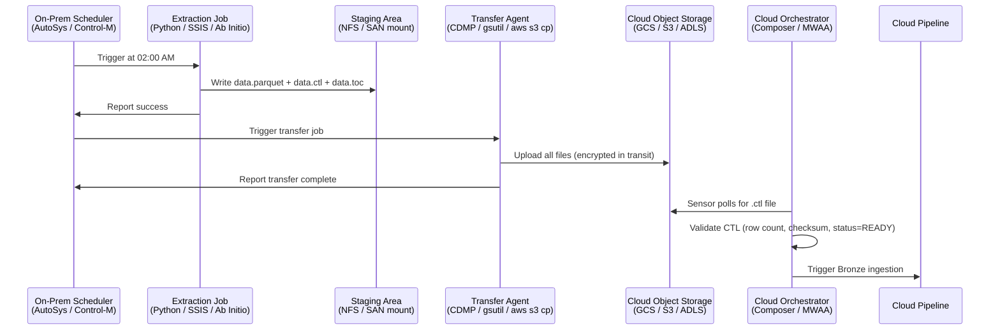
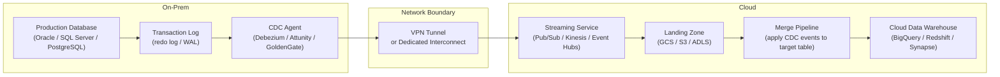
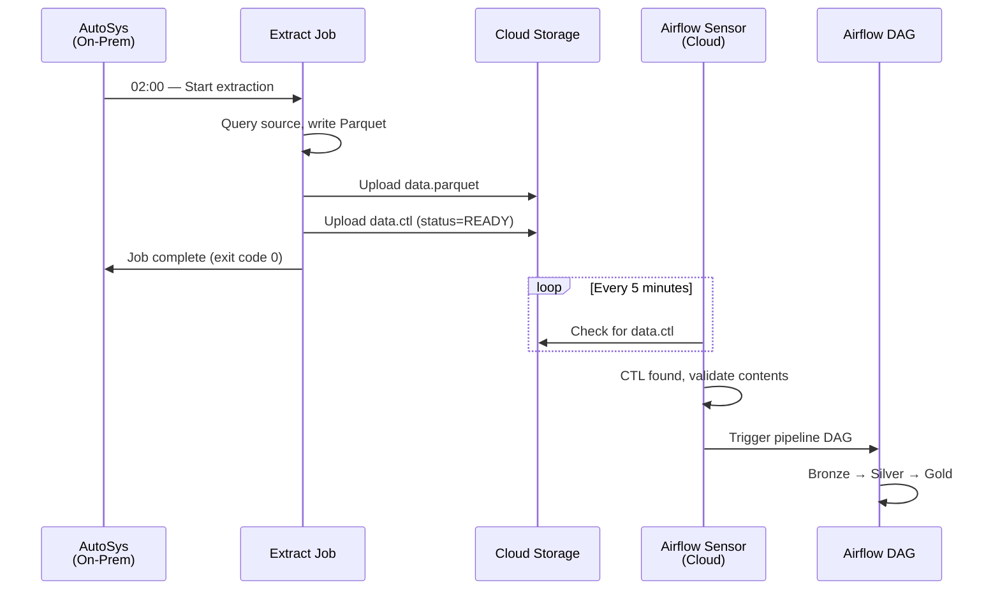
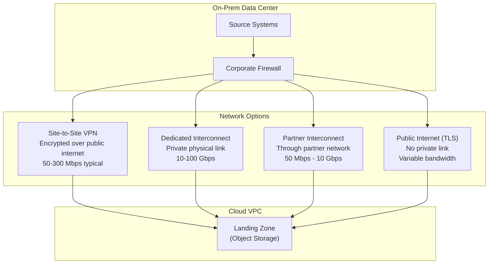

# Hybrid Data Movement - Patterns

**Three transfer patterns, two scheduling models, three network topologies, and two CI/CD pipelines. Every hybrid architecture is a combination of these building blocks.**

---

## Pattern 1: File-Based Transfer

The most common pattern in enterprise hybrid architectures. An on-prem process extracts data to files, transfers them to cloud object storage, and a cloud pipeline picks them up.

This pattern survives because it decouples the source system from the cloud platform. The on-prem team produces files. The cloud team consumes files. Neither needs to know the other's stack.



### File Triplet: Data + CTL + TOC

Production file transfers use the Control File (CTL) / Table of Contents (TOC) protocol. Each batch produces three files:

| File | Purpose | Example |
|---|---|---|
| `data_20260415.parquet` | The actual data | Parquet, CSV, or JSON Lines (JSONL) |
| `data_20260415.ctl` | Batch metadata: row count, checksum, status flag | Proves the transfer is complete |
| `data_20260415.toc` | Schema definition: column names and types | Catches schema drift before loading |

The cloud sensor watches for the CTL file. If the CTL file exists and its status is `READY`, the batch is safe to process. If only the data file exists (no CTL), the transfer may be incomplete — the pipeline waits.

For full CTL/TOC implementation details, see [../ingestion/06_Production_Patterns.md](../ingestion/06_Production_Patterns.md).

### Transfer Tools

| Tool | Vendor | Strength | Use Case |
|---|---|---|---|
| **Cloud Data Migration Program (CDMP)** | Enterprise | Managed transfer with retry, checksums, audit trail | Regulated industries with compliance requirements |
| **Storage Transfer Service** | GCP | Scheduled, managed, supports on-prem agent | Recurring transfers to Google Cloud Storage (GCS) |
| **DataSync** | Amazon Web Services (AWS) | Agent-based, incremental, encryption | Recurring transfers to Simple Storage Service (S3) |
| **AzCopy** | Microsoft Azure | Command-line, supports Azure Active Directory (AAD) auth | Transfers to Azure Data Lake Storage (ADLS) |
| **gsutil rsync** | GCP | rsync-like semantics for GCS | Ad-hoc and scripted transfers to GCS |
| **aws s3 cp / sync** | AWS | AWS Command Line Interface (CLI), supports multipart upload | Scripted transfers to S3 |
| **rsync + SSH** | Open source | Universally available, incremental | Small-scale or development transfers |

---

## Pattern 2: Database Replication (CDC)

Change Data Capture (CDC) streams row-level changes from an on-prem database to the cloud. Instead of extracting full snapshots, the pipeline captures inserts, updates, and deletes as they happen.

This pattern is essential when the source database is too large for full extracts, when near-real-time data is required, or when the source team refuses batch extraction windows because of production database load.



### CDC Considerations

| Concern | Detail |
|---|---|
| **Initial load** | CDC captures changes, not history. You need a one-time full snapshot before CDC starts streaming deltas. |
| **Schema evolution** | When the source adds a column, the CDC stream changes. The merge pipeline must handle schema drift. |
| **Delete handling** | CDC captures deletes as events. The merge pipeline must decide: hard delete, soft delete (flag), or ignore. |
| **Ordering** | Events must be applied in order. Out-of-order application corrupts the target table. |
| **Network dependency** | Unlike file transfer, CDC is a persistent connection. Network interruptions require re-sync or replay from a checkpoint. |

### Cloud-Managed CDC Services

| Service | Cloud | Source Support | Target |
|---|---|---|---|
| **Datastream** | GCP | Oracle, MySQL, PostgreSQL, SQL Server | GCS, BigQuery |
| **Database Migration Service (DMS)** | AWS | Oracle, SQL Server, PostgreSQL, MySQL, MongoDB | S3, Kinesis, Redshift |
| **Azure Database Migration Service** | Azure | SQL Server, Oracle, MySQL, PostgreSQL | Azure SQL, Cosmos DB |
| **Debezium** | Self-managed | Most relational databases, MongoDB | Kafka (then route anywhere) |

---

## Pattern 3: API Gateway

On-prem systems expose APIs. Cloud pipelines call them through a secure gateway. This pattern works when the source system already has an Application Programming Interface (API) and when the data volume per request is moderate (typically under 100 MB per call).

### Architecture Variants

| Variant | How It Works | When to Use |
|---|---|---|
| **Forward proxy** | Cloud pipeline calls on-prem API through VPN/Interconnect | Source system has REST/GraphQL API, moderate volume |
| **Reverse proxy** | On-prem API gateway publishes to a cloud-accessible endpoint (through DMZ) | Security team won't allow inbound connections to the corporate network |
| **API bridge** | On-prem service pushes data to a cloud API endpoint (e.g., Pub/Sub, API Gateway + Lambda/Cloud Functions) | Source team prefers push over pull |

### When API Gateway Is the Wrong Pattern

- Data volume exceeds what HTTP can handle efficiently (multi-GB datasets)
- Source system has no API and building one is not in scope
- Latency requirements are sub-second (use CDC/streaming instead)
- The source API has aggressive rate limits that make full extraction impractical

---

## Scheduling Handoff

The scheduling handoff is where the on-prem world meets the cloud world. It's the most fragile point in a hybrid pipeline.

### How It Works

On-prem enterprise schedulers (AutoSys, Control-M, Tidal) manage job dependencies across hundreds of systems. They know that Job A must finish before Job B starts. They handle retries, alerting, and Service Level Agreement (SLA) tracking. Cloud orchestrators (Cloud Composer, MWAA, Azure Data Factory) do the same thing on the cloud side.

The handoff happens through a file signal: the on-prem scheduler completes extraction, writes a CTL file to cloud storage, and the cloud orchestrator's sensor detects the file and triggers the downstream pipeline.



### Handoff Failure Modes

| Failure | Symptom | Mitigation |
|---|---|---|
| **Extraction fails** | No CTL file appears | Sensor times out after SLA window, alert fires |
| **Transfer fails mid-upload** | Data file exists, no CTL file | Sensor correctly waits — CTL is the completion signal |
| **CTL arrives but data is corrupt** | CTL checksum doesn't match data file | Validation step rejects batch, quarantines files, alerts |
| **Extraction runs late** | CTL arrives after SLA deadline | SLA monitoring triggers alert; pipeline runs late but correctly |
| **Duplicate CTL (re-run)** | Same date partition overwritten | Idempotent pipeline handles gracefully (overwrite, not append) |

---

## Network Architecture

The network between on-prem and cloud determines the bandwidth, latency, reliability, and security of every data transfer.



### When to Use Each

| Option | Bandwidth | Latency | Cost | Provisioning | Use When |
|---|---|---|---|---|---|
| **Site-to-Site VPN** | 50-300 Mbps | Variable (internet) | Low (no hardware) | Days | Transfer volume < 500 GB/day, cost-sensitive |
| **Dedicated Interconnect** | 10-100 Gbps | Low, consistent | High (physical cross-connect) | 4-8 weeks | Transfer volume > 1 TB/day, latency-sensitive (CDC) |
| **Partner Interconnect** | 50 Mbps - 10 Gbps | Low-medium | Medium | 1-2 weeks | Need more bandwidth than VPN, can't justify dedicated |
| **Public Internet (TLS)** | Variable | Variable | Lowest | Immediate | Non-sensitive data, small volumes, initial testing |

### Cloud-Specific Network Services

| Capability | GCP | AWS | Azure |
|---|---|---|---|
| **VPN** | Cloud VPN | Site-to-Site VPN | VPN Gateway |
| **Dedicated link** | Dedicated Interconnect | Direct Connect | ExpressRoute |
| **Partner link** | Partner Interconnect | Direct Connect (partner) | ExpressRoute (partner) |
| **Private DNS** | Cloud DNS (private zones) | Route 53 (private hosted zones) | Azure Private DNS |
| **Private API access** | Private Google Access / VPC Service Controls | VPC Endpoints (PrivateLink) | Private Endpoints |

---

## Two CI/CD Pipelines

Hybrid architectures require two separate deployment pipelines. This isn't a choice — it's a consequence of the organizational and security boundaries between on-prem and cloud.

| Aspect | On-Prem CI/CD | Cloud CI/CD |
|---|---|---|
| **Source control** | Often Bitbucket Server or GitLab self-hosted | GitHub, GitLab SaaS, or Cloud Source Repos |
| **Build** | Jenkins (self-hosted) | GitHub Actions, Cloud Build, CodePipeline |
| **Deploy** | IBM UrbanCode Deploy (UDeploy), Octopus Deploy, Ansible | Terraform, Helm, Cloud Deploy, Harness |
| **Approval gates** | Change Advisory Board (CAB), ServiceNow tickets | Pull request reviews, automated policy checks |
| **Artifact store** | Nexus, Artifactory (on-prem) | Artifact Registry (GCP), Elastic Container Registry (ECR) (AWS), Azure Container Registry (ACR) |
| **Rollback** | Manual or scripted | Automated (Terraform state, Helm rollback) |

### Code Flow Across the Boundary

Extraction scripts that run on-prem are deployed through the on-prem CI/CD pipeline. Cloud pipeline code (Airflow Directed Acyclic Graphs (DAGs), dbt models, Cloud Functions) is deployed through the cloud CI/CD pipeline. When the extraction logic changes — new columns, new source, new schedule — both pipelines may need coordinated releases.

**The coordination risk:** If the on-prem extraction adds a column and the cloud pipeline isn't updated to expect it, the pipeline breaks. If the cloud pipeline starts expecting a column before the on-prem extraction produces it, the pipeline breaks. Feature flags, versioned schemas, and the CTL/TOC protocol reduce this risk.

---

## Code Examples: Patterns in Practice

### File Transfer (Bash — encrypted, with checksum verification)

```bash
#!/bin/bash
# WHERE THIS RUNS: On-prem Linux server, triggered by AutoSys/Control-M
# WHAT IT DOES: Transfers data + CTL + TOC to cloud storage with encryption

SOURCE_DIR="/data/extract/claims"
# GCP: gs://bucket/bronze/claims/
# AWS: s3://bucket/bronze/claims/
# Azure: https://account.blob.core.windows.net/bronze/claims/
DEST="gs://landing-bucket/bronze/claims/"

DATE=$(date +%Y%m%d)

# Transfer with checksum verification (gsutil checks MD5 automatically)
gsutil -m cp \
    ${SOURCE_DIR}/claims_${DATE}.parquet \
    ${SOURCE_DIR}/claims_${DATE}.ctl \
    ${SOURCE_DIR}/claims_${DATE}.toc \
    ${DEST}

# Verify transfer (compare source and destination checksums)
gsutil hash -m ${DEST}claims_${DATE}.parquet
echo "Transfer complete: $(date)"
```

### Airflow Sensor (Python — wait for file to land in cloud)

```python
# WHERE THIS RUNS: In your Airflow DAG (Cloud Composer / MWAA)
# WHAT IT DOES: Waits for the on-prem extraction to land the CTL file
# WHY CTL, NOT DATA: CTL is written LAST. If CTL exists, all files are complete.

from airflow.providers.google.cloud.sensors.gcs import GCSObjectExistenceSensor
# AWS: from airflow.providers.amazon.aws.sensors.s3 import S3KeySensor
# Azure: from airflow.providers.microsoft.azure.sensors.wasb import WasbBlobSensor

wait_for_file = GCSObjectExistenceSensor(
    task_id="wait_for_claims_ctl",
    bucket="landing-bucket",
    object=f"bronze/claims/claims_{{{{ ds_nodash }}}}.ctl",  # Airflow date template
    mode="reschedule",   # WHY: release the worker while waiting (don't block a slot)
    poke_interval=300,   # Check every 5 minutes
    timeout=14400,       # Give up after 4 hours (trigger SLA alert)
    dag=dag,
)
```

---

## Quick Links

| Resource | Link |
|---|---|
| Why hybrid matters | [01_Why.md](01_Why.md) |
| Building It (next chapter) | [03_Building_It.md](03_Building_It.md) |
| Cloud Walkthroughs | [04_Cloud_Walkthroughs.md](04_Cloud_Walkthroughs.md) |
| CTL/TOC protocol details | [../ingestion/06_Production_Patterns.md](../ingestion/06_Production_Patterns.md) |
