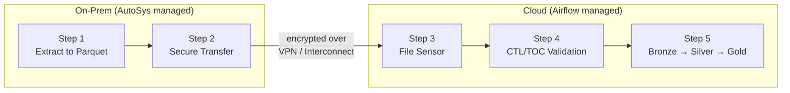
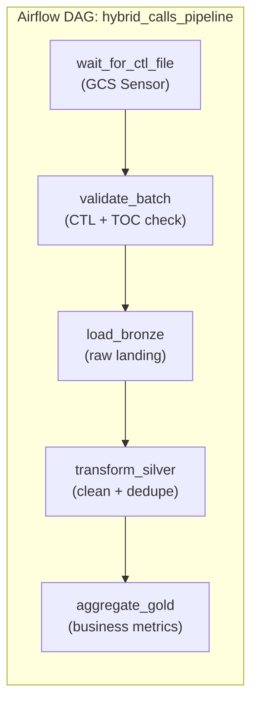

# Hybrid Data Movement - Building It

**A complete hybrid pipeline: on-prem extraction, secure transfer, cloud-side sensor, CTL/TOC validation, and the standard Bronze-Silver-Gold processing. Five steps, one Airflow DAG.**

---

## The Full Hybrid Flow

A nightly pipeline extracts call center data from an on-prem SQL Server database, transfers it to cloud object storage, and processes it through a medallion architecture. Every step is observable, every failure is recoverable, and the on-prem team doesn't need to know anything about the cloud side.



---

## Step 1: On-Prem Extraction

The extraction runs on a Linux server inside the corporate network, triggered by the enterprise scheduler. It queries the source database, writes Parquet (columnar, compressed, schema-embedded), and produces the Control File (CTL) and Table of Contents (TOC) sidecar files.

```python
"""
On-prem extraction script — runs nightly, triggered by AutoSys.
Produces three files: data Parquet, CTL (batch metadata), TOC (schema).
"""
import hashlib
import json
from datetime import datetime, timezone
import pyarrow as pa
import pyarrow.parquet as pq
import pyodbc

BATCH_DATE = datetime.now(timezone.utc).strftime("%Y%m%d")
OUTPUT_DIR = "/data/staging/calls"

# --- Extract from source ---
conn = pyodbc.connect(
    "DRIVER={ODBC Driver 17 for SQL Server};"
    "SERVER=prod-sqlserver-01;"
    "DATABASE=CallCenter;"
    "Trusted_Connection=yes;"
)

query = """
    SELECT call_id, agent_id, customer_id, call_start_utc,
           call_end_utc, disposition, channel, sentiment_score
    FROM dbo.calls
    WHERE CAST(call_start_utc AS DATE) = CAST(GETUTCDATE() - 1 AS DATE)
"""

# Read into PyArrow table (not pandas — avoids memory overhead for large extracts)
cursor = conn.cursor()
cursor.execute(query)
columns = [desc[0] for desc in cursor.description]
rows = cursor.fetchall()
table = pa.table({col: [row[i] for row in rows] for i, col in enumerate(columns)})

# --- Write Parquet ---
data_path = f"{OUTPUT_DIR}/calls_{BATCH_DATE}.parquet"
pq.write_table(table, data_path, compression="snappy")

# --- Write TOC (schema definition) ---
toc = {
    "columns": [
        {"name": field.name, "type": str(field.type)}
        for field in table.schema
    ]
}
toc_path = f"{OUTPUT_DIR}/calls_{BATCH_DATE}.toc"
with open(toc_path, "w") as f:
    json.dump(toc, f, indent=2)

# --- Compute checksum ---
with open(data_path, "rb") as f:
    checksum = hashlib.sha256(f.read()).hexdigest()

# --- Write CTL (batch metadata) — LAST, because it's the completion signal ---
ctl = {
    "batch_date": BATCH_DATE,
    "source_system": "CallCenter.dbo.calls",
    "record_count": table.num_rows,
    "file_name": f"calls_{BATCH_DATE}.parquet",
    "checksum_sha256": checksum,
    "extract_timestamp_utc": datetime.now(timezone.utc).isoformat(),
    "status": "READY"
}
ctl_path = f"{OUTPUT_DIR}/calls_{BATCH_DATE}.ctl"
with open(ctl_path, "w") as f:
    json.dump(ctl, f, indent=2)

print(f"Extraction complete: {table.num_rows} rows, checksum={checksum[:16]}...")
```

**Why the CTL file is written last:** If the process crashes between writing the data file and the CTL file, the cloud sensor will never see a CTL file — so it will never trigger processing on an incomplete batch. The CTL file is the atomic completion signal.

---

## Step 2: Secure Transfer to Cloud

After extraction, the enterprise scheduler triggers a transfer job. The transfer must be encrypted in transit, resumable on failure, and verifiable on arrival.

```bash
#!/bin/bash
# Transfer script — triggered by AutoSys after extraction job completes.
# Transfers data + TOC + CTL to cloud storage.

BATCH_DATE=$(date -u +%Y%m%d)
SOURCE_DIR="/data/staging/calls"
# GCP target (swap for AWS or Azure as needed):
TARGET="gs://landing-zone-prod/calls/${BATCH_DATE}/"

# Transfer data and TOC first, CTL last (preserves completion signal ordering)
gsutil -o "GSUtil:parallel_composite_upload_threshold=150M" \
    cp "${SOURCE_DIR}/calls_${BATCH_DATE}.parquet" "${TARGET}"

gsutil cp "${SOURCE_DIR}/calls_${BATCH_DATE}.toc" "${TARGET}"

# CTL goes last — cloud sensor triggers on this file
gsutil cp "${SOURCE_DIR}/calls_${BATCH_DATE}.ctl" "${TARGET}"

echo "Transfer complete for batch ${BATCH_DATE}"
```

### Cloud-Agnostic Transfer Commands

| Cloud | Command | Key Flags |
|---|---|---|
| **GCP** | `gsutil cp` / `gsutil rsync` | `-o GSUtil:parallel_composite_upload_threshold=150M` for large files |
| **AWS** | `aws s3 cp` / `aws s3 sync` | `--expected-size` for multipart upload tuning |
| **Azure** | `azcopy copy` | `--block-size-mb` for large file optimization |

All three encrypt in transit by default (Transport Layer Security (TLS) 1.2+). For additional security, use customer-managed encryption keys (CMEK) for encryption at rest on the cloud side.

---

## Step 3: Cloud-Side File Sensor

The Airflow Directed Acyclic Graph (DAG) uses a sensor to poll for the CTL file. When the sensor detects the file, it triggers the validation and processing tasks.

```python
"""
Airflow DAG — hybrid pipeline with file sensor.
Waits for on-prem extraction to land files in cloud storage,
validates the batch, then processes through Bronze → Silver → Gold.
"""
from datetime import datetime, timedelta
from airflow import DAG
from airflow.providers.google.cloud.sensors.gcs import GCSObjectExistenceSensor
from airflow.operators.python import PythonOperator

BATCH_DATE = "{{ ds_nodash }}"  # Airflow template: execution date as YYYYMMDD
BUCKET = "landing-zone-prod"
CTL_KEY = f"calls/{BATCH_DATE}/calls_{BATCH_DATE}.ctl"

default_args = {
    "owner": "data-platform",
    "retries": 2,
    "retry_delay": timedelta(minutes=10),
}

with DAG(
    dag_id="hybrid_calls_pipeline",
    schedule_interval="0 6 * * *",      # Run at 06:00 UTC daily
    start_date=datetime(2026, 1, 1),
    catchup=False,
    default_args=default_args,
    tags=["hybrid", "calls"],
) as dag:

    # Step 3: Sensor — wait for CTL file from on-prem extraction
    wait_for_ctl = GCSObjectExistenceSensor(
        task_id="wait_for_ctl_file",
        bucket=BUCKET,
        object=CTL_KEY,
        poke_interval=300,               # Check every 5 minutes
        timeout=14400,                    # Fail after 4 hours (SLA breach)
        mode="reschedule",               # Free up worker slot while waiting
    )
```

**Why `mode="reschedule"`:** In `poke` mode, the sensor holds a worker slot for the entire wait time (potentially hours). In `reschedule` mode, the sensor releases the worker between checks. For hybrid pipelines where the wait time is unpredictable, `reschedule` prevents worker starvation.

### Sensor Equivalents by Cloud

| Cloud | Sensor Class | Alternative (Event-Driven) |
|---|---|---|
| **GCP** | `GCSObjectExistenceSensor` | GCS Pub/Sub notification triggers Cloud Function that triggers DAG |
| **AWS** | `S3KeySensor` | S3 Event Notification triggers Lambda that triggers DAG |
| **Azure** | `WasmBlobSensor` / `AzureBlobStorageSensor` | ADLS Event Grid triggers Function App that triggers DAG |

The sensor pattern (polling) is simpler to implement and debug. The event-driven pattern is more efficient but adds components. Start with sensors; migrate to events when polling frequency or worker utilization becomes a problem.

---

## Step 4: Validate CTL/TOC Before Processing

Never process a batch without validating the control files. This is the last gate before data enters the warehouse.

```python
    # Step 4: Validate CTL and TOC
    def validate_batch(**context):
        """
        Validate CTL metadata and TOC schema before processing.
        Raises on failure — Airflow marks the task as FAILED and retries.
        """
        from google.cloud import storage
        import json
        import hashlib

        client = storage.Client()
        bucket = client.bucket(BUCKET)
        batch_date = context["ds_nodash"]
        prefix = f"calls/{batch_date}"

        # Load CTL
        ctl_blob = bucket.blob(f"{prefix}/calls_{batch_date}.ctl")
        ctl = json.loads(ctl_blob.download_as_text())

        # Verify CTL status
        if ctl["status"] != "READY":
            raise ValueError(
                f"CTL status is '{ctl['status']}', expected 'READY'. "
                f"On-prem extraction may have failed."
            )

        # Download data file and verify checksum
        data_blob = bucket.blob(f"{prefix}/calls_{batch_date}.parquet")
        data_bytes = data_blob.download_as_bytes()
        actual_checksum = hashlib.sha256(data_bytes).hexdigest()

        if actual_checksum != ctl["checksum_sha256"]:
            raise ValueError(
                f"Checksum mismatch: CTL says {ctl['checksum_sha256']}, "
                f"actual is {actual_checksum}. File may be corrupt or "
                f"transfer was incomplete."
            )

        # Verify row count
        import pyarrow.parquet as pq
        import io
        table = pq.read_table(io.BytesIO(data_bytes))
        if table.num_rows != ctl["record_count"]:
            raise ValueError(
                f"Row count mismatch: CTL says {ctl['record_count']}, "
                f"Parquet has {table.num_rows}."
            )

        # Load and validate TOC (schema)
        toc_blob = bucket.blob(f"{prefix}/calls_{batch_date}.toc")
        toc = json.loads(toc_blob.download_as_text())
        toc_columns = {col["name"] for col in toc["columns"]}
        data_columns = set(table.schema.names)

        missing = toc_columns - data_columns
        if missing:
            raise ValueError(f"Columns in TOC but not in data: {missing}")

        print(f"Validation passed: {table.num_rows} rows, "
              f"checksum verified, schema matches TOC.")

    validate = PythonOperator(
        task_id="validate_batch",
        python_callable=validate_batch,
    )
```

---

## Step 5: Standard Cloud Pipeline (Bronze to Silver to Gold)

After validation, the pipeline follows the standard medallion architecture. The hybrid-specific work is done — from here, it's the same as any cloud-native pipeline.

```python
    # Step 5: Process through medallion layers
    def load_bronze(**context):
        """Load validated Parquet into Bronze layer (raw, immutable)."""
        # Copy from landing zone to Bronze with partition
        # Add ingestion metadata: batch_date, source_system, ingestion_timestamp
        print("Bronze load complete")

    def transform_silver(**context):
        """Clean, deduplicate, apply business rules → Silver."""
        # Deduplicate by call_id
        # Normalize timestamps to UTC
        # Apply data quality rules
        # Write to Silver partition
        print("Silver transform complete")

    def aggregate_gold(**context):
        """Build business-level aggregations → Gold."""
        # Daily call volume by channel
        # Average sentiment by agent
        # SLA compliance metrics
        print("Gold aggregation complete")

    bronze = PythonOperator(task_id="load_bronze", python_callable=load_bronze)
    silver = PythonOperator(task_id="transform_silver", python_callable=transform_silver)
    gold = PythonOperator(task_id="aggregate_gold", python_callable=aggregate_gold)

    # DAG dependency chain
    wait_for_ctl >> validate >> bronze >> silver >> gold
```



---

## Operational Considerations

### Idempotency

Every step must be safe to re-run. If the DAG fails at Silver and retries, Bronze should not create duplicate records. Use partition-based overwrites (write to `date=20260415/` and overwrite), not appends.

### SLA Monitoring

The sensor has a 4-hour timeout. If the on-prem extraction typically completes by 04:00 UTC and the DAG is scheduled at 06:00 UTC, that gives a 2-hour buffer for late arrivals plus 4 hours of sensor patience. If the CTL file hasn't arrived by 10:00 UTC, the task fails and alerts fire.

### Backfill

When you need to reprocess historical data, the on-prem team must re-extract and re-transfer. The cloud side handles it: run the DAG with a specific `execution_date` and the templated paths resolve to the correct batch. This only works if the on-prem team can reproduce past extractions — which is another argument for keeping extraction logic in version control, even if it deploys through the on-prem CI/CD pipeline.

---

## Quick Links

| Resource | Link |
|---|---|
| Why hybrid matters | [01_Why.md](01_Why.md) |
| Patterns reference | [02_Patterns.md](02_Patterns.md) |
| Cloud Walkthroughs (next chapter) | [04_Cloud_Walkthroughs.md](04_Cloud_Walkthroughs.md) |
| CTL/TOC protocol details | [../ingestion/06_Production_Patterns.md](../ingestion/06_Production_Patterns.md) |
| Medallion architecture | [../lakehouse/](../lakehouse/) |
