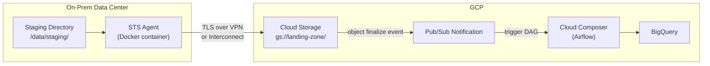
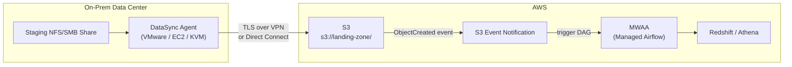
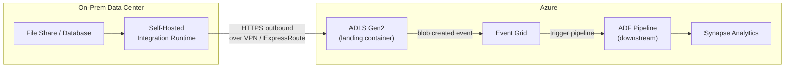
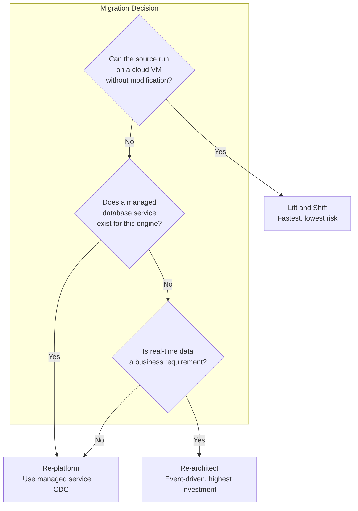

# Hybrid Data Movement - Cloud Walkthroughs

**The same hybrid pattern implemented on GCP, AWS, and Azure. Managed transfer services, dedicated network links, and orchestrator sensors — mapped across all three clouds.**

---

## A Bank Moves Its Risk Pipeline

A bank runs overnight risk calculations on-prem. The results — 50 GB of Parquet files across 30 risk models — must reach the cloud data warehouse by 06:00 for the morning risk dashboard. They've been using rsync over VPN. It works until the night the VPN tunnel drops mid-transfer and nobody notices until the Chief Risk Officer asks why the dashboard is blank.

The fix isn't "try harder with rsync." It's using managed transfer services that handle retries, checksums, and completion notifications without custom scripting.

---

## GCP Walkthrough

### Transfer: Storage Transfer Service

Storage Transfer Service (STS) provides managed, scheduled transfers from on-prem to Google Cloud Storage (GCS). It runs a transfer agent on the on-prem server that handles retry, bandwidth throttling, and integrity checks.



**Key configuration:**

| Setting | Value | Why |
|---|---|---|
| **Agent count** | 3 (for redundancy) | If one agent fails, others continue |
| **Bandwidth limit** | 500 Mbps | Prevent saturating the WAN link during business hours |
| **Schedule** | Daily 02:00-05:00 UTC | Align with on-prem extraction completion window |
| **Manifest file** | Enabled | Lists exactly which files to transfer — no surprises |

### Network: Cloud Interconnect

For persistent, high-bandwidth connectivity:

- **Dedicated Interconnect** provisions a physical cross-connect at a colocation facility. Provides 10 Gbps or 100 Gbps circuits with 99.99% availability (when using redundant connections). Provisioning takes 4-8 weeks and requires a colocation presence.
- **Partner Interconnect** uses a service provider's network. Available at 50 Mbps to 10 Gbps. Faster to provision (1-2 weeks). No colocation required.

### Security: VPC Service Controls

VPC Service Controls create a security perimeter around GCP resources. Data inside the perimeter cannot be exfiltrated to unauthorized projects or the public internet — even by a compromised service account.

For hybrid pipelines, configure the perimeter to allow ingress from the on-prem IP ranges (through the Interconnect) while blocking all other external access to the landing zone bucket.

### Orchestration: Cloud Composer Sensors

```python
# GCS sensor in Cloud Composer (managed Airflow)
from airflow.providers.google.cloud.sensors.gcs import GCSObjectExistenceSensor

wait_for_file = GCSObjectExistenceSensor(
    task_id="wait_for_risk_ctl",
    bucket="landing-zone-prod",
    object="risk/{{ ds_nodash }}/risk_{{ ds_nodash }}.ctl",
    poke_interval=300,        # Check every 5 minutes
    timeout=14400,            # 4-hour SLA window
    mode="reschedule",        # Release worker while waiting
)
```

**Event-driven alternative:** Configure a GCS Pub/Sub notification on the `OBJECT_FINALIZE` event for `.ctl` files. A Cloud Function subscribed to the topic triggers the Composer DAG via the Airflow REST API. This eliminates polling but adds two components (Pub/Sub topic + Cloud Function) to maintain.

---

## AWS Walkthrough

### Transfer: DataSync

AWS DataSync is an agent-based transfer service that handles bandwidth negotiation, compression, integrity verification, and incremental transfers.



**DataSync vs Transfer Family:**

| Service | Protocol | Use Case |
|---|---|---|
| **DataSync** | Agent-based (NFS, SMB, HDFS, self-managed object storage) | Bulk file migration and recurring scheduled transfers |
| **Transfer Family** | SFTP, FTPS, FTP (managed server) | When the source system only speaks SFTP (legacy vendor feeds) |

### Network: Direct Connect

AWS Direct Connect provides a dedicated network connection from on-prem to AWS.

| Option | Bandwidth | Lead Time |
|---|---|---|
| **Dedicated connection** | 1 Gbps, 10 Gbps, or 100 Gbps | 4-8 weeks |
| **Hosted connection** | 50 Mbps to 10 Gbps (from partner) | 1-2 weeks |

For high availability, provision two Direct Connect connections in different locations and configure Border Gateway Protocol (BGP) failover. Without redundancy, a single fiber cut takes down the entire hybrid pipeline.

### Security: VPC Endpoints and PrivateLink

Use S3 Gateway Endpoints to route traffic from the Virtual Private Cloud (VPC) to S3 without traversing the public internet. Combined with S3 Bucket Policies that deny access from non-VPC sources, this ensures that landing zone data is only accessible through the private network path.

### Orchestration: MWAA Sensors

```python
# S3 sensor in Amazon Managed Workflows for Apache Airflow (MWAA)
from airflow.providers.amazon.aws.sensors.s3 import S3KeySensor

wait_for_file = S3KeySensor(
    task_id="wait_for_risk_ctl",
    bucket_name="landing-zone-prod",
    bucket_key="risk/{{ ds_nodash }}/risk_{{ ds_nodash }}.ctl",
    poke_interval=300,
    timeout=14400,
    mode="reschedule",
)
```

**Event-driven alternative:** Configure S3 Event Notifications to send `s3:ObjectCreated:*` events (filtered to `.ctl` suffix) to an Amazon Simple Queue Service (SQS) queue or AWS Lambda function. Lambda calls the MWAA Application Programming Interface (API) to trigger the DAG.

---

## Azure Walkthrough

### Transfer: Self-Hosted Integration Runtime

Azure Data Factory (ADF) uses a Self-Hosted Integration Runtime (SHIR) — a Windows or Linux agent installed on-prem — to bridge the network boundary. SHIR connects outbound to ADF over HTTPS (no inbound firewall rules needed) and executes copy activities that move data from on-prem sources to Azure Data Lake Storage (ADLS).



**AzCopy for scripted transfers:**

```bash
# AzCopy with Azure Active Directory (AAD) authentication
azcopy copy "/data/staging/calls/*" \
    "https://landingzone.blob.core.windows.net/calls/20260415/" \
    --recursive \
    --put-md5       # Compute and store MD5 hash for integrity verification
```

### Network: ExpressRoute

Azure ExpressRoute provides a private connection from on-prem to Azure, similar to GCP Dedicated Interconnect and AWS Direct Connect.

| Option | Bandwidth | Lead Time |
|---|---|---|
| **ExpressRoute (standard)** | 50 Mbps to 10 Gbps | 2-4 weeks (through provider) |
| **ExpressRoute Direct** | 10 Gbps or 100 Gbps | 4-8 weeks |

### Security: Private Endpoints

Azure Private Endpoints assign a private IP Address from the VNet to the storage account. Traffic between the SHIR and ADLS stays on the Microsoft backbone — never touches the public internet.

### Orchestration: ADF Event Triggers

ADF natively supports event-driven triggers on ADLS blob events via Event Grid. No polling sensor needed:

| Trigger Type | How It Works | When to Use |
|---|---|---|
| **Storage Event Trigger** | Fires on blob created/deleted in specified container + path | When you want zero-latency trigger on file arrival |
| **Schedule Trigger** | Fires on cron schedule, pipeline checks for file existence | When you want predictable timing |
| **Tumbling Window Trigger** | Fires for each time window, supports dependencies | When you need backfill and dependency chains |

---

## Cross-Cloud Comparison

### Transfer Services

| Capability | GCP | AWS | Azure |
|---|---|---|---|
| **Managed agent transfer** | Storage Transfer Service | DataSync | Self-Hosted Integration Runtime |
| **SFTP managed server** | N/A (use Cloud Run + SFTP container) | Transfer Family | N/A (use SHIR or VM) |
| **Scheduled transfer** | STS (built-in scheduling) | DataSync (built-in scheduling) | ADF Schedule Trigger |
| **Incremental transfer** | STS (manifest or timestamp filter) | DataSync (content-based) | ADF (change tracking) |
| **Bandwidth throttling** | STS agent config | DataSync task config | SHIR + ADF copy activity config |
| **Integrity verification** | MD5 / CRC32C on upload | Content integrity verification | MD5 via `--put-md5` |

### Network Connectivity

| Capability | GCP | AWS | Azure |
|---|---|---|---|
| **VPN** | Cloud VPN (HA VPN for 99.99%) | Site-to-Site VPN | VPN Gateway |
| **Dedicated private link** | Dedicated Interconnect | Direct Connect | ExpressRoute |
| **Partner private link** | Partner Interconnect | Hosted Direct Connect | ExpressRoute via provider |
| **Max bandwidth (dedicated)** | 100 Gbps | 100 Gbps | 100 Gbps (ExpressRoute Direct) |
| **Private storage access** | Private Google Access | S3 Gateway Endpoint | Private Endpoint |
| **Security perimeter** | VPC Service Controls | VPC Endpoints + Bucket Policies | Private Endpoints + NSG |

### Orchestrator Sensors

| Capability | GCP (Composer) | AWS (MWAA) | Azure (ADF) |
|---|---|---|---|
| **Polling sensor** | `GCSObjectExistenceSensor` | `S3KeySensor` | Schedule Trigger + Lookup activity |
| **Event-driven trigger** | GCS Pub/Sub + Cloud Function | S3 Event + Lambda | Event Grid Storage Trigger (native) |
| **SLA monitoring** | Sensor timeout + Airflow SLA miss callback | Sensor timeout + Airflow SLA miss callback | ADF monitoring + Azure Monitor alerts |

---

## Migration Strategy

When the source system eventually moves to the cloud, how much of the hybrid pipeline do you keep?

| Strategy | What Changes | What Stays | Risk | Best For |
|---|---|---|---|---|
| **Lift and shift** | Source moves to cloud VM (Infrastructure as a Service (IaaS)). Extraction logic unchanged. | Cloud pipeline unchanged. Remove transfer step — source now writes directly to object storage. | Carries on-prem technical debt to cloud. | Tight timeline, low budget, source system is stable |
| **Re-platform** | Source moves to managed database (Cloud SQL, RDS, Azure SQL). Extraction switches to cloud-native (Datastream, DMS, CDC). | Medallion pipeline unchanged. Sensor may change from file sensor to stream consumer. | Medium effort. Extraction logic rewritten. | Source database is relational, managed service exists |
| **Re-architect** | Source system rebuilt as cloud-native (event-driven, microservices). Data arrives as events, not batches. | Gold layer contract stays (downstream consumers don't change). Everything else is new. | High effort. High reward — eliminates batch latency. | Strategic systems, multi-year investment justified |



### Planning for Obsolescence

The best hybrid pipeline is designed to be deleted. When building hybrid infrastructure:

- **Isolate the transfer layer.** Keep transfer logic (Steps 1-2 from [03_Building_It.md](03_Building_It.md)) separate from processing logic (Steps 3-5). When the source moves to cloud, you delete the transfer layer and rewire the sensor — the processing pipeline doesn't change.
- **Use the same landing zone structure.** Whether data arrives from on-prem transfer or cloud-native extraction, it should land in the same bucket path with the same file format. Downstream pipelines don't know or care how the data got there.
- **Version the interface contract.** The CTL/TOC files define the interface between producer and consumer. When the source migrates, the new extraction process still produces CTL/TOC until all downstream consumers have migrated to a cloud-native signal (Pub/Sub, EventBridge, Event Grid).

---

## Quick Links

| Resource | Link |
|---|---|
| Why hybrid matters | [01_Why.md](01_Why.md) |
| Patterns reference | [02_Patterns.md](02_Patterns.md) |
| Building It | [03_Building_It.md](03_Building_It.md) |
| GCP Storage Transfer Service docs | [cloud.google.com/storage-transfer](https://cloud.google.com/storage-transfer/docs) |
| AWS DataSync docs | [docs.aws.amazon.com/datasync](https://docs.aws.amazon.com/datasync/latest/userguide/what-is-datasync.html) |
| Azure Data Factory SHIR docs | [learn.microsoft.com/azure/data-factory](https://learn.microsoft.com/en-us/azure/data-factory/create-self-hosted-integration-runtime) |
| CTL/TOC protocol details | [../ingestion/06_Production_Patterns.md](../ingestion/06_Production_Patterns.md) |
