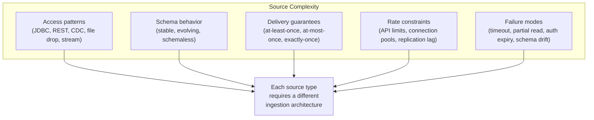
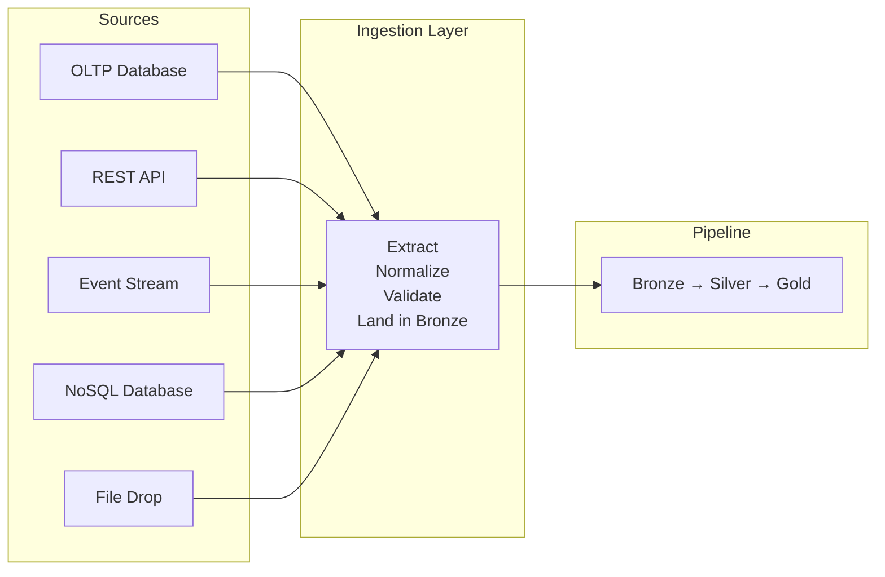

# Ingestion Patterns - Why They Matter

**The pipeline doesn't fail at the transform. It fails at the source. Every production outage you'll debug starts with data that didn't arrive, arrived late, arrived twice, or arrived wrong.**

---

## The Silent Upstream Change

A data platform serves 40 dashboards, 3 Machine Learning (ML) models, and a compliance report. Everything works. The pipeline runs nightly, loads data, transforms it, serves it.

One Tuesday, the application team deploys a schema migration. They add a column, rename another, and change the timestamp format from ISO 8601 to Unix epoch. They don't tell the data team. Why would they — it's their database.

Wednesday morning:
- The ingestion job fails silently on the renamed column. It writes rows with nulls where values should be.
- The compliance report ships with 30% missing data. Legal notices on Thursday.
- The ML model's feature pipeline ingests the Unix timestamps as raw integers. Predictions go to zero. The model gets retrained on garbage. It takes a week to discover and three days to recover.

The transform logic was correct. The warehouse was healthy. The orchestration ran on schedule. The failure was at the boundary — where the pipeline meets the source system.

---

## Why Ingestion Is an Architecture Problem

Ingestion looks simple: read data from source, write it to the pipeline. But every source type has different:

A pipeline that ingests flat files from object storage and a pipeline that ingests from a production PostgreSQL database via Change Data Capture (CDC) are fundamentally different systems — even if the downstream transform and warehouse are identical.

---

## The Five Source Types

Every production data platform ingests from some combination of these:

| Source Type | Examples | Key Challenge |
|---|---|---|
| **Relational databases (OLTP)** | PostgreSQL, MySQL, SQL Server, Cloud SQL, RDS, Azure SQL | Schema changes, connection limits, production impact |
| **APIs** | REST, GraphQL, Salesforce, Stripe, HubSpot, internal microservices | Rate limiting, pagination, auth token management, API versioning |
| **Event streams** | Kafka, Pub/Sub, Kinesis, Event Hubs, application logs | Ordering, backpressure, exactly-once, late arrivals |
| **NoSQL databases** | MongoDB, DynamoDB, Firestore, Cassandra, Redis | Schema flexibility (no enforced schema), nested documents, change streams |
| **Files** | CSV, JSON, Parquet, Avro in object storage (GCS, S3, ADLS) | Format inconsistency, encoding issues, partial uploads, no change tracking |

Most teams start with files (it's what tutorials teach). Production systems have all five, often from the same source: a SaaS platform exposes a REST API, a database replication stream, a webhook event feed, and a nightly file export. You need to decide which one to use — and the answer depends on freshness requirements, data volume, and operational complexity.

---

## What This Playbook Covers

This playbook is for architects and builders designing ingestion for production systems. It covers:

- **How each source type works** — not the "hello world" version, but the production version with failure modes, edge cases, and operational tradeoffs
- **When to use CDC vs API vs file export** for the same source
- **Build vs buy** — custom ingestion code vs managed tools (Airbyte, Fivetran, Datastream, DMS)
- **Production patterns** — retries, idempotency, schema discovery, credential rotation, backpressure
- **Monitoring** — how to know when ingestion fails before the downstream consumer does

---

## Apply It

| Cloud | Notebook | Services Used |
|---|---|---|
| No cloud | Coming soon | Pure Python — API + database ingestion patterns |
| GCP |  | Datastream, Cloud Functions, BigQuery |
| AWS | Coming soon | DMS, Lambda, Redshift/Athena |
| Azure | Coming soon | Data Factory, Azure Functions, Synapse |

---

## Quick Links

| Chapter | Topic |
|---|---|
| [01 - Why](01_Why.md) | This page |
| [02 - Concepts](02_Concepts.md) | Five source types, pull vs push, batch vs stream |
| [03 - Hello World](03_Hello_World.md) | Ingest from a REST API and a database in 15 minutes |
