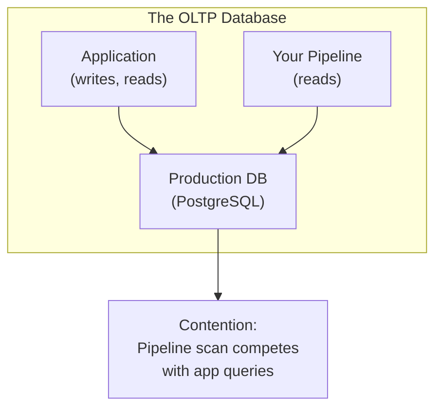
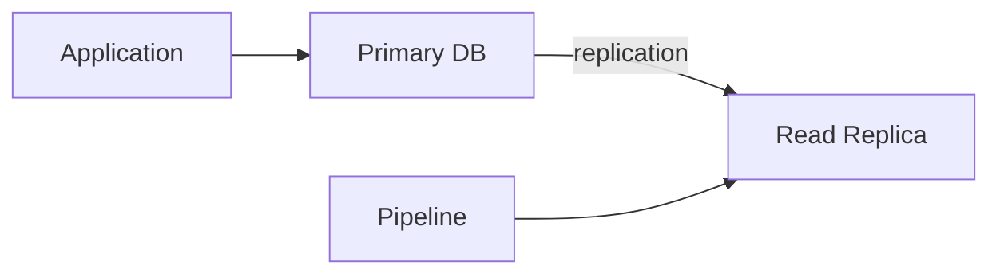
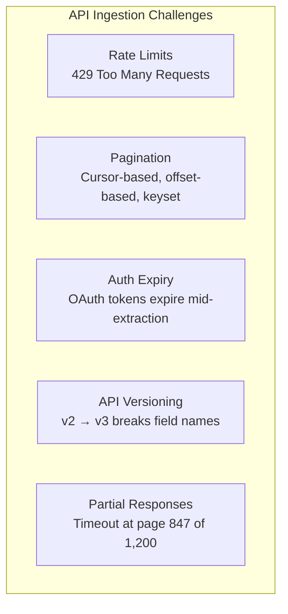
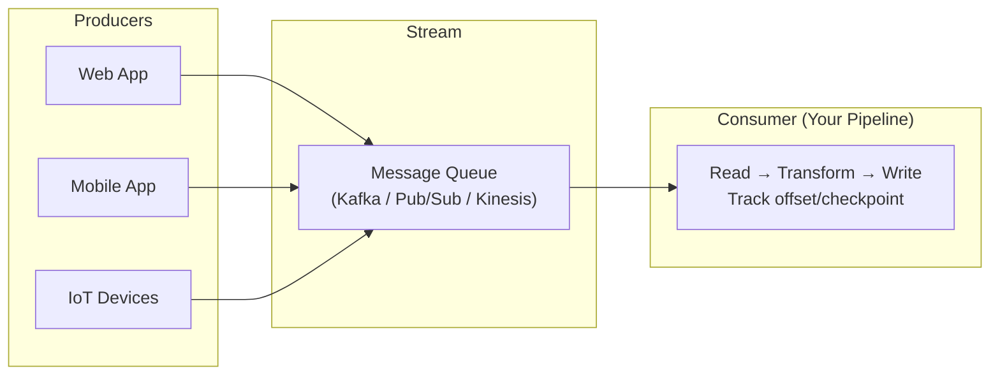
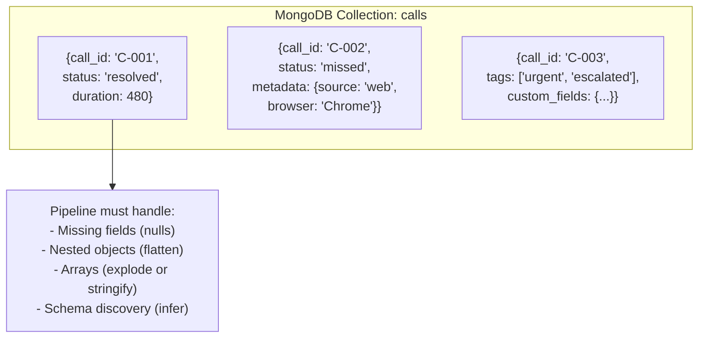
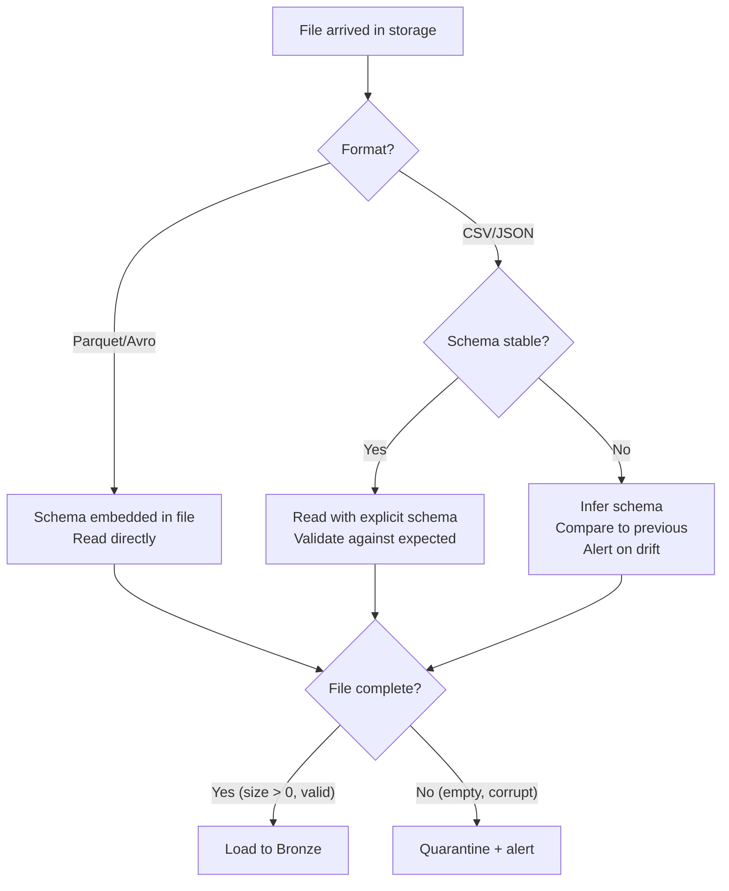
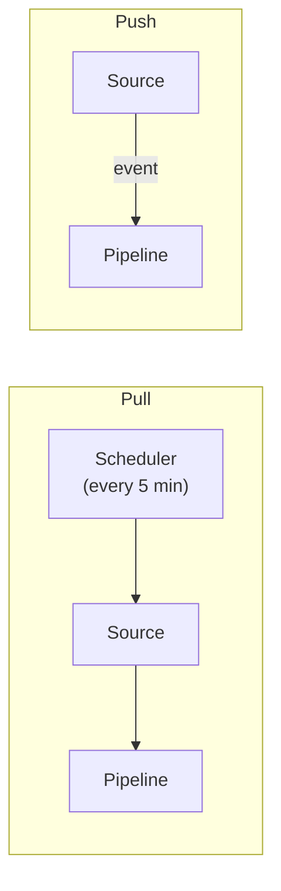

# Ingestion Patterns - Concepts

**Five source types. Three extraction modes. The architecture decisions that determine whether your pipeline is reliable or fragile.**

---

## Source Type 1: Relational Databases (OLTP)

**What it is:** The production database behind the application — PostgreSQL, MySQL, SQL Server, Oracle, Cloud SQL, RDS, Azure SQL.

**Why ingesting from OLTP is hard:**

The database is optimized for the application, not for your pipeline. Every query you run against it competes with production traffic. A full table scan during peak hours slows down the application.



**Three extraction approaches:**

| Approach | How It Works | Latency | Production Impact | Complexity |
|---|---|---|---|---|
| **Full dump** | `pg_dump` or `SELECT *` on a schedule | Hours | High (locks or heavy reads) | Low |
| **Query-based incremental** | `SELECT * WHERE updated_at > watermark` | Minutes | Medium (filtered query) | Medium |
| **Log-based CDC** | Read the Write-Ahead Log (WAL) / binlog | Seconds | None (reads a file, not the DB) | High |

**Architecture decision:** Use query-based incremental for tables under 10M rows with reliable timestamps. Use CDC for high-volume tables, tables that need DELETE capture, or when zero production impact is required. Use full dump only for small reference tables or initial backfill.

**The read replica pattern:** Instead of reading from the primary database, point your pipeline at a read replica. Zero impact on production. The replica has replication lag (typically seconds to minutes), which is acceptable for analytics.



---

## Source Type 2: APIs

**What it is:** REST or GraphQL endpoints exposed by SaaS platforms (Salesforce, Stripe, HubSpot), internal microservices, or third-party data providers.

**Why ingesting from APIs is hard:**

APIs are designed for application consumption (single records, interactive queries), not for bulk data extraction. They impose rate limits, paginate results, expire authentication tokens, and change versions without notice.



**Three pagination patterns:**

| Pattern | How It Works | When to Use |
|---|---|---|
| **Offset-based** | `?offset=100&limit=50` | Simple but dangerous at scale (offset 1M = scan 1M rows server-side) |
| **Cursor-based** | `?cursor=abc123&limit=50` (server returns next cursor) | Production-grade. Most modern APIs use this. |
| **Keyset-based** | `?created_after=2026-04-13T00:00:00` | When you control the query (internal APIs, databases) |

**The rate limit architecture:**

```python
# Production API extraction with rate limiting and retry
import time
import requests
from tenacity import retry, stop_after_attempt, wait_exponential

@retry(stop=stop_after_attempt(5), wait=wait_exponential(multiplier=2, max=60))
def fetch_page(url, headers, params):
    """Fetch one page with exponential backoff on rate limit."""
    response = requests.get(url, headers=headers, params=params)
    
    if response.status_code == 429:  # Rate limited
        retry_after = int(response.headers.get("Retry-After", 60))
        time.sleep(retry_after)
        raise Exception("Rate limited — retrying")
    
    response.raise_for_status()
    return response.json()

def extract_all(base_url, headers):
    """Extract all pages using cursor-based pagination."""
    all_records = []
    cursor = None
    
    while True:
        params = {"limit": 100}
        if cursor:
            params["cursor"] = cursor
        
        data = fetch_page(base_url, headers, params)
        all_records.extend(data["results"])
        
        cursor = data.get("next_cursor")
        if not cursor:
            break  # No more pages
    
    return all_records
```

---

## Source Type 3: Event Streams

**What it is:** Continuous data flows from message queues (Kafka, Pub/Sub, Kinesis, Event Hubs) or application log systems.

**Why ingesting from streams is hard:**

Streams are unbounded. There's no "end" to read to. You must handle ordering (events arrive out of sequence), backpressure (producer is faster than consumer), and exactly-once semantics (process each event once, even after failures).



**Key concepts:**

| Concept | What It Means |
|---|---|
| **Offset / checkpoint** | Your position in the stream. Like a watermark, but for streaming. |
| **Consumer group** | Multiple consumers reading the same stream in parallel (each gets a partition). |
| **Backpressure** | Consumer can't keep up with producer. Queue grows. You need to scale the consumer or drop non-critical events. |
| **At-least-once** | Events may be delivered more than once (on retry). Your consumer must be idempotent. |
| **Exactly-once** | Each event processed exactly once. Requires transactional consumers (Kafka transactions, Pub/Sub ack). |
| **Late arrivals** | An event with timestamp 10:00 arrives at 10:15. Your 10:00 window already closed. |

**Batch vs streaming ingestion from the same stream:**

| Approach | How | Latency | Complexity | When |
|---|---|---|---|---|
| **Micro-batch** | Read from stream every 5 minutes, write batch to warehouse | Minutes | Medium | Most analytics use cases |
| **True streaming** | Continuous consumer writes to warehouse row-by-row | Seconds | High | Fraud detection, real-time dashboards |
| **Stream-to-file** | Stream writes to object storage as Parquet files, pipeline picks up files | Minutes | Low | When you want stream durability without stream complexity |

---

## Source Type 4: NoSQL Databases

**What it is:** Document stores (MongoDB, Firestore), key-value stores (DynamoDB, Redis), wide-column stores (Cassandra, HBase), graph databases (Neo4j).

**Why ingesting from NoSQL is hard:**

NoSQL databases don't enforce schemas. A MongoDB collection can have documents with completely different fields. Your pipeline must handle schema variability — one document has 5 fields, the next has 50, the third has nested arrays 4 levels deep.



**Extraction approaches by NoSQL type:**

| Database | Extraction Method | CDC Available? |
|---|---|---|
| **MongoDB** | `mongoexport`, PyMongo, MongoDB Connector for Spark | Yes — Change Streams |
| **DynamoDB** | DynamoDB Streams, `scan` (expensive), Export to S3 | Yes — DynamoDB Streams |
| **Firestore** | Firestore export to GCS, real-time listeners | Yes — Firestore listeners |
| **Cassandra** | Spark Cassandra Connector, `COPY TO` | Limited — CDC is experimental |
| **Redis** | `DUMP`, Redis Streams, key scan | Limited — Redis Streams only |

**The flattening decision:** Nested documents must be flattened for the warehouse. You have three options:

| Strategy | Example | When |
|---|---|---|
| **Flatten** | `metadata.source` → column `metadata_source` | Known, stable nested structure |
| **Stringify** | `metadata` → JSON string column | Unknown structure, query with JSON functions |
| **Explode** | `tags: ['a','b']` → 2 rows | Need to query/filter on array elements |

---

## Source Type 5: Files

**What it is:** CSV, JSON, Parquet, Avro, XML files dropped into object storage (GCS, S3, ADLS) or SFTP servers.

**Why ingesting from files is hard (at production scale):**

Files look simple. But in production: files arrive with inconsistent encoding (UTF-8 vs Latin-1), inconsistent delimiters (comma vs tab vs pipe), inconsistent schemas (column added in one file, missing in the next), partial uploads (file is 0 bytes or half-written), and duplicate deliveries (same file uploaded twice).

**File ingestion decision tree:**



---

## Pull vs Push

Every source type uses one of two patterns:

| Pattern | Who Initiates | Examples | Tradeoff |
|---|---|---|---|
| **Pull** | Pipeline reaches out to the source on a schedule | Database query, API call, file listing | You control the timing. Risk: you might miss changes between pulls. |
| **Push** | Source sends data to the pipeline when something happens | Webhooks, CDC events, stream messages, file-drop triggers | Near real-time. Risk: you must handle volume spikes and ordering. |



**The hybrid:** Pull for initial backfill, push (CDC/webhooks) for ongoing changes. Most production systems use this combination.

---

## Quick Links

| Chapter | Topic |
|---|---|
| [01 - Why](01_Why.md) | Why ingestion fails in production |
| [02 - Concepts](02_Concepts.md) | This page |
| [03 - Hello World](03_Hello_World.md) | Ingest from API + database |
| [04 - How It Works](04_How_It_Works.md) | JDBC, CDC internals, API pagination, stream consumers |
