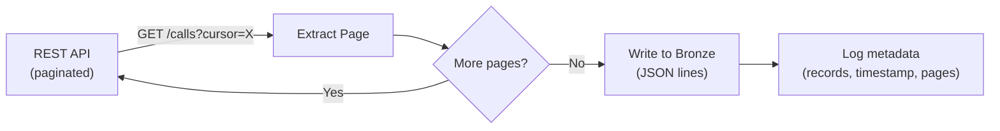
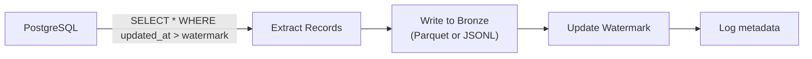

# Ingestion Patterns - Hello World

**Ingest from a REST API and from a PostgreSQL database. Two source types, two patterns, both production-shaped.**

---

## What We're Building

Two ingestion scripts that land data in Bronze (raw, unchanged). Not toy examples — each handles pagination, error recovery, and metadata tracking.

1. **API ingestion** — extract records from a paginated REST API with rate limiting
2. **Database ingestion** — extract records from PostgreSQL using incremental query with watermark

---

## Part 1: API Ingestion

### The Pattern



### The Code

```python
import requests
import json
import time
from datetime import datetime, timezone

# WHY: This pattern works for any paginated REST API.
# Replace the URL and auth with your source.

API_URL = "https://api.example.com/v2/calls"
API_KEY = "your-api-key"  # In production: from secret manager, not hardcoded
BRONZE_PATH = "/data/bronze/calls/"  # Or gs://bucket/bronze/calls/

def ingest_from_api(api_url, api_key, output_path):
    """
    Extract all records from a paginated REST API.
    
    Production considerations:
    - Cursor-based pagination (not offset — offset is O(n) at the source)
    - Exponential backoff on rate limits (429)
    - Metadata logging (records extracted, pages, duration)
    - Idempotent output (overwrite the file, not append)
    """
    headers = {"Authorization": f"Bearer {api_key}"}
    all_records = []
    cursor = None
    page_count = 0
    start_time = datetime.now(timezone.utc)
    
    while True:
        params = {"limit": 100}
        if cursor:
            params["cursor"] = cursor
        
        response = requests.get(api_url, headers=headers, params=params)
        
        # Handle rate limiting
        if response.status_code == 429:
            retry_after = int(response.headers.get("Retry-After", 30))
            print(f"  Rate limited. Waiting {retry_after}s...")
            time.sleep(retry_after)
            continue
        
        response.raise_for_status()
        data = response.json()
        
        records = data.get("results", [])
        all_records.extend(records)
        page_count += 1
        
        print(f"  Page {page_count}: {len(records)} records (total: {len(all_records)})")
        
        cursor = data.get("next_cursor")
        if not cursor:
            break
    
    # Write to Bronze as newline-delimited JSON
    output_file = f"{output_path}/calls_{start_time.strftime('%Y%m%d_%H%M%S')}.jsonl"
    with open(output_file, "w") as f:
        for record in all_records:
            f.write(json.dumps(record) + "\n")
    
    # Log extraction metadata
    metadata = {
        "source": api_url,
        "records_extracted": len(all_records),
        "pages": page_count,
        "started_at": start_time.isoformat(),
        "completed_at": datetime.now(timezone.utc).isoformat(),
        "output_file": output_file,
    }
    print(f"\nExtraction complete: {json.dumps(metadata, indent=2)}")
    
    return metadata

# Run it
# metadata = ingest_from_api(API_URL, API_KEY, BRONZE_PATH)
```

**You Should See:** Records extracted page by page, written to a timestamped JSONL file, with metadata logged.

**What makes this production-shaped:**
- Cursor pagination (not offset)
- Rate limit handling with Retry-After
- Timestamped output files (not overwriting previous extractions)
- Metadata logging (how many records, how long, which file)
- Idempotent — re-running produces a new file, doesn't corrupt existing data

---

## Part 2: Database Ingestion (Incremental)

### The Pattern



### The Code

```python
import psycopg2
import json
from datetime import datetime, timezone

# WHY: This is query-based incremental extraction.
# It works for any relational database with a reliable updated_at column.
# For production OLTP databases, consider CDC (zero production impact)
# or reading from a read replica.

DB_CONFIG = {
    "host": "your-db-host",        # Or Cloud SQL proxy, RDS endpoint
    "port": 5432,
    "dbname": "callcenter",
    "user": "pipeline_readonly",    # Read-only user (principle of least privilege)
    "password": "from-secret-manager",
}

WATERMARK_FILE = "/data/pipeline/watermarks.json"
BRONZE_PATH = "/data/bronze/calls/"

def get_watermark(table_name):
    """Read the last extraction watermark for a table."""
    try:
        with open(WATERMARK_FILE) as f:
            watermarks = json.load(f)
        return watermarks.get(table_name, "1970-01-01T00:00:00Z")
    except FileNotFoundError:
        return "1970-01-01T00:00:00Z"

def save_watermark(table_name, watermark_value):
    """Persist the watermark after successful extraction."""
    try:
        with open(WATERMARK_FILE) as f:
            watermarks = json.load(f)
    except FileNotFoundError:
        watermarks = {}
    
    watermarks[table_name] = watermark_value
    with open(WATERMARK_FILE, "w") as f:
        json.dump(watermarks, f, indent=2)

def ingest_from_database(db_config, table, watermark_column, output_path):
    """
    Incremental extraction from a relational database.
    
    Production considerations:
    - Read-only database user (never write to production DB)
    - Watermark persisted AFTER data is written (not before)
    - Query timeout to prevent long-running scans
    - Connection pooling in high-frequency scenarios
    """
    watermark = get_watermark(table)
    start_time = datetime.now(timezone.utc)
    
    print(f"Extracting {table} where {watermark_column} > '{watermark}'")
    
    conn = psycopg2.connect(**db_config)
    conn.set_session(readonly=True)  # Extra safety
    
    try:
        cursor = conn.cursor()
        
        # Set a query timeout (prevent runaway scans)
        cursor.execute("SET statement_timeout = '300000'")  # 5 minutes
        
        # Extract incrementally
        query = f"""
            SELECT * FROM {table}
            WHERE {watermark_column} > %s
            ORDER BY {watermark_column}
        """
        cursor.execute(query, (watermark,))
        
        columns = [desc[0] for desc in cursor.description]
        rows = cursor.fetchall()
        
        if not rows:
            print(f"  No new records since {watermark}")
            return {"records_extracted": 0}
        
        # Convert to list of dicts
        records = [dict(zip(columns, row)) for row in rows]
        
        # Write to Bronze
        output_file = f"{output_path}/{table}_{start_time.strftime('%Y%m%d_%H%M%S')}.jsonl"
        with open(output_file, "w") as f:
            for record in records:
                # Handle datetime serialization
                f.write(json.dumps(record, default=str) + "\n")
        
        # Update watermark AFTER successful write
        new_watermark = str(max(r[watermark_column] for r in records))
        save_watermark(table, new_watermark)
        
        metadata = {
            "source": f"{db_config['host']}/{db_config['dbname']}.{table}",
            "records_extracted": len(records),
            "watermark_before": watermark,
            "watermark_after": new_watermark,
            "output_file": output_file,
        }
        print(f"\nExtraction complete: {json.dumps(metadata, indent=2)}")
        return metadata
        
    finally:
        conn.close()

# Run it
# metadata = ingest_from_database(DB_CONFIG, "calls", "updated_at", BRONZE_PATH)
```

**You Should See:** Records extracted since the last watermark, written to Bronze, watermark updated.

**What makes this production-shaped:**
- Read-only connection (can't accidentally write to production)
- Query timeout (prevents locking the DB with a runaway scan)
- Watermark saved AFTER data write (prevents data loss on failure)
- Parameterized query (SQL injection prevention)
- Timestamped output files

---

## The Difference

| | API Ingestion | Database Ingestion |
|---|---|---|
| **Access** | HTTP request | Database connection (JDBC/psycopg2) |
| **Pagination** | Cursor from API response | SQL `ORDER BY` + watermark `WHERE` clause |
| **Rate limiting** | API enforces it (429 response) | You enforce it (query timeout, read replica) |
| **Schema** | Defined by API response (can change on version bump) | Defined by DDL (can change on migration) |
| **Auth** | API key / OAuth token | Database user + password / IAM |
| **Failure mode** | Timeout mid-page, rate limit, auth expiry | Connection drop, query timeout, lock contention |

Both patterns land data in Bronze as raw files. Everything downstream (validation, transform, MERGE) is identical regardless of source type.

---

## Quick Links

| Chapter | Topic |
|---|---|
| [02 - Concepts](02_Concepts.md) | Five source types, pull vs push |
| [03 - Hello World](03_Hello_World.md) | This page |
| [04 - How It Works](04_How_It_Works.md) | JDBC internals, CDC mechanics, stream consumers |
| [05 - Building It](05_Building_It.md) | Production ingestion for all five source types |
