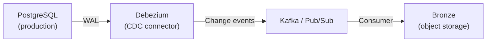
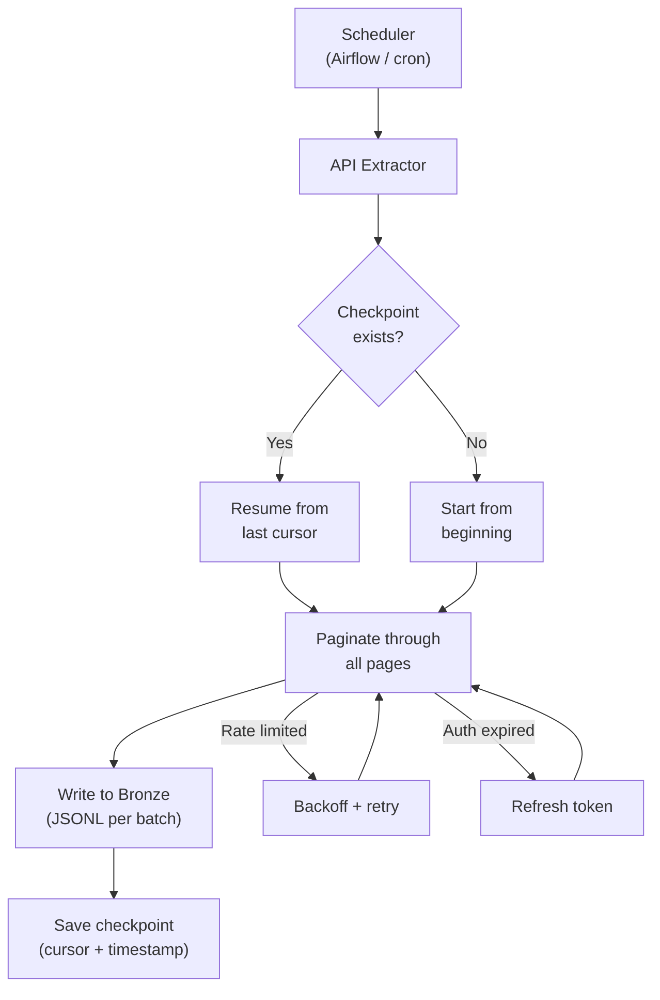
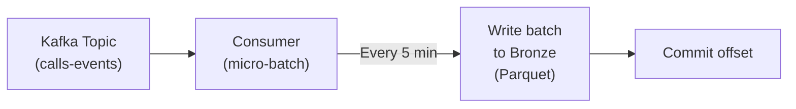
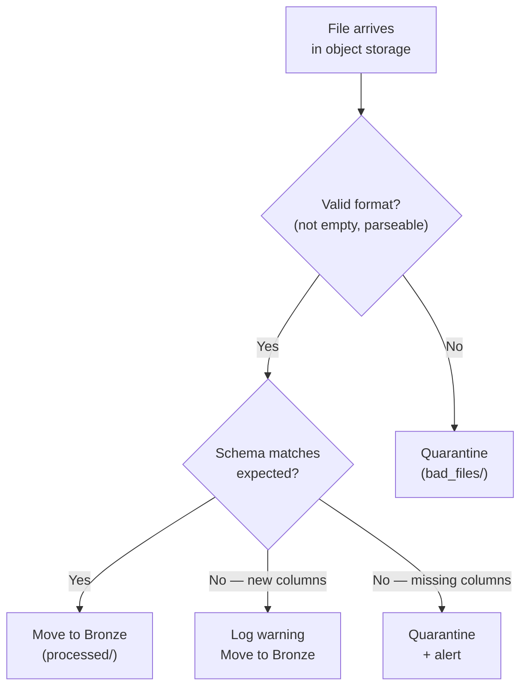

# Ingestion Patterns - Building It

**Production ingestion for all five source types. Each section is a standalone pattern you can adapt to your system.**

---

## Pattern 1: OLTP Database → Bronze (CDC)

The production-grade approach for relational databases. Uses Debezium (open source) or a managed CDC service.



### Debezium Configuration (PostgreSQL)

```json
{
    "name": "calls-cdc-connector",
    "config": {
        "connector.class": "io.debezium.connector.postgresql.PostgresConnector",
        "database.hostname": "db-host",
        "database.port": "5432",
        "database.user": "debezium_replication",
        "database.password": "${secrets:db-password}",
        "database.dbname": "callcenter",
        "database.server.name": "callcenter-prod",
        "table.include.list": "public.calls,public.orders,public.payments",
        "plugin.name": "pgoutput",
        "slot.name": "debezium_calls",
        "publication.name": "dbz_publication",
        "snapshot.mode": "initial",
        "transforms": "route",
        "transforms.route.type": "org.apache.kafka.connect.transforms.RegexRouter",
        "transforms.route.regex": "([^.]+)\\.([^.]+)\\.([^.]+)",
        "transforms.route.replacement": "bronze.$3"
    }
}
```

**Key configuration decisions:**

| Setting | Value | Why |
|---|---|---|
| `snapshot.mode: initial` | Takes a full snapshot first, then streams changes | Ensures no data is missed on first run |
| `plugin.name: pgoutput` | Uses PostgreSQL's native logical decoding | No extension required (unlike wal2json) |
| `slot.name` | Named replication slot | Survives CDC restarts — resume from last position |
| `table.include.list` | Explicit tables | Never CDC the entire database — select what you need |

### Cloud-Managed CDC Alternatives

| Cloud | Service | Configuration |
|---|---|---|
| GCP | Datastream | Console wizard or Terraform. Source: Cloud SQL. Target: GCS or BigQuery. |
| AWS | Database Migration Service (DMS) | Task definition. Source: RDS. Target: S3 or Kinesis. |
| Azure | Data Factory CDC | Pipeline with CDC-enabled source. Source: Azure SQL. Target: ADLS. |

---

## Pattern 2: REST API → Bronze

Production API extraction with full error handling, token management, and checkpoint recovery.



```python
class APIExtractor:
    """Production API extractor with checkpointing and recovery."""
    
    def __init__(self, api_url, auth, checkpoint_path, output_path):
        self.api_url = api_url
        self.auth = auth  # OAuthSession or API key
        self.checkpoint_path = checkpoint_path
        self.output_path = output_path
    
    def extract(self):
        cursor = self._load_checkpoint()
        batch_num = 0
        total_records = 0
        
        while True:
            params = {"limit": 100}
            if cursor:
                params["cursor"] = cursor
            
            data = self._fetch_with_retry(params)
            records = data.get("results", [])
            
            if not records:
                break
            
            # Write each batch to a separate file (recoverable)
            batch_file = f"{self.output_path}/batch_{batch_num:05d}.jsonl"
            self._write_jsonl(records, batch_file)
            
            total_records += len(records)
            batch_num += 1
            
            # Checkpoint after each batch (not at the end)
            cursor = data.get("next_cursor")
            self._save_checkpoint(cursor)
            
            if not cursor:
                break
        
        return {"records": total_records, "batches": batch_num}
    
    def _fetch_with_retry(self, params, max_retries=5):
        for attempt in range(max_retries):
            headers = {"Authorization": f"Bearer {self.auth.get_token()}"}
            response = requests.get(self.api_url, headers=headers, params=params)
            
            if response.status_code == 429:
                wait = int(response.headers.get("Retry-After", 2 ** attempt))
                time.sleep(wait)
                continue
            
            if response.status_code == 401:
                self.auth.refresh()
                continue
            
            response.raise_for_status()
            return response.json()
        
        raise Exception(f"Failed after {max_retries} retries")
    
    def _load_checkpoint(self):
        try:
            with open(self.checkpoint_path) as f:
                return json.load(f).get("cursor")
        except FileNotFoundError:
            return None
    
    def _save_checkpoint(self, cursor):
        with open(self.checkpoint_path, "w") as f:
            json.dump({"cursor": cursor, "saved_at": datetime.now(timezone.utc).isoformat()}, f)
    
    def _write_jsonl(self, records, path):
        with open(path, "w") as f:
            for r in records:
                f.write(json.dumps(r) + "\n")
```

---

## Pattern 3: Event Stream → Bronze

Read from Kafka/Pub/Sub and write micro-batches to object storage.



```python
# Kafka micro-batch consumer pattern
from confluent_kafka import Consumer

consumer = Consumer({
    "bootstrap.servers": "kafka:9092",
    "group.id": "pipeline-bronze-writer",
    "auto.offset.reset": "earliest",
    "enable.auto.commit": False,  # Manual commit after write
})
consumer.subscribe(["calls-events"])

BATCH_SIZE = 1000
BATCH_TIMEOUT = 300  # 5 minutes

batch = []
batch_start = time.time()

while True:
    msg = consumer.poll(timeout=1.0)
    
    if msg and not msg.error():
        batch.append(json.loads(msg.value()))
    
    # Flush batch when size or time threshold hit
    if len(batch) >= BATCH_SIZE or (time.time() - batch_start) > BATCH_TIMEOUT:
        if batch:
            # Write batch to Bronze
            write_parquet(batch, f"bronze/calls/{timestamp}.parquet")
            
            # Commit offset AFTER successful write
            consumer.commit()
            
            batch = []
            batch_start = time.time()
```

---

## Pattern 4: MongoDB → Bronze

```python
from pymongo import MongoClient
import json

client = MongoClient("mongodb://host:27017")
db = client["callcenter"]

def extract_mongodb_incremental(collection_name, watermark_field, watermark_value):
    """Incremental extraction from MongoDB using a watermark field."""
    collection = db[collection_name]
    
    # Query with watermark
    query = {watermark_field: {"$gt": watermark_value}}
    cursor = collection.find(query).sort(watermark_field, 1)
    
    records = []
    for doc in cursor:
        # Flatten the document for tabular storage
        flat = flatten_document(doc)
        records.append(flat)
    
    return records

def flatten_document(doc, prefix=""):
    """Recursively flatten nested MongoDB document."""
    flat = {}
    for key, value in doc.items():
        full_key = f"{prefix}{key}" if not prefix else f"{prefix}_{key}"
        
        if isinstance(value, dict):
            flat.update(flatten_document(value, full_key))
        elif isinstance(value, list):
            flat[full_key] = json.dumps(value)  # Stringify arrays
        else:
            flat[full_key] = value
    
    return flat
```

---

## Pattern 5: Files with Validation

File ingestion with format detection, schema validation, and quarantine for bad files.



```python
def validate_and_ingest_file(file_path, expected_columns, bronze_path, quarantine_path):
    """Validate a file before ingesting into Bronze."""
    import pandas as pd
    
    # Check 1: File not empty
    if os.path.getsize(file_path) == 0:
        move_to_quarantine(file_path, quarantine_path, "empty file")
        return
    
    # Check 2: File parseable
    try:
        if file_path.endswith(".csv"):
            df = pd.read_csv(file_path, nrows=5)
        elif file_path.endswith(".json") or file_path.endswith(".jsonl"):
            df = pd.read_json(file_path, lines=True, nrows=5)
        elif file_path.endswith(".parquet"):
            df = pd.read_parquet(file_path).head(5)
        else:
            move_to_quarantine(file_path, quarantine_path, f"unknown format: {file_path}")
            return
    except Exception as e:
        move_to_quarantine(file_path, quarantine_path, f"parse error: {e}")
        return
    
    # Check 3: Schema validation
    actual_columns = set(df.columns)
    expected = set(expected_columns)
    
    missing = expected - actual_columns
    extra = actual_columns - expected
    
    if missing:
        move_to_quarantine(file_path, quarantine_path, f"missing columns: {missing}")
        alert(f"SCHEMA BREAK: {file_path} missing {missing}")
        return
    
    if extra:
        log_warning(f"New columns in {file_path}: {extra}")
    
    # All checks pass — move to Bronze
    move_to_bronze(file_path, bronze_path)
```

---

## Cloud Service Mapping

| Pattern | GCP | AWS | Azure |
|---|---|---|---|
| OLTP → CDC | Datastream | DMS | Data Factory CDC |
| API extraction | Cloud Functions + Cloud Scheduler | Lambda + EventBridge | Azure Functions + Logic Apps |
| Stream consumption | Dataflow | Lambda / Kinesis Consumer | Stream Analytics / Azure Functions |
| MongoDB CDC | Datastream (MongoDB source) | DMS (MongoDB source) | Data Factory (MongoDB connector) |
| File validation | Cloud Functions (GCS trigger) | Lambda (S3 trigger) | Azure Functions (Blob trigger) |

---

## Quick Links

| Chapter | Topic |
|---|---|
| [04 - How It Works](04_How_It_Works.md) | JDBC, CDC, OAuth, stream internals |
| [05 - Building It](05_Building_It.md) | This page |
| [06 - Production Patterns](06_Production_Patterns.md) | Retries, idempotency, schema discovery |
| [07 - System Design](07_System_Design.md) | Ingestion architecture at scale |
