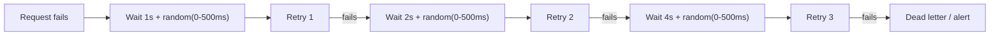
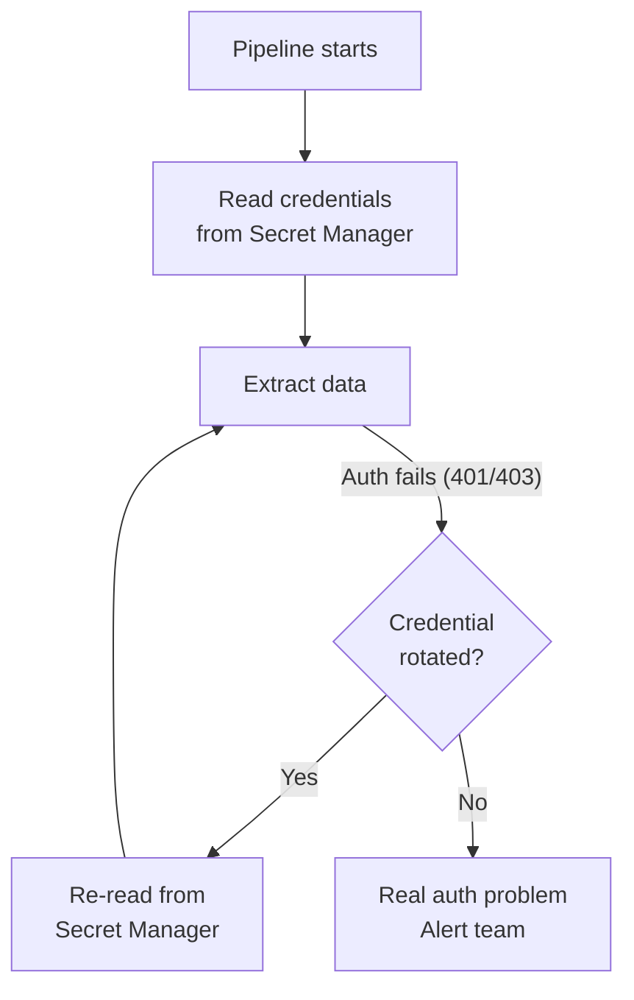
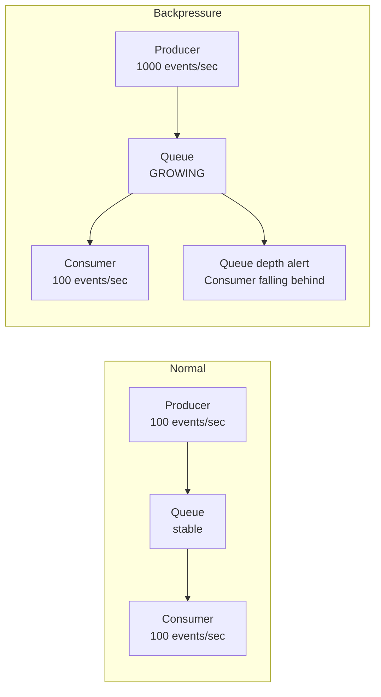

# Ingestion Patterns - Production Patterns

**What breaks in production and how to design around it. Retry strategies, idempotent extraction, schema discovery, credential rotation, and backpressure handling.**

---

## Retry Strategy

Every external call fails eventually. The question is how your pipeline responds.

### Exponential Backoff with Jitter



**Why jitter?** Without jitter, 100 clients that fail at the same time all retry at the same time — causing another failure (thundering herd). Jitter spreads retries across a time window.

| Retry Strategy | When | Risk |
|---|---|---|
| **Immediate retry** | Never in production | Thundering herd, rate limit cascade |
| **Fixed delay** | Simple systems with low concurrency | Multiple clients converge on same retry time |
| **Exponential backoff** | Standard for APIs and databases | Good, but still converges |
| **Exponential + jitter** | Production default | Best — spreads load |

### Retry vs Dead Letter

Not every failure should be retried. Classify failures:

| Failure Type | Retry? | Example |
|---|---|---|
| **Transient** | Yes (with backoff) | 429 rate limit, 503 service unavailable, connection timeout |
| **Auth** | Once (refresh token, then retry) | 401 unauthorized, expired credentials |
| **Client error** | No (fix the code) | 400 bad request, 404 not found, malformed query |
| **Data error** | No (quarantine the record) | Invalid JSON, schema mismatch, corrupt file |

---

## Idempotent Extraction

An extraction is idempotent if running it twice produces the same result in Bronze. This is critical because orchestrators retry failed tasks.

### Pattern: Timestamped Output Files

```
# Run 1 at 14:00 → writes: bronze/calls/2026-04-15_140000.jsonl
# Run 2 at 14:00 (retry) → overwrites: bronze/calls/2026-04-15_140000.jsonl
# Result: same file, same data, no duplicates
```

### Pattern: Partition-Based Overwrite

```
# Extract data for 2026-04-15
# Write to: bronze/calls/date=2026-04-15/data.parquet
# If run again: overwrites the same partition
# Downstream sees: one copy, not two
```

### Anti-Pattern: Append Without Deduplication

```
# Run 1 → appends 500 records to bronze/calls/all_calls.jsonl
# Run 2 (retry) → appends same 500 records again
# Result: 1000 records, 500 duplicates — every downstream number is wrong
```

---

## Schema Discovery and Drift Detection

Sources change their schemas without telling you. Your ingestion must detect this.

### Schema Registry Pattern

Capture the schema of each extraction and compare to the previous version:

```python
def detect_schema_drift(current_columns, expected_columns):
    """Compare incoming schema to expected. Return drift details."""
    current = set(current_columns)
    expected = set(expected_columns)
    
    added = current - expected      # New columns (non-breaking)
    removed = expected - current    # Missing columns (BREAKING)
    
    if removed:
        raise SchemaBreakingChange(
            f"Columns removed: {removed}. "
            f"Source likely renamed or dropped these. "
            f"Action: check source, update pipeline, or quarantine."
        )
    
    if added:
        log_warning(f"New columns detected: {added}. Pipeline will ignore them until schema is updated.")
    
    return {"added": added, "removed": removed}
```

### Schema Capture on Every Extraction

```python
def save_schema_snapshot(source_name, columns, types):
    """Save the schema observed at extraction time."""
    snapshot = {
        "source": source_name,
        "captured_at": datetime.now(timezone.utc).isoformat(),
        "columns": dict(zip(columns, types)),
    }
    
    path = f"pipeline/schemas/{source_name}/{datetime.now().strftime('%Y%m%d')}.json"
    with open(path, "w") as f:
        json.dump(snapshot, f, indent=2)
```

**Why capture schemas?** When a downstream report breaks, you need to answer: "When did the schema change?" The schema snapshot tells you the exact date the new column appeared or the old column disappeared.

---

## Credential Rotation

API keys and database passwords expire or get rotated. Your pipeline must survive this without manual intervention.



### Secret Manager by Cloud

| Cloud | Service | Access Pattern |
|---|---|---|
| GCP | Secret Manager | `secretmanager.versions.access` API |
| AWS | Secrets Manager or SSM Parameter Store | `boto3.client('secretsmanager').get_secret_value()` |
| Azure | Key Vault | `SecretClient.get_secret()` |

**Rule:** Never hardcode credentials. Never store them in environment variables in CI/CD logs. Always read from secret manager at runtime.

---

## Backpressure

What happens when the source produces data faster than your pipeline can consume it?



### Strategies

| Strategy | How | When |
|---|---|---|
| **Scale consumers** | Add more consumer instances (horizontal scaling) | Stream ingestion (Kafka, Pub/Sub) |
| **Increase batch size** | Process larger batches less frequently | Micro-batch ingestion |
| **Shed load** | Drop low-priority events, keep critical ones | Real-time systems under extreme load |
| **Buffer to storage** | Write overflow to object storage, process later | When data loss is unacceptable |

---

## Source-Specific Production Patterns

### API: Respect Rate Limits Before You Hit Them

```python
# Pre-emptive rate limiting (don't wait for 429)
import time

class RateLimiter:
    """Token bucket rate limiter."""
    
    def __init__(self, requests_per_second):
        self.interval = 1.0 / requests_per_second
        self.last_request = 0
    
    def wait(self):
        elapsed = time.time() - self.last_request
        if elapsed < self.interval:
            time.sleep(self.interval - elapsed)
        self.last_request = time.time()

# Use: 5 requests per second (below API's 10/sec limit)
limiter = RateLimiter(requests_per_second=5)

for page in pages:
    limiter.wait()
    data = fetch_page(page)
```

### Database: Statement Timeout

```sql
-- Prevent pipeline queries from locking the database
SET statement_timeout = '300000';  -- 5 minutes max
-- If the query takes longer, it's cancelled automatically
-- Better than a 45-minute full table scan that blocks production
```

### Stream: Consumer Lag Monitoring

```python
# Alert if consumer falls more than 5 minutes behind producer
consumer_lag = get_consumer_lag(topic="calls-events", group="pipeline")
if consumer_lag.total_seconds() > 300:
    alert(f"Consumer lag: {consumer_lag}. Pipeline falling behind.")
```

---

## Quick Links

| Chapter | Topic |
|---|---|
| [05 - Building It](05_Building_It.md) | Production ingestion for all five source types |
| [06 - Production Patterns](06_Production_Patterns.md) | This page |
| [07 - System Design](07_System_Design.md) | Ingestion architecture at scale |
| [08 - Quality Security Governance](08_Quality_Security_Governance.md) | Source credentials, PII at ingestion |
