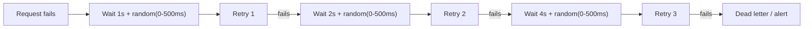
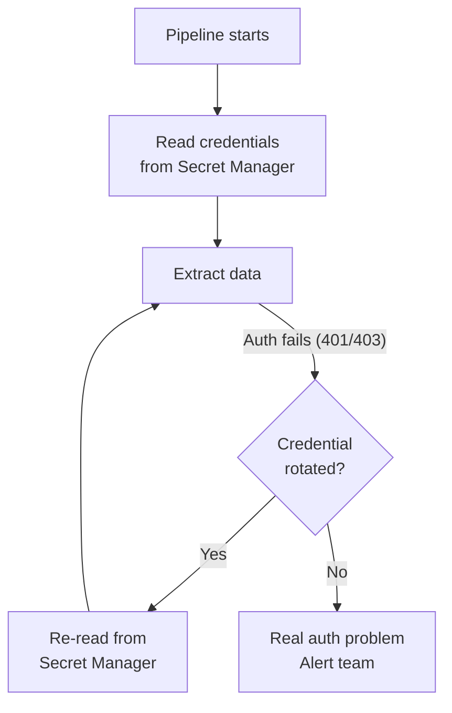
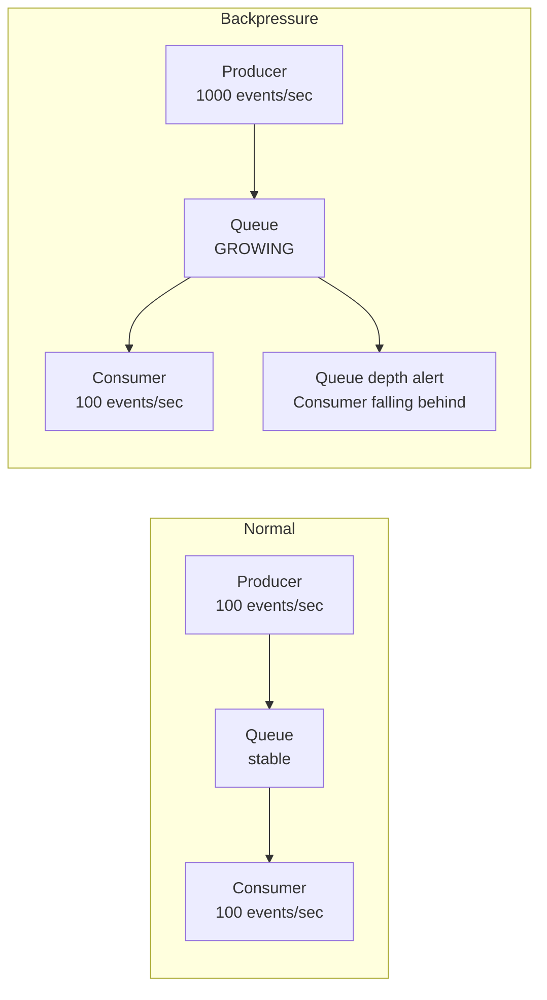
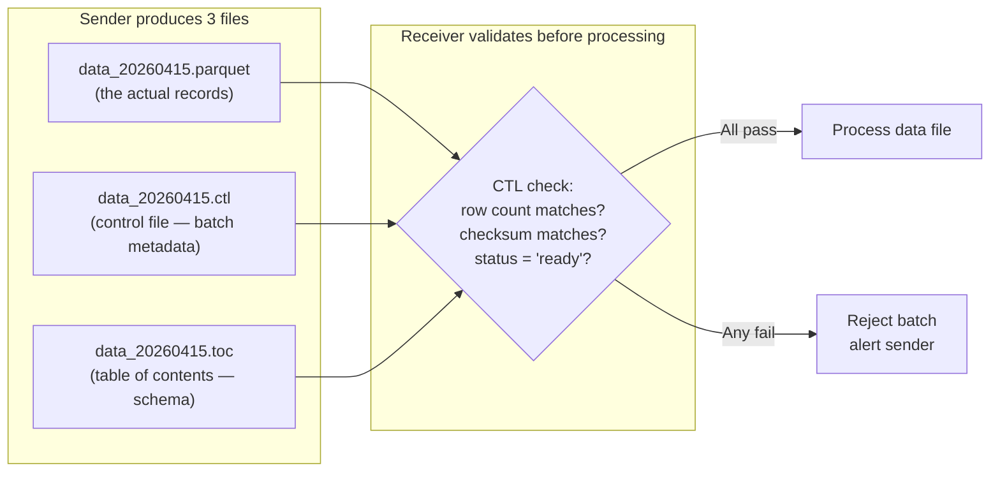

# Ingestion Patterns - Production Patterns

**What breaks in production and how to design around it. Retry strategies, idempotent extraction, schema discovery, credential rotation, and backpressure handling.**

---

## Retry Strategy

Every external call fails eventually. The question is how your pipeline responds.

### Exponential Backoff with Jitter



**Why jitter?** Without jitter, 100 clients that fail at the same time all retry at the same time — causing another failure (thundering herd). Jitter spreads retries across a time window.

| Retry Strategy | When | Risk |
|---|---|---|
| **Immediate retry** | Never in production | Thundering herd, rate limit cascade |
| **Fixed delay** | Simple systems with low concurrency | Multiple clients converge on same retry time |
| **Exponential backoff** | Standard for APIs and databases | Good, but still converges |
| **Exponential + jitter** | Production default | Best — spreads load |

### Retry vs Dead Letter

Not every failure should be retried. Classify failures:

| Failure Type | Retry? | Example |
|---|---|---|
| **Transient** | Yes (with backoff) | 429 rate limit, 503 service unavailable, connection timeout |
| **Auth** | Once (refresh token, then retry) | 401 unauthorized, expired credentials |
| **Client error** | No (fix the code) | 400 bad request, 404 not found, malformed query |
| **Data error** | No (quarantine the record) | Invalid JSON, schema mismatch, corrupt file |

---

## Idempotent Extraction

An extraction is idempotent if running it twice produces the same result in Bronze. This is critical because orchestrators retry failed tasks.

### Pattern: Timestamped Output Files

```
# Run 1 at 14:00 → writes: bronze/calls/2026-04-15_140000.jsonl
# Run 2 at 14:00 (retry) → overwrites: bronze/calls/2026-04-15_140000.jsonl
# Result: same file, same data, no duplicates
```

### Pattern: Partition-Based Overwrite

```
# Extract data for 2026-04-15
# Write to: bronze/calls/date=2026-04-15/data.parquet
# If run again: overwrites the same partition
# Downstream sees: one copy, not two
```

### Anti-Pattern: Append Without Deduplication

```
# Run 1 → appends 500 records to bronze/calls/all_calls.jsonl
# Run 2 (retry) → appends same 500 records again
# Result: 1000 records, 500 duplicates — every downstream number is wrong
```

---

## Schema Discovery and Drift Detection

Sources change their schemas without telling you. Your ingestion must detect this.

### Schema Registry Pattern

Capture the schema of each extraction and compare to the previous version:

```python
def detect_schema_drift(current_columns, expected_columns):
    """Compare incoming schema to expected. Return drift details."""
    current = set(current_columns)
    expected = set(expected_columns)
    
    added = current - expected      # New columns (non-breaking)
    removed = expected - current    # Missing columns (BREAKING)
    
    if removed:
        raise SchemaBreakingChange(
            f"Columns removed: {removed}. "
            f"Source likely renamed or dropped these. "
            f"Action: check source, update pipeline, or quarantine."
        )
    
    if added:
        log_warning(f"New columns detected: {added}. Pipeline will ignore them until schema is updated.")
    
    return {"added": added, "removed": removed}
```

### Schema Capture on Every Extraction

```python
def save_schema_snapshot(source_name, columns, types):
    """Save the schema observed at extraction time."""
    snapshot = {
        "source": source_name,
        "captured_at": datetime.now(timezone.utc).isoformat(),
        "columns": dict(zip(columns, types)),
    }
    
    path = f"pipeline/schemas/{source_name}/{datetime.now().strftime('%Y%m%d')}.json"
    with open(path, "w") as f:
        json.dump(snapshot, f, indent=2)
```

**Why capture schemas?** When a downstream report breaks, you need to answer: "When did the schema change?" The schema snapshot tells you the exact date the new column appeared or the old column disappeared.

---

## Credential Rotation

API keys and database passwords expire or get rotated. Your pipeline must survive this without manual intervention.



### Secret Manager by Cloud

| Cloud | Service | Access Pattern |
|---|---|---|
| GCP | Secret Manager | `secretmanager.versions.access` API |
| AWS | Secrets Manager or SSM Parameter Store | `boto3.client('secretsmanager').get_secret_value()` |
| Azure | Key Vault | `SecretClient.get_secret()` |

**Rule:** Never hardcode credentials. Never store them in environment variables in CI/CD logs. Always read from secret manager at runtime.

---

## Backpressure

What happens when the source produces data faster than your pipeline can consume it?



### Strategies

| Strategy | How | When |
|---|---|---|
| **Scale consumers** | Add more consumer instances (horizontal scaling) | Stream ingestion (Kafka, Pub/Sub) |
| **Increase batch size** | Process larger batches less frequently | Micro-batch ingestion |
| **Shed load** | Drop low-priority events, keep critical ones | Real-time systems under extreme load |
| **Buffer to storage** | Write overflow to object storage, process later | When data loss is unacceptable |

---

## Source-Specific Production Patterns

### API: Respect Rate Limits Before You Hit Them

```python
# Pre-emptive rate limiting (don't wait for 429)
import time

class RateLimiter:
    """Token bucket rate limiter."""
    
    def __init__(self, requests_per_second):
        self.interval = 1.0 / requests_per_second
        self.last_request = 0
    
    def wait(self):
        elapsed = time.time() - self.last_request
        if elapsed < self.interval:
            time.sleep(self.interval - elapsed)
        self.last_request = time.time()

# Use: 5 requests per second (below API's 10/sec limit)
limiter = RateLimiter(requests_per_second=5)

for page in pages:
    limiter.wait()
    data = fetch_page(page)
```

### Database: Statement Timeout

```sql
-- Prevent pipeline queries from locking the database
SET statement_timeout = '300000';  -- 5 minutes max
-- If the query takes longer, it's cancelled automatically
-- Better than a 45-minute full table scan that blocks production
```

### Stream: Consumer Lag Monitoring

```python
# Alert if consumer falls more than 5 minutes behind producer
consumer_lag = get_consumer_lag(topic="calls-events", group="pipeline")
if consumer_lag.total_seconds() > 300:
    alert(f"Consumer lag: {consumer_lag}. Pipeline falling behind.")
```

---

## Enterprise File Transfer: CTL/TOC Pattern

In enterprise environments (especially insurance, healthcare, and finance), data doesn't move as a bare file. It moves as a **three-file package**:



### What's In Each File

**CTL (Control File):** Metadata about the batch — proves the transfer is complete.

```json
{
    "batch_id": "CLAIMS_20260415_001",
    "source_system": "MEDECON",
    "file_name": "claims_20260415.parquet",
    "record_count": 145832,
    "file_size_bytes": 23847291,
    "md5_checksum": "a3f2b8c91d4e5f6a7b8c9d0e1f2a3b4c",
    "created_at": "2026-04-15T02:15:00Z",
    "status": "READY",
    "extract_window": {
        "from": "2026-04-14T00:00:00Z",
        "to": "2026-04-15T00:00:00Z"
    }
}
```

**TOC (Table of Contents):** Schema definition — what columns are in the data file and what types they are.

```json
{
    "file_name": "claims_20260415.parquet",
    "columns": [
        {"name": "claim_id", "type": "STRING", "nullable": false},
        {"name": "member_id", "type": "STRING", "nullable": false},
        {"name": "diagnosis_code", "type": "STRING", "nullable": true},
        {"name": "procedure_code", "type": "STRING", "nullable": true},
        {"name": "paid_amount", "type": "DECIMAL(10,2)", "nullable": true},
        {"name": "service_date", "type": "DATE", "nullable": false},
        {"name": "processed_date", "type": "TIMESTAMP", "nullable": false}
    ],
    "schema_version": "3.2",
    "delimiter": null,
    "encoding": "UTF-8"
}
```

### Validation Logic

```python
import json
import hashlib
import os

def validate_batch(data_path, ctl_path, toc_path):
    """
    Validate a 3-file batch before processing.
    Returns True if all checks pass. Raises on failure.
    
    WHERE THIS RUNS: As the first step in your ingestion DAG,
    before any data loading. Cloud Function (file trigger) or
    Airflow PythonOperator.
    """
    # --- Load CTL ---
    with open(ctl_path) as f:
        ctl = json.load(f)
    
    # Check 1: Status is READY (sender finished writing)
    if ctl["status"] != "READY":
        raise ValueError(f"CTL status is '{ctl['status']}', expected 'READY'. "
                        f"File may still be uploading.")
    
    # Check 2: Data file exists and matches expected size
    actual_size = os.path.getsize(data_path)
    if actual_size != ctl["file_size_bytes"]:
        raise ValueError(f"File size mismatch: expected {ctl['file_size_bytes']}, "
                        f"got {actual_size}. Transfer may be incomplete.")
    
    # Check 3: Checksum matches (proves file not corrupted in transit)
    with open(data_path, "rb") as f:
        actual_md5 = hashlib.md5(f.read()).hexdigest()
    if actual_md5 != ctl["md5_checksum"]:
        raise ValueError(f"Checksum mismatch: expected {ctl['md5_checksum']}, "
                        f"got {actual_md5}. File corrupted during transfer.")
    
    # Check 4: Row count matches (after loading into DataFrame)
    import pandas as pd
    df = pd.read_parquet(data_path)
    if len(df) != ctl["record_count"]:
        raise ValueError(f"Row count mismatch: CTL says {ctl['record_count']}, "
                        f"file has {len(df)}.")
    
    # --- Load TOC and validate schema ---
    with open(toc_path) as f:
        toc = json.load(f)
    
    expected_columns = {col["name"] for col in toc["columns"]}
    actual_columns = set(df.columns)
    
    missing = expected_columns - actual_columns
    if missing:
        raise ValueError(f"Schema mismatch: columns missing from data file: {missing}")
    
    extra = actual_columns - expected_columns
    if extra:
        print(f"WARNING: Extra columns in data file (not in TOC): {extra}")
    
    print(f"Batch {ctl['batch_id']} validated: {ctl['record_count']} records, "
          f"checksum OK, schema OK")
    return True
```

### Why This Pattern Still Exists

| Alternative | Why Enterprises Keep CTL/TOC |
|---|---|
| "Parquet has schema in the footer" | True, but CTL adds record count + checksum that Parquet doesn't have. Auditors want explicit proof of completeness. |
| "GCS writes are atomic" | True for single files. But multi-file uploads (data + metadata) are NOT atomic. CTL's "READY" flag signals that all files are uploaded. |
| "Just validate after loading" | CTL validates BEFORE loading. If the file is bad, you never load it. This matters when loading into BigQuery costs money per byte scanned. |

**Modern equivalent:** If building from scratch, you could replace CTL/TOC with a manifest file (like Delta Lake's transaction log) or use cloud-native event notifications (GCS Pub/Sub notification only fires after the full object is written). But in enterprises with existing on-prem systems, CTL/TOC is the interface contract between teams — changing it requires coordination across 10+ teams.

### CTL/TOC Validation by Cloud

| Where to Run Validation | GCP | AWS | Azure |
|---|---|---|---|
| **Event trigger** (detect file arrival) | Cloud Functions (GCS `finalize` event) | Lambda (S3 `ObjectCreated` event) | Azure Functions (Blob trigger) |
| **Read CTL/TOC from storage** | `google.cloud.storage` Python client | `boto3` S3 client | `azure.storage.blob` Python client |
| **Orchestrator sensor** (wait for CTL) | `GCSObjectExistenceSensor` (Airflow) | `S3KeySensor` (Airflow) | `WasbBlobSensor` (Airflow) |
| **Checksum verification** | `gsutil hash -m` or Python `hashlib` | `aws s3api head-object` (ETag) or Python `hashlib` | `azcopy` or Python `hashlib` |
| **Quarantine bad files** | Move to `gs://bucket/quarantine/` | Move to `s3://bucket/quarantine/` | Move to `quarantine/` container |

---

## Quick Links

| Chapter | Topic |
|---|---|
| [05 - Building It](05_Building_It.md) | Production ingestion for all five source types |
| [06 - Production Patterns](06_Production_Patterns.md) | This page |
| [07 - System Design](07_System_Design.md) | Ingestion architecture at scale |
| [08 - Quality Security Governance](08_Quality_Security_Governance.md) | Source credentials, PII at ingestion |
