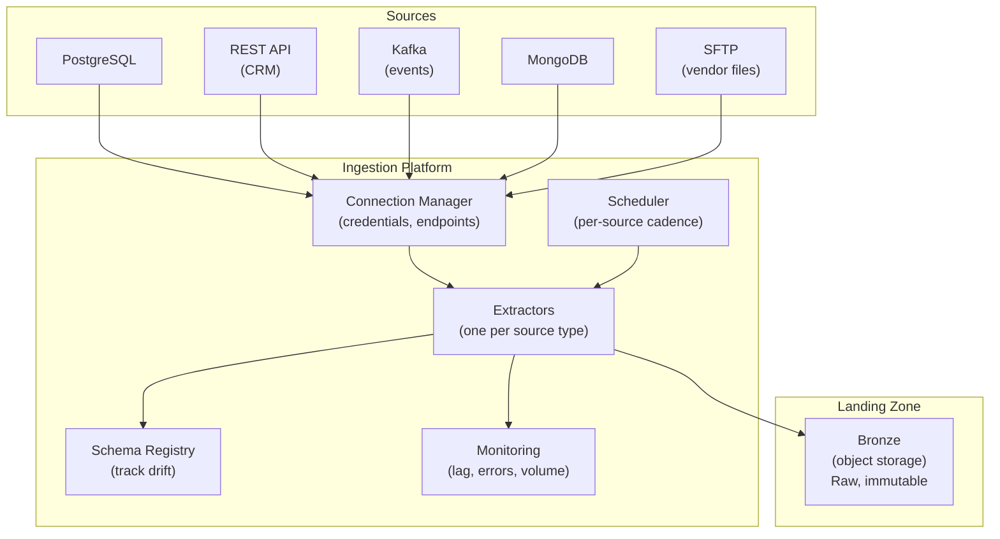
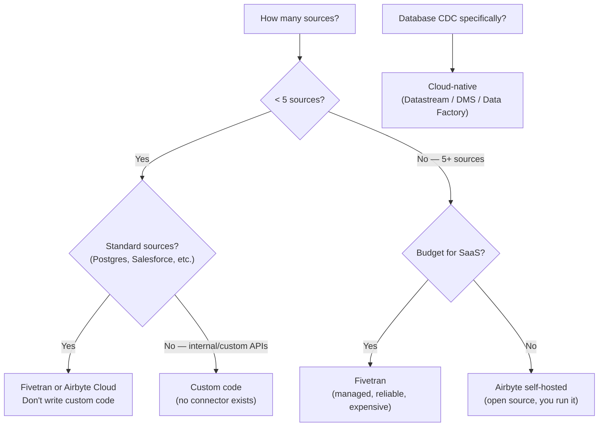
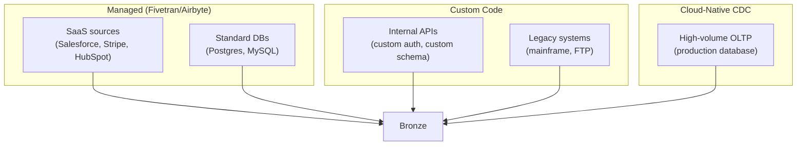
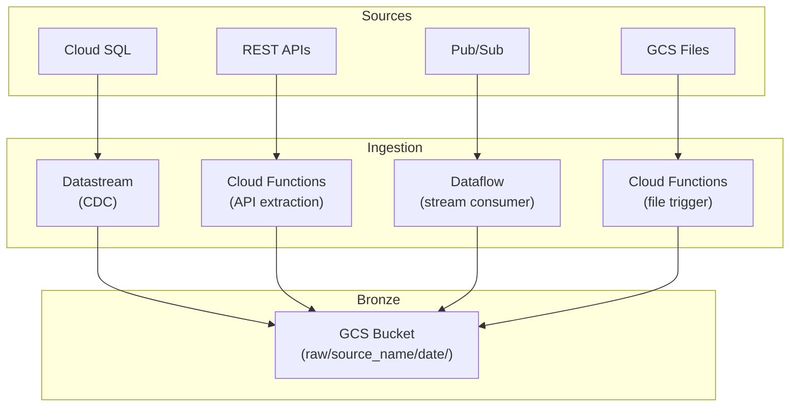
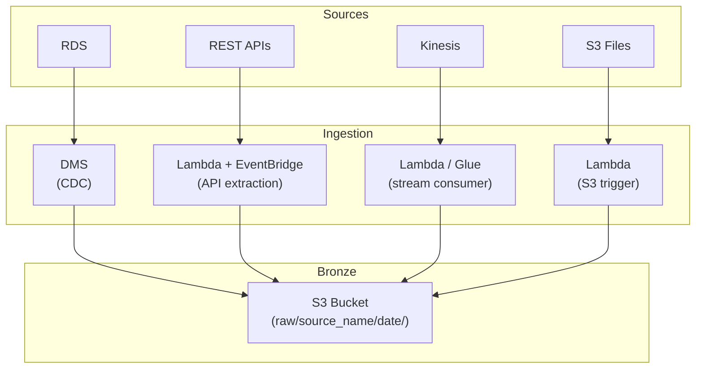
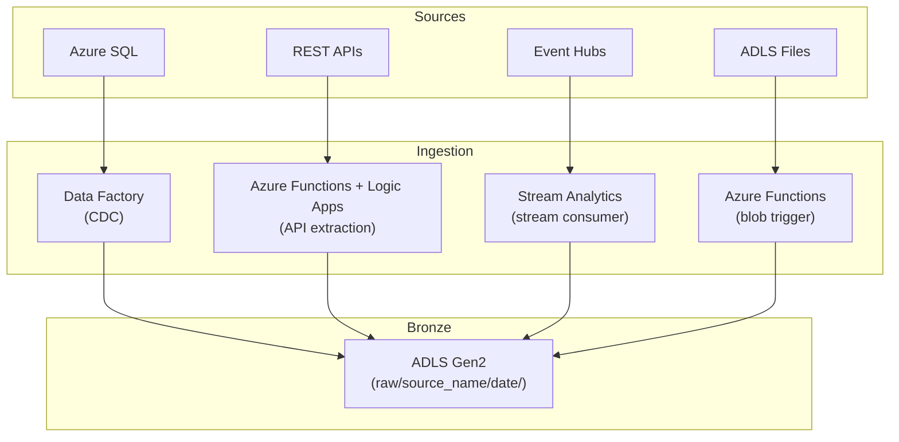

# Ingestion Patterns - System Design

**Ingestion architecture at scale. Build vs buy. How Airbyte, Fivetran, and custom pipelines compare. Multi-source ingestion platform design.**

---

## The Ingestion Platform

At scale, you don't build one pipeline per source. You build an **ingestion platform** — a system that manages connections, extractions, scheduling, monitoring, and schema tracking for all sources.



---

## Build vs Buy

The most consequential ingestion decision: custom code or a managed tool?

### The Landscape

| Tool | Type | Sources | Cost Model | Strength |
|---|---|---|---|---|
| **Airbyte** | Open source (self-hosted or cloud) | 300+ connectors | Free (self-hosted) or per-row (cloud) | Connector library, open source |
| **Fivetran** | Fully managed SaaS | 300+ connectors | Per Monthly Active Row (MAR) | Zero maintenance, reliability |
| **Meltano** | Open source (Singer-based) | 200+ taps | Free | Extensible, GitOps-friendly |
| **Stitch** | Managed SaaS (by Talend) | 100+ connectors | Per row | Simple, acquired by Talend |
| **Custom code** | Your own Python/Spark | Whatever you build | Engineering time | Full control, exact fit |
| **Cloud-native CDC** | Datastream / DMS / Data Factory | Databases only | Per GB replicated | Managed, tight cloud integration |

### Decision Matrix



### When to Build Custom

| Build Custom When | Use Managed When |
|---|---|
| Source is an internal API with custom auth | Source is a standard SaaS (Salesforce, Stripe) |
| Data volume > 100M rows/day (cost of managed at scale) | Data volume < 10M rows/day |
| You need sub-second latency | Minutes-to-hours latency is acceptable |
| You need custom transformation at ingestion time | Raw extraction + downstream transform is fine |
| You have a platform team to maintain it | You don't want to maintain infrastructure |

### The Hybrid Approach (Most Common at Scale)



Use managed tools for standard sources (80% of connectors). Write custom code for internal APIs and edge cases (15%). Use cloud-native CDC for high-volume database replication (5%). All three land in the same Bronze layer.

---

## Multi-Source Architecture by Cloud

### GCP



### AWS



### Azure



---

## Bronze Folder Structure

Regardless of cloud or source type, all data lands in a consistent Bronze structure:

```
bronze/
├── calls/                    # Source: PostgreSQL CDC
│   ├── date=2026-04-13/
│   ├── date=2026-04-14/
│   └── date=2026-04-15/
├── crm_contacts/             # Source: Salesforce API
│   ├── extract_2026-04-13.jsonl
│   └── extract_2026-04-14.jsonl
├── click_events/             # Source: Kafka stream
│   ├── hour=2026-04-15-14/
│   └── hour=2026-04-15-15/
├── vendor_reports/           # Source: SFTP file drop
│   ├── report_2026-04-13.csv
│   └── report_2026-04-14.csv
└── mongo_orders/             # Source: MongoDB Change Stream
    ├── date=2026-04-13/
    └── date=2026-04-14/
```

**Rules:**
- One folder per source
- Partitioned by date (or hour for high-volume)
- Raw format preserved (JSON stays JSON, CSV stays CSV)
- Never modify Bronze data — it's the audit trail

---

## Quick Links

| Chapter | Topic |
|---|---|
| [06 - Production Patterns](06_Production_Patterns.md) | Retries, idempotency, credential rotation |
| [07 - System Design](07_System_Design.md) | This page |
| [08 - Quality Security Governance](08_Quality_Security_Governance.md) | Source credentials, PII at ingestion |
| [09 - Observability Troubleshooting](09_Observability_Troubleshooting.md) | Ingestion monitoring |
