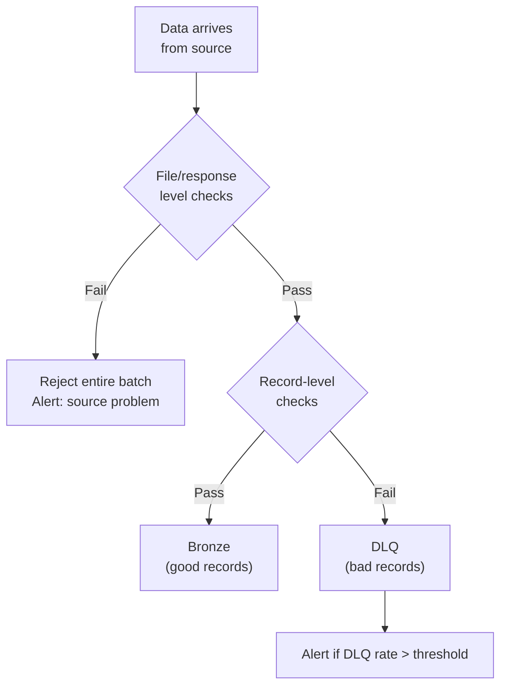
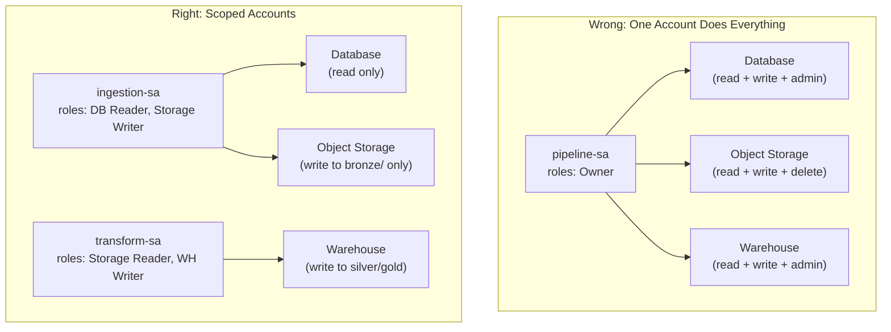
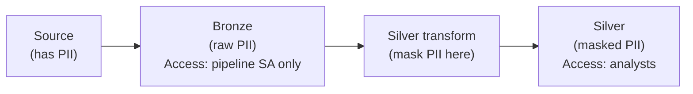
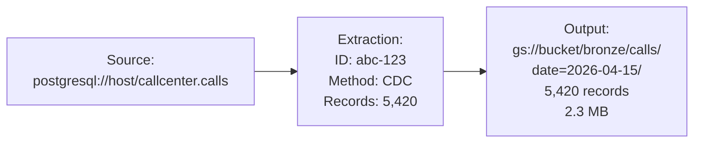

# Ingestion Patterns - Quality, Security, Governance

**Validating data at the boundary. Managing source credentials. Handling PII before it enters the pipeline. Audit trail from source to Bronze.**

---

## Quality: Validate at Ingestion, Not Downstream

The cheapest place to catch bad data is at ingestion — before it propagates through Silver, Gold, ML models, and dashboards. Every bad record that enters Bronze creates cleanup work in every downstream layer.

### Ingestion Validation Framework



### Batch-Level Checks (Before Processing Records)

| Check | What It Catches | Example |
|---|---|---|
| **Non-empty response** | Source returned nothing | API returned `{"results": []}` or DB query returned 0 rows |
| **Minimum record count** | Partial extraction | Expected 500+ calls/day, got 12 |
| **Response format valid** | Source changed format | Expected JSON, got HTML error page |
| **HTTP status** | API error | 500 Internal Server Error |
| **Freshness** | Source is stale | Latest record timestamp is 48 hours old |

### Record-Level Checks (Per Record)

| Check | What It Catches | Action |
|---|---|---|
| **Primary key not null** | Corrupt or partial record | DLQ |
| **Expected type** | Schema drift (string where int expected) | DLQ |
| **Value range** | Data corruption | DLQ if extreme, warn if borderline |
| **Duplicate key** | Source sent same record twice | Deduplicate (keep latest) |

---

## Security: Source Credentials

### Credential Storage by Cloud

| Cloud | Service | How |
|---|---|---|
| GCP | Secret Manager | `gcloud secrets versions access latest --secret=db-password` |
| AWS | Secrets Manager | `aws secretsmanager get-secret-value --secret-id db-password` |
| Azure | Key Vault | `az keyvault secret show --vault-name myvault --name db-password` |

### Credential Anti-Patterns

| Anti-Pattern | Risk | Fix |
|---|---|---|
| Hardcoded in code | Anyone with repo access sees the password | Secret Manager |
| Environment variable in CI/CD logs | Printed in build output | Secret Manager + masked variables |
| Shared service account | Can't audit who accessed what | Per-pipeline service accounts |
| Never-rotated passwords | Compromised credentials persist forever | Automated rotation (Secret Manager supports this) |

### Principle of Least Privilege



---

## PII at Ingestion

Personal data (phone numbers, email addresses, names) enters the pipeline at ingestion. You have two strategies:

### Strategy 1: Mask at Ingestion (Before Bronze)

PII never enters the data lake in raw form. Safer for compliance but you lose the ability to reprocess from raw data.

```python
def mask_pii_at_ingestion(record):
    """Mask PII fields before writing to Bronze."""
    import hashlib
    
    if "phone_number" in record:
        record["phone_hash"] = hashlib.sha256(
            record.pop("phone_number").encode()
        ).hexdigest()
    
    if "email" in record:
        record["email_hash"] = hashlib.sha256(
            record.pop("email").encode()
        ).hexdigest()
    
    if "customer_name" in record:
        del record["customer_name"]  # Drop entirely
    
    return record
```

### Strategy 2: Keep Raw in Bronze, Mask at Silver

Bronze has raw PII (access-restricted). Silver has masked PII (accessible to analysts). More flexible but requires strict Bronze access controls.



### Decision

| Factor | Mask at Ingestion | Mask at Silver |
|---|---|---|
| **Compliance risk** | Lower (PII never in data lake) | Higher (PII in Bronze, needs access controls) |
| **Reprocessing** | Can't re-derive masked fields | Can reprocess from raw Bronze |
| **Flexibility** | Less (masking is irreversible) | More (change masking rules later) |
| **Audit** | Simpler (PII doesn't exist in lake) | More complex (must track who accessed Bronze) |
| **Recommendation** | When regulation requires it (HIPAA, PCI-DSS) | Default for most systems |

---

## Audit Trail

Every extraction should log enough metadata to answer: "Where did this data come from, when was it extracted, and how much arrived?"

### Extraction Log Schema

```sql
CREATE TABLE pipeline.extraction_log (
    extraction_id STRING DEFAULT GENERATE_UUID(),
    source_name STRING,           -- 'postgresql.callcenter.calls'
    source_type STRING,           -- 'database', 'api', 'stream', 'file'
    extraction_method STRING,     -- 'cdc', 'incremental', 'full_dump', 'api_pagination'
    started_at TIMESTAMP,
    completed_at TIMESTAMP,
    records_extracted INT64,
    records_failed INT64,
    bytes_written INT64,
    output_path STRING,           -- 'gs://bucket/bronze/calls/date=2026-04-15/'
    watermark_before STRING,
    watermark_after STRING,
    schema_hash STRING,           -- Hash of the extracted schema (detect drift)
    status STRING,                -- 'success', 'partial', 'failed'
    error_message STRING
);
```

### Data Lineage from Source to Bronze



When someone asks "where did this data come from?" six months later, the extraction log and file metadata answer the question completely.

---

## Quick Links

| Chapter | Topic |
|---|---|
| [07 - System Design](07_System_Design.md) | Ingestion architecture at scale |
| [08 - Quality Security Governance](08_Quality_Security_Governance.md) | This page |
| [09 - Observability Troubleshooting](09_Observability_Troubleshooting.md) | Ingestion monitoring |
| [10 - Decision Guide](10_Decision_Guide.md) | Which extraction method for which source |
