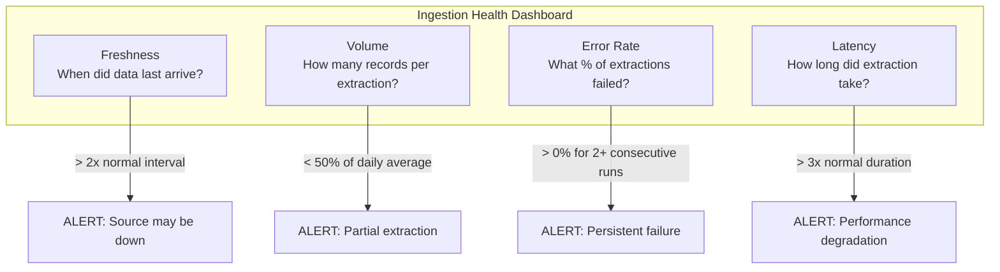

# Ingestion Patterns - Observability & Troubleshooting

**Four metrics to monitor, five common failures, and a debugging playbook for each.**

---

## The Four Ingestion Metrics



| Metric | Query | Alert Threshold |
|---|---|---|
| **Freshness** | `MAX(completed_at)` from extraction log | > 2x the expected schedule interval |
| **Volume** | `records_extracted` from extraction log | < 50% of 7-day moving average |
| **Error rate** | `COUNT(status='failed') / COUNT(*)` | > 0% for 2+ consecutive runs |
| **Latency** | `completed_at - started_at` | > 3x the 7-day average duration |

---

## Common Failures

### Failure 1: Source Database Unreachable

**Symptom:** Extraction fails with `ConnectionRefusedError` or `timeout`.

**Root causes:**
- Database is in maintenance window
- Network configuration changed (security group, firewall rule)
- Database hit max connections
- Read replica replication lag caused failover

**Debug steps:**

```bash
# Step 1: Can you reach the host?
nc -zv db-host 5432

# Step 2: Can you authenticate?
psql -h db-host -U pipeline_readonly -d callcenter -c "SELECT 1"

# Step 3: Check connection count on the database
SELECT count(*) FROM pg_stat_activity;
-- If near max_connections, your pipeline is being crowded out

# Step 4: Check if read replica is healthy
SELECT pg_last_wal_replay_lsn(), pg_last_wal_receive_lsn();
-- If receive > replay, replica is behind
```

**Fix:** If maintenance window — schedule extraction around it. If connection limit — reduce pipeline connections or use connection pooling. If replica lag — wait for catchup or temporarily read from primary.

---

### Failure 2: API Rate Limiting (429)

**Symptom:** Extraction slows to a crawl or fails with `429 Too Many Requests`.

**Root causes:**
- Extraction frequency exceeds API's rate limit
- Multiple pipeline jobs hitting the same API simultaneously
- API provider reduced your rate limit (plan downgrade, abuse detection)

**Debug steps:**

```python
# Check response headers for rate limit info
response = requests.get(api_url, headers=headers)
print(f"Rate limit: {response.headers.get('X-RateLimit-Limit')}")
print(f"Remaining:  {response.headers.get('X-RateLimit-Remaining')}")
print(f"Reset at:   {response.headers.get('X-RateLimit-Reset')}")
```

**Fix:** Implement pre-emptive rate limiting (stay below the limit, don't wait for 429). Serialize API extractions (don't run multiple in parallel). Request a rate limit increase from the API provider.

---

### Failure 3: Schema Drift

**Symptom:** Extraction succeeds but downstream transform fails. Or: extraction writes records with unexpected nulls.

**Root causes:**
- Source team deployed a schema migration (renamed column, changed type)
- API version bumped (v2 → v3, field names changed)
- NoSQL source added new nested fields

**Debug steps:**

```python
# Compare current schema to last known schema
current_columns = set(extracted_df.columns)
expected_columns = set(load_last_known_schema("calls"))

added = current_columns - expected_columns
removed = expected_columns - current_columns

print(f"Added columns:   {added}")    # Non-breaking — new fields
print(f"Removed columns: {removed}")  # BREAKING — pipeline expects these
```

**Fix:** For added columns — log and continue (non-breaking). For removed columns — halt extraction, alert, investigate with source team. Never silently continue when expected columns are missing.

---

### Failure 4: Partial Extraction (Incomplete Data)

**Symptom:** Extraction reports success but record count is significantly lower than expected. Or: downstream aggregations show dips.

**Root causes:**
- API pagination stopped early (cursor expired mid-extraction)
- Database query timed out and returned partial results
- Network interruption during extraction
- File was only partially uploaded to object storage

**Debug steps:**

```sql
-- Compare extraction volume to historical average
SELECT 
    DATE(started_at) AS extraction_date,
    records_extracted,
    AVG(records_extracted) OVER (ORDER BY started_at ROWS BETWEEN 7 PRECEDING AND 1 PRECEDING) AS avg_7d
FROM pipeline.extraction_log
WHERE source_name = 'calls'
ORDER BY started_at DESC
LIMIT 10;
-- If today's count is < 50% of the 7-day average, something is wrong
```

**Fix:** Implement extraction checkpointing (save progress per page/batch). On failure, resume from the last checkpoint rather than restarting. Compare final record count to source count if possible.

---

### Failure 5: Credential Expiry

**Symptom:** Extraction fails with `401 Unauthorized` or `AuthenticationError`.

**Root causes:**
- OAuth token expired mid-extraction (long extraction > token lifetime)
- Database password was rotated
- API key was revoked
- Service account permissions changed

**Debug steps:**

```python
# Test authentication independently
try:
    response = requests.get(api_url, headers={"Authorization": f"Bearer {token}"})
    if response.status_code == 401:
        print("Token expired or revoked")
    elif response.status_code == 403:
        print("Token valid but permissions insufficient")
except Exception as e:
    print(f"Connection error: {e}")
```

**Fix:** Implement auto-refresh for OAuth tokens (refresh 5 minutes before expiry). Use Secret Manager with automatic rotation. Monitor for auth failures separately from data failures.

---

## Monitoring by Cloud

| Capability | GCP | AWS | Azure |
|---|---|---|---|
| Extraction logs | Cloud Logging | CloudWatch Logs | Azure Monitor Logs |
| Metrics dashboard | Cloud Monitoring | CloudWatch Dashboards | Azure Monitor Workbooks |
| Alerting | Cloud Monitoring Alerts | CloudWatch Alarms + SNS | Azure Monitor Alerts |
| CDC lag monitoring | Datastream metrics | DMS CloudWatch metrics | Data Factory monitoring |
| API call tracking | Cloud Trace | X-Ray | Application Insights |

---

## Quick Links

| Chapter | Topic |
|---|---|
| [08 - Quality Security Governance](08_Quality_Security_Governance.md) | Credentials, PII, audit trail |
| [09 - Observability Troubleshooting](09_Observability_Troubleshooting.md) | This page |
| [10 - Decision Guide](10_Decision_Guide.md) | Which extraction method for which source |
