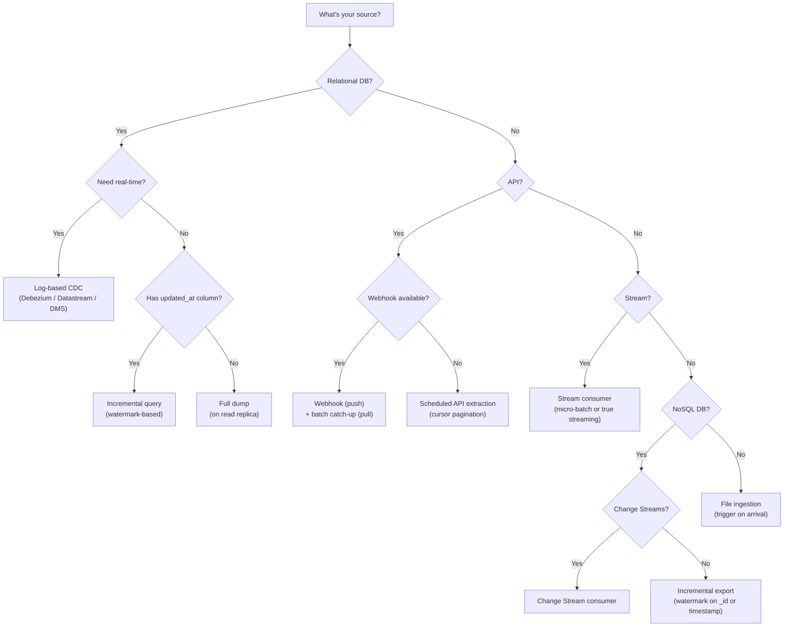

# Ingestion Patterns - Decision Guide

**Which extraction method for which source type. Build vs buy. The decision framework for production ingestion.**

---

## Decision 1: Extraction Method by Source Type

---

## Decision 2: Extraction Method Comparison

| Method | Latency | Complexity | Source Impact | Captures Deletes | Best For |
|---|---|---|---|---|---|
| **Full dump** | Hours | Low | High (full scan) | Yes (by replacement) | Small tables, initial backfill, no change tracking |
| **Incremental query** | Minutes | Medium | Medium (filtered scan) | No | Tables with reliable timestamps, moderate change volume |
| **Log-based CDC** | Seconds | High | None (reads log) | Yes | High-volume OLTP, real-time needs, audit trail |
| **API pagination** | Minutes | Medium | Low (API handles it) | Depends on API | SaaS platforms (Salesforce, Stripe, HubSpot) |
| **Webhooks** | Seconds | Medium | None (source pushes) | Depends on source | Event-driven sources with webhook support |
| **Stream consumer** | Seconds | High | None (queue handles it) | Yes (if events include deletes) | Event-driven architecture, Kafka, Pub/Sub |
| **MongoDB Change Streams** | Seconds | Medium | Low | Yes | MongoDB collections with high change volume |
| **File trigger** | Minutes | Low | None | N/A | Vendor file drops, batch exports |

---

## Decision 3: Build vs Buy

| Factor | Build Custom | Use Managed Tool (Airbyte/Fivetran) |
|---|---|---|
| **Source is standard SaaS** | Don't build — connector exists | Use the connector |
| **Source is internal API** | Build — no connector exists | Build (or create custom Airbyte connector) |
| **Volume < 10M rows/day** | Managed is cheaper (your time costs more) | Use managed |
| **Volume > 100M rows/day** | Build — managed pricing scales per row | Build (managed gets expensive) |
| **Need < 1min latency** | Build — managed tools are batch-oriented | Build |
| **Team has platform engineers** | Build — they can maintain it | Either |
| **Team is small / no platform team** | Use managed — maintenance is included | Use managed |

### Cost Comparison at Scale

| Volume | Fivetran (MAR pricing) | Airbyte Cloud | Custom (engineering time) |
|---|---|---|---|
| 1M rows/month | ~$500/month | ~$300/month | ~$5K (build) + $500/month (maintain) |
| 10M rows/month | ~$2,000/month | ~$1,000/month | ~$5K (build) + $500/month (maintain) |
| 100M rows/month | ~$10,000/month | ~$5,000/month | ~$10K (build) + $1K/month (maintain) |
| 1B rows/month | ~$50,000/month | ~$20,000/month | ~$20K (build) + $2K/month (maintain) |

**The crossover:** Custom becomes cheaper than managed around 50-100M rows/month, depending on your engineering costs.

---

## Decision 4: One Source, Multiple Extraction Options

Many sources offer more than one way to extract. How to pick:

### PostgreSQL

| Method | When |
|---|---|
| **Full dump (`pg_dump`)** | Initial backfill, disaster recovery, one-time migration |
| **Incremental query** | < 10M rows, has `updated_at`, few updates per day |
| **CDC (Debezium/Datastream)** | > 10M rows, need DELETE capture, real-time, zero source impact |
| **Read replica + query** | Compromise: incremental without impacting primary |

### Salesforce

| Method | When |
|---|---|
| **Bulk API** | Large data volumes (> 100K records), full or incremental |
| **REST API** | Small data volumes, real-time lookups |
| **Streaming API (PushTopics)** | Near real-time change events |
| **Fivetran/Airbyte connector** | Standard integration, don't want to manage API complexity |

### MongoDB

| Method | When |
|---|---|
| **`mongoexport`** | One-time migration, small collections |
| **Change Streams** | Real-time CDC, production use |
| **Spark MongoDB Connector** | Large-scale batch extraction into data lake |
| **Airbyte MongoDB connector** | Managed incremental extraction |

---

## The Practical Playbook

For a team starting from zero:

1. **Week 1:** Set up object storage Bronze layer with consistent folder structure
2. **Week 2:** Build file ingestion first (event-triggered on file arrival) — lowest complexity
3. **Week 3:** Add database ingestion (incremental query on read replica) — covers OLTP
4. **Week 4:** Add API ingestion for one SaaS source (most common: CRM or payment processor)
5. **Month 2:** Evaluate CDC for the highest-volume OLTP table (if incremental query is too slow)
6. **Month 3:** Evaluate managed tools (Airbyte/Fivetran) for remaining SaaS connectors

**Don't try to build all five source types in week one.** Start with files, add database, add API. Validate each before adding the next.

---

## Apply It

| Cloud | Notebook | Services Used |
|---|---|---|
| No cloud | Coming soon | Pure Python — API + database patterns |
| GCP |  | Datastream, Cloud Functions, GCS triggers |
| AWS | Coming soon | DMS, Lambda, S3 triggers |
| Azure | Coming soon | Data Factory, Azure Functions, ADLS triggers |

---

## Quick Links

| Chapter | Topic |
|---|---|
| [09 - Observability Troubleshooting](09_Observability_Troubleshooting.md) | Ingestion monitoring and debugging |
| [10 - Decision Guide](10_Decision_Guide.md) | This page |
| [01 - Why](01_Why.md) | Back to the beginning |
| [02 - Concepts](02_Concepts.md) | Five source types explained |
